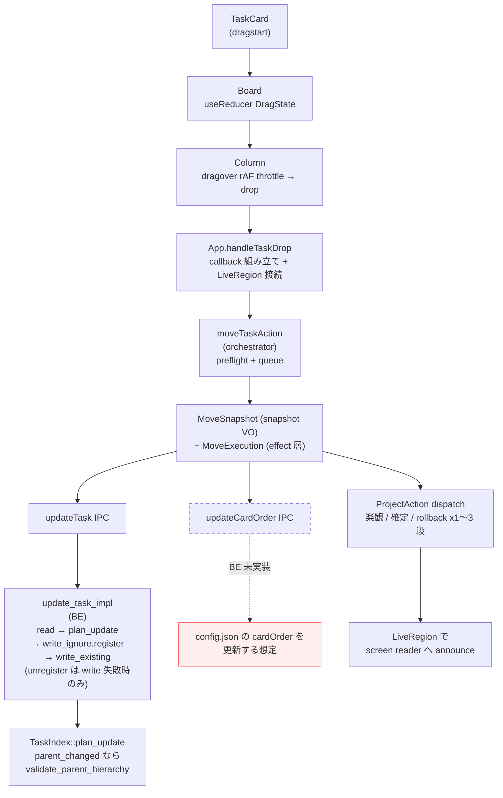
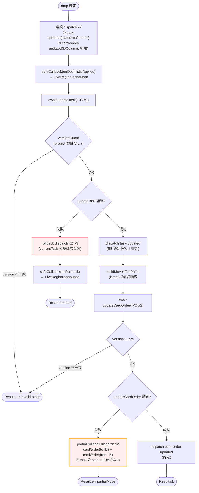
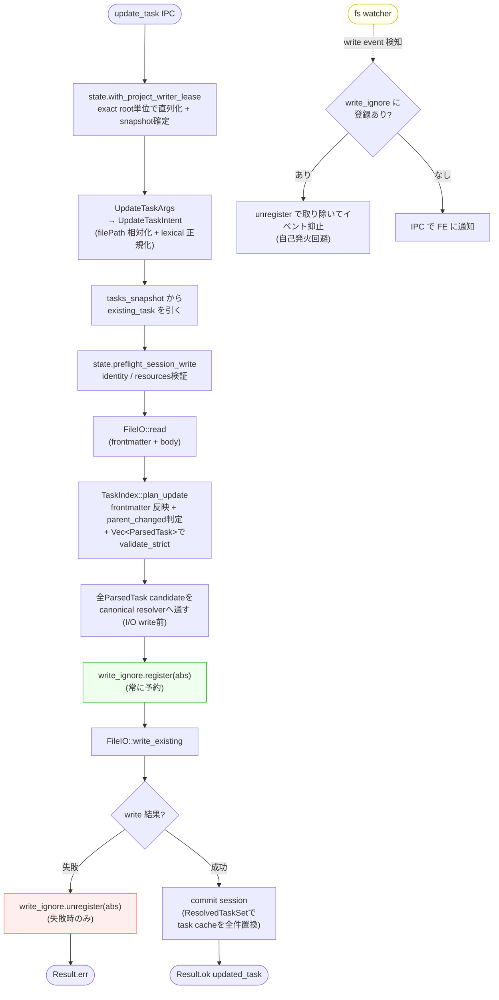

# 現状の DnD 実装スナップショット

カンバンの Drag & Drop が「ここまで複雑にする必要があるか」を判断するための、**現時点の事実だけを並べたメモ**。
設計判断の history は `docs/impl/dnd-board.md`（※一部は現状と矛盾している。後述）。

---

## 1. 1 行サマリ

> HTML5 ネイティブ DnD + 楽観更新 + 3 段ロールバック + version 付きシリアル queue + a11y ライブリージョン + watcher write_ignore。
> 旧カラム cardOrder の同期は **未確定**（`update_card_order` の BE handler が未実装で、status 変更時に旧カラムから自動除去する仕組みは現状コード上に存在しない。詳細は §4 / §5 / §6）。

drop 1 回で動く layer の数:



---

## 2. 登場するファイルと行数

### フロントエンド

| ファイル | 行数 | 役割 |
|:--|--:|:--|
| `src/features/board/components/TaskCard/...` | - | draggable=true / dataTransfer.setData / dragGuard (synthetic click 抑止) |
| `src/features/board/components/Board/index.tsx` | 162 | DragState useReducer、Column へ dragState/callback 配線 |
| `src/features/board/components/Board/dragState.ts` | 172 | DragState / DragAction 型 + companion (create/withHover/...) |
| `src/features/board/components/Column/index.tsx` | 369 | dragover/dragleave/drop 処理、rAF throttle、handleDrop |
| `src/features/board/components/Column/dragHover.ts` | 〜30 | computeHoverIndex (pure) |
| `src/features/board/hooks/useProject/actions/moveTask.ts` | **497** | **MoveSnapshot + MoveExecution + moveTaskAction** |
| `src/features/board/hooks/useProject/actions/buildMovedFilePaths.ts` | 45 | toIndex 補正 (pure) |
| `src/features/board/hooks/useProject/concurrency.ts` | 104 | projectVersion / projectCommandQueue |
| `src/components/LiveRegion/index.tsx` | 66 | aria-live="polite" + zero-width-space hack |
| `src/App.tsx` の `handleTaskDrop` | (540 行のうち〜40) | callback 組み立て、`announce()` 接続 |

**DnD のためだけに動く FE 行数: 約 1,500 行（テスト除く）**

### バックエンド

| ファイル | 行数 | 役割 |
|:--|--:|:--|
| `src-tauri/src/task/update/command.rs` | 134 | `update_task` IPC + effect 層（writer lease + preflight + plan_update + canonical resolver + write + ResolvedTaskSet commit） |
| `src-tauri/src/task/update/args.rs` | 88 | UpdateTaskArgs → UpdateTaskIntent 変換、filePath を project_root 相対化 + lexical 正規化 |
| `src-tauri/src/task/task_index.rs` | 937 | TaskIndex aggregate。うち `plan_update` (L341-451) と parent_changed / hierarchy 検証 |
| `src-tauri/src/state.rs` | 〜300 | AppState、write_ignore registry 受け渡し |
| `src-tauri/src/config.rs` | 946 | `CardOrder = BTreeMap<String, Vec<String>>` 定義、`clean_card_order` 等（cardOrder 以外も含む全体行数。DnD 経路に関係するのは cardOrder 周辺のみ） |
| `src-tauri/crates/fs/src/watcher/write_ignore.rs` | - | 自前 write の watcher 抑止 registry |
| `update_card_order` Tauri command | **未実装** | FE は呼んでいるが BE 側に handler がない |

---

## 3. drop 1 回で何が起きるか（カラム間移動）

```
[FE] dragstart on TaskCard
       └─ dataTransfer.setData(DRAG_MIME_TYPE, filePath)

[FE] dragover on Column   ← 60Hz で多発
       └─ rAF throttle で 1 frame 1 回に圧縮 (Column/index.tsx:102-135)
       └─ computeHoverIndex(clientY) → DragState.withHover

[FE] drop on Column (Column/index.tsx:180-)
       └─ e.clientY から hover index を再計算（rAF 経由の stale 回避）
       └─ onTaskDrop({ taskFilePath, fromColumn, toColumn, toIndex })

[FE] App.handleTaskDrop (App.tsx:401-441)
       └─ targetTitle を確定（後で announce 文言に使う）
       └─ onOptimisticApplied / onRollback callback を生成して moveTask に渡す

[FE] moveTaskAction (moveTask.ts:476-497)
       ├─ preflight: ensureLoaded → projectVersion をキャプチャ
       └─ enqueueProjectCommand 内で:

           ├─ revalidateInsideQueue:
           │    ├─ session が data コマンド受け付け可能か
           │    ├─ projectVersion が一致するか
           │    ├─ target task がまだ存在するか
           │    ├─ target.status === fromColumn か
           │    └─ toColumn が columns に含まれるか

           ├─ MoveSnapshot.from(data, target, params) で VO 採取
           │    (originalTask, fromColumnOrderBefore, toColumnOrderBefore)

           └─ MoveExecution.crossColumn:

               (1) optimistic dispatch:
                   ① { type: "task-updated", task: { ...original, status: toColumn } }
                   ② { type: "card-order-updated", columnName: toColumn,
                        filePaths: buildMovedFilePaths(...) }
                   → reducer に反映 → UI 即更新
                   → safeCallback(onOptimisticApplied)
                   → LiveRegion へ「「タイトル」を「toColumn」に移動しました」announce

               (2) await updateTask({ filePath, status: toColumn })  ← IPC #1

               (3) versionGuard: IPC 中に project が切り替わってないか

               (4) updateTask 失敗時 rollback:
                   beforeRollback の currentTask を見て分岐:
                   ├─ currentTask.status === toColumn (楽観維持):
                   │    [
                   │      card-order-updated(toColumn, 旧順),
                   │      task-updated(currentTask, status=fromColumn),
                   │      card-order-updated(fromColumn, 旧順)
                   │    ]   ← 3 段
                   └─ currentTask が消失 / status が toColumn 以外（concurrent 更新あり）:
                        [
                          card-order-updated(toColumn, 旧順),
                          card-order-updated(fromColumn, 旧順)
                        ]   ← 2 段（task-updated 省略で外部更新を保護）
                   → safeCallback(onRollback)
                   → LiveRegion へ「「タイトル」の移動を取り消しました」announce
                   → return Result.err(tauri)

               (5) updateTask 成功:
                   ├─ dispatch task-updated (BE が返した最新 task で確定)
                   ├─ buildMovedFilePaths(latest, ...) で最終順序を再計算
                   └─ await updateCardOrder({ columnName: toColumn, filePaths })  ← IPC #2

               (6) updateCardOrder 失敗時 partial rollback:
                   [
                     card-order-updated(toColumn, 旧順),
                     card-order-updated(fromColumn, 旧順)
                   ]
                   → return Result.err(partialMove)
                   ※ task の status 変更は確定済みなので戻さない

               (7) updateCardOrder 成功:
                   dispatch card-order-updated 確定 → Result.ok
```

#### crossColumn の状態遷移（成功 / 各失敗パス）



#### rollback の `currentTask` 乖離判定（updateTask 失敗時）

```mermaid
flowchart TD
    FAIL([updateTask IPC 失敗]) --> READ["beforeRollback = visibleData(state)<br/>currentTask = beforeRollback.tasks.find(filePath)"]
    READ --> Q{"currentTask の状態?"}
    Q -->|undefined<br/>(task 消失)| TWO
    Q -->|status ≠ toColumn<br/>(外部 listener が status 更新)| TWO
    Q -->|status === toColumn<br/>(楽観維持)| THREE

    TWO["**2 段 rollback**<br/>① cardOrder(toColumn, 旧順)<br/>② cardOrder(fromColumn, 旧順)<br/>※ task-updated は省略<br/>(外部更新を上書きしないため)"]
    THREE["**3 段 rollback**<br/>① cardOrder(toColumn, 旧順)<br/>② task-updated(currentTask, status=fromColumn)<br/>③ cardOrder(fromColumn, 旧順)<br/>※ status 以外のフィールドは<br/>currentTask の値を採用<br/>(concurrent 更新を保護)"]

    TWO --> CB[safeCallback onRollback]
    THREE --> CB
    CB --> END([Result.err tauri])

    style TWO fill:#ffe,stroke:#cc0
    style THREE fill:#fee,stroke:#f66
```

### 同一カラム並び替え

```
isSameOrder(snapshot, filePaths) なら early return Result.ok（IPC を呼ばない）
↓
dispatch card-order-updated（楽観）
↓
await updateCardOrder
↓
失敗時: dispatch card-order-updated(旧順) ← 1 段だけ
```

---

## 4. BE 側で起きること（updateTask）

```
update_task IPC (command.rs)
  ├─ exact project rootのwriter leaseを取得し、immutable session snapshotを確定
  ├─ UpdateTaskArgs → UpdateTaskIntent（filePath が絶対パスなら project_root を strip して相対化し、lexical 正規化）
  ├─ tasks_snapshot から existing_task を引く
  │
  ├─ session identity / active resourcesをpreflight
  ├─ FileIO::read で frontmatter + body をパース
  │
  ├─ TaskIndex::plan_update (task_index.rs:341-451)
  │    ├─ status / title / priority / labels / parent / body を frontmatter に反映
  │    ├─ parent_changed = ?  ← lookup-normalized で表記揺れ吸収して新旧比較
  │    │    （None / Some("") 削除 / Some(path) 変更で分岐式が3層）
  │    ├─ parent_changed ならVec<ParsedTask>を組み、ResolvedTaskSet::validate_strictで全体再検証
  │    ├─ frontmatter を serialize → TaskContent VO で妥当性チェック
  │    └─ UpdateTaskOutcome { updated_task: ParsedTask, file_content }
  │
  ├─ resident全TaskをParsedTask candidateへ戻し、対象をupdated_taskへ置換
  ├─ canonical full resolverでparent warning / effective parent / children / reverseLinksを全件再計算
  │    └─ resolver通過証明のResolvedTaskSetと返却対象TaskをI/O前に確定
  │
  ├─ write_ignore.register(&abs)  ← watcher有無によらず自前write markerを予約
  │
  ├─ FileIO::write_existing(&abs, file_content)
  │    └─ 書き込み失敗時のみ write_ignore.unregister(&abs) して early return
  │       （success path では呼び出し側では解除せず、watcher 側が write_ignore.unregister で消費する設計）
  │
  └─ commit session（ResolvedTaskSetでtask cacheを一括置換）
```

#### update_task の write_ignore タイミング



> 「BE が status 変更を watcher 経由で検知して、旧カラムの cardOrder から自動除去する」
> という設計が `docs/impl/dnd-board.md` に書かれているが、**現状 update_card_order の BE 実装が無く**、
> 旧カラムの cardOrder が実際にどう同期されるかは仕様/実装ともに曖昧。

---

## 5. cardOrder の所在

- 物理: `.spec-board/config.json` 内の `cardOrder: { [columnName]: filePath[] }`
- 型: `BTreeMap<String, Vec<String>>` (`src-tauri/src/config.rs`)
- 載っていない task は「カラム末尾」扱い（FE 側 `src/domains/project-data` の `ProjectData.applyCardOrderUpdated` がこの規則を適用する。BE の `clean_card_order` は不在パス / 不在キーの除去だけで、未掲載タスクを末尾に補完する処理は持たない）
- 更新経路: `updateCardOrder` IPC（**FE 側のみ存在、BE handler 無し**）

---

## 6. 一覧: 複雑さの内訳

| # | 場所 | 何をしているか | なぜ複雑か |
|:--|:--|:--|:--|
| 1 | `Column/index.tsx:102-135` | dragover を rAF で 1 frame 1 回に圧縮 | drop 時に rAF の hover が stale なので drop でも clientY から再計算する。同じ計算が 2 か所 |
| 2 | `buildMovedFilePaths.ts:24-45` | toIndex 補正 (sameColumn + downward なら -1) | 「DOM 上の hover index」と「target 除外後配列での挿入 index」のずれを吸収 |
| 3 | `moveTask.ts:180-204` rollbackCrossDispatches | currentTask を見て 2 段 / 3 段に分岐 | 楽観 IPC 中に watcher 由来の外部 task-updated が来ている可能性 → 上書き保護 |
| 4 | `moveTask.ts:476-497` + `concurrency.ts` | preflight + queue + 中再検証 + versionGuard x2 | race / project 切替対策。validation が 4 か所に分散（preflight / revalidateInsideQueue / versionGuard after updateTask / versionGuard after updateCardOrder） |
| 5 | `moveTask.ts:313-460` MoveExecution | crossColumn (90 行) / sameColumn (45 行) で 2 IPC を逐次実行 + 3 種 rollback パス | 成功 / updateTask 失敗 / updateCardOrder 失敗 (partial) の 3 終端 |
| 6 | `LiveRegion/index.tsx:35-40` | 同文言再 announce のために id 奇数で zero-width-space を付け外し | SR 実装差吸収の hack |
| 7 | `App.tsx:401-441` | onOptimisticApplied / onRollback を組んで moveTask に注入 | UI 通知と reducer dispatch を疎結合にした副作用。callback 例外は moveTask 内 safeCallback で握り潰し |
| 8 | `update/command.rs` + `write_ignore` | 自前 write を watcher に無視させる register。success path では呼び出し側で解除せず watcher 側が `unregister` で消費、write 失敗時のみ呼び出し側で `unregister` | 自前 write → watcher → IPC → reducer の自己発火ループを切る必要があるが、register / 消費 / 失敗時 unregister の責務が両側に分散して読み解きにくい |
| 9 | `task_index.rs` plan_update + `update/command.rs` | parent_changed 判定 (3 分岐) + lookup-normalized + I/O前strict hierarchy検証。更新後はフィールド種別にかかわらずParsedTask candidate全件をcanonical resolverへ通し、ResolvedTaskSetでcacheを一括置換 | moveを含むmutation直後と再open後の派生状態を一致させるため、statusだけの変更でも全件resolverを省略しない |
| 10 | docs と実装の乖離 | `docs/impl/dnd-board.md` は「楽観 UI 採用しない / 2 IPC」と書いてあるが現状は「楽観 UI 採用 + 2 IPC + 3 段 rollback」 | 設計判断の history が更新されておらず、現状の根拠が読めない |

---

## 7. テストの量

dnd / move 関連のテストファイル（実装 PR で増えたもの含む）:

- `moveTask.behavior.test.ts` (楽観 / rollback / partial / sameOrder no-op / version 不一致 …)
- `buildMovedFilePaths.behavior.test.ts`
- `Column/__tests__/Column.dnd.test.tsx`
- `Board/__tests__/Board.dnd.test.tsx`
- `TaskCard/__tests__/TaskCard.dnd.test.tsx` (drag guard 含む)
- `LiveRegion/__tests__/LiveRegion.rendering.test.tsx`
- `App` レベルの DnD a11y テスト

各テストファイル単体は小さいが、**「drop が起こした 1 ふるまい」を確認するために覚える必要がある文脈が広い**: snapshot / version / queue / projectSessionState / callback / live region / partial-move / sameColumn no-op / currentTask 乖離。

---

## 8. 「ここまで複雑にする必要があるか」の判断材料

複雑度の正味コストはおそらく次の 3 軸で計れる。

### (a) 楽観更新 + 3 段 rollback は本当に要るか

採用根拠（推定）:
- IPC 失敗時に UI が巻き戻る挙動を保証するため
- 体感速度の改善（drop → UI 反映の遅延を消す）

代替案:
- **IPC 完了後 dispatch（楽観なし）**: `dnd-board.md` の元設計に戻す。複雑度は MoveSnapshot / rollback / callback / LiveRegion 接続のうち rollback と callback と LiveRegion 文言の半分が消える。`updateTask` は数十 ms なので、ローカルファイル相手なら体感差はほぼ無い。
- **楽観あり / rollback は単に「全リロード」**: snapshot を持たず、失敗したら project を再読み込みする。currentTask 分岐ロジックは消えるが、UX の質は下がる（他カラムも一瞬ちらつく）。

### (b) cardOrder を別 IPC にする必要があるか

現状: `update_task` と `update_card_order` の 2 IPC を逐次実行 → partial-move が発生する。

代替案: `update_task` の引数に「新 cardOrder（少なくとも toColumn 分）」を渡し、BE で 1 トランザクション化する。partial-move のパスと `updateCardOrder` の存在自体が消える。`task_index.rs::plan_update` の責務は増えるが、現状 BE 側 `update_card_order` は実装すらされていないので、今からなら回避できる。

### (c) projectVersion / queue の 2 重ガードは要るか

`preflight` + `revalidateInsideQueue` + `versionGuard` x2 = **4 か所**で同じ「project 切替されてないか」を確認している。

実態として project 切替は user 操作（メニューから別 project を開く）でしか起きないので、queue の入口 1 か所で十分という見方もできる。IPC を await している間に切替が起きうるかどうか、ユースケースを確認する価値あり。

### (d) React 19 の `useOptimistic` を使わず手組みしている

**この project は React 19.1 を使っているが、`grep -rn "useOptimistic" src/` の結果はゼロ件**。楽観更新は全部 `useReducer` + 手動 `dispatch` + 手動 snapshot + 手動 rollback dispatch で実装されている。

React 19 公式の `useOptimistic` は「async action が解決/失敗したら自動で実体 state に戻る」ことを保証する hook で、まさに `moveTask.ts` が 497 行かけて手作業でやっていることをカバーする。これを使えば以下が消える可能性がある:

- `MoveSnapshot.rollbackCrossDispatches`（2 段 / 3 段分岐）
- `MoveSnapshot.partialRollbackDispatches`
- `MoveSnapshot.rollbackSameDispatches`
- `currentTask` が optimistic 維持か乖離かの分岐（外部更新は base state 側で進むので自動で取り込まれる）
- `onRollback` callback と LiveRegion の「取り消しました」announce の起点

`useOptimistic` は `useReducer` の state を base に取れる API なので、現在の `useProject` の reducer 構成とも結合できる（base 側に確定 state、optimistic 側に楽観適用後を持つ）。

**注意点**: `useOptimistic` は React の Action / `useTransition` と組み合わせる前提なので、現在の **`projectCommandQueue`（自前シリアル queue）と相性が悪い**可能性がある。queue を React の transition に置き換える検討も同時に要る。version ガードは結局必要だが、rollback 専用コードは消える。

---

## 9. 推奨される次のアクション（参考）

1. `docs/impl/dnd-board.md` の更新（or 当ファイルへの差し替え）— 設計判断と実装の乖離を解消
2. 楽観更新の費用対効果を `updateTask` の実測レイテンシで再評価
3. `update_card_order` を `update_task` に統合できないか BE 設計を再検討（partial-move を消す）
4. `versionGuard` を queue 入口に集約できないか確認
5. **`useOptimistic` への置き換えを検討**（rollback 系コードと callback の半分が消える可能性。`projectCommandQueue` を `useTransition` に寄せる設計変更とセットで）

これらは現状を変えるための提案ではなく、複雑度の妥当性を再評価するためのチェックポイント。
