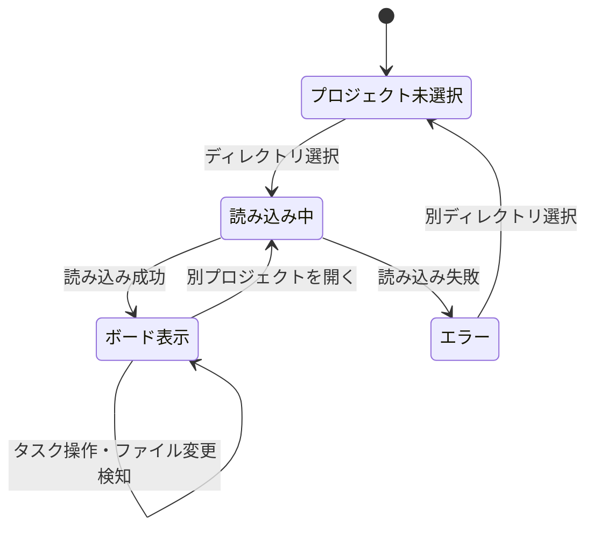

# spec-board - ボードビュー仕様（フロントエンド）

> **機能**: [spec-board](./index.md)
> **ステータス**: 下書き

## 概要

カンバン風のボードUIを提供し、タスクをステータス別のカラムに表示する。カラムはユーザーが自由に定義・編集でき、ドラッグ&ドロップでタスクのステータスを変更できる。

## レイアウト

```
┌──────────────────────────────────────────────────────────┐
│  spec-board   [プロジェクト名]            [設定] [開く]    │
├──────────────────────────────────────────────────────────┤
│                                                          │
│  ┌─── Todo ───┐  ┌ In Progress ┐  ┌─── Done ───┐       │
│  │ [+ 追加]   │  │ [+ 追加]    │  │ [+ 追加]   │  ...  │
│  │            │  │             │  │            │       │
│  │ ┌────────┐ │  │ ┌─────────┐ │  │ ┌────────┐ │       │
│  │ │カード1  │ │  │ │カード3   │ │  │ │カード5  │ │       │
│  │ └────────┘ │  │ └─────────┘ │  │ └────────┘ │       │
│  │ ┌────────┐ │  │ ┌─────────┐ │  │            │       │
│  │ │カード2  │ │  │ │カード4   │ │  │            │       │
│  │ └────────┘ │  │ └─────────┘ │  │            │       │
│  │            │  │             │  │            │       │
│  └────────────┘  └─────────────┘  └────────────┘       │
│                                                          │
│  [+ カラムを追加]                                         │
└──────────────────────────────────────────────────────────┘
```

## コンポーネント

| コンポーネント | 種別 | 説明 | 振る舞い |
|:-------------|:-----|:-----|:---------|
| ヘッダーバー | ナビゲーション | プロジェクト名、設定ボタン、ディレクトリ選択ボタンを表示 | 設定ボタンでカラム管理パネルを開く。「開く」でプロジェクトディレクトリを選択 |
| カラム | コンテナ | ステータスに対応する縦列。ヘッダーにステータス名とタスク数を表示 | ドロップ先として機能。カラム内でのカード並び替えも可能 |
| カラムヘッダー | ヘッダー | ステータス名、タスク件数、追加ボタン | ステータス名クリックで名前編集。「+ 追加」で新規タスク作成 |
| カラム追加ボタン | ボタン | ボード右端に表示される「+ カラムを追加」ボタン | クリックでカラム名入力フィールドを表示 |
| タスクカード | カード | [task-card-spec.md](./task-card-spec.md) を参照 | ドラッグ可能。クリックで詳細パネルを開く |

## ユーザー操作

| 操作 | トリガー | 振る舞い | 遷移先 |
|:-----|:--------|:---------|:-------|
| プロジェクトを開く | 「開く」ボタンクリック | OSのディレクトリ選択ダイアログを表示。選択後にmdファイルを読み込んでボードに表示 | ボードビュー |
| タスクのステータス変更 | カードをドラッグして別カラムにドロップ | 対象タスクのmdファイルのフロントマター `status` を更新 | - |
| カラム内のカード並び替え | カードをドラッグして同一カラム内でドロップ | カードの表示順序を更新し、`config.json` の `cardOrder` に永続化（[config-spec.md](./config-spec.md) 参照） | - |
| カラムの追加 | 「+ カラムを追加」ボタンクリック | カラム名入力フィールドを表示。入力確定で新カラムを追加 | - |
| カラム名の編集 | カラムヘッダーのステータス名をクリック | インライン編集モードに切り替わり、ステータス名を変更可能。該当するタスクのmdファイルも一括更新 | - |
| カラムの削除 | カラムヘッダーの右クリックメニュー | 確認ダイアログを表示。カラム内にタスクがある場合は移動先カラムをドロップダウンで選択させ、全タスクの `status` を一括更新してから削除。タスクがない場合はそのまま削除 | - |
| カラムの並び替え | カラムヘッダーをドラッグ | カラムの表示順序を変更 | - |

## 状態管理

### ページの状態

| 状態名 | 型 | 初期値 | 更新トリガー |
|:-------|:---|:-------|:-----------|
| projectPath | `string \| null` | `null` | ディレクトリ選択時 |
| columns | `Column[]` | `[]` | プロジェクト読み込み時、カラム追加/編集/削除時 |
| tasks | `Task[]` | `[]` | プロジェクト読み込み時、ファイル変更検知時、UI操作時 |
| isLoading | `boolean` | `false` | プロジェクト読み込み開始/完了時 |

### 状態遷移図



## 初期状態

### プロジェクト未選択時

- ボード領域に「プロジェクトを開く」ボタンと簡単な説明テキストを中央表示

### 空プロジェクト（mdファイル0件）

- デフォルトカラム（Todo / In Progress / Done）を表示
- 各カラムは空の状態で、「+ 追加」ボタンのみ表示
- ボード中央に「タスクがありません。「+ 追加」ボタンまたはmdファイルを作成してタスクを追加してください」のガイドメッセージを表示

### config.json なし・タスクあり

- 既存タスクの `status` フィールドから出現順にカラムを自動生成
- 生成したカラム定義を `config.json` に保存

## エラー表示

| エラーケース | 発生条件 | 表示方法 | ユーザーアクション |
|:------------|:---------|:---------|:----------------|
| ディレクトリ読み込み失敗 | 指定ディレクトリが存在しない、またはアクセス権限がない | トースト通知 | 別のディレクトリを選択 |
| mdファイルパースエラー | フロントマターの形式が不正 | トースト通知 + 該当カードにエラーアイコン表示 | mdファイルを手動修正 |
| ファイル書き込み失敗 | ディスク容量不足、権限エラー | トースト通知 | ファイルシステムの状態を確認 |

## アクセシビリティ

| 観点 | 対応方針 |
|:-----|:---------|
| キーボード操作 | Tab でカード間移動、Enter で詳細パネル展開、矢印キーでカラム間移動 |
| スクリーンリーダー | カラムに `role="list"`、カードに `role="listitem"` を付与。ドラッグ操作時にライブリージョンでステータス変更を通知 |
| フォーカス管理 | ドラッグ&ドロップ完了後、移動したカードにフォーカスを維持 |

## 制限事項

- 同一プロジェクト内のタスク数が1,000件を超える場合のパフォーマンスは保証しない
- カラムの並び順・カード並び順は `.spec-board/config.json` に保存（mdファイルには含まない）
- **検索・フィルタリング機能はMVPスコープ外**（ラベル、優先度、キーワードによるタスク絞り込みはV2以降で検討）

## 関連仕様

- [config-spec.md](./config-spec.md) - カラム設定・カード並び順の永続化仕様
- [task-card-spec.md](./task-card-spec.md) - タスクカードの表示内容・詳細パネル・フォーム仕様
- [file-system-spec.md](./file-system-spec.md) - ファイル監視・変更検知の仕組み
- [task-format-spec.md](./task-format-spec.md) - mdファイルのフォーマットとフロントマターの定義
