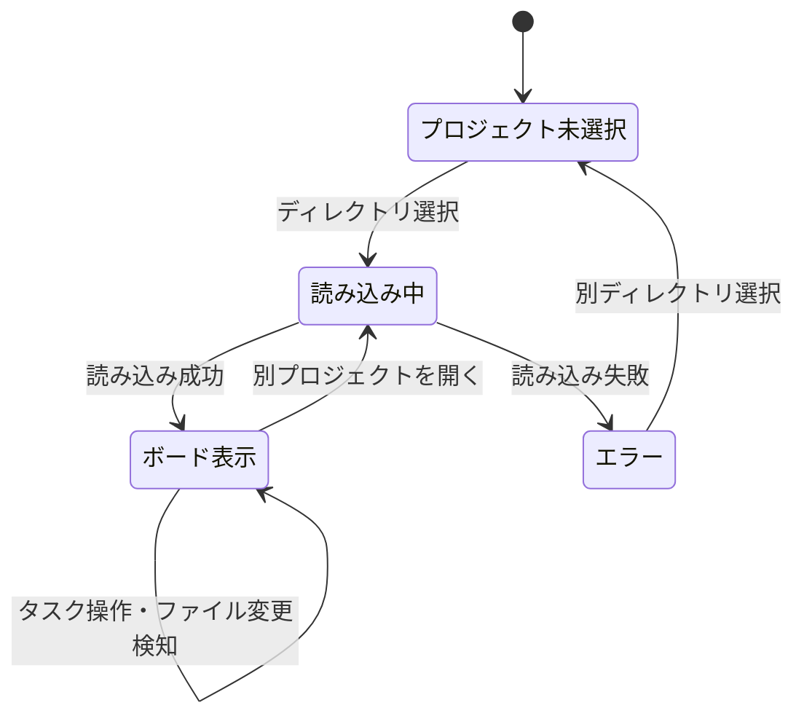

# spec-board - ボードビュー仕様（フロントエンド）

> **機能**: [spec-board](./index.md)
> **ステータス**: 下書き

## 概要

カンバン風のボードUIを提供し、タスクをステータス別のカラムに表示する。カラムはユーザーが自由に定義・編集でき、ドラッグ&ドロップでタスクのステータスを変更できる。

## レイアウト

```
┌──────────────────────────────────────────────────────────┐
│  spec-board   [プロジェクト名]            [設定] [開く]    │
├──────────────────────────────────────────────────────────┤
│                                                          │
│  ┌─── Todo ───┐  ┌ In Progress ┐  ┌─── Done ───┐       │
│  │ [+ 追加]   │  │ [+ 追加]    │  │ [+ 追加]   │  ...  │
│  │            │  │             │  │            │       │
│  │ ┌────────┐ │  │ ┌─────────┐ │  │ ┌────────┐ │       │
│  │ │カード1  │ │  │ │カード3   │ │  │ │カード5  │ │       │
│  │ └────────┘ │  │ └─────────┘ │  │ └────────┘ │       │
│  │ ┌────────┐ │  │ ┌─────────┐ │  │            │       │
│  │ │カード2  │ │  │ │カード4   │ │  │            │       │
│  │ └────────┘ │  │ └─────────┘ │  │            │       │
│  │            │  │             │  │            │       │
│  └────────────┘  └─────────────┘  └────────────┘       │
│                                                          │
│  [+ カラムを追加]                                         │
└──────────────────────────────────────────────────────────┘
```

## コンポーネント

| コンポーネント | 種別 | 説明 | 振る舞い |
|:-------------|:-----|:-----|:---------|
| ヘッダーバー | ナビゲーション | テーマのライト ⇔ ダーク クイックトグル + ビュー固有アクション（マイルストーン切替 / 設定 / 開く）を右寄せで表示。**プロジェクト名見出しは持たない**（サイドバーの ProjectSwitcher へ集約）。テーマのクイックトグルは外観方針（本仕様「外観」節）に従いヘッダーに保持する | 設定ボタンで設定画面へ切り替える。設定画面表示中は同ボタンが「ボードへ戻る」になり、押すとボードへ戻る。「開く」でプロジェクトディレクトリを選択（設定画面表示中に押した場合は押下時点でボードへ戻したうえで開く）。マイルストーンボタンは `onMilestoneClick` 指定時のみ表示し、milestone ビュー中は「ボードへ戻る」表記になる |
| カラム | コンテナ | ステータスに対応する縦列。ヘッダーにステータス名とタスク数を表示 | ドロップ先として機能。カラム内でのカード並び替えも可能 |
| カラムヘッダー | ヘッダー | ステータス名、タスク件数、追加ボタン、上端アクセント色帯 | ステータス名クリックで名前編集。「+ 追加」で新規タスク作成（全画面 2 ペイン作成ビュー `create` へ遷移）。上端 2px の色帯は `columns[].color`（`#rrggbb`、大文字は小文字化）を反映し、未設定・不正時は `order` index ベースのフォールバックパレット（CSS テーマトークン）で表示してライト/ダーク両テーマに追従する |
| カラム追加ボタン | ボタン | ボード右端に表示される「+ カラムを追加」ボタン | クリックでカラム名入力フィールドを表示 |
| タスクカード | カード | [task-card-spec.md](./task-card-spec.md) を参照 | ドラッグ可能。クリック（または Enter / Space）で詳細（全画面 2 ペイン）へ遷移する。サブIssue進捗バーは**バーのみ表示**し、`X/Y` 数値はカードフッターへ集約する（進捗値は progressbar の `aria-label`/`aria-valuenow` で提供）。集計対象は**全子孫タスク**（完了数 `X` は「完了カラム」と一致する件数、総数 `Y` は全子孫件数）。サイクル参照（A→B→A、A→A）下でも有限ステップで停止し、同一子孫は 1 回しか数えない。子孫 0 件のときは進捗バーを表示しない |

## ユーザー操作

| 操作 | トリガー | 振る舞い | 遷移先 |
|:-----|:--------|:---------|:-------|
| プロジェクトを開く | 「開く」ボタンクリック | OSのディレクトリ選択ダイアログを表示。選択後にmdファイルを読み込んでボードに表示 | ボードビュー |
| タスクのステータス変更 | カードをドラッグして別カラムにドロップ | `update_task` IPC で対象タスクの frontmatter `status` を更新したのち、移動先カラムに対して `update_card_order` を 1 回呼び出す。旧カラムの `cardOrder` は BE 側 watcher が `status` 変更を検知して自動除去する契約 | - |
| カラム内のカード並び替え | カードをドラッグして同一カラム内でドロップ | `update_card_order` IPC を 1 回呼び出してカード表示順を `.spec-board/config.json` の `cardOrder` に永続化（[config-spec.md](./config-spec.md) 参照）。並び順に変化が無い場合は IPC を呼ばない。**reopen 時の rehydration（`open_project` が `config.card_order` を読み込みカラム内の tasks を並び替える）は BE 側の対応が必要（別 issue 依存）** | - |
| カラムの追加 | 「+ カラムを追加」ボタンクリック | カラム名入力フィールドを表示。入力確定で新カラムを追加 | - |
| カラム名の編集 | カラムヘッダーのステータス名をクリック | インライン編集モードに切り替わり、ステータス名を変更可能。該当するタスクのmdファイルも一括更新 | - |
| カラムの削除 | カラムヘッダーの右クリックメニュー | 確認ダイアログを表示。カラム内にタスクがある場合は移動先カラムをドロップダウンで選択させ、全タスクの `status` を一括更新してから削除。タスクがない場合はそのまま削除 | - |
| カラムの並び替え | カラムヘッダーをドラッグして別カラム上にドロップ | ColumnHeader を `draggable=true` のハンドルとし、HTML5 ネイティブ DnD（独自 MIME `application/x-spec-board-column`、payload は `columnName` 文字列）で並び替える。drop 確定時に表示順（`order` 昇順）上で `fromColumnName` / `toColumnName` を index に再解決し、全カラムの `order` を 0-origin 連番に正規化して `update_columns` IPC を呼ぶ。楽観 dispatch（`columns-replaced`）→ 失敗時 rollback dispatch を行い、`aria-live="polite"` のライブリージョンに楽観適用直後 `「{カラム名}」を {移動先 index+1} 番目に移動しました`、`update_columns` 失敗時 `「{カラム名}」の移動を取り消しました` をアナウンスする。同位置ドロップ / 1 カラムのみ / `fromColumnName` が queue 待ち中に削除された場合は副作用ゼロ（IPC / dispatch / アナウンスを一切行わない）。子 rename / メニュー / +追加 ボタン上での dragstart は `data-column-dnd-disabled` 属性 + 最外殻 dragstart で `event.preventDefault()` により中止し、元の click 動作のみが発火する | - |

## 状態管理

### ページの状態

| 状態名 | 型 | 初期値 | 更新トリガー |
|:-------|:---|:-------|:-----------|
| projectPath | `string \| null` | `null` | ディレクトリ選択時 |
| columns | `Column[]` | `[]` | プロジェクト読み込み時、カラム追加/編集/削除時 |
| tasks | `Task[]` | `[]` | プロジェクト読み込み時、ファイル変更検知時、UI操作時 |
| isLoading | `boolean` | `false` | プロジェクト読み込み開始/完了時 |

### 状態遷移図


```mermaid
stateDiagram-v2
    [*] --> プロジェクト未選択
    プロジェクト未選択 --> 読み込み中: ディレクトリ選択
    読み込み中 --> ボード表示: 読み込み成功
    読み込み中 --> エラー: 読み込み失敗
    エラー --> プロジェクト未選択: 別ディレクトリ選択
    ボード表示 --> ボード表示: タスク操作・ファイル変更検知
    ボード表示 --> 読み込み中: 別プロジェクトを開く
```

## 初期状態

### プロジェクト未選択時

- ボード領域に「プロジェクトを開く」ボタンと簡単な説明テキストを中央表示

### 空プロジェクト（mdファイル0件）

- デフォルトカラム（Todo / In Progress / Done）を表示
- 各カラムは空の状態で、「+ 追加」ボタンのみ表示
- ボード中央に「タスクがありません。「+ 追加」ボタンまたはmdファイルを作成してタスクを追加してください」のガイドメッセージを表示

### config.json なし・タスクあり

- 既存タスクの `status` フィールドから出現順にカラムを自動生成
- 生成したカラム定義を `config.json` に保存

## 画面区分（ボード / 設定 / 全画面詳細 / 作成）

アプリは `board`（既定）/ `settings` / `detail`（全画面詳細）/ `create`（全画面タスク作成）の画面区分を持ち（マイルストーン別ビュー `milestone` を含む）、ヘッダーバー直下の本体（`<main>`）を区分ごとに出し分ける。ルーティングライブラリは導入せず、React 標準の状態のみで管理する。

- **既定は `board`**。起動直後・プロジェクト未選択でも従来どおりボード（または「プロジェクトを開く」案内）を表示する。
- **遷移**: ヘッダーバーの設定ボタンで `board ⇄ settings` をトグルする。設定画面表示中はボタン文言が「ボードへ戻る」になる（`detail` 表示中は `board` と同じく「設定」表記）。
- **全画面詳細（`detail`）への遷移**: タスクカードをクリック（または Enter / Space）すると、選択と同時に `<main>` を占有する全画面 2 ペイン詳細ビュー（DetailScreen）へ即遷移する（左ペイン＝タイトル＋本文、右ペイン＝プロパティサイドバー）。遷移アニメーションは無い。**詳細は全画面 2 ペイン（DetailScreen）の単一形態とする（Issue #267）。board 上に詳細を重ねる形態は持たない。右プロパティサイドバーの集約項目（status / priority / labels / sub-issue / links）構成は維持する。**
- **詳細ビューの狭幅レスポンシブ**: DetailScreen は `md`（768px）未満で本文上・サイドバー下の縦積み（上ボーダー）、`md` 以上で左本文・右 360px サイドバーの横 2 ペイン（左ボーダー）に折り返す。各ペインは個別に縦スクロールする。
- **`detail` からの戻り**: 全画面詳細ビューの「← 戻る」ボタンまたは Esc キーでボードへ戻る。戻ると選択タスクは解除されクリーンなボードになる。削除確認ダイアログ表示中は Esc を無視する。
- **`detail` と `settings` は排他**: 全画面詳細表示中に「設定」を押すと設定画面へ直行し、詳細は閉じる（選択タスクも解除する）。これにより「detail → settings → board」と辿っても詳細は復活しない。
- **選択タスク消失時のフォールバック**: 全画面詳細表示中にプロジェクト切替・外部更新などで選択タスクが消失した場合は、詳細に取り残さずボードへ戻す。
- **ボード状態の保持**: 設定画面・全画面詳細・全画面作成表示中もボードの状態（読み込み済みタスク・カラム・作成ビューの状態など、アプリ最上位で保持する状態）は破棄されず、ボードへ戻ると復帰する。ただしボード内部のスクロール位置は保持対象外。`detail` からの戻りでは選択タスクは（前述のとおり）解除される。
- **全画面タスク作成（`create`）への遷移**: タスク作成は**全画面 2 ペイン作成ビュー（TaskCreateScreen）**で行う（旧 480px モーダルは廃止）。viewport 全体を占有し、上部 chrome（topbar / subbar）・下部固定フッターと、左ペイン＝入力フォーム / 右ペイン＝ライブプレビュー（frontmatter＋本文の最終形を Raw / レンダリングでトグル表示、既定はレンダリング）で構成する。作成ビューでは共通の HeaderBar / AppSidebar は非表示（全画面 standalone レイアウト）。左ペインの入力フォームは次の入力 UI を持つ:
  - **ステータス / 優先度の popover select**: `<select>` ではなく色付き swatch + chevron の trigger と `role="listbox"` の popover（option は `role="option"`）。trigger クリック / ArrowDown / Enter で開き、クリックまたは ArrowUp/Down・Home/End で選択（端は循環）、Esc / 外側クリックで閉じる。popover を開いている間の Esc は capture フェーズで捕捉して画面の破棄確認へ伝播させず、閉じている間は画面の Esc を妨げない。ステータスの swatch 色はボードのカラム色帯と同一の accent 解決、優先度は High=赤 / Medium=黄 / Low=青（カードの優先度バッジと同配色）+「なし」。
  - **ラベルの popover 複数選択（GitHub 風）**: trigger（選択済みを背景色付きバッジで表示 / 未選択は「ラベルを選択…」）をクリックで popover を開き、検索欄で `labels.yml` 由来の既存ラベルを絞り込み（大文字小文字を無視した部分一致）、option のトグルで複数選択する（選択中は ✓）。既存に無い検索語は「作成」候補または検索欄 Enter でその場作成して選択する。IME 変換確定の Enter では作成しない。バッジ色は `labels.yml` の `color`（#RRGGBB）を `color-mix` で淡い背景 + 濃い文字に変換（優先度バッジと同様の塗り）、未設定時は中立グレー。popover を開いている間の Esc は capture フェーズで画面の破棄確認へ伝播させず、外側クリックでも閉じる。`labels.yml` 不在・取得失敗時は既存候補なし（新規作成のみ可）。
  - **Markdown ツールバー**: 説明欄上部に見出し / 太字 / 斜体 ｜ 引用 / コード / リンク ｜ 箇条書きリスト / 番号付きリスト / タスクリストの 9 ボタン（区切りで 3 グループ）。行プレフィックス系とインライン囲み（太字 / 斜体 / コード）は選択範囲に適用し（適用済みならトグルで剥がす）、リンクは `[選択]()` を生成して URL 入力位置へカーソルを移す。適用後も選択範囲を復元する。
  - **保存先パスプレビュー**: ファイル名欄直下に保存先フルパス（衝突回避の連番サフィックス適用後の想定ファイル名）を表示する。無効入力時は警告表示に切り替わる。
  - **ライブプレビュー操作**: 右ペインはレンダリング / Raw 切替に加え、最終 Markdown の UTF-8 バイト長表示、折りたたみ（topbar トグル / プレビュー内の閉じるボタン）、ドラッグハンドルによる幅変更（下限 340px / 上限 viewport 幅の 62%）、保存先ファイル名のフッター表示を持つ。
  - **下部固定フッター**: 左に validation ヒント（タイトル未入力時「タイトルを入力してください」/ 入力済み「保存先: {相対パス}」）、右にキャンセルと「タスクを作成」。作成ボタンはタイトル未入力時 disabled で、フォーム外配置のため `formRef` 経由の `requestSubmit`（⌘Enter と同一経路）で送信する。
  - **同期ステータスバッジ**: topbar に「監視 N files」を表示する（N は読み込み済みタスク総数の流用。watcher の実監視ファイル数を BE→FE 配線することはしない）。
  起動導線は 2 つ:
  - **board の「+ 追加」**: カラムヘッダーの「+ 追加」から起動。親フィールドは全タスクから選択可能。戻り先は board。
  - **detail の「+ サブIssue追加」**: 詳細ビューのサイドバーから起動。親は起動元タスクに self-set され read-only。戻り先は**起動元の detail（親タスク）**。利用可能なステータスが無い場合はトーストして遷移しない。
- **`create` の保存・閉じ操作と戻り先**: ⌘（macOS）/ Ctrl（Windows/Linux）+Enter で保存する（フォームのバリデーションを通過した場合のみ送信）。「キャンセル」/ Esc は入力がある場合は破棄確認ダイアログ（「入力内容を破棄しますか？」/「破棄する」）を表示し、確定で閉じる（未入力なら即閉じる）。破棄確認ダイアログ表示中は画面側の Esc / ⌘+Enter を抑止する（ダイアログ側が Esc を処理し、1 回の Esc で画面まで閉じない）。IME 変換中（isComposing）のキー操作は無視する。戻り先は起動導線で退避した値（board 起点→board、detail サブIssue 起点→元の detail）に従う。送信中（`isSubmitting`）は Esc・閉じ操作・入力を抑止する。送信失敗（重複等）時は画面に留まりトーストを出す。全画面ビューのため detail は unmount され、旧モーダル時代の上位モーダル調停は持たない。
- **重ね合わせ／全画面 UI の整理**: 全画面詳細ビュー（DetailScreen）は `detail` 区分の本体、全画面作成ビュー（TaskCreateScreen）は `create` 区分の本体として、それぞれ `<main>` に表示する（`settings` / `milestone` 表示中は作成導線非表示）。トースト通知とアクセシビリティ用ライブリージョンは画面区分に依らず常時表示する。
- **「開く」操作**: 設定画面表示中に「開く」を押した場合は、押下時点でボードへ戻したうえでプロジェクトを開く。

### 設定画面（サブナビ + タブ）

設定画面はサブナビ（タブ）と、アクティブタブのパネルで構成する。

- **サブナビ**: タブが 1 枠でもタブ UI を表示する。WAI-ARIA Tabs のロール属性（`tablist` / `tab` / `tabpanel`、`aria-selected`、`aria-controls` / `aria-labelledby`）を付与する。タブ複数化時のキーボード操作（矢印 / Home / End・roving tabindex）は将来対応。
- **ラベルタブ（読み取り専用）**: 登録済みラベル一覧を表示する最初のタブ。各ラベルは色プレビューとともに一覧表示する（色解決規則は [label-registry-spec.md](./label-registry-spec.md) を参照）。読み取り系のため、取得失敗時はトーストを出さずタブ内のインライン文言で告知する。`labels.yml` 不在・0 件は「ラベルなし」相当の空表示とする（エラーではない）。編集・保存は対象外。
- **外観タブ**: テーマ（ライト / ダーク / システム）・表示密度（標準 / コンパクト）・アクセントカラー（5 色）をセグメント選択で切り替える。選択は即時反映され、クライアントローカル（`localStorage`）に永続化する（プロジェクトの設定ファイルには保存しない）。詳細は後述の「外観（テーマ / 密度 / アクセント）」を参照。

## IDEシェル（サイドバー / ビュー切替 / 検索フィルタ / 外観）

ヘッダーバー直下を「左サイドバー｜メイン」の横 2 分割で構成し、IDE ライクなシェルを提供する。サイドバー・ビュー切替・外観の各設定はクライアントローカル（`localStorage`）に保存し、プロジェクトの `.spec-board/config.json` には含めない。

### サイドバー（プロジェクトスイッチャー + ファイルツリー）

- 左端に折りたたみ可能な `<aside>` を常時表示する。折りたたみ状態は `localStorage`（`spec-board:sidebarCollapsed`）に永続化する。
- **プロジェクトスイッチャー**: 現在開いているプロジェクト名と「開く」ボタン、最近開いたプロジェクト一覧を表示する。一覧の項目をクリックするとディレクトリ選択ダイアログを経由せず、そのパスのプロジェクトを直接開く。
- **最近開いたプロジェクト**: 読み込み成功時に `localStorage`（`spec-board:recentProjects`）へ記録する。先頭が最新で最大 8 件、同一パスは先頭へ繰り上げて重複させない。
- **ファイルツリー**: 読み込み済みタスクの `filePath`（プロジェクト相対）からディレクトリ階層を構築して表示する（実ディレクトリ全体の走査ではなく、タスクファイル由来のツリー）。各階層はディレクトリを先に、ファイルを後に名前昇順で並べる。ファイル（タスク）クリックで対象タスクを選択する。サイドバーは画面区分（board / settings / detail / milestone）に依らず常時表示する。

### サブバー（ビュー切替: ボード / リスト / ツリー / カレンダー）

メイン上部に WAI-ARIA Tabs のサブバーを置き、ボード領域の表示形態を切り替える。選択は `localStorage`（`spec-board:viewMode`）に永続化する。後述の横断フィルタは全ビュー共通で適用される。

- **ボード**: 既存のカンバン（カラム + DnD）。
- **リスト**: 全タスクをフラットな一覧（status / priority / due / labels）で表示。行クリックで詳細を開く。
- **ツリー**: parent/children 階層をインデント表示。子を持つノードは展開 / 折りたたみできる。親が表示集合に無いタスクはルート扱い。
- **カレンダー**: `due` 日付を月グリッドに配置。前後の月へ移動でき、期限なし / 不正な期限のタスクは下部にまとめて表示する。

### 検索 / フィルタ（MVP 採用）

ボード領域のサブバー直下に横断フィルタバーを置き、全ビュー共通で絞り込む。各条件は AND で結合する。

- **キーワード**: タイトル / 本文への部分一致（大文字小文字を無視）。
- **ラベル / 優先度 / ステータス**: それぞれ選択集合のいずれかに一致（OR）。空集合は無条件一致。
- **マイルストーン**: 全件 / 未割当 / 指定マイルストーン。
- 絞り込み後 / 全件の件数を表示し、いずれかの条件が有効なときはクリア操作を提供する。

### 外観（テーマ / 密度 / アクセント）

- **テーマ**: ライト / ダーク / システム。`system` は OS の配色設定（`prefers-color-scheme`）に追従し、OS 設定の変化にもリアルタイムで追従する。
- **表示密度**: 標準 / コンパクト（ルート `font-size` を切り替えて余白・文字サイズを一括スケール）。
- **アクセント**: 5 色（ブルー / バイオレット / グリーン / アンバー / ローズ）。
- 実装はセマンティックな CSS 変数トークン（surface / foreground / muted / border / accent ほか）を `documentElement` の `data-theme` / `data-density` / `data-accent` 属性で実行時に切り替える方式。設定は外観設定タブで行うほか、ヘッダーにライト ⇔ ダークのクイックトグルを置く。
- 設定はクライアントローカル（`localStorage`: `spec-board:appearance`）に保存する。

## エラー表示

| エラーケース | 発生条件 | 表示方法 | ユーザーアクション |
|:------------|:---------|:---------|:----------------|
| ディレクトリ読み込み失敗 | 指定ディレクトリが存在しない、またはアクセス権限がない | トースト通知 | 別のディレクトリを選択 |
| mdファイルパースエラー | フロントマターに invalid 系の値が含まれる（対象 warning code: `invalidTitleUsedFileName` / `invalidStatusUsedDefault` / `invalidParentIgnored` / `nonStringExtraKeyIgnored` / `extraValueNotJsonCompatible`。`parentCycle` は循環バナーで別扱い、`parentNotFound` / `missing*` 系はリンク切れ・別カテゴリで対象外） | プロジェクトロード時 (state.kind が `"loaded"` に遷移したとき) に warning Toast「パースエラーが N 件あります」を 1 回表示（同一 `loadedPath` 内では再発火しない / 別 project 切替後 N >= 1 なら再発火）。加えて該当カードのタイトル行右端に赤いパースエラーアイコンを表示（リンク切れの黄アイコンと併存可） | mdファイルを手動修正 |
| ファイル書き込み失敗 | ディスク容量不足、権限エラー | トースト通知（書き込み系コマンドは下記の一元化対象） | ファイルシステムの状態を確認 |
| リンク切れ (プロジェクトロード時) | 開いたプロジェクトに `parent` / `links` / `children` / `reverseLinks` のいずれかが解決できないタスクが N >= 1 件含まれる | プロジェクトロード時 (state.kind が `"loaded"` に遷移したとき) に warning Toast「リンク切れが N 件あります」を 1 回表示。同一 `loadedPath` 内では再発火しない（別 project に切替後、N >= 1 なら再度 1 回発火する） | 詳細（全画面 2 ペイン）で該当 path を確認し、リンクを削除するか参照先ファイルを作成。詳細は [task-card-spec.md](./task-card-spec.md) の「エラー表示」セクション参照 |

### 書き込み失敗トーストの一元化

書き込み（ミューテーション）系コマンドの失敗トーストは、各ハンドラではなく IPC ラッパ層（`invokeWrapped`）に集約して発火する。これにより失敗通知の source of truth を一本化し、握り潰し・通知の不統一・二重通知を防ぐ。

- **共通トースト対象（allowlist）**: `create_task` / `update_task` / `delete_task` / `add_link` / `remove_link` / `update_columns` の失敗。`invokeWrapped` が「&lt;操作&gt;に失敗しました: &lt;詳細&gt;」を 1 件発火する。操作ラベルはコマンド単位で決まる（例: `update_columns` 由来はカラムの追加 / 改名 / 削除 / 並び替えのいずれでも「カラムの更新に失敗しました」に統一される）。`HAS_CHILDREN` 詳細は「子タスクが存在するため削除できません」に翻訳する。
- **App 側の重複抑止**: App 各ハンドラは、失敗が allowlist 由来（= `invokeWrapped` が通知済み）のときだけ自前の失敗トーストを抑止する。判定は起点コマンド名を保持する `TauriError.command` に基づく。
- **サイレント化させないもの（App 側が従来どおり通知）**: allowlist 外の tauri 失敗（`open_project` / 同一カラム `update_card_order` / `update_columns` 前段の `get_columns` refresh 失敗）と非 tauri 失敗（`invalid-state` / カラム domain validation）。
- **成功トースト・partial-move 専用文・LiveRegion アナウンス**は本一元化の影響を受けず従来どおり表示する。`update_card_order` は意図的に allowlist 外とし、partial-move 区別を保つ。

## アクセシビリティ

| 観点 | 対応方針 |
|:-----|:---------|
| キーボード操作 | Tab でカード間移動、Enter / Space で詳細（全画面 2 ペイン）へ遷移、矢印キーでカラム間移動 |
| スクリーンリーダー | カラムに `role="list"`、カードに `role="listitem"` を付与。カラム間移動の楽観 dispatch 直後に `aria-live="polite"` のライブリージョン（視覚非表示 / `role="status"` / `aria-atomic="true"`）で「移動しました」を通知。`updateTask` 失敗によるフル rollback 時はさらに「移動を取り消しました」を追加通知する。partial-move（status 確定 + cardOrder のみ rollback）および「楽観 dispatch 後の projectVersion 不一致」では追加の取消アナウンスは流さない（既に「移動しました」が発火済みで status は永続化済み、または state が新 project に切替済みのため）。同一カラム並び替え、および「楽観 dispatch 前 invalid-state（preflight 失敗）」ではライブリージョンを更新しない（エラー toast のみ） |
| フォーカス管理 | ドラッグ&ドロップ完了後、移動したカードにフォーカスを維持 |
| 全画面詳細ビュー（DetailScreen）のフォーカス | `<section aria-label="タスク詳細" tabIndex="-1">` のランドマークと視覚非表示の `<h1>`（タスクタイトル）を持つ。マウント時に section へフォーカスを移し、ビュー先頭へキーボード/SR フォーカスを移動する。「← 戻る」/ Esc で board へ戻る（削除確認ダイアログ表示中は Esc を抑止して競合させない）。サブIssue 追加は全画面作成ビュー（`create`）へ遷移し detail を unmount するため、旧モーダル時代の上位モーダル調停は不要になった。**focus trap は適用しない**: DetailScreen は modal ではなく、HeaderBar と AppSidebar が `detail` 区分でも常時操作可能なため、Tab フォーカスを DetailScreen 内に閉じ込めるとそれらの操作系へキーボードで到達できなくなる。よって Tab は通常どおり画面全体を巡回させる |
| 全画面作成ビュー（TaskCreateScreen）のフォーカス | `<section aria-label="タスク作成" tabIndex="-1">` のランドマークを持つ。左ペイン＝入力フォーム、右ペイン＝ライブプレビュー。⌘/Ctrl+Enter で保存、Esc / 「キャンセル」は入力ありなら破棄確認ダイアログ（`role="alertdialog"` + `aria-modal`）を経由して閉じ、戻り先（board / 元の detail）へ遷移する。ダイアログ表示中は画面側の Esc / ⌘+Enter リスナーを抑止して二重ハンドリングを防ぐ。送信中（`isSubmitting`）は Esc・閉じ操作・入力を抑止する。ステータス/優先度は popover select（trigger に `aria-haspopup="listbox"` / `aria-expanded`、popover は `role="listbox"`、各 option は `role="option"` / `aria-selected`。ArrowUp/Down・Home/End で highlight 移動、Enter で確定、open 中の Esc は capture フェーズで画面の破棄確認へ伝播させない）、ラベル入力は combobox + listbox、説明欄は `role="toolbar"` の Markdown ツールバー、パスプレビューは `aria-live="polite"` の可視ライブリージョンを持つ。作成ビューでは共通の HeaderBar / AppSidebar を非表示にした全画面 standalone レイアウトを採り、DetailScreen 同様 focus trap は適用しない |
| ヘッダ操作ボタンのフォーカス可視化 | 詳細ビューの「← 戻る」ボタンに `focus-visible:ring-2 focus-visible:ring-accent`、削除ボタンに `focus-visible:ring-2 focus-visible:ring-red-500` を付与し、キーボードフォーカスを可視化する（アクセント色はテーマのセマンティックトークンに追従する） |

## ドラッグ&ドロップ仕様

### 基本方針

- HTML5 ネイティブ Drag and Drop API のみで実装する（外部 DnD ライブラリは導入しない）
- カード要素に `draggable="true"` を付与し、独自 MIME `application/x-spec-board-task` で payload を運ぶ
- 外部からの D&D（テキスト・ファイル等、独自 MIME を持たないもの）は `dragover` で `preventDefault` せず drop を受け付けない
- BE 側コマンド `update_task` / `update_card_order` の実装、および `open_project` が `config.card_order` を読み込んでカラム内 tasks を rehydrate する処理は本仕様の依存先とする（別 issue で起票）。現状の `open_project` は tasks を id 順で返すため、保存した cardOrder が reopen 後に反映されないことを許容する

### IPC シーケンス

| 種類 | IPC 呼び出し |
|:-----|:------------|
| カラム間移動 | (1) `update_task({ filePath, status: toColumn })`、(2) 成功後 `update_card_order({ columnName: toColumn, filePaths })`。旧カラムの cardOrder は BE 側 watcher が status 変更を検知して自動除去する契約 |
| 同一カラム内並び替え | `update_card_order({ columnName, filePaths })` を 1 回。並び順に変化が無い場合は IPC を呼ばない |

楽観的 UI 更新を採用する。drop 確定と同時に status / cardOrder を仮反映し、IPC 完了後に server 値で確定上書きする。`updateTask` 失敗時はスナップショットへフル rollback し、ライブリージョンで「移動を取り消しました」を通知する。partial-move（`updateTask` 成功 / `updateCardOrder` 失敗）の場合は status を `toColumn` に確定保持し、cardOrder のみ永続化済みの実態（`toColumn` は旧 order + 移動タスク末尾補完、`fromColumn` は移動タスク除外済み）に再収束させる。partial-move ではライブリージョンを更新せず、partial-move 専用エラー toast のみで通知する。projectVersion 不一致時は新 project state を破壊しないため rollback / 確定 dispatch をスキップし、`invalid-state` を返す。

### UI 表現

| 状態 | 表現 |
|:-----|:----|
| ドラッグ中のカード | `data-dragging="true"` 属性 + opacity 0.4 のクラスを付与 |
| Drop ターゲットの hover 位置 | 対応する位置に `<li data-testid="drop-placeholder" aria-hidden="true">` のセパレータを表示 |
| 中央境界判定 | マウス Y 座標がカード中央より厳密に上 (`clientY < middle`) なら上半分、それ以外（中央ピッタリ含む）は下半分扱い |

### エッジケース

- ESC キー押下: ブラウザが `dragend` を発火し、自動で IDLE 状態へ復帰
- Drag 直後の synthetic click: `dragGuardRef` で次の macrotask まで `onClick` を抑止し、誤って詳細へ遷移しないようにする
- IPC 失敗（generic）: カラム間移動の `update_task` 失敗時は書き込み失敗通知の一元化により「タスクの更新に失敗しました: &lt;原因&gt;」トーストを表示する（`update_task` は共通トースト対象コマンドのため `invokeWrapped` 層が発火し、App 側の汎用「タスクの移動に失敗しました」は二重通知回避のため抑止される）。同一カラム内の `update_card_order` 失敗は共通トースト対象外のため、従来どおり App 側が「タスクの移動に失敗しました: &lt;原因&gt;」を表示する。dragState は finally で必ず null に戻す
- IPC 部分失敗（partial-move）: カラム間移動で `update_task` 成功 + `update_card_order` 失敗のときは、カラム移動だけは完了しているため「カラムの移動は完了しましたが、並び順の保存に失敗しました。手動で並び替えてください。」と区別して表示する
- stale state: queue 実行時に対象タスクが見つからない / `fromColumn` と `status` が乖離 / `toColumn` が消滅した場合は `invalid-state` で抜ける

### a11y アナウンス

楽観成功アナウンスは IPC 完了を待たず、楽観 dispatch 直後に `onOptimisticApplied` callback を起点に発火する。partial-move / invalid-state のように IPC 後に判明する分岐では、既に「移動しました」アナウンスが出ている前提で扱う。下表は楽観 dispatch 時点と IPC 完了時点を合算したアナウンス結果である。

| イベント | LiveRegion アナウンス | エラー toast |
|:--|:--|:--|
| カラム間移動成功 | 「『タイトル』を『toColumn』に移動しました」 | なし |
| カラム間移動失敗（`updateTask` reject、フル rollback 後） | 「『タイトル』を『toColumn』に移動しました」→「『タイトル』の移動を取り消しました」 | 「タスクの更新に失敗しました: ...」（`update_task` 共通トーストを `invokeWrapped` 層が発火。App 汎用「移動に失敗」は抑止） |
| partial-move（status 確定 + cardOrder のみ補正） | 「『タイトル』を『toColumn』に移動しました」のみ（status は永続化済みのため取消アナウンスは流さない） | partial-move 用エラー toast |
| 同一カラム並び替え（成功 / 失敗いずれも） | なし（`onOptimisticApplied` はカラム間 status 変更時のみ呼ぶ契約） | 失敗時のみ「タスクの移動に失敗しました: ...」 |
| 楽観 dispatch 前 invalid-state（preflight 失敗: target 消失 / status 乖離 / toColumn 消失 / 開始前 version 切替） | なし（楽観 dispatch も `onOptimisticApplied` も発火しない） | `invalid-state` メッセージ |
| 楽観 dispatch 後 invalid-state（IPC 中の projectVersion 切替） | 「『タイトル』を『toColumn』に移動しました」のみ（state は新 project に切替済みのため取消アナウンスは流さない） | 「プロジェクトが切り替わりました」 |

## DetailScreen の field 編集と楽観更新

DetailScreen 上で `status` / `priority` / `labels` を編集すると、UI は IPC（`update_task`）の応答を待たずに即時反映される（楽観更新）。
IPC が失敗した場合は編集前の値に自動ロールバックし、画面右上にエラートーストを表示する。
成功時も成功トーストを 1 件表示する。
ファイル監視で外部から同じタスクが書き換えられたケースでも、楽観中のキーが既に外部値で上書きされていればロールバックは行わない（外部値を優先する整合性ルール）。

## DetailScreen の削除フロー

DetailScreen の「削除」ボタン押下で確認ダイアログを表示する。対象タスクが子タスクを持つかで分岐する。

- **子なし** (`hierarchy.childFilePaths.length === 0`)
  - メッセージ: 「`「{title}」を削除しますか？この操作は取り消せません。`」
  - 確定すると `delete_task` に `orphanStrategy` 未指定で IPC を送る
- **子あり** (`hierarchy.childFilePaths.length > 0`)
  - メッセージ: 「`「{title}」を削除しますか？子タスクが {N} 件あります。`」（`{N}` は子件数、末尾「取り消せません」は付けない）
  - ダイアログ内に「子タスクの処理」ラジオグループを表示する
    - `clear`（既定）: 子タスクの親リンクを解除して削除
    - `abort`: 削除を中止
  - ラジオの選択値はダイアログを開くたびに `clear` にリセットされる
  - 確定すると `delete_task` に選択値 (`"clear"` / `"abort"`) を `orphanStrategy` として IPC を送る
  - BE が `abort` を受け取って子残存を理由に拒否（`"task has children: ..."` 形式）した場合、`TauriError.code` は `HAS_CHILDREN` に分類され、トーストは「タスクの削除に失敗しました: 子タスクが存在するため削除できません」を表示し、ダイアログは維持される

削除に失敗するケース（任意の reject）では、確認ダイアログは閉じずに `削除` ボタンが押下可能な状態に戻る（ユーザにリトライさせるため）。

## 制限事項

- 同一プロジェクト内のタスク数が1,000件を超える場合のパフォーマンスは保証しない
- カラムの並び順・カード並び順は `.spec-board/config.json` に保存（mdファイルには含まない）
- 検索・フィルタリング（キーワード / ラベル / 優先度 / ステータス / マイルストーン）は MVP で採用済み（「IDEシェル」節を参照）。フィルタの選択状態はセッション内の一時状態で永続化しない
- サイドバー / ビュー切替 / 外観などの UI 設定はクライアントローカル（`localStorage`）に保存し、プロジェクトの `.spec-board/config.json` には含めない
- サイドバーのファイルツリーはタスクファイル（`Task.filePath`）由来であり、プロジェクトディレクトリ全体の走査ではない

## 関連仕様

- [config-spec.md](./config-spec.md) - カラム設定・カード並び順の永続化仕様
- [task-card-spec.md](./task-card-spec.md) - タスクカードの表示内容・詳細（全画面 2 ペイン）・フォーム仕様
- [file-system-spec.md](./file-system-spec.md) - ファイル監視・変更検知の仕組み
- [task-format-spec.md](./task-format-spec.md) - mdファイルのフォーマットとフロントマターの定義
