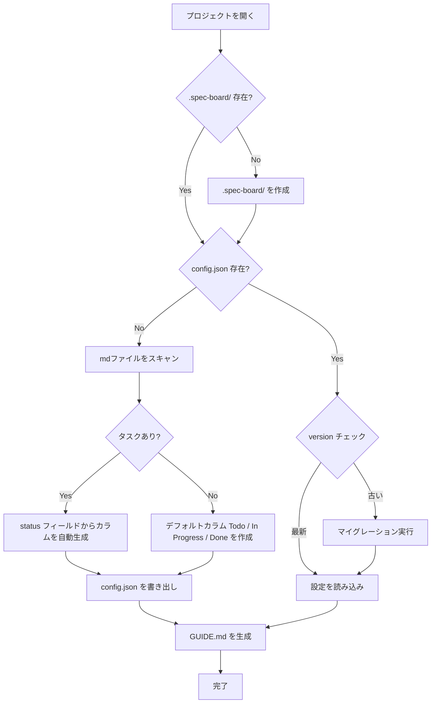

# spec-board - 設定仕様（バックエンド）

> **機能**: [spec-board](./index.md)
> **ステータス**: 下書き

## 概要

spec-board のプロジェクト単位の設定を `.spec-board/config.json` で管理する仕様を定義する。カラム定義、カード並び順、AIエージェント向けフォーマットガイドの自動生成もこの仕様の範囲とする。

## ディレクトリ構造

```
project-root/
├── .spec-board/
│   ├── config.json          # プロジェクト設定（カラム・カード順序など）
│   └── GUIDE.md             # AIエージェント向けフォーマットガイド（自動生成）
└── tasks/
    └── ...
```

- `.spec-board/` はプロジェクト初回オープン時に自動作成
- `.spec-board/` は **gitに含めることを推奨**（カラム定義をチームで共有可能にするため）。ただし強制はしない

## config.json スキーマ

```json
{
  "version": 1,
  "columns": [
    { "name": "Todo", "order": 0 },
    { "name": "In Progress", "order": 1 },
    { "name": "Done", "order": 2 }
  ],
  "cardOrder": {
    "Todo": ["tasks/task-a.md", "tasks/task-b.md"],
    "In Progress": ["tasks/task-c.md"],
    "Done": []
  },
  "doneColumn": "Done"
}
```

### フィールド定義

| フィールド | 型 | 必須 | デフォルト | 説明 |
|:----------|:---|:-----|:----------|:-----|
| version | `number` | はい | `1` | 設定ファイルのスキーマバージョン。将来のマイグレーションに使用 |
| columns | `Column[]` | はい | `[]` | カラム（ステータス）定義の配列 |
| columns[].name | `string` | はい | - | カラム名。タスクのフロントマター `status` と対応 |
| columns[].order | `number` | はい | - | カラムの表示順序（0始まり、昇順） |
| cardOrder | `Record<string, string[]>` | はい | `{}` | カラム名をキー、そのカラム内のタスクファイルパスの配列を値とする。配列順がカード表示順 |
| doneColumn | `string` | いいえ | 最後のカラム名 | 「完了」として扱うカラム名。サブIssue進捗バーの完了判定に使用 |

### columns

- 最低1つのカラムが必要
- カラム名の重複は不可
- `order` は連番である必要はないが、昇順でソートして表示に使用

### cardOrder

- `config.json` に記載されていないタスクは、カラム内の末尾に追加
- 存在しないファイルパスのエントリは自動的に除去（クリーンアップ）
- ドラッグ&ドロップによるカラム内並び替え時に更新

### doneColumn

- サブIssue進捗バーにおける「完了」の判定基準となるカラム
- 未設定の場合は `columns` の最後のカラムをデフォルトとして使用

## 設定の初期化

### 初回オープン時の振る舞い



### マイグレーション

- `version` フィールドでスキーマバージョンを管理
- バージョンが古い場合、自動的にマイグレーションを実行
- マイグレーション前にバックアップ（`config.json.bak`）を作成

## AIエージェント向けガイド（GUIDE.md）

プロジェクトオープン時およびカラム設定変更時に `.spec-board/GUIDE.md` を自動生成する。AIエージェントがこのファイルを参照することで、有効なステータス値やフォーマットを把握できる。

### 生成内容

```markdown
# spec-board タスクフォーマットガイド

このプロジェクトは spec-board で管理されています。
タスクは以下のフォーマットの Markdown ファイルで管理します。

## テンプレート

\```
---
title: タスクのタイトル（必須）
status: Todo（必須・下記の有効な値から選択）
priority: Medium（任意・High / Medium / Low）
labels:（任意）
  - ラベル名
parent: tasks/parent-task.md（任意・親タスクのパス）
links:（任意）
  - tasks/related-task.md
---

タスクの詳細説明
\```

## 有効なステータス値

- Todo
- In Progress
- Done

## ルール

- ファイルは `.md` 拡張子で作成してください
- `.spec-board/` ディレクトリ内のファイルは編集しないでください
- `parent` に指定するパスはプロジェクトルートからの相対パスです
```

### 更新タイミング

| トリガー | 動作 |
|:--------|:-----|
| プロジェクト初回オープン | GUIDE.md を新規生成 |
| カラム追加・削除・名前変更 | 有効なステータス値セクションを再生成 |
| config.json の手動編集検知 | GUIDE.md を再生成 |

## Tauriコマンド

### `get_columns`

**説明**: 現在のカラム設定を取得する。

**引数**: なし

**戻り値**:
```json
{
  "columns": [
    { "name": "Todo", "order": 0 },
    { "name": "In Progress", "order": 1 },
    { "name": "Done", "order": 2 }
  ],
  "doneColumn": "Done"
}
```

---

### `update_columns`

**説明**: カラム設定を更新する。カラムの追加・削除・名前変更・並び替えを処理する。

**引数**:

| パラメータ | 型 | 必須 | 説明 |
|:----------|:---|:-----|:-----|
| columns | `Vec<Column>` | はい | 新しいカラム設定の配列 |
| renames | `Vec<Rename>` | いいえ | カラム名変更の配列 `[{ "from": "旧名", "to": "新名" }]` |
| doneColumn | `String` | いいえ | 完了カラム名 |

**振る舞い**:
1. `renames` がある場合、該当するタスクのmdファイルの `status` を一括更新
   - 一括更新は**トランザクション的**に処理。途中で1件でも失敗した場合、変更済みファイルを元に戻してエラーを返却
2. カラム設定を `config.json` に保存
3. `GUIDE.md` を再生成
4. 更新後のカラム設定を返却

**エラー**:

| ケース | 条件 | エラーメッセージ |
|:-------|:-----|:---------------|
| カラム名重複 | 同名のカラムが存在する | カラム名が重複しています: {name} |
| 一括更新失敗 | リネーム中のファイル書き込み失敗 | カラム名の変更中にエラーが発生しました。変更を元に戻しました |

---

### `update_card_order`

**説明**: カラム内のカード並び順を更新する。

**引数**:

| パラメータ | 型 | 必須 | 説明 |
|:----------|:---|:-----|:-----|
| columnName | `String` | はい | 対象カラム名 |
| filePaths | `Vec<String>` | はい | 新しい並び順のファイルパス配列 |

**振る舞い**:
1. `config.json` の `cardOrder[columnName]` を `filePaths` で上書き
2. 更新後の設定を保存

## エラーハンドリング

| エラーケース | 発生条件 | 振る舞い | ログレベル |
|:------------|:---------|:---------|:----------|
| config.json 読み込み失敗 | JSONパースエラー、権限不足 | デフォルト設定で起動し、トースト通知 | ERROR |
| config.json 書き込み失敗 | ディスク容量不足、権限不足 | エラーをフロントエンドに通知 | ERROR |
| GUIDE.md 生成失敗 | 書き込み権限不足 | 警告ログ出力。アプリの動作には影響しない | WARN |

## 制限事項

- `config.json` を外部エディタで直接編集した場合、アプリ再起動まで反映されない
- `cardOrder` に数千件のエントリがある場合、config.json のサイズが肥大化する可能性がある

## 関連仕様

- [file-system-spec.md](./file-system-spec.md) - プロジェクトオープン時の設定初期化フロー
- [board-view-spec.md](./board-view-spec.md) - カラムの表示・操作仕様
- [task-format-spec.md](./task-format-spec.md) - フロントマターの `status` とカラムの対応
