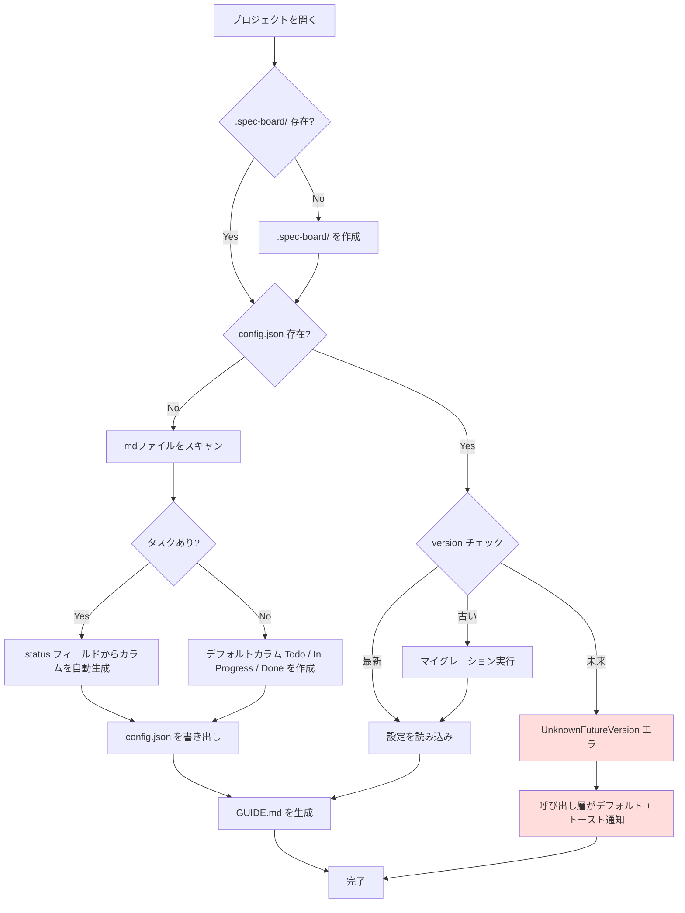

# spec-board - 設定仕様（バックエンド）

> **機能**: [spec-board](./index.md)
> **ステータス**: 下書き

## 概要

spec-board のプロジェクト単位の設定を `.spec-board/config.json` で管理する仕様を定義する。カラム定義、カード並び順、AIエージェント向けフォーマットガイドの自動生成もこの仕様の範囲とする。

## ディレクトリ構造

```
project-root/
├── .spec-board/
│   ├── config.json                          # プロジェクト設定（カラム・カード順序など）
│   ├── config.json.bak                      # 古い version の config を読み込んだ際のマイグレーション前バックアップ（後述「マイグレーション」節）
│   ├── config.json.bak.tmp.{pid}.{nanos}.{counter}  # backup 書き出し中の一時ファイル（rename で `.bak` に昇格／load 冒頭に閾値超過の orphan は cleanup）
│   └── GUIDE.md                             # AIエージェント向けフォーマットガイド（自動生成）
└── tasks/
    └── ...
```

- `.spec-board/` はプロジェクト初回オープン時に自動作成
- `.spec-board/` は **gitに含めることを推奨**（カラム定義をチームで共有可能にするため）。ただし強制はしない
- `config.json.bak` / `config.json.bak.tmp.*` はマイグレーション処理由来のため `.gitignore` に含めることを推奨

## config.json スキーマ

```json
{
  "version": 1,
  "columns": [
    { "name": "Todo", "order": 0 },
    { "name": "In Progress", "order": 1 },
    { "name": "Done", "order": 2 }
  ],
  "cardOrder": {
    "Todo": ["tasks/task-a.md", "tasks/task-b.md"],
    "In Progress": ["tasks/task-c.md"],
    "Done": []
  },
  "doneColumn": "Done"
}
```

### フィールド定義

| フィールド | 型 | 必須 | デフォルト | 説明 |
|:----------|:---|:-----|:----------|:-----|
| version | `number` | はい | `1` | 設定ファイルのスキーマバージョン。将来のマイグレーションに使用 |
| columns | `Column[]` | はい | `[Todo, In Progress, Done]`（`Config::default` baseline） | カラム（ステータス）定義の配列。**最低 1 つのカラムが必須**であり、`columns: []` は load 時に `EmptyColumns` エラーで拒否される（[エラーハンドリング](#エラーハンドリング) 参照） |
| columns[].name | `string` | はい | - | カラム名。タスクのフロントマター `status` と対応 |
| columns[].order | `number` | はい | - | カラムの表示順序（0始まり、昇順） |
| cardOrder | `Record<string, string[]>` | はい | `{}` | カラム名をキー、そのカラム内のタスクファイルパスの配列を値とする。配列順がカード表示順 |
| doneColumn | `string` | いいえ | 最後のカラム名 | 「完了」として扱うカラム名。サブIssue進捗バーの完了判定に使用 |

### columns

- 最低1つのカラムが必要
- カラム名の重複は不可
- `order` は連番である必要はないが、昇順でソートして表示に使用

### cardOrder

- `config.json` に記載されていないタスクは、カラム内の末尾に追加
- 存在しないファイルパスのエントリは自動的に除去（クリーンアップ）
- `columns` のいずれの `name` にも一致しないキーは、そのキーごと除去される
- `columns` に存在するキーについては、パス除去の結果として値が空配列 `[]` になってもキー自体は保持される（カラムの初期状態を表すため。`columns` に無いキーの除去ルールとは独立）
- 値配列内の重複パス除去は現行スコープ外（将来別 Issue で検討）
- ドラッグ&ドロップによるカラム内並び替え時に更新

### doneColumn

- サブIssue進捗バーにおける「完了」の判定基準となるカラム
- 未設定の場合は `columns` の最後のカラムをデフォルトとして使用

## 設定の初期化

### 初回オープン時の振る舞い


```mermaid
flowchart TD
    A[プロジェクトを開く] --> B{.spec-board/ 存在?}
    B -->|No| C[.spec-board/ を作成]
    B -->|Yes| D{config.json 存在?}
    C --> D
    D -->|No| E[mdファイルをスキャン]
    D -->|Yes| F{version チェック}
    E --> G{タスクあり?}
    G -->|Yes| H[status フィールドからカラムを自動生成]
    G -->|No| I[デフォルトカラム Todo / In Progress / Done を作成]
    H --> J[config.json を書き出し]
    I --> J
    J --> K[GUIDE.md を生成]
    F -->|最新| L[設定を読み込み]
    F -->|古い| M[マイグレーション実行]
    F -->|未来| X[UnknownFutureVersion エラー]
    X --> Y[呼び出し層がデフォルト + トースト通知]
    M --> L
    L --> K
    K --> N[完了]
    Y --> N

    style X fill:#fdd
    style Y fill:#fdd
```

### 既存タスクからのカラム自動生成（純粋関数 `build_config_from_statuses`）

上記フローチャートの `H[status フィールドからカラムを自動生成]` ノードは、バックエンドの純粋関数 `build_config_from_statuses` が担当する。本関数の責務と入出力規約を以下に明文化する。

#### 責務 / 入出力

- **入力**: `(file_path, status)` の列（既存タスクの md フロントマター由来）。
- **出力**: `Config` 値。**保存は行わない**（保存・走査・パースは別レイヤの責務）。
- **入力 0 件のときの戻り値**: `columns: []` の `Config`。これは**内部純粋関数の戻り値**であり、保存対象 `config.json` ではない。
- 「タスクなし時はデフォルト 3 カラム（Todo / In Progress / Done）を保存する」分岐は**上位フロー側**の責務であり、その層で `Config::default()` を採用する。
- 「`columns` は最低 1 つ必要」のルール（上記「columns」節）は**保存される `config.json`** に対する制約であり、純粋関数の戻り値とは独立。

#### カラム順序と `doneColumn` の採用規則

- カラム名は `(path, status)` 列を **path 昇順**でソートしてから、各 status の **first-occurrence wins**（初出順、重複は除去）で並ぶ。
- ソートは `PathBuf::Ord`（OS の `OsStr` 表現順序）に従い、project-root からの相対パスでの比較が前提。
- `status` フィールドが欠落しているタスク（`None`）は、先頭デフォルトカラム名（`"Todo"`）にフォールバックする。
- `doneColumn` は生成された columns の**末尾カラム名**を採用する（`columns` が空なら `None`）。

#### 入力 status の正規化責務

- 入力の status 文字列はそのまま採用される。空文字 `""`、空白のみ `" "`、前後空白を含む `"  Todo  "` も**未正規化のまま**カラム名となる。
- `trim` / 大文字小文字統一などの正規化は**呼び出し層**（フロントマター `extras["status"]` を `Value -> Option<String>` に変換する層）の責務。
- 結果として、未正規化の `"  Todo  "` と trim 後の `"Todo"` は**別カラム**として扱われる点に注意。

### マイグレーション

- `version` フィールドでスキーマバージョンを管理
- バージョンが古い場合、自動的にマイグレーションを実行
- マイグレーション前にバックアップ（`config.json.bak`）を作成

#### バージョン判定の挙動

これらは **`load_or_default` の戻り値**としての契約を述べる。アプリ起動時のユーザー体験（デフォルト + トースト）はこれを受け取った**呼び出し層（Tauri コマンド / アプリシェル）の責務**であり、後述「[エラーハンドリング](#エラーハンドリング)」のテーブルにフォールバック挙動を集約する。

- 読み込んだ `version` が現行サポート範囲（`DEFAULT_VERSION = 1`）を超える場合は `UnknownFutureVersion` エラーを `Err` として返す。
- `load_or_default` は冒頭で `<root>/.spec-board/config.json.bak.tmp.*` の orphan を best-effort で削除する（クラッシュ等で `open(tmp)` と `rename(tmp, dst)` の間で中断された残骸を後続 load で清掃する）。安全条件として: (1) `.spec-board/` 自体が symlink の場合は走査自体を skip して外部ディレクトリの巻き込み削除を防ぐ、(2) tmp 名末尾の `{nanos}` を読み、現在時刻との差が **1 時間以上** の orphan のみを削除対象とし、同一 / 別プロセスで進行中の concurrent load が作った直近の live tmp は温存する。
- 古い `version` を読み込んだ場合は `<root>/.spec-board/config.json.bak` をマイグレーション**前**の生コンテンツで作成（既存 `.bak` は警告なく上書き、履歴は残さない）した上でマイグレーションを実行する。**書き出し戦略**: ① 呼び出しごとに unique な tmp パス（`config.json.bak.tmp.{pid}.{nanos}.{counter}`、`counter` は process-local AtomicU64）を組み立て（同一プロセス内・粗い時計分解能環境でも collision を防ぎつつ並行 load 干渉を回避）、② その tmp パスを `unlink`（symlink / hard link のリンク先や inode は破壊せずディレクトリエントリだけ除去）してから `O_CREAT | O_EXCL` 相当（`OpenOptions::create_new(true)`）で完全に新しい inode を atomic に作成し、③ その fresh inode に raw コンテンツを書き込み、④ atomic `rename(<tmp>, config.json.bak)` でディレクトリエントリだけを差し替える。これにより tmp が事前に外部ファイルへ **symlink / hard link** されていても、`.bak` が外部ファイルへ hard link されていても、いずれの inode も truncate されずプロジェクト外のファイル上書きを防げる。書き出し前に追加で `<root>/.spec-board/` ディレクトリと `config.json.bak` の leaf の双方が symlink でないことを確認し、いずれかが symlink の場合は `BackupFailed` を返して書き出しを拒否する（多重防御）。いずれもベストエフォート防御であり、`<root>` 自身およびそれ以上の ancestor の symlink / hard link、本チェックと write / rename の間に発生する TOCTOU race、ロックレスでの並行 load 完全制御は **本Issue 範囲外**（lockfile / project-root 内制限の導入は別Issue で扱う）。
- マイグレーション結果は呼び出し側に返る `Config.version` が常に `DEFAULT_VERSION` に正規化される。本Issue（骨格段階）では `config.json` への永続化は行わないため、古い `version` のファイルが残っている限り、毎回の load で backup + migrate 経路を通る。
- `version` フィールドの欠落 / 型不一致（文字列など）/ `u32` 範囲外は通常の JSON パースエラー（`Parse`）として扱う。

#### カラム名重複の検証

- `columns` 内のカラム名は load 時に完全一致で重複検査される。重複が見つかれば `DuplicateColumnName` を `Err` として返す（呼び出し層のフォールバック挙動は[エラーハンドリング](#エラーハンドリング)を参照）。
- 大文字小文字違い（例: `"Todo"` vs `"todo"`）は別カラム扱い（`build_config_from_statuses` と同規約）。
- カラム名は値そのものを完全一致比較する。空文字 `""` / 空白のみ `" "` / 前後空白付き `"  Todo  "` も**未正規化のまま**受理し、distinct であれば許容する（`trim` 等の正規化責務は呼び出し層）。空文字 / 空白を別エラーとして拒否する仕様は本Issue 範囲外。

## AIエージェント向けガイド（GUIDE.md）

プロジェクトオープン時およびカラム設定変更時に `.spec-board/GUIDE.md` を自動生成する。AIエージェントがこのファイルを参照することで、有効なステータス値やフォーマットを把握できる。
バックエンドの `Config::guide_markdown` / `generate_guide_markdown` / `generate_guide_markdown_for_columns` は、GUIDE.md の Markdown 本文を組み立てる純粋関数である。`.spec-board/GUIDE.md` への書き込み、更新タイミング制御、Tauri コマンド公開は別レイヤの責務とする。

### 生成内容

```markdown
# spec-board タスクフォーマットガイド

このプロジェクトは spec-board で管理されています。
タスクは以下のフォーマットの Markdown ファイルで管理します。

## テンプレート

````
---
title: タスクのタイトル（推奨・省略時はファイル名からフォールバック）
status: Todo（推奨・省略時は既定カラムにフォールバック。指定する場合は下記の有効な値から選択）
priority: Medium（任意・High / Medium / Low）
labels:（任意）
  - ラベル名
parent: tasks/parent-task.md（任意・親タスクのパス）
links:（任意）
  - tasks/related-task.md
---

タスクの詳細説明
````

## 有効なステータス値

- Todo
- In Progress
- Done

## ルール

- ファイルは `.md` 拡張子で作成してください
- `.spec-board/` ディレクトリ内のファイルは編集しないでください
- `parent` に指定するパスはプロジェクトルートからの相対パスです
```

上記は default config の生成例である。実際の GUIDE.md 生成では、テンプレート内の `status:` 例は `columns[].order` 昇順で最初の `columns[].name` を raw 出力する。

「有効なステータス値」セクションは、`columns[].name` を `columns[].order` 昇順で bullet 出力する。同一 `order` のカラムがある場合は入力配列順を保持する。カラム名は Markdown escape / trim / normalization を行わず、値そのものを出力する。

保存対象の `config.json` では `columns: []` は load 時に拒否されるが、Markdown 文字列生成用の純粋関数は `columns: []` 入力でも panic せず文字列を返す。この場合、テンプレート内の `status:` 例は `Todo` にフォールバックし、「有効なステータス値」見出し直下には bullet を出力せず空行を 1 つ置く。

生成される Markdown 文字列は、タイトル、テンプレート、有効なステータス値、ルールの順序で決定論的に構成され、末尾改行を含む。

### 更新タイミング

| トリガー | 動作 |
|:--------|:-----|
| プロジェクト初回オープン | GUIDE.md を新規生成 |
| カラム追加・削除・名前変更 | 有効なステータス値セクションを再生成 |
| 外部エディタで config.json を直接編集後、アプリ再起動 | GUIDE.md を再生成して反映 |

## Tauriコマンド

### `get_columns`

**説明**: 現在のカラム設定を取得する。

**引数**: なし

**戻り値**:
```json
{
  "columns": [
    { "name": "Todo", "order": 0 },
    { "name": "In Progress", "order": 1 },
    { "name": "Done", "order": 2 }
  ],
  "doneColumn": "Done"
}
```

---

### `update_columns`

**説明**: カラム設定を更新する。カラムの追加・削除・名前変更・並び替え・完了カラム変更を 1 コマンドで処理する。すべての引数は任意で、指定されたフィールドのみが更新される（`renames` → `columns` → `doneColumn` の順に適用）。

**引数**:

| パラメータ | 型 | 必須 | 説明 |
|:----------|:---|:-----|:-----|
| columns | `Vec<Column>` | いいえ | 新しいカラム設定の配列。指定時はカラム集合を上書き（追加・削除・並び替え）。**rename 適用後の名前空間**で指定する。未指定時はカラム集合を変更しない |
| renames | `Vec<Rename>` | いいえ | カラム名変更の配列 `[{ "from": "旧名", "to": "新名" }]`。空配列または未指定で rename 処理スキップ |
| doneColumn | `String` | いいえ | 完了カラム名。**rename 適用後の名前空間**で指定する。未指定時は変更しない |

**振る舞い**:
1. すべての引数が未指定（`columns`/`doneColumn`/`renames` のいずれも `None`）の場合は no-op として `Ok(())` を返し、ファイルや state を一切変更しない
2. `renames` 内で `from == to` の項目は冪等にスキップ
3. `renames` が指定され、かつ空でない場合、該当するタスクのmdファイルの `status` を一括更新（空配列または未指定の場合はこのステップをスキップ）
   - 一括更新は**トランザクション的**に処理。途中で1件でも失敗した場合、変更済みファイルを元に戻してエラーを返却
4. `columns` が指定されている場合、カラム集合を上書きして `config.json` に保存
5. `doneColumn` が指定されている場合、完了カラム名を更新して `config.json` に保存
6. `GUIDE.md` を再生成
7. 戻り値なし（更新後の設定が必要な場合は呼び出し側が `get_columns` で取得する）

**エラー**:

| ケース | 条件 | エラーメッセージ |
|:-------|:-----|:---------------|
| プロジェクト未オープン | `AppState` に project_path / config が無い | プロジェクトが開かれていません |
| 内部 lock 破損 | `AppState` または `WriteIgnoreRegistry` の Mutex が poison | 内部状態のロックが破損しました |
| カラム全削除 | `columns: []`（空配列）が指定された | カラムを 0 件にすることはできません |
| カラム名重複 | 同名のカラムが存在する | カラム名が重複しています: {name} |
| 不在 rename from | `rename.from` が現在の columns に無い | 存在しないカラム名のリネームが指定されました: {name} |
| 重複 rename from | 同じ `from` を複数 rename で指定 | 同じカラム名のリネームが複数指定されました: {name} |
| 空 rename to | `rename.to` が空文字列 | リネーム後のカラム名が空です |
| 不在 doneColumn | `doneColumn` が新 columns に無い | 指定された完了カラムが存在しません: {name} |
| rename.to が新 columns に欠落 | `args.columns` と `renames` を同時指定したが `rename.to` が新 columns に含まれない | リネーム後のカラム名が新しい columns に含まれていません: {name} |
| md frontmatter パース失敗 | rename 対象 md の YAML パースに失敗 | カラム名の変更中にフロントマターのパースに失敗しました |
| md frontmatter 不在 | rename 対象 md に frontmatter が無い | カラム名の変更対象 md にフロントマターがありません: {path} |
| 原本読み込み失敗 | rename 対象 md の読み込みに失敗（書き換え開始前） | カラム名の変更対象 md の読み込みに失敗しました: {path} |
| 一括更新失敗 | リネーム中のファイル書き込み失敗 | カラム名の変更中にエラーが発生しました。変更を元に戻しました |
| ロールバック失敗 | rollback 中の書き戻しに失敗（二重失敗） | カラム名の変更失敗後のロールバックに失敗しました: {path} |
| config.json シリアライズ失敗 | `serde_json::to_string_pretty` 失敗 | config.json のシリアライズに失敗しました |
| config.json 書き込み失敗 | atomic write 失敗（権限・ディスク容量等） | config.json の書き込みに失敗しました: {path} |

---

### `update_card_order`

**説明**: カラム内のカード並び順を更新する。

**引数**:

| パラメータ | 型 | 必須 | 説明 |
|:----------|:---|:-----|:-----|
| columnName | `String` | はい | 対象カラム名 |
| filePaths | `Vec<String>` | はい | 新しい並び順のファイルパス配列 |

**振る舞い**:
1. `columnName` が `columns[]` に存在しない場合は更新を拒否し、`config.json` を変更しない（エラー文字列: `カラムが見つかりません: {columnName}`）
2. `filePaths` は FE が事前に正規化した結果をそのまま `cardOrder[columnName]` に保存する。バックエンド側では未存在ファイルパスの除外などのフィルタを行わない
3. 既存キーがあれば**上書き**、無ければ**新規追加**として `cardOrder` に書き込む
4. 書き込みは tmp → rename ベース（Unix では `rename(2)` の atomic 置換、Windows では既存ファイル上書き時に backup 経由の 2 段 rename にフォールバック）で行い、`config.json` 自体が中途半端な内容になる部分書き込みを防止する
5. `.spec-board/` ディレクトリは watcher の拡張子フィルタで除外されるため、本書き込みによって FE への変更通知（emit）は走らない
6. disk への書き込みが成功した場合、`project_path` が処理開始時の snapshot と一致するときに限り AppState の `Config` を更新する。disk 失敗時は in-memory の `Config` を変更しない（次回呼び出しで再試行可能）

**並行性**:

- **逐次**呼び出し（前の呼び出しが完了してから次が始まる場合）は、最後の呼び出しの結果が最終的に保存される（後勝ち）。
- **`open_project` との並行**: 処理開始時に `project_path` と `config` を**両 lock 同時保持下で atomic に snapshot** し、disk write 後の in-memory 更新も**両 lock 同時保持下で `project_path` の一致確認 + `config` 更新の atomic check-and-set** として行う。これにより `open_project` の commit と interleave しても「新 path + 旧 config」を観測する race や、旧プロジェクトの config を新プロジェクトの in-memory state に注入する race は発生しない。snapshot 取得後に project が swap された場合、disk write は旧プロジェクトの `.spec-board/config.json` に対して整合的に完了し、新プロジェクトの in-memory 更新は no-op となる。
- **同一プロジェクト内での `update_card_order` 並行**呼び出し時の厳密な整合性は本機能では保証しない。`snapshot_project_and_config` から `replace_config_if_project_matches` までは 2 回の lock 取得に分かれているため、間に別の `update_card_order` 呼び出しが完了すると、後勝ちの disk 書き込みより前に取得した snapshot で disk が上書きされる race window が残る。本ケースは現状の DnD UX 上の問題が観測されていないため受容しており、将来 `AppState::with_config_mut` のような atomic update helper を導入した時点で改善する。

## エラーハンドリング

### load_or_default が返す `LoadConfigError` バリアント

`load_or_default` が返す各 `Err` バリアントに対して、**呼び出し層（Tauri コマンド / アプリシェル）が決定する**フォールバック挙動を以下にまとめる。バックエンド層自体はデフォルトへのフォールバックを行わず、エラーを caller に返す。

| エラーケース | 発生条件 | バックエンド戻り値 | 呼び出し層の振る舞い | ログレベル |
|:------------|:---------|:------------------|:-------------------|:----------|
| JSON パース失敗 | JSON 構文エラー、必須フィールド欠落、`version` の型不一致 / `u32` 範囲外 | `LoadConfigError::Parse` | デフォルト設定で起動し、トースト通知 | ERROR |
| 未来 version 検出 | `version > DEFAULT_VERSION` | `LoadConfigError::UnknownFutureVersion` | デフォルト設定で起動し、トースト通知（アプリの更新案内を含む） | ERROR |
| カラム名重複 | `columns` 内に同一名のカラムが存在 | `LoadConfigError::DuplicateColumnName` | デフォルト設定で起動し、トースト通知 | ERROR |
| 空カラム | `columns: []` (spec の「最低1つのカラムが必要」違反) | `LoadConfigError::EmptyColumns` | デフォルト設定で起動し、トースト通知 | ERROR |
| マイグレーション失敗（**本Issue 時点では到達不能**: 詳細は表下注を参照） | `migrate_config` が `MigrationError` を返す | `LoadConfigError::MigrationFailed` | デフォルト設定で起動し、トースト通知 | ERROR |
| バックアップ失敗 | `.bak` の書き出しに失敗（権限不足 / symlink 宛先 / ディレクトリ衝突など） | `LoadConfigError::BackupFailed` | デフォルト設定で起動し、トースト通知（バックアップ作成失敗の旨を明示） | ERROR |
| I/O 失敗 | `.spec-board/` の作成 / `config.json` の読み取りに失敗 | `LoadConfigError::Io` | デフォルト設定で起動し、トースト通知 | ERROR |

> **`MigrationFailed` の到達可能性について**
>
> 本Issue（骨格段階）時点では `load_or_default` 経由で `LoadConfigError::MigrationFailed` は実際には返らない。`from_version > DEFAULT_VERSION` は `UnknownFutureVersion` で先に弾かれ、`from_version <= DEFAULT_VERSION` の経路では現行 `migrate_config` は常に `Ok` を返すため。
> バリアントは `MigrationError` の variant 追加に向けた forward compatibility のために存在し、将来 `DEFAULT_VERSION` を引き上げて実マイグレーションを実装したタイミングで実際に発生し得るようになる。本Issue 時点の caller は `MigrationFailed` 経路を実装しなくてよい（match の網羅性のためにダミーアームを書く程度で十分）。

### load_or_default 以外のフロー

| エラーケース | 発生条件 | 振る舞い | ログレベル | 仕様参照 |
|:------------|:---------|:---------|:----------|:--------|
| config.json 書き込み失敗 | ディスク容量不足、権限不足 | エラーをフロントエンドに通知 | ERROR | save 経路（別Issue） |
| GUIDE.md 生成失敗 | 書き込み権限不足 | 警告ログ出力。アプリの動作には影響しない | WARN | GUIDE.md 自動生成（別Issue） |

## 制限事項

- `config.json` を外部エディタで直接編集した場合、アプリ再起動まで反映されない
- `cardOrder` に数千件のエントリがある場合、config.json のサイズが肥大化する可能性がある

## 関連仕様

- [file-system-spec.md](./file-system-spec.md) - プロジェクトオープン時の設定初期化フロー
- [board-view-spec.md](./board-view-spec.md) - カラムの表示・操作仕様
- [task-format-spec.md](./task-format-spec.md) - フロントマターの `status` とカラムの対応
