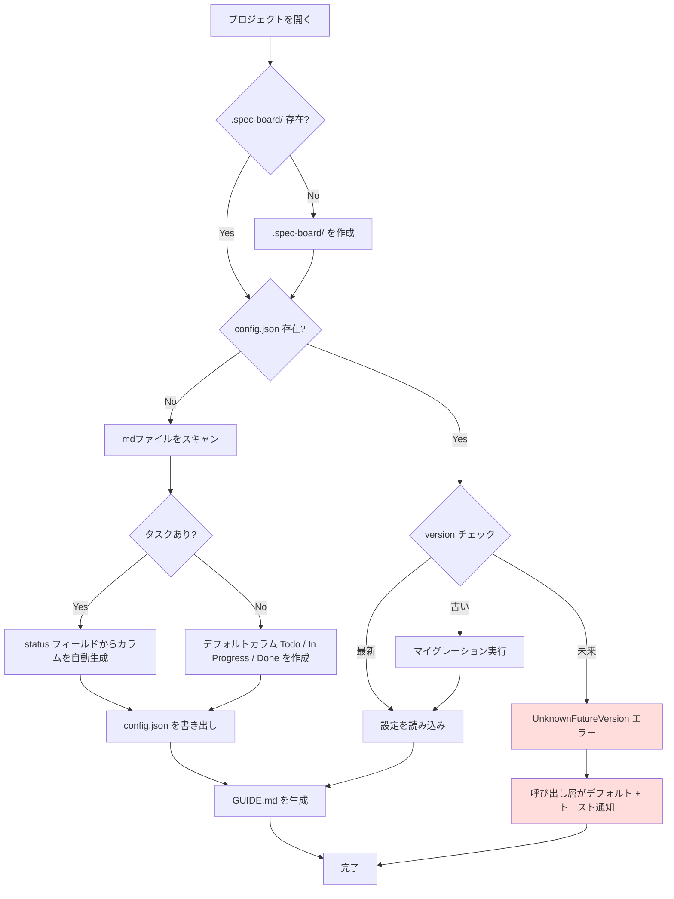

# spec-board - 設定仕様（バックエンド）

> **機能**: [spec-board](./index.md)
> **バージョン**: 1.1
> **ステータス**: 下書き

## 概要

spec-board のプロジェクト単位の設定を `.spec-board/config.json` で管理する仕様を定義する。カラム定義、カード並び順、AIエージェント向けフォーマットガイドの自動生成もこの仕様の範囲とする。

> **UI 設定はここに含めない**: テーマ / 表示密度 / アクセント、サイドバーの折りたたみ、ボードの表示形態（ビュー切替）、最近開いたプロジェクトといった**クライアントローカルな UI 設定**は `config.json` ではなくブラウザの `localStorage`（`spec-board:*` キー）に保存する。プロジェクトを跨いで共有される端末固有の設定であり、プロジェクトフォルダ（リポジトリ）には持ち込まない。詳細は [board-view-spec.md](./board-view-spec.md) の「IDEシェル」節を参照。

## ディレクトリ構造

```
project-root/
├── .spec-board/
│   ├── config.json                          # プロジェクト設定（カラム・カード順序など）
│   ├── config.json.bak                      # 古い version の config を読み込んだ際のマイグレーション前バックアップ（後述「マイグレーション」節）
│   ├── config.json.bak.tmp.{pid}.{nanos}.{counter}  # backup 書き出し中の一時ファイル（rename で `.bak` に昇格／load 冒頭に閾値超過の orphan は cleanup）
│   ├── labels.yml                           # ラベルマスタ定義（説明・グループ・色などのメタ情報。後述「labels.yml スキーマ」節）
│   ├── milestones.yml                       # マイルストーンマスタ定義（表示名・期日・並び順・状態などのメタ情報。後述「milestones.yml スキーマ」節）
│   ├── GUIDE.md                             # AIエージェント向けフォーマットガイド（自動生成）
│   ├── templates/                           # タスクテンプレート置き場（任意。後述「タスクテンプレート」節）
│   │   └── *.md
│   ├── archive/                             # アーカイブ済みタスク置き場（後述「タスクアーカイブ」節）
│   │   └── <元の相対パス>.md
│   └── trash/                               # 削除済みタスクのゴミ箱（後述「ゴミ箱」節）
│       └── <元の相対パス>.md
└── tasks/
    └── ...
```

- `.spec-board/` はプロジェクト初回オープン時に自動作成
- `.spec-board/` は **gitに含めることを推奨**（カラム定義をチームで共有可能にするため）。ただし強制はしない
- `config.json.bak` / `config.json.bak.tmp.*` はマイグレーション処理由来のため `.gitignore` に含めることを推奨

## config.json スキーマ

```json
{
  "version": 1,
  "columns": [
    { "name": "Todo", "order": 0, "color": "#2563eb" },
    { "name": "In Progress", "order": 1, "wipLimit": 3 },
    { "name": "Done", "order": 2 }
  ],
  "cardOrder": {
    "Todo": ["tasks/task-a.md", "tasks/task-b.md"],
    "In Progress": ["tasks/task-c.md"],
    "Done": []
  },
  "doneColumn": "Done"
}
```

### フィールド定義

| フィールド | 型 | 必須 | デフォルト | 説明 |
|:----------|:---|:-----|:----------|:-----|
| version | `number` | はい | `1` | 設定ファイルのスキーマバージョン。wire / disk では従来どおり数値であり、将来のマイグレーションに使用 |
| columns | `Column[]` | はい | `[Todo, In Progress, Done]`（`Config::default` baseline） | カラム（ステータス）定義の配列。**最低 1 つのカラムが必須**であり、`columns: []` は load 時に `EmptyColumns` エラーで拒否される（[エラーハンドリング](#エラーハンドリング) 参照） |
| columns[].name | `string` | はい | - | カラム名。タスクのフロントマター `status` と対応 |
| columns[].order | `number` | はい | - | カラムの表示順序（0始まり、昇順）。u32 の有限な非負整数として扱い、新規追加時に最大値へ到達している場合は追加を適用しない |
| columns[].color | `string` | いいえ | なし（フォールバックパレット） | カラムヘッダー上端アクセント帯の `#RRGGBB` 色。不正形式・型不一致・欠落・`null` は lenient に「色なし」へ倒す（後述）。`None` 時は serialize で `color` キーごと省略され、既定値の適用は FE 表示層の責務 |
| columns[].wipLimit | `number` | いいえ | なし（制限なし） | カラムの WIP 上限（1 以上の整数）。0・負数・小数・型不一致・欠落・`null` は lenient に「制限なし」へ倒す（後述）。`None` 時は serialize で `wipLimit` キーごと省略される。超過してもボード操作は拒否せず、FE がヘッダーで警告表示にのみ使う |
| cardOrder | `Record<string, string[]>` | はい | `{}` | カラム名をキー、そのカラム内のタスクファイルパスの配列を値とする。配列順がカード表示順 |
| doneColumn | `string` | いいえ | 最後のカラム名 | 「完了」として扱うカラム名。サブIssue進捗バーの完了判定に使用 |

### columns

- 最低1つのカラムが必要
- カラム名の重複は不可
- `order` は連番である必要はないが、昇順でソートして表示に使用する。FE の新規カラム追加は現在の最大値 + 1 を採番し、u32 最大値に到達している場合は重複 order を作らず中止する
- `color` はカラムヘッダー上端のアクセント帯に使う任意の色。設定済みのカラムは reorder / rename を行っても `color` が保持される
- `wipLimit` はカラムの WIP 上限（任意）。設定済みのカラムは reorder / rename を行っても `wipLimit` が保持される。ステータス未記載タスクの自動追従（reconcile）や config 生成（bootstrap）で追加されるカラムは `wipLimit` なしで作られる

#### color の lenient 解釈

- `color` は `#RRGGBB`（`#` + 16 進 6 桁）のみ妥当とみなし、妥当な場合のみ色として保持する。大文字は小文字へ正規化する（`#ABCDEF` → `#abcdef`）。
- 不正形式（`"red"` / `"#12345"` 等）・型不一致（数値 `123`）・欠落・`null` はエラーにせず「色なし」へ倒す。payload では `color` を省略し、フォールバックパレット（`order` index ベースのテーマトークン）の適用は FE 表示層の責務とする。
- `color` 未設定（`None`）のカラムを serialize すると `color` キーは出力されない（`skip_serializing_if`）。これにより既存 `config.json` を reorder / rename で書き戻しても `color` キーは付与されず、差分が生じない。

#### wipLimit の lenient 解釈

- `wipLimit` は 1 以上の整数のみ妥当とみなし、妥当な場合のみ上限として保持する。
- `0`・負数・小数（`2.5`）・型不一致（`"3"` / `true`）・`u32` 超過・欠落・`null` はエラーにせず「制限なし」へ倒す。
- `wipLimit` 未設定（`None`）のカラムを serialize すると `wipLimit` キーは出力されない（`skip_serializing_if`）。
- 上限はあくまで表示上の警告に使う値であり、超過状態でもタスク作成・移動などのボード操作は拒否されない。

### cardOrder

- `config.json` に記載されていないタスクは、カラム内の末尾に追加
- ドラッグ&ドロップによるカラム内並び替え時に更新
- 正規化は in-memory のみで実行し、config.json への即時書き戻しは行わない（次の write 操作で自然に永続化）

#### パスの同一性（canonical 表記）

パスの同一性は「canonical 表記」で判定する。canonical 化は次の順で行う。

1. `\` を `/` に置換する
2. 空セグメント・`.` セグメント・先頭の Windows ドライブレター（`C:` 形式）を除去する。
   この結果、先頭 / 末尾のスラッシュや重複スラッシュも取り除かれる（`/tasks/a.md` → `tasks/a.md`）
3. `..` セグメントを含むものは canonical 化できないものとして扱う
4. 空文字・`.md` 以外の拡張子のものは canonical 化できないものとして扱う

- 大文字小文字は区別する。`Tasks/A.md` と `tasks/a.md` は別のタスクとして扱う（case-sensitive なファイルシステムで実在しうる別ファイルを誤って 1 つに畳まないため）
- canonical 化できない参照は cardOrder から除去される

#### 重複の除去

不変条件は 2 種類あり、保証されるタイミングが異なる。

- **同一カラム内の一意性**: 値配列内の重複パスは canonical 表記の比較で除去される（first occurrence wins）。
  `tasks/a.md` と `tasks\a.md` は同一パスとして扱う。これは `cardOrder` を構築・変更する
  **すべての経路**（`config.json` の読み込み / `move_task` / `update_columns`）で常に保証される
- **カラム跨ぎの一意性**: 同一パスが複数カラムに出現する場合、columns の order 昇順走査で最初に
  見つかったカラムに残る（first occurrence wins）。order が同値のカラム間ではカラム名の辞書順（昇順）で
  tie-break する。この解決は**プロジェクト読み込み時にのみ**実行される（勝者の判定にカラム表示順が
  必要なため）。`move_task` / `update_columns` は書き込み前の `cardOrder` が既にこの条件を
  満たしている前提で 1 カラムだけを書き換える

#### キーと空配列の扱い

- `columns` のいずれの `name` にも一致しないキーは、`update_columns` によるカラム定義の更新時に
  そのキーごと除去される。読み込み時の正規化ではキーを除去しない（値が空配列になっても残す）
- `columns` に存在するキーについては、パス除去の結果として値が空配列 `[]` になってもキー自体は保持される（カラムの初期状態を表すため）
- 実体が消えたファイルパスのエントリは、そのカラムの `cardOrder` を書き換える操作（`move_task`）の
  時点で除去される

### doneColumn

- サブIssue進捗バーにおける「完了」の判定基準となるカラム
- 未設定の場合は `columns` の最後のカラムをデフォルトとして使用

## labels.yml スキーマ

タスク frontmatter の `labels`（自由文字列の配列）に対し、説明・グループ・色などのメタ情報を一元管理する「ラベルマスタ定義ファイル」を `.spec-board/labels.yml` に置く。`config.json` とは別ファイルで管理し、トップレベルの `labels:` キー配下に定義の配列を並べる。

```yaml
# .spec-board/labels.yml
labels:
  - name: bug
    description: バグ報告
    group: type
    color: "#D73A4A"        # 必ずクォートする（unquoted な #... は YAML コメント扱いになる）
    updated: "2026-05-30T12:00:00Z"
  - name: enhancement       # name のみ（他フィールドは任意・省略可）
```

### フィールド定義

| フィールド | 型 | 必須 | デフォルト | 説明 |
|:----------|:---|:-----|:----------|:-----|
| labels | `LabelDefinition[]` | いいえ | `[]` | ラベル定義の配列。トップレベルキー欠落 / `null` / 空配列はいずれも空レジストリ（= 全ラベル暗黙扱い）に正規化される |
| labels[].name | `string` | はい | - | ラベル識別子。完全一致・未正規化（trim / 大文字小文字統一なし）。空文字 `""` は不可 |
| labels[].description | `string` | いいえ | なし | ラベルの説明文 |
| labels[].group | `string` | いいえ | なし | UI 上のグルーピングに使うグループ名（グルーピングの表示は表示層の責務）。空文字 `""` は未指定として扱い `None` に正規化する（trim / 大文字小文字統一はしない） |
| labels[].color | `string` | いいえ | なし（既定色） | `#RRGGBB` 形式の色。不正形式は lenient に「色なし（既定色）」へ倒す（後述） |
| labels[].updated | `string` | いいえ | なし | 最終更新日時。ISO 8601 を推奨するが形式は検証せず文字列のまま保持する |

### 配置・読み込み

- `.spec-board/labels.yml` に配置する。ファイル不在時は空レジストリ（`labels: []`）として扱い、プロジェクトは正常に開ける（後方互換）。
- プロジェクトオープン時（`open_project`）に読み込み、`AppState` に保持する。取得は独立した `get_labels` コマンドで行う（`open_project` の payload には同梱しない）。
- 空ファイル / コメントのみ / `---`（null ドキュメント）/ `labels:` キー欠落 / `labels: null` はいずれも空レジストリに正規化する。

### color の lenient 解釈

- `color` は `#RRGGBB`（`#` + 16 進 6 桁）のみ妥当とみなす。妥当な場合のみ色として保持する。
- 不正形式（`"red"` / `"#GGG"` 等）・型不一致（数値 `123` / マッピング `{}`）・欠落・`null` はエラーにせず「色なし」へ倒す。payload では `color` を省略し、既定色の適用は FE 表示層の責務とする。
- **`color` はクォート必須**: YAML では `#` 以降がコメント扱いになるため、`color: #1A2B3C`（クォートなし）は値が `null` と解釈され、silently 既定色へ倒れる。必ず `color: "#1A2B3C"` とクォートする。

### name 一意性の検証

- `name` はマスタ内で完全一致・一意。重複が見つかれば load 時に拒否し、`open_project` は `labels load failed (parse)` として失敗する。
- `name` が空文字 `""` の定義も load 時に拒否する（`labels load failed (parse)`）。空白のみ `"   "` は trim しない方針のため許容する（未正規化）。
- ここでの「一意性 / 空拒否」はマスタ定義 `labels.yml` 自身に対する制約であり、**frontmatter の未定義ラベル**（labels.yml に存在しないラベル名）は警告なく暗黙許容する点と区別する。
- Rust ドメイン上の `LabelRegistry` は定義配列を非公開で保持し、空の既定値または検証を通過した構築経路からのみ生成する。YAML 読み込み、直接 deserialize、create / update の各経路はいずれも同じ空名・完全一致重複検証を通るため、検証前の配列を registry として公開しない。定義の参照は immutable であり、定義順を変更しない。
- この内部構築制約は永続化・IPC 形状を変更しない。`labels:` 配列、欠落 / `null` の空レジストリ化、未知フィールド、各 lenient フィールド、既存の load エラー文字列は従来どおりとする。

### スキーマの前方互換

- 未知のトップレベルキー / 定義内キーは無視する（`deny_unknown_fields` は付けない）。将来のフィールド追加に対する前方互換のため。
- lenient なのは `color` のみ。`name` / `description` / `group` / `updated` は文字列型を strict に検証し、文字列以外（数値 `123` / bool / mapping / sequence 等）が来た場合は `labels load failed (parse)` として扱う（`description: "123"` のようにクォートすれば文字列として受理される）。
- `get_labels` payload は labels.yml の定義順をそのまま保持する（並べ替えない）。`group` での UI グルーピングは表示層の責務。

### get_labels の使用数集計

`get_labels` の payload は定義（labels.yml 由来）と派生値（使用数）を別フィールドで返す（1 オブジェクトに混ぜない）。

```ts
type GetLabelsPayload = {
  labels: WireLabelDefinition[];      // 定義順を保持（FE は adapter で domain 型へ変換）
  usageCounts: { [name: string]: number }; // ラベル名 → 使用タスク件数
};
```

- `usageCounts` は「そのラベルを使っているタスクの件数」。1 タスク内で同じラベルが重複していても 1 件（タスク単位で重複排除）。照合は完全一致・未正規化。
- `usageCounts` はタスク側（frontmatter）由来のため、labels.yml に未定義の暗黙ラベルのキーも含み得る。FE は `labels[].name` で引くため余分なキーは無害（暗黙ラベルは `labels` に現れない）。
- 集計は表示用のため eventual consistency を許容する（labels と tasks を厳密に同一トランザクションでは観測しない）。
- **FE 型ドリフト注意**: FE の TS 型は手書きのため、Rust 側の `usageCounts` 追加だけでは TS ビルドは壊れない。`GetLabelsPayload` の TS 型に `usageCounts` を追加して追従する必要がある（FE 実装は別 Issue）。

### ラベル CRUD コマンド

ラベルマスタの書き込みは 3 コマンドで行う。いずれも成功時に `.spec-board/labels.yml` を atomic に上書きし、in-memory state にも反映する。

| コマンド | 引数 | 戻り値 | 説明 |
|:---------|:-----|:-------|:-----|
| `create_label` | `{ name, description?, group?, color? }` | `Unit` | 新規ラベルを追記する。`name` 重複・空文字 `""` は拒否。`group` 空文字 / `color` 不正 hex は未指定に倒す（lenient）。`updated` はサーバが現在時刻を自動セット |
| `update_label` | `{ name, description?, group?, color? }` | `Unit` | 既存ラベルの metadata を更新する。`name` は同一性キーで **rename しない**。不在 `name` は拒否。`updated` をサーバが自動更新 |
| `delete_label` | `{ name }` | `{ usageCount }` | 指定ラベルを削除する。不在 `name` は拒否。削除前の使用タスク件数を返す |

- **`update_label` は PUT セマンティクス**: FE は全フィールドを送る契約。`description` / `group` / `color` を未指定（または `null`）で送ると、その既存値は**クリアされる**（部分更新ではない）。`color` の不正 hex も既定色（未指定）へ倒れる。
- **`updated` の自動セット**: `create_label` / `update_label` 時にサーバが現在時刻を ISO 8601 / RFC 3339（UTC・`Z` 終端）でセットする。FE / 引数からは指定できない。
- **`delete_label` の usageCount**: 削除前に算出した使用タスク件数（`get_labels` の `usageCounts` と同じ意味）。`usageCount > 0`（使用中）でも削除は実行し、タスク frontmatter の `labels` は一切変更しない（タスク側は暗黙ラベルとして残る）。delete の usageCount は labels と tasks を整合スナップショットで観測した値。
- **エラー文字列契約**（FE のパターンマッチ整合のため `get_labels` と完全一致）:
  - プロジェクト未オープン → `"プロジェクトが開かれていません"`
  - 内部状態の lock 破損 → `"内部状態のロックが破損しました"`

> **スコープ境界**: 本仕様は labels.yml のスキーマ確定・読み込み・`get_labels`（使用数集計含む）・`create_label` / `update_label` / `delete_label`・invoke ラッパまでを対象とする（Rust バックエンド）。FE 連携（`usageCounts` の TS 型追従・ラベル編集 UI）と実際のラベル色の UI 反映（既定色の具体値 / design token 定義）は別 Issue で扱う。

### ラベル設定画面（FE）

設定 → ラベルタブ（`LabelSettingsTab`）は labels.yml の CRUD と表示集計を備えるフル機能の管理画面として動作する。マイルストーン設定画面のパターン（楽観更新せず成功時 reload で確定）を踏襲する。

- **作成 / 編集フォーム**: 名前 / 説明 / グループ / カラー（HEX 直接入力 + `<input type="color">` + プリセット10色のスウォッチ）を 1 フォームで扱う。プレビューチップはフォーム値から即時反映する（color → group → name の優先順位で色を解決）。プリセット色は `{ red, orange, yellow, green, teal, blue, indigo, purple, pink, gray }` の `#RRGGBB`。
- **作成時の name 保存**: name は trim せず raw のまま保存する。前後空白を検知した場合は警告を表示するが送信は許容する。
- **FE validation（フォーム送信前）**:
  - **完全一致重複**: 既存と完全一致の name は form エラーで送信ブロック。
  - **類似名警告**: case / 前後空白差のみの name は警告表示で送信許容。
  - **空白のみ name の新規作成不可**: 空文字・空白のみの name は `name-required` エラーで送信不可（既存の空白のみ name ラベルの閲覧・編集は可能）。
  - **color-invalid 警告**: 不正 HEX（`#RRGGBB` 以外）は警告のみ。BE が既定色へ倒す lenient 契約を尊重し送信は許容する。
- **編集モード**: 一覧の「編集」ボタンで `name` を固定（disabled）したフォームへ既存値を流し込む。name 系 validation はスキップされ `color-invalid` のみ判定する。送信時は全フィールド送信（PUT セマンティクス）。description / group は raw 保持・空欄のみ undefined（クリア）。color のみ trim 済み実効値を送信する。「キャンセル」で新規モードへ戻る。
- **削除確認**: `globalThis.confirm` で確認文言を分岐する。使用数 `> 0` のとき「『name』は N 件のタスクで使用中です。削除しますか？（タスクの値は残ります）」、使用数 `= 0` のとき「『name』を削除しますか？」。キャンセルで `delete_label` は呼ばない。
- **フィルタバー**: グループチップ（件数つき / 「すべて」+ 各グループ）+ 検索ボックス（name / description 部分一致・大小無視）+ ソート select（`name` 昇順 / `usage` 降順 / `updated` 新しい順）。グループ選択は判別 union `{ kind: "all" } | { kind: "group"; value }` で表現し、実グループ名 `"all"` との衝突を回避する。
- **テーブル**: 列は「ラベルチップ / 説明 / 使用数 / グループ badge / 更新 / 行アクション」。`updated` 未設定は「新規」を表示。相対時刻は「たった今 / N 分前 / N 時間前 / 昨日 / N 日前 / N週間前 / Nヶ月前 / YYYY/MM/DD」。
- **使用数リンク**: テーブルの使用数セルは `count > 0` のときリンク（ボタン）として描画し、クリックすると board へ遷移して当該ラベルでフィルタを適用する。`count = 0` は「0 件」のプレーンテキスト（クリック不可）。
- **使用数 live 上書き**: settings 画面に渡す `usageCounts` は、プロジェクトが loaded のときだけ FE 側で live なタスク集合から算出した値（`LabelRegistry.labelUsageCounts(tasks)`）で上書きする。loaded 未到達の間は BE 由来の `get_labels.usageCounts` をフォールバックとして維持する（瞬間的な「0 件 / 未使用」誤表示を防ぐ）。
- **保存先 strip の同期表示**: 実リソース由来の同期ラベルが提供された場合だけ表示する。取得時刻を保持しない現在の `LabelsResource` では同期 badge を表示せず、固定の相対時刻を表示してはならない。
- **統計ヘッダー / フッター集計**: 上部に「N 件 / M 使用中 / K 未使用」、フッターに「表示中件数 / 総数」と使用中ラベルのカラー集計（`color` 指定優先・無ければ group キー）を表示する。
- **エクスポート**: 「⬇ エクスポート」ボタンで `@tauri-apps/plugin-dialog` の `save()` を呼び、ユーザーが選んだパスへ `export_labels` コマンドが `labels.yml` を書き出す。BE は既存 store と同じ `serde_yaml_ng::to_string` 経路で直列化するため、ディスクの labels.yml と同じ camelCase / `skip_serializing_if` 規則が適用される。ダイアログのキャンセルは no-op。空 path（`""`）は BE が `EmptyPath` で拒否し、`save()` 例外 / BE write 失敗は共通トースト経路で通知する。

### `export_labels` コマンド

`labels.yml` を任意パスへ書き出す書き込み専用 Tauri コマンド。

| コマンド | 引数 | 戻り値 | 説明 |
|:---------|:-----|:-------|:-----|
| `export_labels` | `{ path: string }` | `Unit` | `AppState.labels` の `LabelRegistry` を `serde_yaml_ng::to_string` で直列化し、`std::fs::write(path)` で書き出す |

- 保存先パスはユーザーが FE の save ダイアログで明示的に選んだもの。アプリ権限の範囲でユーザー指定パスへ書き込むのは仕様。
- エラー文字列契約（FE のパターンマッチ整合のため `get_labels` / `delete_label` と一致）:
  - 空 path → `"保存先のパスが空です"`
  - プロジェクト未オープン → `"プロジェクトが開かれていません"`
  - 内部状態の lock 破損 → `"内部状態のロックが破損しました"`
- 親ディレクトリ不存在・書込権限なし等は `std::fs::write` の失敗として OS のエラー文字列を透過する。
- write は project 外への単発書込のため resident mutation は行わないが、labels は `session_snapshot()` を 1 回取得して coherent に直列化する。保存先への `std::fs::write` は snapshot lock 解放後に実行する。

### ステータス / 設定ファイルタブの FE 統合境界

設定画面には `StatusSettingsTab` と `ConfigFileTab` の内部到達経路を持つ。

- `StatusSettingsTab` は App が渡す実project columnとtask使用数を初期値に、カラム順序、名称、完了カラム、空カラムの追加 / 削除を編集する。App adapter は `{ columns, doneColumn }` を `update_columns` command（rename時は `renames` を含む）へ変換する。成功時のみdirtyを解除し、失敗時は変更を保持して再試行可能にする。
- `ConfigFileTab` は `config.json` / `GUIDE.md` の読み取り専用表示と copy / regenerate / external editor / reveal folder の callback 境界を持つ。現段階の `SettingsScreen` は canonical example を表示し、実ディスク読込や OS / IPC action を行わない。`GUIDE.md` の正式な生成・更新条件は本仕様「AIエージェント向けガイド（GUIDE.md）」節を引き続き source of truth とする。
- したがって、これら 2 タブの表示が存在すること自体は `config.json` / `GUIDE.md` の永続化契約を変更しない。接続前の UI 操作を成功した書込みとして扱ってはならない。

## milestones.yml スキーマ

タスク frontmatter の `milestone`（単数の自由文字列・参照キー）に対し、表示名・期日・並び順・状態などのメタ情報を一元管理する「マイルストーンマスタ定義ファイル」を `.spec-board/milestones.yml` に置く。`config.json` とは別ファイルで管理し、トップレベルの `milestones:` キー配下に定義の配列を並べる。labels.yml と同じハイブリッド構成（frontmatter 自由文字列 + yml マスタ・非破壊・暗黙許容）を踏襲する。

```yaml
# .spec-board/milestones.yml
milestones:
  - name: v0.3
    title: v0.3 リリース
    description: ラベル/マイルストーン基盤の整備
    due: "2026-07-31"          # 期日。ISO 8601（日付 / 日時）を推奨。クォート推奨
    order: 0                    # 並び順（昇順。0 始まり）
    state: open                 # open / closed 等。task の status とは別概念
    updated: "2026-06-03T12:00:00Z"
  - name: v0.4                  # name のみ（他フィールドは任意・省略可）
```

### フィールド定義

| フィールド | 型 | 必須 | デフォルト | 説明 |
|:----------|:---|:-----|:----------|:-----|
| milestones | `MilestoneDefinition[]` | いいえ | `[]` | マイルストーン定義の配列。トップレベルキー欠落 / `null` / 空配列はいずれも空レジストリ（= 全マイルストーン暗黙扱い）に正規化される |
| milestones[].name | `string` | はい | - | マイルストーン識別子。frontmatter `milestone` から参照される値。完全一致・未正規化（trim / 大文字小文字統一なし）。空文字 `""` は不可 |
| milestones[].title | `string` | いいえ | なし | 人間可読な表示名（例: `v0.3 リリース`）。未指定時は表示層が `name` をフォールバック表示する |
| milestones[].description | `string` | いいえ | なし | マイルストーンの説明文 |
| milestones[].due | `string` | いいえ | なし | 期日（リリース予定日 / 締切）。ISO 8601 を推奨するが形式は検証せず文字列のまま保持する。並び替え・進捗表示に利用 |
| milestones[].order | `number` | いいえ | なし | 表示順序（昇順）。**有限の非負整数のみ有効**。小数 / 負数 / `null` / 型不一致は未指定（並び順なし）に倒す。並び規則: 有効な `order` を持つ要素を `order` 昇順で先に並べ、同一 `order` は定義順を保持する。`order` 未指定の要素は有効 `order` 付き要素の後ろに定義順で並べる |
| milestones[].state | `string` | いいえ | `open`（表示層フォールバック） | マイルストーンの開閉状態。`open` / `closed` 等。**task frontmatter の `status` とは別概念**。未知値は表示層が `open` 相当にフォールバックする |
| milestones[].updated | `string` | いいえ | なし | 最終更新日時。ISO 8601 を推奨するが形式は検証せず文字列のまま保持する |

### 配置・読み込み

- `.spec-board/milestones.yml` に配置する。ファイル不在時は空レジストリ（`milestones: []`）として扱い、プロジェクトは正常に開ける（後方互換）。
- 空ファイル / コメントのみ / `---`（null ドキュメント）/ `milestones:` キー欠落 / `milestones: null` はいずれも空レジストリに正規化する。
- **YAML ルート型**: YAML ドキュメントのルートは mapping を要求する。ルートが sequence（`[]` / `[...]`）/ scalar（`foo` など）の場合は load エラーとする（ファイル全体が配列 / スカラのケースは「キー欠落（空レジストリ）」ではなく構造不正として扱う。null ドキュメント `---` のみは空レジストリ正規化の対象）。
- **構造の strict 検証**: ルート mapping 配下の `milestones` が**配列以外**（mapping `{}` / スカラ `foo` など）、または**配列要素が mapping 以外**（`[null]` / `["v0.3"]` など）の場合は load エラーとして拒否する（labels.yml の strict 解釈に合わせる）。
- プロジェクトオープン時（`open_project`）に読み込み in-memory state に保持し、独立コマンド `get_milestones` で取得する（labels.yml の `open_project` / `get_labels` の振り分けに倣う）。

### タスク由来の live projection

`open_project` と `get_tasks` は、タスク一覧・task projection・watcher session と同じ snapshot から導出した `milestoneProjections` を payload に同梱する。Rust のフィールド名は `milestone_projections` だが、IPC 上は `#[serde(rename_all = "camelCase")]` により次の camelCase DTO となる。

```ts
type MilestoneProjectionDto = {
  done: number;
  total: number;
  taskFilePaths: string[];
};

type MilestoneProjectionsDto = {
  [rawMilestoneName: string]: MilestoneProjectionDto;
};
```

- `total` はその raw milestone 名を持つタスク件数、`done` はそのうち解決済み done column と `status` が完全一致するタスク件数。
- `taskFilePaths` は所属タスクの raw `filePath` を payload の `tasks` と同じ順序で保持する。通常はカラム表示順 → `cardOrder` → `id` 昇順であり、`get_tasks` で config が存在しない場合のみ `id` 昇順へフォールバックする。
- frontmatter の `milestone` が未指定（Rust の `None`）または空文字 `""` のタスクは projection から除外する。空白のみを含む名前を含め、空でない値は trim・大文字小文字変換をせず raw 値のまま完全一致キーとして扱う。
- `milestones.yml` に未定義の暗黙名、および `__proto__` / `constructor` / `toString` のような特殊名も lossless にキーとして保持する。FE は wire object を `Map` に変換して参照し、object prototype に依存したキーアクセスを行わない。
- 所属タスクがないマスタ定義は map に entry を持たない。FE は未登録名を `{ done: 0, total: 0, taskFilePaths: [] }` として表示する。全タスクが未割当の場合、wire 値は空 object `{}`。
- done column を解決できない場合は `done=0` とする。この場合も UI は `done / total` の数値を表示するが、0% と誤認させないため ratio と進捗バーを表示しない。

### `get_milestones.usageCounts` の互換契約

進捗・所属タスク・live 使用件数の source of truth は上記 `milestoneProjections` とする。一方、`get_milestones` の `usageCounts: Record<string, number>` は既存 client との IPC 互換のため必須フィールドのまま維持する。Settings の使用数表示と削除確認は `usageCounts` ではなく、resident snapshot の該当 projection にある `total` を使用する。

`delete_milestone` も既存の削除時契約を維持し、milestones と tasks の整合 snapshot から削除前の使用タスク件数を算出して `{ usageCount }` を返す。`usageCount > 0` でもマスタ定義の削除は実行し、タスク frontmatter の `milestone` は変更しない。この互換用集計・削除ガードは本 projection 追加では削除しない。

### lenient 解釈

lenient には **2 つの軸**がある（labels.yml が「lenient なのは color のみ」と単軸で語るのに対し、milestones は型と値で層が分かれる点に注意）。

- **型レベルの lenient（`order` のみ）**: `order` が型不一致（文字列など）・小数・負数・`null` の場合はエラーにせず未指定（並び順なし）に倒す。有効値は有限の非負整数のみ。文字列フィールドはこの型 lenient の対象外で文字列型を strict に検証する。
- **値レベルの lenient（`state`）**: `state` は文字列型としては strict に検証する。予約語は完全一致する小文字の `open` / `closed` だけであり、空文字 `""` は未指定として扱う。それ以外の未知値は、空白のみ・前後空白付き・case 違いを含めて正規化せず raw 文字列のまま保持する。表示層は未知値を既定（`open` 相当）へフォールバックする。文字列以外の型（数値 / bool / mapping 等）が来た場合は load エラー。
- **in-memory invariant**: Rust ドメインでは未知値をprivateな rawを持つ `OtherState` として保持し、rawからの分類は `MilestoneState::from_lenient` だけが行う。YAML deserializeとcreate / update adapterもこの入口を直接利用するため、空文字や予約語を `Other` として構築できない。
- **roundtrip / 互換**: 未知の `state` は保存後の再読み込みでも同じraw値と分類を保つ。`state` のwire / disk表現は従来どおり文字列であり、既存のYAML型不一致を含むエラー分類・表示文字列も変更しない。
- `due` / `updated` は形式（ISO 8601 等）を検証せず文字列のまま保持する（型は strict に文字列を要求）。
- 任意文字列フィールド（`title` / `description`）の空文字 `""` は未指定として `None` に正規化する（trim はしない。labels.yml の `group` 空文字正規化に倣う。`name` の空文字のみ拒否対象）。
- frontmatter `milestone` 値がマスタ未定義の場合は警告を出さず素通しする（暗黙許容・非破壊。「name 一意性の検証」節と区別）。

### name 一意性の検証

- `name` はマスタ内で完全一致・一意。重複が見つかれば load 時に拒否する（labels.yml の `labels load failed (parse)` に倣い、`milestones load failed (parse)` とする）。
- `name` が空文字 `""` の定義も load 時に拒否する。空白のみ `"   "` は trim しない方針のため許容する（未正規化）。
- ここでの「一意性 / 空拒否」はマスタ定義 `milestones.yml` 自身に対する制約であり、**frontmatter の未定義マイルストーン値**は警告なく暗黙許容する点と区別する。
- Rust ドメイン上の `MilestoneRegistry` は定義配列を非公開で保持し、空の既定値または検証を通過した構築経路からのみ生成する。YAML 読み込み、直接 deserialize、create / update の各経路はいずれも同じ空名・完全一致重複検証を通るため、検証前の配列を registry として公開しない。定義の参照は immutable であり、定義順を変更しない。
- この内部構築制約は永続化・IPC 形状を変更しない。`milestones:` 配列、欠落 / `null` の空レジストリ化、未知フィールド、各 lenient フィールド、既存の load エラー文字列は従来どおりとする。

### スキーマの前方互換

- 未知のトップレベルキー / 定義内キーは無視する（`deny_unknown_fields` は付けない）。将来のフィールド追加に対する前方互換のため。
- `name` / `title` / `description` / `state` / `due` / `updated` は文字列型を strict に検証する（型不一致は load エラー）。`order` のみ数値型 + lenient フォールバック。
- マスタの定義順は payload でそのまま保持する（並べ替えない）。`order` による並びは表示層の責務とする。

## タスクテンプレート（.spec-board/templates/）

`.spec-board/templates/*.md` にタスクの雛形を置くと、タスク作成画面のテンプレートとして選択できる。雛形は通常のタスクと同じフロントマター形式（[task-format-spec.md](./task-format-spec.md)）で書き、専用の記法は導入しない。人間と AI エージェントが同じ置き場・同じ形式で雛形を共有することを目的とする。

### 配置・読み込み

- `templates/` ディレクトリは任意。存在しない場合は「テンプレートなし」として正常に扱う（エラーにしない）
- 直下の `*.md` のみをテンプレートとして扱う。`.md` 以外の拡張子・サブディレクトリ・symlink は無視する
- テンプレート名は拡張子を除いたファイル名。一覧はテンプレート名の昇順で返す
- `templates/` 配下のファイルはタスクとしては扱われない（task scanner の走査対象は `tasks/` 配下のみで、`.spec-board/` は対象外）

### `get_task_templates` コマンド

| コマンド | 引数 | 戻り値 |
|:--------|:-----|:-------|
| `get_task_templates` | なし | `{ templates: TaskTemplate[] }` |

`TaskTemplate` は `{ name, title?, status?, priority?, labels, milestone?, links, due?, draft, body }`（camelCase）。フィールドの解釈はタスクのフロントマターと同じ lenient 契約に従う（不正な `priority` は未指定、単一文字列の `labels` は 1 要素配列、`draft` は `true` のみ真、など）。

- プロジェクト未オープン時は空一覧を返す
- frontmatter の YAML が壊れているテンプレートは一覧から除外する（作成フローを止めない）
- frontmatter ブロックを持たないテンプレートは全文を `body` として返す
- `parent` はテンプレートから返さない（親は作成画面の文脈＝サブ Issue 経路が決める）

作成画面での適用挙動（選択 UI・上書き確認・status フォールバック）は [task-card-spec.md](./task-card-spec.md) を参照。

## タスクアーカイブ（.spec-board/archive/）

完了したタスクをファイルとして保持したままボード・走査対象から外すため、タスク md を `.spec-board/archive/` 配下へ移動する。移動先はアーカイブ時の project_root 相対パスをそのままミラーする（例: `tasks/foo.md` → `.spec-board/archive/tasks/foo.md`）。`.spec-board/` 配下は task scanner / watcher の走査対象外のため、移動した時点で再オープンしてもタスクとして読み込まれない。

### コマンド

| コマンド | 引数 | 戻り値 |
|:--------|:-----|:-------|
| `archive_task` | `{ filePath }` | なし |
| `get_archived_tasks` | なし | `{ tasks: { filePath, title, status? }[] }`（アーカイブ内相対パス昇順） |
| `unarchive_task` | `{ filePath }`（アーカイブ内相対パス） | `{ restoredFilePath }` |

### archive_task

- delete_task と同じ writer lease + resident commit 経路を通り、resident cache から除去してボードへ即時反映する（FE の cache 反映も削除と同じ task-deleted 意味論）
- **子タスクを持つタスクはアーカイブできない**（delete_task の abort 契約と同型。先に子を処理する）
- 移動先に同名ファイルが既にある場合はファイル名へ `-2` からの連番を付けて回避する
- 自前 write として write-ignore を登録するため、元パスの削除 event は watcher で抑止される

### get_archived_tasks

- プロジェクト未オープン・`archive/` 不在は空一覧
- frontmatter が読めないファイルも一覧に載せる（title はファイル名 stem へフォールバック、status は省略）。アーカイブは復元のための一覧であり、壊れた md を隠すと復元手段ごと失われるため除外しない

### unarchive_task

- アーカイブ内相対パスの位置（= 元の場所）へファイルを書き戻す。復元先に同名ファイルがある場合は `-2` からの連番で回避し、実際の復元先パスを返す
- **resident cache は変更せず、write-ignore も登録しない**。復元ファイルは watcher が通常の外部作成として拾い、再オープンと同じ経路でボードへ反映される（反映は watcher の集約分だけ遅延する）

## ゴミ箱（.spec-board/trash/）

`delete_task` はディスク上ではタスク md を即時削除せず、`.spec-board/trash/` へ移動する（ソフトデリート）。移動先は削除時の project_root 相対パスをそのままミラーする。resident cache / board からは従来どおり即時に消え、`.spec-board/` 配下は走査対象外のため再オープンしてもタスクとして読み込まれない。移動先に同名ファイルがある場合は `-2` からの連番で回避する。

### コマンド

| コマンド | 引数 | 戻り値 |
|:--------|:-----|:-------|
| `get_trashed_tasks` | なし | `{ tasks: { filePath, title, status?, deletedAt? }[] }`（ゴミ箱内相対パス昇順） |
| `restore_trashed_task` | `{ filePath }`（ゴミ箱内相対パス） | `{ restoredFilePath }` |
| `purge_trashed_task` | `{ filePath }` | なし（1 件を完全削除。復元不可） |
| `empty_trash` | なし | なし（ゴミ箱ディレクトリごと完全削除。不在時は no-op） |

- `deletedAt` はゴミ箱内ファイルの更新時刻（RFC 3339 / UTC）から導出する。ゴミ箱への移動は read → 排他 write の合成なので、書き込んだ時刻＝削除時刻になる。取得できない場合はキーを省略する
- `restore_trashed_task` は unarchive_task と同じく resident cache を変更せず、復元ファイルの取り込みを watcher の外部作成検知に委ねる（反映は watcher の集約分だけ遅延する）。復元先に同名ファイルがある場合は `-2` からの連番で回避し、実際の復元先パスを返す
- frontmatter が読めないファイルも一覧に載せる（title はファイル名 stem へフォールバック）。復元手段を失わせないため除外しない
- 保持期間による自動掃除は行わない（明示的な `purge_trashed_task` / `empty_trash` のみ）

## 設定の初期化

### 初回オープン時の振る舞い


```mermaid
flowchart TD
    A[プロジェクトを開く] --> B{.spec-board/ 存在?}
    B -->|No| C[.spec-board/ を作成]
    B -->|Yes| D{config.json 存在?}
    C --> D
    D -->|No| E[mdファイルをスキャン]
    D -->|Yes| F{version チェック}
    E --> G{タスクあり?}
    G -->|Yes| H[status フィールドからカラムを自動生成]
    G -->|No| I[デフォルトカラム Todo / In Progress / Done を作成]
    H --> J[config.json を書き出し]
    I --> J
    J --> K[GUIDE.md を生成]
    F -->|最新| L[設定を読み込み]
    F -->|古い| M[マイグレーション実行]
    F -->|未来| X[UnknownFutureVersion エラー]
    X --> Y[呼び出し層がデフォルト + トースト通知]
    M --> L
    L --> K
    K --> N[完了]
    Y --> N

    style X fill:#fdd
    style Y fill:#fdd
```

### 既存タスクからのカラム自動生成（純粋関数 `build_config_from_statuses`）

上記フローチャートの `H[status フィールドからカラムを自動生成]` ノードは、バックエンドの純粋関数 `build_config_from_statuses` が担当する。本関数の責務と入出力規約を以下に明文化する。

#### 責務 / 入出力

- **入力**: `(file_path, status)` の列（既存タスクの md フロントマター由来）。
- **出力**: `Config` 値。**保存は行わない**（保存・走査・パースは別レイヤの責務）。
- **入力 0 件のときの戻り値**: `columns: []` の `Config`。これは**内部純粋関数の戻り値**であり、保存対象 `config.json` ではない。
- 「タスクなし時はデフォルト 3 カラム（Todo / In Progress / Done）を保存する」分岐は**上位フロー側**の責務であり、その層で `Config::default()` を採用する。
- 「`columns` は最低 1 つ必要」のルール（上記「columns」節）は**保存される `config.json`** に対する制約であり、純粋関数の戻り値とは独立。

#### カラム順序と `doneColumn` の採用規則

- カラム名は `(path, status)` 列を **path 昇順**でソートしてから、各 status の **first-occurrence wins**（初出順、重複は除去）で並ぶ。
- ソートは `PathBuf::Ord`（OS の `OsStr` 表現順序）に従い、project-root からの相対パスでの比較が前提。
- `status` フィールドが欠落しているタスク（`None`）は、先頭デフォルトカラム名（`"Todo"`）にフォールバックする。
- `doneColumn` は生成された columns の**末尾カラム名**を採用する（`columns` が空なら `None`）。

#### 入力 status の正規化責務

- 入力の status 文字列はそのまま採用される。空文字 `""`、空白のみ `" "`、前後空白を含む `"  Todo  "` も**未正規化のまま**カラム名となる。
- `trim` / 大文字小文字統一などの正規化は**呼び出し層**（フロントマター `extras["status"]` を `Value -> Option<String>` に変換する層）の責務。
- 結果として、未正規化の `"  Todo  "` と trim 後の `"Todo"` は**別カラム**として扱われる点に注意。

### 既存 config への未知 status 追加（reconcile）

`.spec-board/config.json` が既に存在する状態でタスクの `status` が `columns` のいずれにも一致しないと、そのタスクはどのカラムにも属さずボードから見えなくなる。これを避けるため、未知 status を検出したらカラムとして自動追加する。

- **発火点**: 全オープン経路（コールドオープン / セッションキャッシュヒット後の背景再スキャン）と、ファイル監視経路（タスク md の作成・更新・リネーム・全量再スキャン）。
- **追加位置**: 既存カラム列の**末尾**（`order` の最大値 + 1 から連番）。
- **追加順の決定論が及ぶ範囲**: 「path 昇順の初出順」（「カラム順序と `doneColumn` の採用規則」節と同じ走査規則）は、**1 回の走査でまとめて評価した status 集合の中でのみ**成立する。オープンと全量再スキャンは全タスクを 1 度に評価するのでこの規則どおりになるが、**ファイル監視は 1 件ずつ評価するため、複数の未知 status が別々のイベントで届いた場合の追加順はイベント到着順になる**。どちらの経路でも「未知 status は必ず末尾に追加される」ことは変わらない。
- **`order` の飽和**: `order` が `u32` の上限に達している異常な config では採番が飽和し、新カラムが既存カラムと同じ `order` を持つ。この場合の表示順は `order` 昇順の**安定ソート**に従い、`columns` 配列で後ろにある新カラムが末尾に残る。
- **既存カラムの不変性**: 既存カラムの `name` / `order` / `color` と `cardOrder` は一切変更しない。新カラムは `cardOrder` にエントリを持たないため、そのカラムのタスクは `id` 昇順で並ぶ。
- **`doneColumn`**: 既存値を維持する（`columns` に存在しない値が設定されていても**修復しない**。reconcile の責務は未知 status のカラム追加であって不正な config の是正ではなく、勝手に直すとユーザーが後から追加するつもりのカラム名を奪う）。ただし `doneColumn` 未設定（省略）の config にカラムを追加するときは、追加**前**の解決結果（`order` 最大のカラム名）を `doneColumn` として明示的に確定させる。未設定時の解決規則が末尾カラムを指すため、確定させないと追加した新カラムが完了カラムに化けてしまう。`columns` が空の config では確定させる値が無いため未設定のままとする。
- **status の正規化**: 行わない（「入力 status の正規化責務」節と同じ規約）。空文字 `""` / 空白のみ `" "` / 前後空白付き `"  Todo  "` はそのままカラム名になり、大文字小文字違いは別カラムとして追加される。
- **差分が無ければ `config.json` を書かない**。同じ入力に対する再オープンは冪等で、同じ `columns` / `order` / `doneColumn` を返す。
- **config.json が不在の場合**は reconcile ではなく「既存タスクからのカラム自動生成」が走る。**読み込みに失敗した場合**はどちらも行わず、既存ファイルを上書きしない。**ファイル監視経路も同じ規約に従い、カラム追加が必要になった時点で `config.json` を読み直し、不在または読み込み失敗なら何もしない**（アプリ起動後にファイルを消したり壊したりしても、勝手に作り直さない）。
- **外部編集との関係**: ファイル監視経路でカラムを追加する際は、直前に `config.json` を読み直してその内容へ追記する。**保証の範囲は「読み直した時点までに外部が加えた変更を保持する」まで**。読み直しから書き込みまでの間に外部プロセスが `config.json` を書き換えた場合、その変更は上書きされる（アプリ内の書き込み経路どうしはプロジェクト単位の直列化により競合しない）。
- **読み直しの結果が反映される範囲**: 読み直した `config.json` が既に必要なカラムを持っていた場合、ファイルは書き換えずにその内容をアプリ内の状態へ取り込む（カラムを持たない古い状態のままタスクが表示されなくなるのを防ぐため）。
- **保存に失敗したときの挙動**: オープン経路では旧 config のまま開き、`loadWarnings` に `configFallback` を 1 件追加する（「open_project の config fallback と `loadWarnings`」節を参照）。ファイル監視経路では `loadWarnings` に相当する通知先が無いため log にのみ残し、カラムは追加されずその status のタスクはボードに表示されないままになる。次にプロジェクトを開いたときの reconcile で再試行される。ただし読み直した `config.json` がアプリ内の状態と食い違っていた場合は、**保存の成否とは独立に**その内容をアプリ内へ取り込み、画面を再取得させる（保存できなかったカラムは含まれないが、外部が加えた変更には追いつく）。
- **GUIDE.md の更新条件**: `config.json` を実際に保存したときにだけ `GUIDE.md` も書き直す。読み直した `config.json` の内容を取り込んだだけの場合（＝ファイルを書いていない場合）は更新しない。その内容を書いた側が `GUIDE.md` の更新責務を持つ。
- **既知の挙動**: `update_columns` でユーザーが削除したカラムは、同じ status のタスクが残っていれば次のオープンで**末尾に**復活する（削除前の位置には戻らない）。「未知 status は必ずカラムになる」という単一規則を保ち、タスクが画面から消えないことを優先した結果である。
- **他のマスタとの扱いの違い**: `labels.yml` / `milestones.yml` は、タスク側に未登録の label / milestone が現れても自動登録しない（マスタへの追記はユーザーの明示操作からしか行わない）。`columns` だけを自動追記するのは、**未知 status のタスクはどのカラムにも入らずボードから見えなくなる**のに対し、未登録の label / milestone はタスクの表示自体を妨げないため。この非対称は意図的である。

### マイグレーション

- `version` フィールドでスキーマバージョンを管理
- バージョンが古い場合、自動的にマイグレーションを実行
- マイグレーション前にバックアップ（`config.json.bak`）を作成

#### バージョン判定の挙動

これらは **`load_or_default` の戻り値**としての契約を述べる。アプリ起動時のユーザー体験（デフォルト + トースト）はこれを受け取った**呼び出し層（Tauri コマンド / アプリシェル）の責務**であり、後述「[エラーハンドリング](#エラーハンドリング)」のテーブルにフォールバック挙動を集約する。

- 現行サポートversionは `SchemaVersion::CURRENT = 1` とする。`SchemaVersion` はprivateな `u32` を持つVOで、正規化済み `Config` はこの現行値だけを保持する。`Config::new(columns, cardOrder, doneColumn)` も常に現行値を設定し、callerが任意のversionを注入する経路は公開しない。
- JSON上の `version` は引き続き数値としてserializeするため、wire / disk形状は `"version": 1` のまま変わらない。
- load境界はまずprivateなraw adapter `VersionOnly { version: u32 }` で値を先読みする。legacy / futureのraw数値を扱えるのはこのadapterとmigration境界だけであり、読み込んだ `version` が `SchemaVersion::CURRENT` を超える場合は `UnknownFutureVersion` エラーを `Err` として返す。
- 現行versionのJSONはraw文字列から `Config` へ直接deserializeし、元のline / columnを持つ `Parse` 分類を維持する。`Config` / `SchemaVersion` の直接deserializeは現行値だけを受理し、legacy / future値によるnormalized aggregateの構築を拒否する。
- `load_or_default` は冒頭で `<root>/.spec-board/config.json.bak.tmp.*` の orphan を best-effort で削除する（クラッシュ等で `open(tmp)` と `rename(tmp, dst)` の間で中断された残骸を後続 load で清掃する）。安全条件として: (1) `.spec-board/` 自体が symlink の場合は走査自体を skip して外部ディレクトリの巻き込み削除を防ぐ、(2) tmp 名末尾の `{nanos}` を読み、現在時刻との差が **1 時間以上** の orphan のみを削除対象とし、同一 / 別プロセスで進行中の concurrent load が作った直近の live tmp は温存する。
- 古い `version` を読み込んだ場合は `<root>/.spec-board/config.json.bak` をマイグレーション**前**の生コンテンツで作成（既存 `.bak` は警告なく上書き、履歴は残さない）した上でマイグレーションを実行する。**書き出し戦略**: ① 呼び出しごとに unique な tmp パス（`config.json.bak.tmp.{pid}.{nanos}.{counter}`、`counter` は process-local AtomicU64）を組み立て（同一プロセス内・粗い時計分解能環境でも collision を防ぎつつ並行 load 干渉を回避）、② その tmp パスを `unlink`（symlink / hard link のリンク先や inode は破壊せずディレクトリエントリだけ除去）してから `O_CREAT | O_EXCL` 相当（`OpenOptions::create_new(true)`）で完全に新しい inode を atomic に作成し、③ その fresh inode に raw コンテンツを書き込み、④ atomic `rename(<tmp>, config.json.bak)` でディレクトリエントリだけを差し替える。これにより tmp が事前に外部ファイルへ **symlink / hard link** されていても、`.bak` が外部ファイルへ hard link されていても、いずれの inode も truncate されずプロジェクト外のファイル上書きを防げる。書き出し前に追加で `<root>/.spec-board/` ディレクトリと `config.json.bak` の leaf の双方が symlink でないことを確認し、いずれかが symlink の場合は `BackupFailed` を返して書き出しを拒否する（多重防御）。いずれもベストエフォート防御であり、`<root>` 自身およびそれ以上の ancestor の symlink / hard link、本チェックと write / rename の間に発生する TOCTOU race、ロックレスでの並行 load 完全制御は **本Issue 範囲外**（lockfile / project-root 内制限の導入は別Issue で扱う）。
- マイグレーションはraw `u32` を受け、JSON Valueの `version` を `SchemaVersion::CURRENT` の数値へ書き換えてから `Config` にdeserializeする。呼び出し側に返る `Config::version()` は常に `SchemaVersion::CURRENT` となる。本Issue（骨格段階）では `config.json` への永続化は行わないため、古い `version` のファイルが残っている限り、毎回の load で backup + migrate 経路を通る。
- `version` フィールドの欠落 / 型不一致（文字列など）/ `u32` 範囲外は通常の JSON パースエラー（`Parse`）として扱う。

#### カラム名重複の検証

- `columns` 内のカラム名は load 時に完全一致で重複検査される。重複が見つかれば `DuplicateColumnName` を `Err` として返す（呼び出し層のフォールバック挙動は[エラーハンドリング](#エラーハンドリング)を参照）。
- 大文字小文字違い（例: `"Todo"` vs `"todo"`）は別カラム扱い（`build_config_from_statuses` と同規約）。
- カラム名は値そのものを完全一致比較する。空文字 `""` / 空白のみ `" "` / 前後空白付き `"  Todo  "` も**未正規化のまま**受理し、distinct であれば許容する（`trim` 等の正規化責務は呼び出し層）。空文字 / 空白を別エラーとして拒否する仕様は本Issue 範囲外。
- `ColumnName` は serde 境界では `Lenient` として raw 文字列を受ける。現行 version と migration の両経路で、columns 非空・完全一致重複検査が成功した後、`columns[].name` / `doneColumn` / `cardOrder` key の非空値を `Validated` へ分類する。`doneColumn` や `cardOrder` key が `columns` に存在しない場合も load 時には削除・拒否せず、非空なら同様に分類する。
- strict 判定は `value.is_empty()` のみであり、`""` だけは互換性のため `Lenient` fallback として保持する。`" "` と `"  Todo  "` は raw bytes を変えず `Validated` になる。default、既存タスクからの自動生成、reconcile、`update_columns` で採用した Config も同じ分類規則を使う。一方、frontmatter / IPC 境界から得る `Task.status` は `Lenient` のまま保持する。
- state tag は JSON / disk schema に含めず、raw 文字列だけを serialize する。比較・順序・hash・membership・done 判定も raw 文字列だけに基づくため、分類前後で wire 値、cardOrder key 順、エラー variant / 表示文字列は変わらない。保存して再度開いても同じ raw 値と分類結果になる。

## AIエージェント向けガイド（GUIDE.md）

プロジェクトオープン時およびカラム設定変更時に `.spec-board/GUIDE.md` を自動生成する。AIエージェントがこのファイルを参照することで、有効なステータス値やフォーマットを把握できる。
バックエンドの `Config::guide_markdown` / `generate_guide_markdown` / `generate_guide_markdown_for_columns` は、GUIDE.md の Markdown 本文を組み立てる純粋関数である。`.spec-board/GUIDE.md` への書き込み、更新タイミング制御、Tauri コマンド公開は別レイヤの責務とする。

### 生成内容

```markdown
# spec-board タスクフォーマットガイド

このプロジェクトは spec-board で管理されています。
タスクは以下のフォーマットの Markdown ファイルで管理します。

## テンプレート

````
---
title: タスクのタイトル（推奨・省略時はファイル名からフォールバック）
status: Todo（推奨・省略時は既定カラムにフォールバック。指定する場合は下記の有効な値から選択）
priority: Medium（任意・High / Medium / Low）
labels:（任意）
  - ラベル名
milestone: v0.3（任意・マイルストーン名。.spec-board/milestones.yml の name と対応）
parent: tasks/parent-task.md（任意・親タスクのパス）
links:（任意）
  - tasks/related-task.md
---

タスクの詳細説明
````

## 有効なステータス値

- Todo
- In Progress
- Done

## ルール

- ファイルは `.md` 拡張子で作成してください
- `.spec-board/` ディレクトリ内のファイルは編集しないでください
- `parent` に指定するパスはプロジェクトルートからの相対パスです

## タスクテンプレート

- `.spec-board/templates/*.md` にタスクの雛形を置くと、タスク作成画面のテンプレートとして選択できます
- 雛形は通常のタスクと同じフロントマター形式で書きます（`templates/` 配下のファイルはタスクとしては扱われません）
- `.spec-board/templates/` 配下は上記ルールの例外として自由に追加・編集して構いません
```

上記は default config の生成例である。実際の GUIDE.md 生成では、テンプレート内の `status:` 例は `columns[].order` 昇順で最初の `columns[].name` を raw 出力する。

「有効なステータス値」セクションは、`columns[].name` を `columns[].order` 昇順で bullet 出力する。同一 `order` のカラムがある場合は入力配列順を保持する。カラム名は Markdown escape / trim / normalization を行わず、値そのものを出力する。

保存対象の `config.json` では `columns: []` は load 時に拒否されるが、Markdown 文字列生成用の純粋関数は `columns: []` 入力でも panic せず文字列を返す。この場合、テンプレート内の `status:` 例は `Todo` にフォールバックし、「有効なステータス値」見出し直下には bullet を出力せず空行を 1 つ置く。

生成される Markdown 文字列は、タイトル、テンプレート、有効なステータス値、ルール、タスクテンプレートの順序で決定論的に構成され、末尾改行を含む。

### 更新タイミング

| トリガー | 動作 |
|:--------|:-----|
| プロジェクトオープン（`config.json` を読めた場合 / 不在で生成した場合） | GUIDE.md を新規生成 / 再生成 |
| プロジェクトオープン（`config.json` の読み込みに失敗した場合） | 生成しない（既定値で開くが GUIDE.md は書き換えない） |
| カラム追加・削除・名前変更（`update_columns`） | 有効なステータス値セクションを再生成 |
| 未知 status のカラム追加（reconcile。全オープン経路とファイル監視経路） | `config.json` を実際に保存したときだけ再生成 |
| 外部エディタで config.json を直接編集後、アプリ再起動 | GUIDE.md を再生成して反映 |

## Tauriコマンド

### `get_columns`

**説明**: 現在のカラム設定を取得する。

**引数**: なし

**戻り値**:
```json
{
  "columns": [
    { "name": "Todo", "order": 0 },
    { "name": "In Progress", "order": 1 },
    { "name": "Done", "order": 2 }
  ],
  "doneColumn": "Done"
}
```

---

### `update_columns`

**説明**: カラム設定を更新する。カラムの追加・削除・名前変更・並び替え・完了カラム変更を 1 コマンドで処理する。すべての引数は任意で、指定されたフィールドのみが更新される（`renames` → `columns` → `doneColumn` の順に適用）。

**引数**:

| パラメータ | 型 | 必須 | 説明 |
|:----------|:---|:-----|:-----|
| columns | `Vec<Column>` | いいえ | 新しいカラム設定の配列。指定時はカラム集合を上書き（追加・削除・並び替え）。**rename 適用後の名前空間**で指定する。未指定時はカラム集合を変更しない |
| renames | `Vec<Rename>` | いいえ | カラム名変更の配列 `[{ "from": "旧名", "to": "新名" }]`。空配列または未指定で rename 処理スキップ |
| doneColumn | `String` | いいえ | 完了カラム名。**rename 適用後の名前空間**で指定する。未指定時は変更しない |

**振る舞い**:
1. exact raw project root の writer gate を取得し、gate 後の fresh `ProjectSessionSnapshot` から pure plan を作る。すべての引数が未指定（`columns`/`doneColumn`/`renames` のいずれも `None`）の場合は no-op として `Ok(())` を返し、ファイルや state を一切変更しない
2. `renames` 内で `from == to` の項目は冪等にスキップ
3. revision の checked increment と session-scoped resource identity を preflight する。Revision が `u64::MAX` の場合は task disk read、write-ignore 登録、config/task write を一切行わず typed error を返す
4. `renames` が指定され、かつ空でない場合、該当するタスクの md ファイルの `status` を一括更新（空配列または未指定の場合はこのステップをスキップ）。`from == to` の項目は冪等にスキップされ、md への書き込みも `WriteIgnoreRegistry` の登録/解除も行わない。一括更新はトランザクション的に処理され、以下の段階で進行する:
   - **(a) pre-read**: 対象 md 全件の原本 bytes をメモリに読み込む。1 件でも読み込み失敗した場合は `RenameReadFailed` を返し、disk を一切変更せず終了する。
   - **(b) write_ignore 登録**: snapshot と同じ `SessionVersion` の active resource から取得した `WriteIgnoreRegistry` へ対象 md のパスを bulk 登録する。
   - **(c) 順次 write**: 各 md の frontmatter `status` を新カラム名に書き換えて atomic write。途中で 1 件でも失敗した場合、書き込み完了済み md を原本 bytes で書き戻し、rollback の成否にかかわらず登録済み write-ignore entry を best-effort で解除してから失敗エラーを返す。
5. `columns` / `doneColumn` の変更をまとめた新 config を `config.json` に保存
6. snapshot の full SessionId + Revision が current の場合だけ、config と tasks を単一 revision commit で resident session へ反映する。disk 後 conflict の扱いは後述の「ProjectSession writer protocol」を参照
7. `GUIDE.md` を再生成（**best-effort**。書き込み失敗時はログ (WARN + stderr fallback) のみ出力し、`update_columns` 自体は成功扱いとする）
8. 戻り値なし（更新後の設定が必要な場合は呼び出し側が `get_columns` で取得する）

**エラー**:

| ケース | 条件 | エラーメッセージ |
|:-------|:-----|:---------------|
| プロジェクト未オープン | `AppState` に project_path / config が無い | プロジェクトが開かれていません |
| 内部 lock 破損 | `AppState` または `WriteIgnoreRegistry` の Mutex が poison | 内部状態のロックが破損しました |
| watcher 補助スレッド起動失敗 | `WriteIgnoreRegistry` の cleanup worker 起動失敗 | watcher の補助スレッド起動に失敗しました |
| カラム全削除 | `columns: []`（空配列）が指定された | カラムを 0 件にすることはできません |
| カラム名重複 | 同名のカラムが存在する | カラム名が重複しています: {name} |
| 不在 rename from | `rename.from` が現在の columns に無い | 存在しないカラム名のリネームが指定されました: {name} |
| 重複 rename from | 同じ `from` を複数 rename で指定 | 同じカラム名のリネームが複数指定されました: {name} |
| 空 rename to | `rename.to` が空文字列 | リネーム後のカラム名が空です |
| 不在 doneColumn | `doneColumn` が新 columns に無い | 指定された完了カラムが存在しません: {name} |
| rename.to が新 columns に欠落 | `args.columns` と `renames` を同時指定したが `rename.to` が新 columns に含まれない | リネーム後のカラム名が新しい columns に含まれていません: {name} |
| md frontmatter パース失敗 | rename 対象 md の YAML パースに失敗 | カラム名の変更中にフロントマターのパースに失敗しました |
| md frontmatter 不在 | rename 対象 md に frontmatter が無い | カラム名の変更対象 md にフロントマターがありません: {path} |
| 原本読み込み失敗 | rename 対象 md の読み込みに失敗（書き換え開始前） | カラム名の変更対象 md の読み込みに失敗しました: {path} |
| 一括更新失敗 | リネーム中のファイル書き込み失敗 | カラム名の変更中にエラーが発生しました。変更を元に戻しました |
| ロールバック失敗 | rollback 中の書き戻しに失敗（二重失敗） | カラム名の変更失敗後のロールバックに失敗しました: {path} |
| config.json シリアライズ失敗 | `serde_json::to_string_pretty` 失敗 | config.json のシリアライズに失敗しました |
| config.json 書き込み失敗 | atomic write 失敗（権限・ディスク容量等） | config.json の書き込みに失敗しました: {path} |

**rollback 時の副作用**: 失敗時のロールバックは原本 bytes による書き戻しを行い、rollback 自体が失敗した場合も含めて、この command が登録した `WriteIgnoreRegistry` entry を best-effort で解除する。解除に失敗しても元の disk/rollback error を上書きしない。

---

### `move_task`

**説明**: タスクのカラム間移動（`status` 変更 + `cardOrder` 更新）と同一カラム内の並び替えを、単一コマンドでまとめて処理する。`update_card_order` を置き換えるコマンドで、FE から `cardOrder` を更新する経路はこの 1 本のみ。

**引数**:

| パラメータ | 型 | 必須 | 説明 |
|:----------|:---|:-----|:-----|
| filePath | `String` | はい | 移動対象タスクのファイルパス（絶対 or project_root 相対）。拡張子は scanner と同じく大文字小文字を区別せず `.md` を要求する |
| fromColumn | `String` | はい | 移動元カラム名。移動前の `status` の期待値として検証に使う |
| toColumn | `String` | はい | 移動先カラム名。`fromColumn` と同値なら同一カラム内の並び替え |
| toColumnFilePaths | `Vec<String>` | はい | 移動先カラムの新しい並び順のファイルパス配列。`filePath` と同じ規則で正規化・検証する |

**戻り値**: 移動後の `Task`（同一カラム並び替えでは `status` 不変の既存 `Task`）。`cardOrder` は返さず、FE は楽観更新した並びをそのまま確定する。

本コマンドが保存した `cardOrder` は、次回の `open_project` が payload の `tasks` を「カラムの表示順 → そのカラムの `cardOrder` の並び → `id` 昇順」で返すことで表示順として復元される。

**振る舞い**:
1. `fromColumn` / `toColumn` のいずれかが `columns[]` に存在しない場合は何も書き込まず拒否する（エラー文字列: `カラムが見つかりません: {columnName}`）
2. 対象タスクが tasks キャッシュに存在しない場合は拒否する（エラー文字列: `対象のタスクが見つかりません: {path}`）
3. タスクの現在の `status` が `fromColumn` と一致しない場合は、別操作による stale な移動として拒否する（エラー文字列: `タスクの状態が変わっています: 期待={expected}, 実際={actual}`）。判定は tasks キャッシュ上の値と、直前に読み込んだ task md から解決した**実効 `status`** の両方に対して行う（キャッシュは watcher 反映待ちで古くなり得るため、片方だけを信じると外部エディタによる `status` 変更を握り潰して上書きしてしまう）。md の実効 `status` は、`status:` が文字列で読めればその値、欠落 / 非文字列ならスキャン時と同じ既定 `status`（`columns` の先頭）とする。同一カラム並び替えでも先に検証するため、stale な状態のまま `cardOrder` だけが書き換わることはない
4. `fromColumn !== toColumn` の場合のみ frontmatter の `status` を `toColumn` に書き換えて task md へ atomic 書き込みし、watcher の自己 write 抑止レジストリに登録する。書き換え後の内容が scanner の受理条件（1 MiB 以下 / 先頭 8 KiB に NUL バイトなし）から外れる場合は書き込まずに拒否する（移動は成功したのに次の再スキャンで task が消えるのを防ぐ）
5. `cardOrder` を更新する。`toColumn` は `toColumnFilePaths` で上書きし、`fromColumn` は既存エントリから移動対象パスのみを取り除く。`fromColumn` に既存エントリが無い、または移動対象パスを含まない場合は書き換えない（並びを持たないカラムに空配列を生やさないため）
6. `toColumnFilePaths` に移動対象パスが含まれていない場合は末尾に追加する。FE の算出漏れや stale な並びをそのまま保存して、移動したタスクだけが移動先カラムの並びから抜け落ちることを防ぐ
7. `toColumnFilePaths` 内の重複は初出のみを残して除去する（同じカードが並びに 2 回現れないようにする）
8. `toColumnFilePaths` の各要素も `filePath` と同じ入力パス VO で正規化・検証する（空文字拒否 / 絶対パスの project_root 相対化 / `..` 拒否 / `.md` 拡張子必須）。1 件でも解決できない場合は移動全体を拒否する（エラー文字列: `ファイルパスが不正です: {path}`）。素通しすると `..` や絶対パスが実在判定に使われ、そのまま `cardOrder` へ永続化されてしまうため。並び順には正規化後の表記を保存する
9. 上記で正規化した各パスを `project_root.join(path)` で解決して `std::fs::metadata` を呼び、`Err` が `ErrorKind::NotFound` の場合のみ除外する。`permission denied` 等の `NotFound` 以外の I/O エラーはユーザーのカード並びを誤って消さないために保守的にパスを保持する。順序は入力を保持し、削除対象のみ抜く
10. 書き込みは tmp → rename ベース（Unix では `rename(2)` の atomic 置換、Windows では既存ファイル上書き時に backup 経由の 2 段 rename にフォールバック）で行い、`config.json` 自体が中途半端な内容になる部分書き込みを防止する
11. `.spec-board/` ディレクトリは watcher の拡張子フィルタで除外されるため、`config.json` の書き込みによって FE への変更通知（emit）は走らない
12. `config.json` への書き込みが成功した場合、`project_path` が処理開始時の snapshot と一致するときに限り AppState の `Config` を更新する。disk 失敗時は in-memory の `Config` を変更しない（次回呼び出しで再試行可能）
13. カラム間移動では、`project_path` の照合・tasks キャッシュの更新・`Config` の差し替えを**同一クリティカルセクション**で行う。`project_path` が処理開始時の snapshot と一致しない場合（処理中に別プロジェクトへ切り替わった場合）は in-memory を一切変更しない。2 段に分けると、その間に `open_project` が完了して旧プロジェクト由来の `Task` を新プロジェクトのキャッシュへ挿入し得るため。`Config` の差し替えは tasks キャッシュ更新が成功した場合のみ行う（順序を逆にすると「`Config` は移動後・tasks は移動前」の部分適用が in-memory に残る）
14. tasks キャッシュへ反映する際、`children` / `reverse_links` は既存キャッシュの値を保持する。これらは scan で task 集合から導出される派生値で md の frontmatter には現れないため、frontmatter から再構築した `Task` で素朴に上書きすると、親タスクを移動した瞬間に子一覧や被リンクが消える
15. `warnings` は逆に**書き込み後の内容で再判定した値**を採用する（`status` を書き込むため `status` 欠落の警告などは消える必要がある）。ただし task 集合から導出される `ParentNotFound` / `ParentCycle` は単一 md から再導出できないため既存キャッシュの値を引き継ぐ

**書き込み失敗時の best-effort rollback**:

task md と `config.json` は別ファイルのため、両者をまたぐトランザクション保証は無い。カラム間移動で task md の書き込みに成功した後に失敗した場合は、task md を元の内容へ書き戻し、watcher の自己 write 抑止登録も解除してからエラーを返す。書き戻し自体が失敗した場合の再収束は watcher / 再スキャンに委ねる。task md の書き込み時点で失敗した場合は `config.json` に触れないため、disk 上の状態は呼び出し前のまま保たれる。

`config.json` を書き終えた後に in-memory の tasks キャッシュ更新が失敗した場合（並行削除などで対象タスクがキャッシュから消えていた場合。エラー文字列: `対象のタスクが見つかりません: {path}`）は、`config.json` も移動前の内容へ書き戻す。task md だけを戻して `config.json` を移動後のまま残すと、FE が全面 rollback するのに対して永続状態だけが移動後に進んでしまうため。

**並行性**:

- **同一プロジェクト**: exact-root writer gate により command 全体を直列化し、後発は先行 commit 後の fresh snapshot から plan する。古い config/cardOrder snapshot で先行結果を上書きする lost update は起こさない。
- **`open_project` との並行**: same-root reopen は同じ gate で直列化する。別 root の open は別 gate なので並行できるが、disk 後の full SessionId + Revision CAS が旧 project の state を新 session へ注入することを防ぐ。旧 root への disk write が成功して current session が同じ exact root/session のままなら resync を試み、project switch または same-path reopen 後なら current state を変更せず typed conflict を返す。
- config と tasks の resident 反映は 1 回の `ProjectSession` commit で行い、「config だけ移動後・tasks は移動前」の部分状態を reader に公開しない。

## ProjectSession writer protocol

`update_columns`、`move_task`、label CRUD、milestone CRUD は
[ファイルシステム仕様の ProjectSession と並行性契約](./file-system-spec.md#projectsession-と並行性契約)
に従う。

- 同じ exact raw `ProjectRoot` の writer は command 種別をまたいで 1 本の gate に直列化する。gate 待機後に fresh snapshot を読み直すため、先行 writer の config/registry/task 更新を後発 writer が保持する
- writer gate は closure-scoped API でだけ取得し、raw gate/guard を command へ返さない。同一 thread の lease 再入は同じ root／別 root とも待機せず `WriterLeaseReentrant` typed error にし、RAII marker は operation error、early return、panic unwind で必ず解除する
- resident pair は raw Mutex を所有する private lock module で domain guard を先に取得し、その guard を消費して resources guard へ進む段階 API だけを使う。resources 単独参照と background cache は guard を返さない値 API とする
- project switch と same-path reopen は root + SessionId の pre-gate identity 検証で disk I/O 前に拒否し、resident commit は full SessionId + Revision CAS で行う
- resident validation / target 解決後、store load、task disk read、write-ignore 登録、disk writeより先に revision increment を checked preflight する。revision 枯渇時は disk/store I/O ゼロで session と marker を不変に保つ
- disk write 成功後に同じ session の revision conflict が判明した場合、同じ非 reentrant gate を再取得せず、operation と同じ injected task I/O / config loader / registry store で current disk state を再読込して CAS resync する
- resync 成功時も command は元の typed conflict を返す。resync 失敗は warning として残すが元の conflict を上書きしない。task/config 系の write-ignore marker は resync 成功時だけ watcher consume 用に残し、失敗時は cleanup する
- project switch、same-path reopen、resource identity 不一致、revision 枯渇は内部では別々の typed error で保持する。Tauri command 名・引数・成功 payload と既存 validation/I/O error の表示文字列は変更しない

## エラーハンドリング

### open_project の config fallback と `loadWarnings`

`.spec-board/config.json` が存在しない場合はタスクの `status` からカラムを生成して `config.json` に保存し、生成した Config で開く（生成規則は「既存タスクからのカラム自動生成」節を参照）。保存に成功した場合は warning を生成しない。保存に失敗した場合は `Config::default()` で開き、`loadWarnings` に下記の `configFallback` を 1 件追加する。既存 config の read / parse / validation / migration / backup に失敗した場合も `open_project` は `Config::default()` で継続し、同じ warning を 1 件追加する（この場合は生成・保存を行わず、既存ファイルを上書きしない）。

既存 config へ未知 status のカラムを追加する reconcile（「既存 config への未知 status 追加（reconcile）」節）が `config.json` の保存に失敗した場合も、同じ `configFallback` warning を 1 件追加する。この場合は旧 config のまま開き、追加カラムは採用しない。

`config.json` の**読み込みに失敗して**既定値へフォールバックした場合は、`GUIDE.md` も更新しない。実際のカラムは `config.json` に残っているため、既定 3 カラムの一覧で `GUIDE.md` を上書きすると AI エージェントへ実在しない status 値を案内することになる。`config.json` が**不在**の場合（生成して保存する経路）は従来どおり `GUIDE.md` も書き出す。

`GUIDE.md` の書き出し失敗は best-effort 扱いで `loadWarnings` を増やさない。GUIDE.md は AI エージェント向けの案内であってボードの表示には影響しないため。

```json
{
  "code": "configFallback",
  "stage": "config",
  "path": ".spec-board/config.json",
  "message": "設定を読み込めないため既定値を使用しました",
  "recoverable": true
}
```

FE は `loadWarnings` の件数を warning toast と loaded board の展開パネルで示す。root access、hierarchy depth / cycle、labels / milestones registry、watcher 初期化、session / lock の失敗は設定 fallback では吸収せず、従来どおり `open_project` の fatal error とする。

### load_or_default が返す `LoadConfigError` バリアント

`load_or_default` が返す各 `Err` バリアントに対して、**呼び出し層（Tauri コマンド / アプリシェル）が決定する**フォールバック挙動を以下にまとめる。バックエンド層自体はデフォルトへのフォールバックを行わず、エラーを caller に返す。

| エラーケース | 発生条件 | バックエンド戻り値 | 呼び出し層の振る舞い | ログレベル |
|:------------|:---------|:------------------|:-------------------|:----------|
| JSON パース失敗 | JSON 構文エラー、必須フィールド欠落、`version` の型不一致 / `u32` 範囲外 | `LoadConfigError::Parse` | `Config::default()` で `open_project` を継続し、`configFallback` の `loadWarnings` を返す（FE は件数を warning toast で通知） | ERROR |
| 未来 version 検出 | `version > SchemaVersion::CURRENT` | `LoadConfigError::UnknownFutureVersion` | `Config::default()` で `open_project` を継続し、`configFallback` の `loadWarnings` を返す（FE は件数を warning toast で通知）（アプリの更新案内を含む） | ERROR |
| カラム名重複 | `columns` 内に同一名のカラムが存在 | `LoadConfigError::DuplicateColumnName` | `Config::default()` で `open_project` を継続し、`configFallback` の `loadWarnings` を返す（FE は件数を warning toast で通知） | ERROR |
| 空カラム | `columns: []` (spec の「最低1つのカラムが必要」違反) | `LoadConfigError::EmptyColumns` | `Config::default()` で `open_project` を継続し、`configFallback` の `loadWarnings` を返す（FE は件数を warning toast で通知） | ERROR |
| マイグレーション失敗（**本Issue 時点では到達不能**: 詳細は表下注を参照） | `migrate_config` が `MigrationError` を返す | `LoadConfigError::MigrationFailed` | `Config::default()` で `open_project` を継続し、`configFallback` の `loadWarnings` を返す（FE は件数を warning toast で通知） | ERROR |
| バックアップ失敗 | `.bak` の書き出しに失敗（権限不足 / symlink 宛先 / ディレクトリ衝突など） | `LoadConfigError::BackupFailed` | `Config::default()` で `open_project` を継続し、`configFallback` の `loadWarnings` を返す（FE は件数を warning toast で通知）（バックアップ作成失敗の旨を明示） | ERROR |
| I/O 失敗 | `.spec-board/` の作成 / `config.json` の読み取りに失敗 | `LoadConfigError::Io` | `Config::default()` で `open_project` を継続し、`configFallback` の `loadWarnings` を返す（FE は件数を warning toast で通知） | ERROR |

> **`MigrationFailed` の到達可能性について**
>
> 本Issue（骨格段階）時点では `load_or_default` 経由で `LoadConfigError::MigrationFailed` は実際には返らない。`from_version > SchemaVersion::CURRENT` は `UnknownFutureVersion` で先に弾かれ、現行version以下の経路では現行 `migrate_config` は常に `Ok` を返すため。
> バリアントは `MigrationError` の variant 追加に向けた forward compatibility のために存在し、将来 `SchemaVersion::CURRENT` を引き上げて実マイグレーションを実装したタイミングで実際に発生し得るようになる。本Issue 時点の caller は `MigrationFailed` 経路を実装しなくてよい（match の網羅性のためにダミーアームを書く程度で十分）。

### load_or_default 以外のフロー

| エラーケース | 発生条件 | 振る舞い | ログレベル | 仕様参照 |
|:------------|:---------|:---------|:----------|:--------|
| config.json 書き込み失敗 | ディスク容量不足、権限不足 | エラーをフロントエンドに通知 | ERROR | save 経路（別Issue） |
| GUIDE.md 生成失敗 | 書き込み権限不足 | 警告ログ出力。アプリの動作には影響しない | WARN | GUIDE.md 自動生成（別Issue） |

## 制限事項

- `config.json` を外部エディタで直接編集した場合、原則アプリ再起動まで反映されない（例外として、reconcile がカラム追加のために `config.json` を読み直したときは、その内容がアプリ内の状態へ取り込まれる。「既存 config への未知 status 追加（reconcile）」節を参照）
- `cardOrder` に数千件のエントリがある場合、config.json のサイズが肥大化する可能性がある

## 関連仕様

- [file-system-spec.md](./file-system-spec.md) - プロジェクトオープン時の設定初期化フロー
- [board-view-spec.md](./board-view-spec.md) - カラムの表示・操作仕様
- [task-format-spec.md](./task-format-spec.md) - フロントマターの `status` とカラムの対応

## 変更履歴

| バージョン | 日付 | 変更内容 | 変更者 |
|:-----------|:-----|:---------|:-------|
| 1.11 | 2026-08-23 | Issue #598: MilestoneState の予約語完全一致、空文字の未指定化、unknown raw保持、in-memory構築不変条件とroundtrip / wire / error互換契約を明記 | - |
| 1.10 | 2026-08-23 | Issue #597: SchemaVersion の CURRENT 限定、Config.version 非公開、raw load / migration 境界と wire / disk / error 互換契約を明記 | - |
| 1.9 | 2026-08-23 | Issue #600: LabelRegistry / MilestoneRegistry の検証済み構築・immutable 定義参照と、wire / disk / error 互換契約を明記 | - |
| 1.8 | 2026-08-23 | Issue #594: domain → resources の段階 guard、closure-scoped writer lease、同一 thread 再入の fail-fast typed error と RAII marker 解除契約を追加 | - |
| 1.7 | 2026-08-12 | open_config_file の固定targetへ labels を追加。viewer一覧は config/GUIDE の2件を維持し、labels.yml は外部表示専用とする | - |
| 1.6 | 2026-08-12 | ラベル設定の「ファイルを見る」を labels.yml 外部表示用 optional callback 境界として追加 | - |
| 1.5 | 2026-08-11 | Settings Status / Config 内部タブの presentational callback 境界と、未接続時に永続化しない契約を追記 | - |
| 1.4 | 2026-08-09 | Issue #457: 既存 config への未知 status 追加（reconcile）節、GUIDE.md 更新タイミングの再整理、読み込み失敗時に GUIDE.md を書き換えない契約を追加 | - |
| 1.3 | 2026-08-01 | Issue #458: config failure の `Config::default()` 継続、`configFallback` `loadWarnings`、registry / root fatal 境界を追加 | - |
| 1.2 | 2026-07-31 | Issue #453: config/registry writer の project-scoped gate、session revision CAS、revision preflight、disk 後 conflict resync 契約を追加 | - |
| 1.1 | 2026-07-29 | `open_project` / `get_tasks` の milestone projection 契約と `get_milestones.usageCounts` の互換方針を追加 | - |
