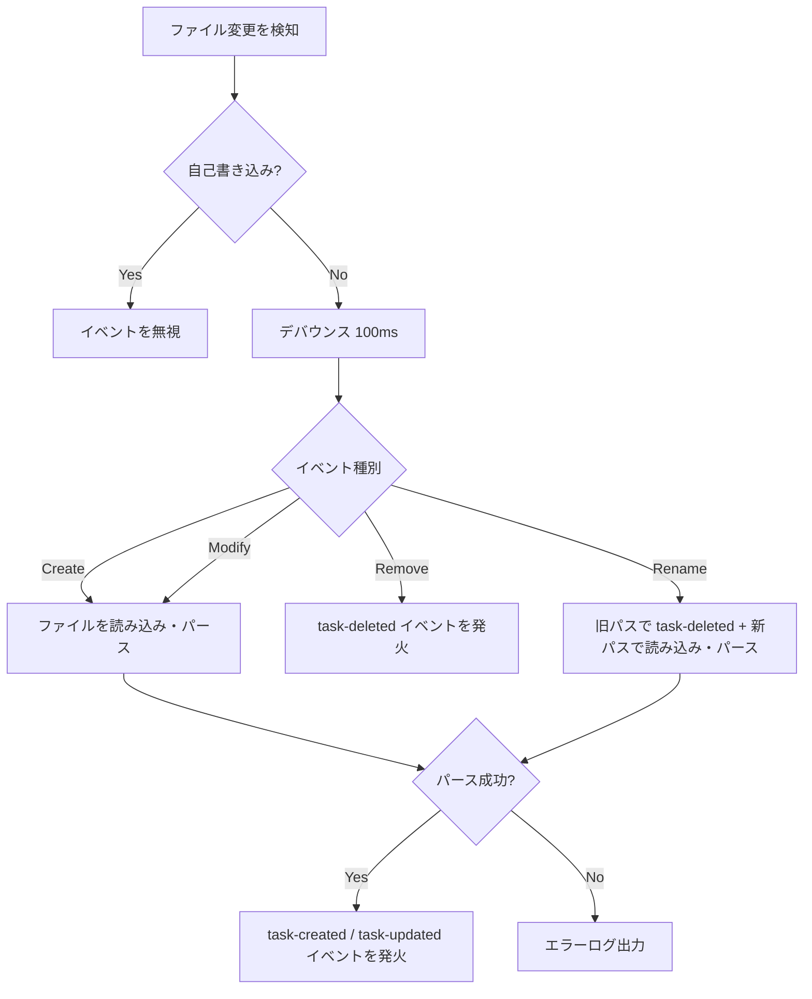

# spec-board - ファイルシステム仕様（バックエンド）

> **機能**: [spec-board](./index.md)
> **ステータス**: 下書き

## 概要

Tauriバックエンド（Rust）におけるmdファイルの読み書き・パース・ファイルシステム監視の仕様を定義する。プロジェクトディレクトリ内のmdファイルをタスクとして管理し、外部からの変更をリアルタイムに検知してフロントエンドへ通知する。

## Tauriコマンド一覧

| コマンド | 説明 |
|:---------|:-----|
| `open_project` | プロジェクトディレクトリを開き、mdファイルを一括読み込みしてファイル監視を開始 |
| `get_tasks` | 現在のプロジェクト内の全タスクを取得 |
| `create_task` | 新規タスクのmdファイルを作成 |
| `update_task` | 既存タスクのmdファイルを更新 |
| `delete_task` | タスクのmdファイルを削除 |
| `get_columns` | カラム設定を取得（[config-spec.md](./config-spec.md) 参照） |
| `update_columns` | カラム設定を更新（[config-spec.md](./config-spec.md) 参照） |
| `update_card_order` | カラム内のカード並び順を更新（[config-spec.md](./config-spec.md) 参照） |
| `add_link` | タスク間の関連リンクを追加 |
| `remove_link` | タスク間の関連リンクを削除 |

## コマンド詳細

### `open_project`

**説明**: 指定ディレクトリをプロジェクトとして開き、配下のmdファイルをスキャンしてタスク一覧を返す。同時にファイル監視を開始する。

**引数**:

| パラメータ | 型 | 説明 |
|:----------|:---|:-----|
| path | `String` | プロジェクトディレクトリの絶対パス |

**戻り値**:
```json
{
  "tasks": [
    {
      "id": "ファイルパス（プロジェクトルートからの相対パス）",
      "title": "タスクタイトル",
      "status": "Todo",
      "priority": "Medium",
      "labels": ["bug", "frontend"],
      "parent": "tasks/parent-task.md",
      "links": ["tasks/related-task.md"],
      "children": ["tasks/child-1.md", "tasks/child-2.md"],
      "reverseLinks": ["tasks/other-task.md"],
      "body": "Markdown本文",
      "filePath": "tasks/fix-bug.md"
    }
  ],
  "columns": ["Todo", "In Progress", "Done"]
}
```

- `parent`: フロントマターの `parent` フィールドの値
- `links`: フロントマターの `links` フィールドの値
- `children`: このタスクを `parent` に指定している子タスクのパス一覧（逆引き算出）
- `reverseLinks`: このタスクを `links` に含んでいる他タスクのパス一覧（逆引き算出）
```

**エラー**:

| ケース | 条件 | エラーメッセージ |
|:-------|:-----|:---------------|
| ディレクトリ不存在 | 指定パスが存在しない | ディレクトリが見つかりません: {path} |
| アクセス権限なし | 読み取り権限がない | ディレクトリにアクセスできません: {path} |

---

### `get_tasks`

**説明**: 現在のプロジェクト内の全タスクを取得する。`open_project` で読み込み済みのタスクキャッシュから返却する。

**引数**: なし

**戻り値**: `open_project` と同じ `tasks` 配列。`children` と `reverseLinks` の逆引き情報を含む。

---

### `create_task`

**説明**: フロントマター付きのmdファイルを新規作成する。

**引数**:

| パラメータ | 型 | 必須 | 説明 |
|:----------|:---|:-----|:-----|
| title | `String` | はい | タスクタイトル |
| status | `String` | はい | ステータス |
| priority | `String` | いいえ | 優先度（High / Medium / Low） |
| labels | `Vec<String>` | いいえ | ラベル一覧 |
| parent | `String` | いいえ | 親タスクのファイルパス |
| body | `String` | いいえ | Markdown本文 |

**振る舞い**:
1. タイトルをkebab-caseに変換してファイル名を生成（例: `fix-login-bug.md`）
2. 同名ファイルが存在する場合はサフィックスを付与（`fix-login-bug-1.md`）
3. `parent` が指定されている場合、対象ファイルの存在と循環参照がないことを検証
4. フロントマター + 本文の形式でmdファイルを書き出し
5. 作成したタスク情報を返却（`children` と `reverseLinks` を含む）

---

### `update_task`

**説明**: 既存タスクのmdファイルを更新する。

**引数**:

| パラメータ | 型 | 必須 | 説明 |
|:----------|:---|:-----|:-----|
| filePath | `String` | はい | 対象ファイルのプロジェクトルートからの相対パス |
| title | `String` | いいえ | タスクタイトル |
| status | `String` | いいえ | ステータス |
| priority | `String` | いいえ | 優先度 |
| labels | `Vec<String>` | いいえ | ラベル一覧 |
| parent | `String` | いいえ | 親タスクのファイルパス（空文字で親を解除） |
| body | `String` | いいえ | Markdown本文 |

**振る舞い**:
1. 対象ファイルを読み込み、フロントマターをパース
2. 渡されたフィールドのみを更新（未指定フィールドは変更しない）
3. `parent` が変更される場合、循環参照がないことを検証
4. フロントマター + 本文を再構成して書き出し
5. **`title` を変更してもファイル名はリネームしない**（`parent` や `links` での参照が壊れるため）

---

### `delete_task`

**説明**: タスクのmdファイルを削除する。

**引数**:

| パラメータ | 型 | 必須 | 説明 |
|:----------|:---|:-----|:-----|
| filePath | `String` | はい | 対象ファイルのプロジェクトルートからの相対パス |
| orphanStrategy | `String` | いいえ | 子タスクがある場合の処理方針。`clear`（子の `parent` をクリア）または `abort`（削除中止）。デフォルト: `clear` |

**振る舞い**:
1. 対象ファイルの存在を確認
2. 子タスクが存在する場合、`orphanStrategy` に従い処理
   - `clear`: 全ての子タスクの `parent` フィールドをクリア
   - `abort`: エラーを返却し削除を中止
3. 他タスクの `links` フロントマターに削除対象のパスが明示的に記載されている場合、該当エントリを削除（逆引きのみのリンクはフロントマター上に存在しないため処理不要）
4. ファイルを削除
5. 削除完了を返却

---

### `add_link`

**説明**: 2つのタスク間に関連リンクを追加する。

**引数**:

| パラメータ | 型 | 必須 | 説明 |
|:----------|:---|:-----|:-----|
| sourceFilePath | `String` | はい | リンク元タスクのファイルパス |
| targetFilePath | `String` | はい | リンク先タスクのファイルパス |

**振る舞い**:
1. 両ファイルの存在を確認
2. リンク元タスクのフロントマター `links` に `targetFilePath` を追加
3. 既にリンクが存在する場合は何もしない

---

### `remove_link`

**説明**: 2つのタスク間の関連リンクを削除する。

**引数**:

| パラメータ | 型 | 必須 | 説明 |
|:----------|:---|:-----|:-----|
| sourceFilePath | `String` | はい | リンク元タスクのファイルパス |
| targetFilePath | `String` | はい | リンク先タスクのファイルパス |

**振る舞い**:
1. リンク元タスクのフロントマター `links` から `targetFilePath` を削除

---

## ビジネスロジック

### mdファイルのスキャン

| ID | ルール | 条件 | 振る舞い |
|:---|:-------|:-----|:---------|
| BL-001 | スキャン対象 | プロジェクトディレクトリ直下および再帰的なサブディレクトリ | `.md` 拡張子のファイルのみをタスクとして認識 |
| BL-002 | 除外パターン | `node_modules`、`.git`、`.*`（ドットファイル/ディレクトリ） | スキャン対象から除外 |
| BL-003 | フロントマターなしのmd | フロントマターが存在しないmdファイル | タスクとして認識しない（スキップ） |

### ファイル名の生成

| ID | ルール | 条件 | 振る舞い |
|:---|:-------|:-----|:---------|
| BL-004 | kebab-case変換 | タイトルからファイル名を生成する際 | スペース → ハイフン、特殊文字を除去、小文字に統一 |
| BL-005 | 重複回避 | 同名ファイルが既に存在する場合 | サフィックス `-1`, `-2`, ... を付与 |

## ファイルシステム監視

### 監視仕様

| 項目 | 仕様 |
|:-----|:-----|
| 監視ライブラリ | `notify` crate（Rust） |
| 監視対象 | プロジェクトディレクトリ以下の `.md` ファイル |
| 監視イベント | Create / Modify / Remove / Rename |
| デバウンス | 同一ファイルへの変更を100ms以内に集約 |
| 自己書き込み抑制 | 後述の「自己書き込み抑制」セクション参照 |
| フロントエンドへの通知 | Tauri のイベントシステム（`emit`）を使用 |

### イベント通知

フロントエンドに送信するイベント:

| イベント名 | ペイロード | 発火条件 |
|:----------|:----------|:---------|
| `task-created` | `{ task: Task }` | 新しいmdファイルが作成された |
| `task-updated` | `{ task: Task }` | 既存のmdファイルが更新された |
| `task-deleted` | `{ filePath: string }` | mdファイルが削除された |

### 処理フロー



### Rename イベントの処理

ファイルがリネームされた場合（外部エディタやAIエージェントによる操作）:

1. 旧パスのタスクに対して `task-deleted` イベントを発火
2. 新パスのファイルを読み込み・パースし、`task-created` イベントを発火
3. 他タスクの `parent` や `links` に旧パスが含まれている場合、**自動的には更新しない**（リンク切れとして表示し、ユーザーに修正を促す）

### 自己書き込み抑制

spec-board 自身がmdファイルを書き込んだ直後に、ファイル監視がその変更を「外部変更」として検知して二重更新される問題を防止する。

**方式**: 書き込みパスセット（Write Ignore Set）

| ステップ | 動作 |
|:--------|:-----|
| 1 | ファイル書き込み前に、対象ファイルパスを「書き込みパスセット」に追加 |
| 2 | ファイルを書き込み |
| 3 | ファイル監視がイベントを受け取った際、「書き込みパスセット」にパスが含まれていればイベントを無視 |
| 4 | イベント無視後、該当パスを「書き込みパスセット」から除去 |

- 書き込みパスセットは `HashSet<PathBuf>` で管理し、`Mutex` で排他制御
- セット登録から5秒以内にイベントが来なかった場合、タイムアウトで自動除去（リーク防止）

## エラーハンドリング

| エラーケース | 発生条件 | 振る舞い | ログレベル |
|:------------|:---------|:---------|:----------|
| ファイル読み込み失敗 | 権限不足、ファイルロック中 | エラーをフロントエンドに通知、処理をスキップ | WARN |
| フロントマターパース失敗 | YAML構文エラー、必須フィールド欠損 | エラーをフロントエンドに通知、該当ファイルをスキップ | WARN |
| ファイル書き込み失敗 | ディスク容量不足、権限不足 | エラーをフロントエンドに返却 | ERROR |
| 監視の初期化失敗 | OS制限（inotify上限等） | エラーをフロントエンドに通知、ポーリングにフォールバック | ERROR |

## カラム設定・カード並び順の永続化

カラム設定、カード並び順、AIエージェント向けガイドの仕様は [config-spec.md](./config-spec.md) を参照。

`get_columns`、`update_columns`、`update_card_order` のコマンド詳細も [config-spec.md](./config-spec.md) に記載。

## 制限事項

- シンボリックリンク先のmdファイルは監視対象外
- ファイル名に使用できない文字がタイトルに含まれる場合、自動的に除去して生成
- 大量ファイルの同時変更時（100ファイル以上）はバッチ処理で順次反映

## 関連仕様

- [config-spec.md](./config-spec.md) - 設定ファイル・カラム管理・AIエージェント向けガイド
- [task-format-spec.md](./task-format-spec.md) - mdファイルのフォーマット定義・パース仕様
- [board-view-spec.md](./board-view-spec.md) - ファイル変更イベントを受け取るフロントエンド側の仕様
- [task-card-spec.md](./task-card-spec.md) - タスクデータの表示仕様
