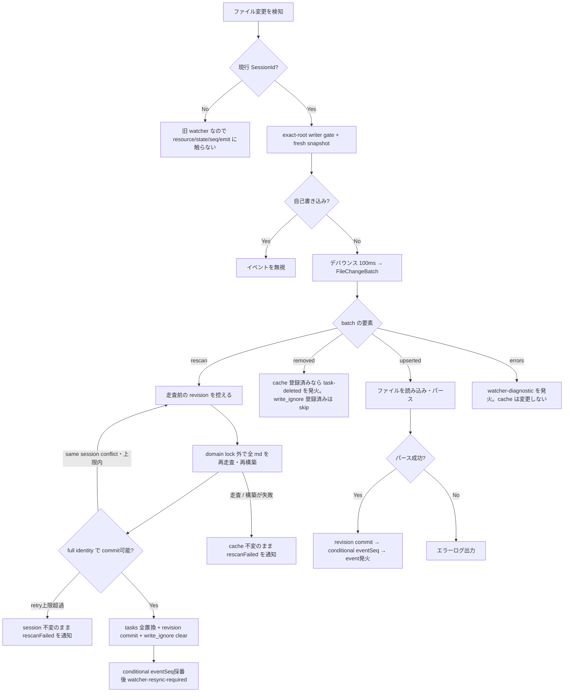

# spec-board - ファイルシステム仕様（バックエンド）

> **機能**: [spec-board](./index.md)
> **ステータス**: 下書き

## 概要

Tauriバックエンド（Rust）におけるmdファイルの読み書き・パース・ファイルシステム監視の仕様を定義する。プロジェクトディレクトリ内のmdファイルをタスクとして管理し、外部からの変更をリアルタイムに検知してフロントエンドへ通知する。

## Tauriコマンド一覧

| コマンド | 説明 |
|:---------|:-----|
| `open_project` | プロジェクトディレクトリを開き、mdファイルを一括読み込みし、`notify` ベースの実 watcher を起動して FE への `task-created` / `task-updated` / `task-deleted` 配信を開始する |
| `get_tasks` | 現在のプロジェクト内の全タスクと task / milestone の集計 projection を取得 |
| `create_task` | 新規タスクのmdファイルを作成 |
| `update_task` | 既存タスクのmdファイルを更新 |
| `delete_task` | タスクのmdファイルを削除（ディスク上は `.spec-board/trash/` へのソフトデリート。[config-spec.md](./config-spec.md) 「ゴミ箱」節） |
| `get_columns` | カラム設定を取得（[config-spec.md](./config-spec.md) 参照） |
| `get_labels` | ラベルマスタ定義を取得（[config-spec.md](./config-spec.md) 「labels.yml スキーマ」参照） |
| `update_columns` | カラム設定を更新（[config-spec.md](./config-spec.md) 参照） |
| `move_task` | タスクのカラム間移動（status 変更 + cardOrder 更新）と同一カラム内並び替え（[config-spec.md](./config-spec.md) 参照） |
| `create_label` | ラベルマスタに新規ラベルを追加（[config-spec.md](./config-spec.md) 「ラベル CRUD コマンド」参照） |
| `update_label` | 既存ラベルの metadata を更新（PUT・[config-spec.md](./config-spec.md) 参照） |
| `delete_label` | ラベルを削除し削除前の使用数を返す（[config-spec.md](./config-spec.md) 参照） |
| `add_link` | タスク間の関連リンクを追加 |
| `remove_link` | タスク間の関連リンクを削除 |

## コマンド詳細

### `open_project`

**説明**: 指定ディレクトリをプロジェクトとして開き、配下のmdファイルをスキャンしてタスク一覧を返す。同時に `notify` ベースの実 watcher を起動し、`task-created` / `task-updated` / `task-deleted` を `tauri::AppHandle::emit` でフロントエンドに配信する adapter を `AppState` に設置する。

> 本コマンドは対象の exact raw `ProjectRoot` writer gate を取得し、config / registries / tasks の読み込み、`SessionId` の予約、paused watcher と session-scoped `WriteIgnoreRegistry` の stage を resident state の外で完了する。その後、単一 critical section で `ProjectSession` と active resources を swap し、watcher activation latch を `Pending` から `Active` へ遷移させる。swap 前のどの失敗でも旧 session/resources は一切変更しない。

> `.spec-board/labels.yml`（ラベルマスタ）も config 読み込みと同じく open 時に読み込み、config / milestones / tasks と同じ `ProjectSession` に commit する。不在時は空レジストリ（`labels: []`）で開け、後方互換を保つ。壊れた YAML / name 重複 / name 空文字は `labels load failed (parse)`、I/O 異常は `labels load failed (io)` として open に失敗する。取得は独立コマンド `get_labels` で行い、本コマンドの payload には同梱しない。

**引数**:

| パラメータ | 型 | 説明 |
|:----------|:---|:-----|
| path | `String` | プロジェクトディレクトリの絶対パス |

**戻り値**:

`tasks[*].id` と `tasks[*].filePath` は wire 互換のため両方を維持し、scanner が
正規化した同一の canonical project root 相対 path を返す。resident `Task` は
`filePath` だけを identity として保持する。

```json
{
  "tasks": [
    {
      "id": "tasks/fix-bug.md",
      "filePath": "tasks/fix-bug.md",
      "title": "タスクタイトル",
      "status": "Todo",
      "priority": "Medium",
      "labels": ["bug", "frontend"],
      "parent": "tasks/parent-task.md",
      "links": ["tasks/related-task.md"],
      "children": ["tasks/child-1.md", "tasks/child-2.md"],
      "reverseLinks": ["tasks/other-task.md"],
      "body": "Markdown本文",
      "extras": { "estimate": 3 },
      "warnings": [
        {
          "code": "missingStatusUsedDefault",
          "field": "status",
          "message": "status is missing; default status was used"
        }
      ]
    }
  ],
  "columns": ["Todo", "In Progress", "Done"],
  "projections": {
    "tasks/fix-bug.md": {
      "subIssueProgress": { "done": 1, "total": 3 },
      "isDone": false,
      "childFilePaths": ["tasks/sub-a.md", "tasks/sub-b.md"]
    }
  },
  "milestoneProjections": {
    "release-v1": {
      "total": 1,
      "done": 0,
      "taskFilePaths": ["tasks/fix-bug.md"]
    }
  },
  "loadWarnings": [],
  "session": {
    "projectKey": "/home/user/specs",
    "generation": 1,
    "revision": 0,
    "eventSeq": 0
  }
}
```

- `parent`: フロントマターの `parent` フィールドの値
- `links`: フロントマターの `links` フィールドの値
- `children`: このタスクを `parent` に指定している子タスクのパス一覧（全タスク index 構築後の派生値）
- `reverseLinks`: このタスクを `links` に含んでいる他タスクのパス一覧（全タスク index 構築後の派生値）
- `extras`: 定義外フロントマターを JSON 互換値として保持したオブジェクト
- `warnings`: `title` / `status` の fallback や `parent` / `extras` の型不一致など、Task 生成を継続できる非致命警告の一覧
- `projections`: filePath をキーにした集計値。詳細は `get_tasks` 節を参照する。初期表示時点でフロントエンドが集計を持てるよう同梱する
- `milestoneProjections`: milestone 名をキーにした `{ total, done, taskFilePaths }`。`projections` と別取得せず、同じ payload に同梱する
- `session`: watcher イベント検証の初期 baseline。swap で commit された immutable snapshot だけから `tasks` と一緒に組み立てる。`generation` は内部 `SessionId`、`revision` は session-local `SessionRevision` の既存 wire adapter 値である。詳細は「イベント通知」節を参照

フロントエンドでは、この Tauri IPC payload を `TaskPayload` として受け取り、domain model の `Task` に変換して扱う。`Task` では `parent` / `children` は `hierarchy.parentFilePath` / `hierarchy.childFilePaths` に、`links` / `reverseLinks` は `links.linkedFilePaths` / `links.reverseLinkedFilePaths` に格納する。IPC payload と markdown frontmatter のフィールド名は互換性維持のため flat なまま変更しない。

**エラー**:

| ケース | 条件 | エラーメッセージ |
|:-------|:-----|:---------------|
| ディレクトリ不存在 | 指定パスが存在しない | `ディレクトリが見つかりません: {path}` |
| ディレクトリではない | 指定パスがディレクトリでない（通常ファイル等） | `ディレクトリではありません: {path}` |
| アクセス権限なし | 読み取り権限がない | `ディレクトリにアクセスできません: {path}` |
| 内部状態の lock 破損 | project domain / active resources / writer gate の Mutex が poison 状態 | `内部状態のロックが破損しました` |
| スキャン致命エラー | root の metadata/read_dir、parent hierarchy の20段超過（`TooDeep`）など。循環は致命エラーにせず `parentCycle` warning として継続 | `io scan failed: {message}` |
| config 読み込み失敗 | `config.json` が壊れている等 | `Config::default()` で継続し、`loadWarnings` に `configFallback` を含める |
| ファイル監視の初期化失敗 | inotify 上限超過 / poll fallback 失敗 / path 消失等で `Watcher::start` が `Err` を返した場合 | `ファイル監視の初期化に失敗しました: {source}` |

> 個別 md ファイルの fs::read 失敗、task_from_markdown のパース失敗、scanner の per-entry 失敗は recoverable な load warning として payload の loadWarnings に含め、該当ファイルを skip して残りのタスクで処理を継続する。root metadata/read_dir、hierarchy の `TooDeep`、labels/milestones、watcher/session 初期化、lock は fatal とし、コマンド全体を失敗させる。parent循環は `parentCycle` warning として継続する。
>
> ファイル監視の初期化、SessionId 枯渇、domain/resources lock のいずれの swap 前失敗でも resident `ProjectSession` と active resources は **一切変更されず**、フロントエンドは旧プロジェクトを表示したまま動作を継続する。予約済み SessionId は再利用せず、次の成功 open との間に gap が生じ得る。FE 側 `TauriError.PATTERNS` には watcher 初期化失敗の個別分類がないため `UNKNOWN` 分類になる。

#### プロジェクトセッションキャッシュ（再オープンの即時応答）

- 一度開いたプロジェクトの `ProjectSession` は、別プロジェクトへの切替時にバックグラウンドキャッシュへ退避され、プロセス終了まで保持される（上限なし）。
- キャッシュに一致する root（exact raw `ProjectRoot`）で `open_project` を呼ぶと、ディスク走査・パースを行わずキャッシュから payload を構築して即時応答する。このとき `session.generation` は**新規採番**され、`session.revision` は 0 から再開する。`GUIDE.md` の書き出しもコールドオープン時のみ行う。config 不在時の `config.json` 生成もコールドオープン時のみ行う。ただし生成は watcher 初期化より前に実行するため、watcher 初期化に失敗した open でも生成済みの `config.json` は残る（生成は冪等で、次回オープンがその内容を読むだけ）。未知 status のカラム追加（reconcile。[config-spec.md](./config-spec.md) の「既存 config への未知 status 追加（reconcile）」節）はキャッシュヒット後の背景再スキャンでも行い、追加すべきカラムが無ければ `config.json` も `GUIDE.md` も書き込まない。
- 即時応答の直後、バックグラウンドで tasks / config / labels / milestones を全量再読込し、キャッシュとの差分があれば 1 commit で置換のうえ `watcher-resync-required`（reason: `rescan`）を emit する。フロントエンドは既存の resync 経路で最新化する。差分がなければ何も送らない。
- resync で使う `get_tasks` の応答には `columns` と `doneColumn` を同梱する。`tasks` の並びは backend の config に従うため、カラム定義を取り直さないと「並びは新しいがカラムは古い」board で固定される。`get_columns` を別途呼ぶ形にはしない。2 つの読み取りの間に backend の commit が走ると `tasks` と `columns` の revision が混在するため、**同一 snapshot から導出した 1 応答**で配る。
- バックグラウンド再読込の規則はコールドオープンと同一（config は fallback + warning、labels / milestones / tasks の失敗は中断）。したがって「再スキャン後の状態 = そのプロジェクトをコールドオープンした場合の状態」に収束する。読み込みに失敗した場合はキャッシュを変更せず、`watcher-diagnostic`（code: `rescanFailed`）を通知する。
- 同一パスの再オープン（切替を挟まない reopen）はキャッシュを使わず、従来どおりコールドオープンする。
- ディレクトリ検証（不存在 / ディレクトリでない / 権限なし）はキャッシュ参照より前に実行するため、キャッシュがあってもエラー契約は従来と変わらない。再活性化が watcher 初期化などで失敗した場合、消費済みのキャッシュエントリは復元しない（次回 open がコールドになるだけで、stale な状態は返らない）。

---

### ProjectLoadWarning と `loadWarnings`

`open_project` と `get_tasks` は、タスクを一部読み込めない場合でも成功し、成功した `tasks` / projections と同じ snapshot に `loadWarnings` を同梱する。warning は UI が分類できる安定した値であり、fatal error の代替ではない。

| フィールド | 型 | 説明 |
|:----------|:---|:-----|
| `code` | `scanEntryError` / `metadataError` / `unreadableFile` / `fileTooLarge` / `binaryFile` / `invalidPath` / `taskReadFailed` / `frontmatterParseFailed` / `configFallback` / `unknown` | 失敗分類。未知値は FE で `unknown` として安全に表示する |
| `stage` | `scan` / `read` / `parse` / `config` / `unknown` | 発生段階 |
| `path` | `string` または `null` | project root からの相対 path。相対化できない場合は `null`。config fallback は `.spec-board/config.json` |
| `message` | `string` | 原因の補足。UI は raw message をそのまま HTML として解釈しない |
| `recoverable` | `boolean` | 今回は load warning がすべて `true`。root / hierarchy / registry / watcher / session / lock の fatal error は payload に含めない |

同一 `(stage, path, code, message, recoverable)` は payload 直前に重複除去し、順序を安定化する。`loadWarnings: []` は警告が無い正常な読み込みを表す。config が存在しない場合はタスクの `status` からカラムを生成して保存し、成功時は warning を生成しない。生成した config の保存に失敗した場合は `Config::default()` で開き `configFallback` を追加する。この warning はコールドオープンでのみ付くため、保存に失敗したまま別プロジェクトへ切り替えて戻ると（キャッシュヒット + 背景再スキャン）payload から消える。背景再スキャンはディスクへ書かず生成も再試行しないためで、config は `Config::default()` のままなので board の見え方は変わらない。存在する config の read / parse / validation / migration / backup 失敗は `Config::default()` で継続し、`configFallback` を追加する（この場合は生成・保存を行わない）。

watcher の full rescan が成功した場合は、その rescan report の warnings で session の `loadWarnings` を tasks と atomic に置き換える。修復されたファイルの warning は消え、新たに失敗したファイルだけが残る。rescan 自体が fatal の場合は旧 tasks と旧 warnings を保持し、既存の watcher diagnostic を通知する。

### `get_tasks`

**説明**: 現在のプロジェクト内の全タスクを取得する。`open_project` で読み込み済みのタスクキャッシュから返却する。

**引数**: なし

**戻り値**: `{ tasks, columns, doneColumn, projections, milestoneProjections, loadWarnings, session }`。`tasks` は `open_project` と同じ Task 配列（`children` と `reverseLinks` の逆引き情報を含む）、`columns` / `doneColumn` は `get_columns` と同じ導出のカラム定義と完了カラム、`projections` は filePath をキーにした task 集計、`milestoneProjections` は milestone 名をキーにした集計、`session` は watcher イベント検証の baseline。

> `columns` / `doneColumn` を同梱するのは、フロントエンドが resync でカラム定義も取り直せるようにするため。`tasks` の並びは backend の config に従うので、カラムだけ据え置くと board が「並びは新しいがカラムは古い」状態で固定される。`get_columns` を別に呼ぶ形にすると、2 つの読み取りの間に走った commit をまたいで revision が混在するため、**同じ snapshot の `Config` から導出**して 1 応答で返す。プロジェクト未 open のときは `columns` が空配列、`doneColumn` は `null`。

> `tasks` の並び順は `open_project` と**完全に同一**（カラム表示順 → `cardOrder` → canonical `filePath`〔= wire `id`〕昇順）。フロントエンドは配列順をそのまま表示順に使うため、片方だけ path 昇順にすると watcher の full rescan / イベント欠落からの復旧のたびに DnD で決めた並びが崩れる。並び順の決定は `TaskIndex::sorted_by_board_order` 1 箇所に集約する。`milestoneProjections[*].taskFilePaths` も、この `tasks` を milestone ごとに絞り込んだ順序と一致する。`config` が `None` の場合のみ `TaskIndex::sorted_by_id` にフォールバックし、`tasks` / `taskFilePaths` ともに canonical `filePath` 昇順とする。この場合は完了カラムも解決できないため `done` は 0。

```json
{
  "tasks": [ /* ... */ ],
  "columns": [
    { "name": "Todo", "order": 0 },
    { "name": "Done", "order": 1 }
  ],
  "doneColumn": "Done",
  "projections": {
    "tasks/parent.md": {
      "subIssueProgress": { "done": 1, "total": 3 },
      "isDone": false,
      "childFilePaths": ["tasks/child-a.md", "tasks/child-b.md"]
    }
  },
  "milestoneProjections": {
    "release-v1": {
      "total": 3,
      "done": 1,
      "taskFilePaths": [
        "tasks/parent.md",
        "tasks/child-a.md",
        "tasks/child-b.md"
      ]
    }
  },
  "loadWarnings": [],
  "session": {
    "projectKey": "/home/user/specs",
    "generation": 1,
    "revision": 42,
    "eventSeq": 17
  }
}
```

`session` は返した `tasks` と同一トランザクションで確定した値で、受信側はこれで
watcher イベント検証の baseline（`revision` と `eventSeq` の両方）を取り直す。

**`projections` の各フィールド**:

| フィールド | 説明 |
|:----------|:-----|
| `subIssueProgress.total` | 全子孫の件数。root 自身は含まない |
| `subIssueProgress.done` | 全子孫のうち完了カラムに居る件数 |
| `isDone` | そのタスク自身が完了カラムに居るか |
| `childFilePaths` | 直接の子の filePath。`filePath` 昇順 |

**`milestoneProjections` の各フィールド**:

| フィールド | 説明 |
|:----------|:-----|
| `total` | その milestone が割り当てられた task 件数 |
| `done` | 対象 task のうち、snapshot の config から解決した完了カラムに居る件数。完了カラムを解決できない場合は 0 |
| `taskFilePaths` | 対象 task の canonical `filePath`。payload の `tasks` と同じ board order（config が `None` なら `filePath` 順） |

`milestone: null` と空文字は未割当として map に含めない。空でない名称は milestone registry に未定義でも raw 値を key として保持し、task 集合を 1 回走査して `total` / `done` / `taskFilePaths` を同時に集計する。`taskFilePaths` 自体は集計中に sort せず、command 層が先に tasks を payload 順へ sort してから `TaskIndex` を再構築することで順序を保証する。百分率は payload に含めない。

**集計規則**:

- 親子関係は各タスクの `parent` から組み直す（payload の `children` には依存しない）
- 集計対象は**全子孫**で、root 自身は含まない
- サイクル（A→B→A）・自己参照（A→A）でも有限ステップで停止する
- 同じ子孫へ複数経路で到達しても 1 度だけ数える
- `parent` が実在タスクに解決できないタスクは、どのタスクの子にもならない（`childFilePaths` にも現れない）
- `childFilePaths` の値は親が書いた raw な参照文字列ではなく、**解決先タスク自身の `filePath`**
- 完了カラムは `doneColumn` 設定値。未設定時は `columns` の `order` 最大（表示上の末尾）カラム。どちらも解決できない場合は `isDone` が常に false・`done` は 0
- 百分率は payload に含めない（表示層で算出する）

**未オープン時**: `tasks` / `projections` / `milestoneProjections` はすべて空、`session` は初期値（`generation` / `revision` / `eventSeq` がすべて 0）の payload を成功で返す（エラーにはしない）。

### Snapshot / projection 同期契約

`get_tasks` は project domain lock を 1 回だけ取得して immutable `ProjectSessionSnapshot` を作る。lock 解放後、snapshot の config で完了カラムを解決し、tasks を board order へ sort して `TaskIndex` を再構築する。その同じ index から task projection、milestone projection、最後に payload の tasks を取り出す。未オープン時だけ従来どおり空 payload と idle session を返す。

`open_project` の payload は swap で commit された snapshot を途中で再読込せず、`get_tasks` と同じ `sort → task projection → milestone projection → tasks` の順で構築する。このため両 command は同じ project snapshot に対して `tasks` / `projections` / `milestoneProjections` の値と順序が一致し、config / registries / tasks / session は同じ論理 revision に属する。

フロントエンドでは、open 成功時に `tasks` と両 projection map を 1 つの `ProjectData` に設定する。task mutation、column reorder、完了カラム変更後の projection sync は project command queue の barrier 後に `get_tasks` を呼び、1 つの `projections-refreshed` action で両 map を同時置換する。single in-flight と path / open request id / request sequence の guard を通らない古い応答、および IPC 失敗時は現在値を保持する。

watcher の `eventSeq` gap または full rescan 通知から復旧する場合も、queue barrier 後に `get_tasks` で full snapshot を取得する。読み取り中に mutation が enqueue された応答、project / generation / session が変わった応答は採用しない。gate が snapshot session を受理したときだけ、1 つの `tasks-resynced` action で `tasks` / `projections` / `milestoneProjections` を atomic に反映する。走行中の session baseline は watcher gate が更新し、`ProjectData.watcherSession` は open baseline のまま保持する。buffer した watcher event の replay で tasks がさらに進んだ場合は、通常の projection sync が両 map を再取得する。

### ProjectSession と並行性契約

`AppState` の resident domain は `Idle | Loaded(ProjectSession)` を単一 Mutex で保持する。`ProjectSession` は exact raw `ProjectRoot`、process 内で一意な `SessionId`、session-local `SessionRevision`、config、labels、milestones、tasks を一体として所有する。watcher handle と `WriteIgnoreRegistry` は cache 対象になり得る domain から分離し、同じ `SessionVersion { SessionId, SessionRevision }` を持つ active resources として最大 1 組だけ保持する。

raw domain/resources/background Mutex は private な lock owner module だけが所有する。domain lock を取得した `DomainGuard` を消費しなければ resources lock を取得できず、resident pair の取得順序は domain → resources に型で固定される。resources の単独参照は identity 検証と `Arc<WriteIgnoreRegistry>` clone を lock owner 内で完結させる値 API、background cache は take/stash の値 API だけを公開し、いずれも raw guard を caller へ返さない。

mutation と watcher event は次の protocol を使う。

1. gate 取得前に対象の root / SessionId を控える。
2. exact raw `ProjectRoot` ごとの writer gate を closure-scoped API で取得する。同一 root は直列化し、別 root は異なる thread で互いに待たない。raw gate/guard は caller へ公開しない。同一 thread が lease 内から writer lease を再取得した場合は、同じ root／別 root のどちらも待機せず `WriterLeaseReentrant` typed error を返す。thread-local marker は RAII で管理し、operation error、early return、panic unwind のいずれでも解除する。
3. gate 取得後に fresh snapshot を読み、root + SessionId を再検証する。待機中の正常な revision 進行は許可するが、project switch と same-path reopen は disk I/O 前に typed conflict として拒否する。
4. resident validation と target 解決を副作用なしで行い、revision の checked increment と active resource identity を preflight する。`u64::MAX` なら disk/store read・write-ignore 登録・disk write を行わない。
5. 必要な disk I/O を行った後、snapshot の full SessionId + Revision で resident mutation を CAS commit する。成功 commit だけが revision を 1 増やす。

disk write 後に revision conflict が起きた場合は current session を上書きせず、同じ gate lease を保持したまま operation 別の disk source から same-project resync を 1 回行う。resync 成否にかかわらず caller へは元の typed conflict を返す。task/config 書き込みの write-ignore marker は resync 成功時だけ watcher の 1 回 consume 用に残し、resync 失敗またはその他の post-disk error では cleanup する。

open は target root の同じ gate を使う。swap 後は gate と state locks を解放してから旧 watcher を stop/join するため、停止が遅くても別 root の open/writer を block しない。旧 watcher の stop が panic しても新 session は rollback せず、旧 `SessionVersion` と panic message を diagnostic に残す。stale adapter は resource access、state mutation、eventSeq 採番、emit の前に identity guard で破棄する。

reader は `get_tasks` / `preview_task_filename` / `get_columns` / `get_labels` / `get_milestones` / `export_labels` の各 command で `session_snapshot()` を 1 回だけ読み、異なる revision の field を混在させない。

フォアグラウンドの session とは別に、`AppState` は退避済み session を `ProjectRoot` をキーにしたバックグラウンドキャッシュ（`HashMap<ProjectRoot, ProjectSession>`）で保持する。このキャッシュは lock owner 内の take/stash 値 API で単独取得し、background guard を外へ出さない。resident identity の読取後に background cache を取得する処理も guard を入れ子にしないため、domain → resources の段階 API と独立した leaf lock である。

- キャッシュへの退避は swap で押し出された session に対して行い、writer gate と全 state lock を解放した後に実行する。
- 同一 root のエントリが既にある場合は `SessionId` が大きい方を残す。`SessionId` はプロセス内で単調増加するため、並行 open で退避順序が逆転しても常に最新の session が勝つ。
- キャッシュから取り出した session はそのままでは resident state に戻さず、`SessionId` を新規採番して `SessionRevision` を初期値から再開する。データの再利用と identity の一意性を分離することで、既存の「open のたびに generation が前進する」契約を維持する。
- 同一 root の reopen で押し出された session はキャッシュへ退避しない。退避してしまうと、次の同一 root open が「常にコールドで読み直す」契約を破って過去のデータを返す。
- 取り出し時に、resident session と同じ root で resident より古いエントリは破棄する。退避は displaced 側の writer gate を持たないため、別 root の open が退避を終える前に同じ root がコールドで開き直されると、resident より古いエントリが後から入りうる。
- キャッシュ上限は設けない（プロセス終了で破棄）。1 プロジェクトあたり config + labels + milestones + 全 task（`body` に Markdown 全文を含む）を保持するため、多数のプロジェクトを開くとメモリは単調増加する。明示的な close によるキャッシュ破棄は現時点では提供しない。
- キャッシュ lock が poison した場合は open を失敗させず、コールドオープンへ縮退する（キャッシュは純粋な最適化であり、恒久的に open を失敗させる理由にならない）。
- 背景再スキャンは対象 root の writer gate を保持したまま全量読込を行う。したがって再オープン直後は、同じプロジェクトへの書き込みコマンドと同一 root の再オープンが、スキャン完了までシリアライズされる（即時応答そのものはスキャン開始前に返る）。

---

### `create_task`

**説明**: フロントマター付きのmdファイルを新規作成する。

**引数**:

| パラメータ | 型 | 必須 | 説明 |
|:----------|:---|:-----|:-----|
| title | `String` | はい | タスクタイトル |
| status | `String` | はい | ステータス |
| priority | `String` | いいえ | 優先度（High / Medium / Low） |
| labels | `Vec<String>` | いいえ | ラベル一覧 |
| parent | `String` | いいえ | 親タスクのファイルパス |
| body | `String` | いいえ | Markdown本文 |

**振る舞い**:
1. タイトルを kebab-case に変換してファイル名を生成（例: `fix-login-bug.md`）
2. **配置先ディレクトリの決定**:
   - `parent` 未指定 → プロジェクトルート直下の `tasks/`（必要なら自動作成）
   - `parent` 指定 → 解決済み親 Task の `file_path` の dirname に同居（raw 入力の `./tasks/x.md` や `tasks\\x.md` 表記揺れではなく、正規化済み親パス由来）
3. **ファイル名衝突回避**:
   - in-memory `tasks_cache` の同一配置先ディレクトリ内に同名 Task があればサフィックス付与（`fix-login-bug-1.md` / `-2.md` ...）
   - cache に未反映の disk 上 stale ファイルや並行 create との衝突は `OpenOptions::create_new(true)` で検出され `Io(AlreadyExists)` エラー（上書きはしない）
4. **入力検証**:
   - `parent` 指定時は対象 Task の存在 + 親 chain 循環 + 深さ上限（MAX=20）を検証
   - 既存 cache 内の dangling parent / links が新規 Task で解決されるケース（augmented hierarchy）も検証対象に含める
   - `title` が空、または kebab-case 化結果が空文字列なら `InvalidTitle` エラー
5. **frontmatter 構築**:
   - `priority` は `High` / `Medium` / `Low` に ASCII 大小文字非区別で正規化、`Some` だけ書き出す（無効値 / 空文字 / 未指定は frontmatter から省略）
   - `labels` は空配列なら省略
   - `parent` は解決済み Task の `file_path` 文字列をそのまま書き出す
6. **I/O前resolution plan + 書き込み + commit**:
   - 新規parse-only candidateと既存全taskをcanonical resolverへ通し、`children` / `reverseLinks` / graph warningを全件再計算した`ResolvedTaskSet`と戻り値をdisk I/O前に確定する
   - 既存cache内でdangling parent / linksが新規Taskを参照していた場合も、このresolution planで`parentNotFound` warningの除去と新規Task側の`children` / `reverseLinks`への反映を同時に行う
   - directory確保後、watcher起動状態にかかわらず`write_ignore`へ自前write pathを登録し、`create_new`で書き込む
   - 書き込み成功後は事前計算済み`ResolvedTaskSet`をsessionへcommitする。identity競合時はdiskからresyncし、局所cache更新は行わない
7. **戻り値**: 挿入後の Task（`children` / `reverseLinks` 解決済み）

### preview_task_filename IPC

タスク作成フォームで入力中のタイトル / 明示ファイル名 / 親タスクパスから、
保存先パスのプレビュー（衝突回避済み）を返す読み取り専用 IPC。

- **引数**: `{ title, explicitFilename?, parentFilePath? }`
- **戻り値**: `{ kind: "path", fileName, relPath, fullPath }` | `{ kind: "invalid", error }` | `{ kind: "pending" }`
- FE 側の kebab-case 変換・unique filename 生成は本 IPC に統一し、二重実装を排除する

**Atomic 性 (部分 atomic)**:
- 入力検証 / 配置先決定は副作用前に完了する。失敗時は FS / state を一切変更しない
- FS write 中の失敗（`write_all` 途中失敗）は best-effort で `remove_file` を試み、`write_ignore` を解除して `Io` エラーを返す
- FS write 成功後の cache 更新失敗（lock poison 等）はファイルが残る（次回 open / watcher rescan で拾われる）

---

### `update_task`

**説明**: 既存タスクのmdファイルを更新する。

**引数**:

| パラメータ | 型 | 必須 | 説明 |
|:----------|:---|:-----|:-----|
| filePath | `String` | はい | 対象ファイルのプロジェクトルートからの相対パス |
| title | `String` | いいえ | タスクタイトル |
| status | `String` | いいえ | ステータス |
| priority | `String` | いいえ | 優先度 |
| milestone | `String` | いいえ | マイルストーン（空文字で解除、未指定で保持） |
| labels | `Vec<String>` | いいえ | ラベル一覧 |
| parent | `String` | いいえ | 親タスクのファイルパス（空文字で親を解除） |
| body | `String` | いいえ | Markdown本文 |
| draft | `boolean` | いいえ | 下書き状態（`true`でdraft化、`false`で解除、未指定で保持） |

**振る舞い**:
1. exact project rootのwriter lease内でsnapshotを確定し、session identity / active resourcesをpreflightする
2. 対象ファイルを読み込み、`TaskDocument`としてパースする
3. 渡されたフィールドだけを`TaskPatch`で更新する（未指定フィールドは変更しない）。`parent`変更時は`Vec<ParsedTask>`に対象candidateを反映し、`ResolvedTaskSet::validate_strict`で循環/深さを検証する
4. documentをrenderして更新candidateを作り、resident全taskとcanonical resolverへ通す。`ResolvedTaskSet`、戻り値、書き込み内容を変更I/O前に確定する
5. watcher起動状態にかかわらず`write_ignore`へ対象pathを登録し、ファイルを書き込む
6. 書き込み成功後は事前計算済み`ResolvedTaskSet`をsessionへcommitする。identity競合時はdiskからresyncし、局所cache更新は行わない
7. **`title` を変更してもファイル名はリネームしない**（`parent` や `links` での参照が壊れるため）

> Implementation notes (2026-05-16): `update_task`は部分マージ更新で、`parent`変更時だけ
> `ResolvedTaskSet::validate_strict`によるI/O前strict検証を追加する。strict検証の有無とは別に、
> 全更新でwrite前にcanonical resolverを実行し、resolved resident planを完成させる。

---

### `delete_task`

**説明**: タスクのmdファイルを削除する。

**引数**:

| パラメータ | 型 | 必須 | 説明 |
|:----------|:---|:-----|:-----|
| filePath | `String` | はい | 対象ファイルのプロジェクトルートからの相対パス（絶対パスも受付可。`InputTaskPath` で `.md` 必須として正規化） |
| orphanStrategy | `String` | いいえ | 子タスクがある場合の処理方針。現在は `abort`（削除中止）のみ実装。`clear` strategy は将来対応 |

**振る舞い**:
1. `filePath` を `InputTaskPath` で正規化し、空文字・非 `.md`・`..` を含むパスは `InvalidPath` エラーを返す
2. cache（`TaskIndex`）上で対象タスクの存在を確認し、見つからなければ `FileNotFound` エラーを返す
3. 子タスクが存在する場合、`HasChildren` エラーを返却し削除を中止する（abort strategy）
4. 対象を除いた全taskをcanonical resolverへ通し、消えたtask由来の`children` / `reverseLinks`を除去した`ResolvedTaskSet`をdisk変更前に確定する。frontmatterのraw `parent` / `links`は変更しない
5. watcher起動状態にかかわらず`WriteIgnoreRegistry`へ削除対象pathを登録する
6. 対象mdを`.spec-board/trash/`の同じ相対pathへ移動する（ソフトデリート）。移動失敗時はmarkerを解除し、既存error分類を維持する
7. 移動成功後は事前計算済み`ResolvedTaskSet`をsessionへcommitする。identity競合時はdiskからresyncし、局所cache更新は行わない
8. `Ok(())` を返却する

**エラー**:

| エラー | Display 文字列パターン | 条件 |
|:------|:---------------------|:-----|
| `InvalidPath` | `invalid path: {raw}`（空文字時は `invalid path: empty`） | 空文字・非 `.md`・不正パス |
| `FileNotFound` | `file not found: {abs_path}` | cache に対象タスクが存在しない、またはtrashへの移動時にsourceがdisk上に存在しない |
| `HasChildren` | `task has children: {path} (children: ...)` | 子タスクが 1 件以上存在する |
| `UnsupportedOrphanStrategy` | `unsupported orphan strategy: {strategy}` | `abort` 以外の orphanStrategy が指定された |
| `NoProjectOpen` | `project is not opened` | プロジェクト未オープン |

> `delete_task` command は `create_task` / `update_task` と同じ lock 取得順序契約・write_ignore パターン・effect 層構成に従う。CardOrder には削除済みタスクの path が残るが、board 表示は壊れない（cardOrder 未記載のタスクは末尾へ回る規則があるため）。cleanup は Issue #507 で扱う。現在は abort strategy のみ実装済みで、clear strategy（子の parent クリア）は将来対応する。`reverseLinks` は削除直後の canonical resolver で再構築済みになる。

---

### `add_link`

**説明**: 2つのタスク間に関連リンクを追加する。

**引数**:

| パラメータ | 型 | 必須 | 説明 |
|:----------|:---|:-----|:-----|
| sourceFilePath | `String` | はい | リンク元タスクのファイルパス |
| targetFilePath | `String` | はい | リンク先タスクのファイルパス |

**振る舞い**:
1. 両ファイルの存在を確認
2. リンク元タスクのフロントマター `links` に `targetFilePath` を追加
3. 既にリンクが存在する場合は何もしない
4. 追加した場合は全 task を canonical resolver に通し、target を含む `reverseLinks` を全件再計算して resident cache を一括置換

---

### `remove_link`

**説明**: 2つのタスク間の関連リンクを削除する。

**引数**:

| パラメータ | 型 | 必須 | 説明 |
|:----------|:---|:-----|:-----|
| sourceFilePath | `String` | はい | リンク元タスクのファイルパス |
| targetFilePath | `String` | はい | リンク先タスクのファイルパス |

**振る舞い**:
1. リンク元タスクのフロントマター `links` から `targetFilePath` を削除
2. 削除した場合は全 task を canonical resolver に通し、target を含む `reverseLinks` を全件再計算して resident cache を一括置換

---

## ビジネスロジック

### mdファイルのスキャン

| ID | ルール | 条件 | 振る舞い |
|:---|:-------|:-----|:---------|
| BL-001 | スキャン対象 | プロジェクトディレクトリ直下および再帰的なサブディレクトリ | `.md` 拡張子のファイルのみをタスクとして認識 |
| BL-001a | 拡張子の大小文字非区別 | `.MD` / `.Md` / `.mD` などの大文字混じり拡張子 | `.md` と同等にスキャン対象とする |
| BL-002 | 除外パターン | `node_modules`、`.git`、`.*`（ドットファイル/ディレクトリ） | スキャン対象から除外 |
| BL-002a | ドット始まりのmdファイル | `.hidden.md` / `.DS_Store` などファイル名先頭がドット | `.md` 拡張子であっても除外 |
| BL-002b | 非 UTF-8 のパス | ファイル名・パス component に非 UTF-8 バイト列を含む | 後続の Tauri / JSON 境界（UTF-8 文字列前提）と整合させるため保守的に除外 |
| BL-002c | 除外パターンの適用範囲 | 利用者が `~/.spec-board/` や `node_modules` という名前のディレクトリを root として渡した場合 | 除外パターンは **root 配下の子孫エントリにのみ適用** し、root 自身がドット始まりや `node_modules` 名でもスキャン自体は実行する |
| BL-002d | 巨大ファイル | サイズが 1MB（1,048,576 byte）を超える `.md` ファイル | スキャン結果から除外（1MB ちょうどは含める） |
| BL-002e | バイナリファイル | 先頭 8KB（8,192 byte）に NUL byte (`0x00`) を含む `.md` ファイル | スキャン結果から除外（プローブ範囲外の NUL byte は判定しない） |
| BL-003 | フロントマターなしのmd | フロントマターが存在しないmdファイル | タスクとして認識しない（スキップ） |

### ファイル名の生成

| ID | ルール | 条件 | 振る舞い |
|:---|:-------|:-----|:---------|
| BL-004 | kebab-case変換 | タイトルからファイル名を生成する際 | スペース → ハイフン、特殊文字を除去、小文字に統一 |
| BL-005 | 重複回避 | 同名ファイルが既に存在する場合 | サフィックス `-1`, `-2`, ... を付与。`task-1.md` 衝突時は `task-1-1.md`（base の末尾数字は解釈しない） |

## ファイルシステム監視

### 監視仕様

| 項目 | 仕様 |
|:-----|:-----|
| 監視ライブラリ | `notify` crate（Rust） |
| モジュール配置 | サブクレート `spec-board-fs`（`src-tauri/crates/fs/`）配下に置く（重い外部 crate を集約する規約。CLAUDE.md「Rust バックエンド構成ルール」参照）。公開 API には `notify::*` の型を漏らさず、`std` の型と独自エラー型のみで構成する |
| 監視対象 | プロジェクトディレクトリ以下の `.md` ファイル |
| 稼働数 | 常にフォアグラウンドのプロジェクト 1 つ分のみ。プロジェクト切替のたびに旧 watcher を stop / join し、OS ハンドルとスレッドを解放する。キャッシュから再活性化した場合も watcher と `WriteIgnoreRegistry` は新規作成する（write-ignore は session-scoped の意味を保つため空で始まる） |
| 監視イベント | 変更は opaque な `FileChangeBatch` に畳み込まれて本体クレートへ渡る。consumer は `removed()` / `upserted()` / `is_rescan()` / `errors()` で内容を読み取る。`upserted` は読み直したうえで、`removed` は cache 登録済みパスのみを対象に、**変更を反映した全 task の派生値（`children` / `reverseLinks` / parent 関連 warning）を再構築して `tasks_cache` を全置換**する（`WriteIgnoreRegistry` に登録された自前書き込み / delete はスキップ）。emit は変更対象だけが変わった場合のみ `task-created` / `task-updated` / `task-deleted` を 1 通、**変更対象以外の task の派生値も変わった場合は `watcher-resync-required` を 1 通**出す。`is_rescan()` が true の batch は full rescan を行って `tasks_cache` を全置換し、`errors()` は structured diagnostics として FE へ通知する |
| デバウンス | 後述の「デバウンス（変更バッチへの畳み込み）」セクション参照 |
| 自己書き込み抑制 | 後述の「自己書き込み抑制」セクション参照 |
| フロントエンドへの通知 | Tauri のイベントシステム（`emit`）を使用 |

### イベント通知

すべての watcher イベントは共通 envelope に包んで配信する。

```ts
{
  projectKey: string,      // BE 採番の project 識別子
  generation: number,      // 内部 SessionId の互換値（成功 open ごとに一意）
  revision: number,        // session-local SessionRevision の互換値
  cacheMutating: boolean,  // この event が cache を変更したか
  eventSeq: number,        // emit ごとに 1 消費する連番（欠番 = 取りこぼし）
  changeId: string,        // "{generation}-{eventSeq}"（ログ相関用）
  payload: { /* イベント別 */ }
}
```

| イベント名 | payload | 発火条件 | cacheMutating |
|:----------|:--------|:---------|:--------------|
| `task-created` | `{ task: Task }` | 新しい md ファイルが作成された | true |
| `task-updated` | `{ task: Task }` | 既存の md ファイルが更新された | true |
| `task-deleted` | `{ filePath: string }` | md ファイルが削除された | true |
| `watcher-resync-required` | `{ reason: "rescan" }` | batch の `rescan` を受けて full rescan を完了した、キャッシュヒット再オープン後の背景再スキャンが差分を commit した、変更対象以外の task の派生値も変わった、未知 status のカラムを追加した、または変更対象を読めない・parse できない / load warning 対象で disk 全体からの再構築が必要になった。循環メンバーは raw `parent` を resident cache に保持するため、循環だけを理由に full rescan へ委ねない。**snapshot は同梱しない**（FE が `get_tasks` で取り直す） | true |
| `watcher-diagnostic` | `{ code, message, paths }` | watcher backend の障害 / full rescan の失敗 | false |

受信側は `projectKey` / `generation` の不一致を破棄し、`eventSeq` の欠番を検知したら
`get_tasks` で snapshot を取り直す。`cacheMutating: true` の event についてのみ
`revision` の単調性を検査する（診断イベントは cache を変えないため revision が進まない）。

**通常の差分更新とカラム更新の競合**: watcher adapter も command と同じ exact-root
writer gate を取得してから fresh snapshot を読み、その snapshot の `Config` で status
欠落時の既定カラムを解決する。parse 後は full SessionId + Revision で commit するため、
`update_columns` と interleave して 1 世代前の既定カラムを resident state へ混入させない。
project switch / same-path reopen で identity が変わった場合は event を破棄し、eventSeq も
消費しない。

**購読開始窓の保証（Issue #508）**: フロントエンドは Provider mount から
`task-created` / `task-updated` / `task-deleted` / `watcher-resync-required` /
`watcher-diagnostic` の 5 event を常設購読し、5 本すべての registration が完了するまで
`open_project` を開始しない。open 開始から session baseline の commit までは parse 済み
envelope を FIFO で保持し、commit 後に既存の identity / sequence gate を通して同期的に
replay する。このため watcher activation 直後の単発変更と、キャッシュヒット再オープンの
応答前に届く `watcher-resync-required` は、後続 event がなくても反映される。

open 中の queue 上限は 200 件とする。201 件目で個別 replay を破棄して overflow を latch
し、session の commit（open 失敗時は旧 session の復元）後に既存の `get_tasks` resync を
1 回だけ要求する。overflow 後の追加 event ごとに再取得は行わない。project / generation /
open request token が一致しない envelope は replay せず、project 切替、same-path reopen、
後勝ち open の間で queue を混在させない。この保証のための BE event 名・envelope field・
IPC DTO の変更はない。

`open_project` / `get_tasks` の応答には、その snapshot と**同一 domain snapshot**で
確定した `session`（`{ projectKey, generation, revision, eventSeq }`）が含まれる。
受信側はこれを envelope 検証の baseline とし、再取得のたびに取り直す。

`watcher-diagnostic` の `code` は
`watchPathUnavailable` / `resourceExhausted` / `permissionDenied` / `io` / `unknown` /
`rescanFailed` のいずれか。未知の値は受信側で `unknown` に丸めて必ず通知する。

### 処理フロー


```mermaid
flowchart TD
    A[ファイル変更を検知] --> G0{現行 SessionId?}
    G0 -->|No| G1[旧 watcher なので resource/state/seq/emit に触らない]
    G0 -->|Yes| W[exact-root writer gate + fresh snapshot]
    W --> A1{自己書き込み?}
    A1 -->|Yes| A2[イベントを無視]
    A1 -->|No| B[デバウンス 100ms → FileChangeBatch]
    B --> C{batch の要素}
    C -->|upserted| D[ファイルを読み込み・パース]
    C -->|removed| E[cache 登録済みなら task-deleted を発火。write_ignore 登録済みは skip]
    C -->|rescan| S0[走査前の revision を控える]
    C -->|errors| X[watcher-diagnostic を発火。cache は変更しない]
    S0 --> S1[domain lock 外で全 md を再走査・再構築]
    S1 --> S2{full identity で commit可能?}
    S2 -->|same session conflict・上限内| S0
    S2 -->|retry上限超過| S6[session 不変のまま rescanFailed を通知]
    S2 -->|Yes| S3[tasks 全置換 + revision commit + write_ignore clear]
    S3 --> S4[conditional eventSeq採番後 watcher-resync-required]
    S1 -->|走査 / 構築が失敗| S5[cache 不変のまま rescanFailed を通知]
    D --> F{パース成功?}
    F -->|Yes| G[revision commit → conditional eventSeq → event発火]
    F -->|No| H[エラーログ出力]
```

### Rename イベントの処理

リネームは fs 層のデバウンスで `removed(from)` と `upserted(to)` の 2 エントリに分解される。「これは rename の宛先だ」という情報は本体クレートまで運ばれない。

ファイルがリネームされた場合（外部エディタやAIエージェントによる操作）:

1. 旧パスのタスクに対して `task-deleted` イベントを発火
2. 新パスのファイルを読み込み・パースし、`task-created` イベントを発火。ただし新パスが既に `tasks_cache` に登録済み（= リネームで既存タスクファイルを上書きした）の場合は `task-updated` になる。emit する event 名は cache 存在だけで決まり、リネームの宛先を無条件に `task-created` とする扱いはしない

ただし 1 / 2 のそれぞれで、**変更対象以外の task の派生値も変わった場合は、その envelope が `watcher-resync-required` に置き換わる**（`task-deleted` / `task-created` は出ない）。旧パスのタスクが他タスクから参照されていた場合の 1 がこれに当たる。全量再取得へ倒す条件は「監視イベント」の表と `watcher-resync-required` の発火条件を参照。
3. 旧パスへの `task-deleted` 処理時、他タスクの **派生値**（`children` / `reverseLinks`）から旧パス参照は消える（派生値は全件再構築されるため）。一方 frontmatter 由来の **raw 値**（`parent` / `links`）は書き換えない。値は保持され、`parentNotFound` warning と壊れたリンク表示で示される（`task-format-spec.md` の parent 解決 / links 解決の規則と同じ扱い）。BE が md を書き戻すことはない。したがって、他タスクに残っていた旧パス参照を新パスへ自動変換することもしない。新パス参照を他タスクに復元するには、外部側で当該タスクの md を編集して新パスを記述し直す必要がある

delete と create は同じ writer gate 内でも別々の fresh snapshot / revision commit /
conditional eventSeq 採番を行い、従来どおり 2 envelope を順番に emit する。composite rename
event や同一 revision の 2 payload には統合しない。

### デバウンス（変更バッチへの畳み込み）

`spec_board_fs::watcher` は `100ms` のスライディングウィンドウ内に届いたイベントを、**path ごとのウィンドウ終了時点の状態**へ畳み込み、`FileChangeBatch` として 1 回だけ送出する。エディタ保存時に多くのバックエンドが連続発火する `Modify` を抑制しつつ、ウィンドウ内で起きた変更を取りこぼさない。

| 項目 | 仕様 |
|:-----|:-----|
| ウィンドウ幅 | `100ms`（`DEBOUNCE_DURATION` 定数。`watcher` モジュール内のみで参照） |
| 集約方式 | スライディングウィンドウ。同一 path に新着イベントが届くたびに deadline を `now + 100ms` まで延長する。`100ms` 静止して初めて発火する。deadline は path ごとに独立してスライドするため、同じウィンドウで観測された変更が別々の batch に分かれることはある |
| 畳み込み単位 | path ごとに「upsert すべき」「取り除くべき」のいずれか 1 状態だけを保持する。後続イベントは**状態を**後勝ちで上書きするが、他 path のエントリには影響しない |
| 畳み込み規則 | `Created` / `Modified` → upsert、`Removed` → removal。`create → remove` は removal に、`remove → create` は upsert に、`repeated modify` は 1 つの upsert に畳まれる |
| Rename の扱い | `Renamed { from, to }` は `from` → removal と `to` → upsert の **2 エントリを独立に登録**する。後続の `Modified(to)` は `to` のエントリだけを更新するため、`from` の削除は失われない |
| 判定不能イベントの解決 | 端点が 1 つしかない rename 通知（backend が rename の from / to を別イベントで通知する場合）は、flush 時に実在を確認し、存在すれば upsert、存在しなければ removal として確定する |
| batch の不変条件 | 同一 path が `removed` と `upserted` の両方に現れない。各配列内でも path は重複しない。順序は deadline 昇順（同点は path 昇順）で決定的（`HashMap` の反復順に依存しない） |
| 適用順序 | 受信側は 1 batch を `is_rescan()` → `errors()` → `removed()` → `upserted()` の順に処理する。`removed()` を先に処理するのは、分解された rename の旧パス削除を新パス登録より先に反映させるため。1 件の処理に失敗しても残りの変更は処理する |
| バイパス対象 | backend の rescan 通知と稼働中障害は畳み込まず、`rescan` / `errors` のみを立てた専用 batch として即時送出する。状態乖離や障害検出を遅延させないため、保留を **追い越して** 先に通知される（このとき保留は flush されず残る） |
| 順序保証 | バイパス batch は保留を flush せずに追い越すため、受信側は rescan の後に古い変更 batch が遅延到着する可能性を許容する前提で実装すること。**上位層はこれを envelope の `revision` / `eventSeq` で吸収する**: 追い越した古い cache 変更は `revision` が snapshot 以下になるので破棄され、`eventSeq` の欠番は取りこぼしとして自動再取得を起こす。再取得の応答が届くまでに来た cache 変更は受信側 gate が buffer し、baseline 取り直し後に順に畳み込んで適用する |
| Drop 時の保留 | `Watcher` の Drop で上流が解放された際、残っている保留は破棄せず **1 つの batch** にまとめ、deadline 昇順（同点は path 昇順）で flush されてから adapter スレッドが終了する |
| 空 batch | 伝えるべき変更が 1 件も無い batch は送出しない |
| 公開 API | `Watcher::start` は `Receiver<FileChangeBatch>` を返す。batch の field は非公開で、外部 consumer は immutable getter のみを使用する。batch の構築は watcher 内部に限定し、`Default` や外部 struct literal による不変条件の迂回を許さない。`notify::Event` の翻訳結果である `FsEvent` は `watcher` モジュール内部の中間表現で、公開 API には出さない |

### 自己書き込み抑制

spec-board 自身がmdファイルを書き込んだ直後に、ファイル監視がその変更を「外部変更」として検知して二重更新される問題を防止する。

**方式**: 書き込みパスセット（Write Ignore Set）

| ステップ | 動作 |
|:--------|:-----|
| 1 | ファイル書き込み前に、対象ファイルパスを「書き込みパスセット」に追加 |
| 2 | ファイルを書き込み |
| 3 | ファイル監視がイベントを受け取った際、「書き込みパスセット」にパスが含まれていればイベントを無視 |
| 4 | イベント無視後、該当パスを「書き込みパスセット」から除去 |

- 書き込みパスセットは active session ごとの `HashSet<PathBuf>` として管理し、`Mutex` で排他制御する。取得時に `SessionVersion` を検証して `Arc<WriteIgnoreRegistry>` だけを clone し、resource lock を disk I/O 区間へ持ち越さない
- セット登録後に対応するイベントが来なかった場合の解除は呼び出し側が明示的に行う
- **パス表現は絶対パス**で揃える。`FileChangeBatch` が運ぶ `PathBuf` をそのまま key として比較するため、書き込み側も `register` 時に絶対パスを使うこと。相対表記や区切り違い（`./tasks/x.md` と `tasks/x.md` 等）は別キーとして扱われ、`unregister` がヒットせずに自己書き込みが二重通知される
- **stale entry の TTL cleanup は行わない**。full rescan 成功時は current session の registry を clear し、open 成功時は新 session 用の空 registry へ resources ごと swap する。disk 失敗、resync 失敗、または conflict 以外の post-disk commit error では、その command が登録した entry を best-effort で明示解除する。disk 成功後の same-project resync に成功した場合だけ、対応する watcher event が 1 回 consume できるよう entry を残す
- **未知 status のカラム追加（reconcile）由来の `config.json` / `GUIDE.md` の書き込みは、書き込みパスセットへ登録しない**。監視イベント側は `.spec-board/`（先頭がドットのディレクトリ）と `.md` 以外の拡張子を、書き込みパスセットの照合より前に除外する。登録しても照合されず、消費されないエントリが残り続けるためである

## エラーハンドリング

| エラーケース | 発生条件 | 振る舞い | ログレベル |
|:------------|:---------|:---------|:----------|
| ファイルスキャンの致命的エラー | スキャン root が不在 / アクセス不可 / ディレクトリでない | `open_project` 経由でフロントエンドに「ディレクトリが見つかりません / アクセスできません / ディレクトリではありません」相当のエラーを返却 | ERROR |
| 走査中の個別 I/O エラー | `.md` 候補の entry / metadata 取得失敗 | `loadWarnings` に `scanEntryError` / `metadataError` を追加し、その項目を skip。ほかのファイルの走査を継続 | WARN |
| ファイル読み込み失敗 | 個別 md の権限不足、ファイルロック中など | `loadWarnings` に `unreadableFile`/`taskReadFailed` を追加し、そのファイルだけ skip。残りのタスクで成功 | WARN |
| フロントマターパース失敗 | YAML構文エラー、Task生成中の読み取り/解析失敗 | `loadWarnings` に `frontmatterParseFailed` を追加し、そのファイルだけ skip。残りのタスクで成功 | WARN |
| ファイル書き込み失敗 | ディスク容量不足、権限不足 | エラーをフロントエンドに返却 | ERROR |
| 監視の初期化失敗 | OS制限（inotify上限等） | `Watcher::start` 内部で recommended → poll の自動フォールバックを試み、両方失敗した場合のみ `open_project` から `ファイル監視の初期化に失敗しました: ...` を返す。AppState は **一切変更せず**、フロントエンドは旧プロジェクトを表示したまま動作を継続する | ERROR |
| 監視稼働中の backend 障害 | 監視対象の消失 / 資源枯渇 / 権限剥奪 / I/O エラー | batch の `errors`（`WatcherFailure`）を `watcher-diagnostic`（`cacheMutating: false`）として FE へ配信し、error トーストで可視化する。`tasks_cache` と `revision` は変更しない | WARN |
| full rescan の失敗 | Rescan 受信後の再走査で root 不在 / 親チェーンの深さ超過 | `tasks_cache` を **一切変更せず**、`watcher-diagnostic`（`code: "rescanFailed"`）のみ発火する。FE に再取得させても BE の cache が古いままなので、「復旧できなかった」ことを伝える方が安全側 | WARN |
| full rescan 中の並行 mutation / カラム更新 | 走査中に mutation command が commit して revision が進む、または `update_columns` が既定 status を変える | 置換直前の check-and-set が **revision と「走査に使った既定 status」の両方**の不一致を検出し、**最大 3 回**まで再走査する。上限超過時は cache を変更せず `rescanFailed` を通知する（最終試行を無条件採用すると、その走査中のカラム変更まで誤った内容で確定させてしまうため） | WARN |

## バックエンド API（内部）

`open_project` などの Tauri command から呼び出される、内部 Rust API の仕様。

### モジュール配置の方針

重い外部 crate（`walkdir` / `notify` / `reqwest` 等）に依存する処理は独立サブクレート `spec-board-fs`（`src-tauri/crates/fs/`）に集約し、Cargo.toml レベルで外部ライブラリ差し替えの影響を 1 箇所に閉じ込める。本体クレート `spec-board` は `path = "crates/fs"` 経由でのみ参照する。

- 集約する: 重い I/O / 走査 / OS 依存 / ネットワーク等を伴う crate
- 集約しない: `serde` / `serde_json` / `serde_yaml_ng` / `thiserror` / `anyhow` 等のエコシステム標準（本体 crate に直接置く）
- `spec-board-fs` の各モジュールは公開 API の型シグネチャに外部 crate の型を出さない（`std` の型と独自エラー型のみ）
- `spec-board-fs` は `tauri` に依存しない（IPC コマンド層は本体クレート側に置く）

詳細は CLAUDE.md「Rust バックエンド構成ルール」を参照。

### `scan_md_files`

```rust
pub fn scan_md_files(root: &Path) -> Result<Vec<PathBuf>, ScanError>;

pub enum ScanError {
    Io {
        path: std::path::PathBuf,
        source: std::io::Error,
    },
}
```

| 項目 | 仕様 |
|:-----|:-----|
| 機能 | `root` 配下の `.md` ファイルを再帰的に列挙する |
| 配置 | `src-tauri/crates/fs/src/task/file_scanner.rs`（サブクレート `spec-board-fs`、`walkdir` の集約先）。呼び出しは `spec_board_fs::task::file_scanner::scan_md_files` |
| 戻り値 | `root` からの **相対 `PathBuf`** の `Vec`。順序は OS 依存のため呼び出し側でソートする |
| 走査ライブラリ | `walkdir` crate（`follow_links(false)` 設定でシンボリックリンクは辿らない） |
| 除外パターン | BL-002 / BL-002a / BL-002b / BL-002c / BL-002d / BL-002e の各ルールを内部で適用 |
| 個別 I/O エラー | per-entry の `Err` は黙って skip し走査を継続（上記「エラーハンドリング」の挙動） |
| 致命的エラー | `Err(ScanError::Io { path, source })` を返す。`path` には呼び出し時に渡された root が保持され、エラー文脈を残す |
| `Display` 形式 | `failed to scan directory \`{path}\`: {source}`（root のパスを必ず含める） |

`open_project` 等の Tauri command は本 API を呼び出し、`ScanError::Io` をフロントエンド表示用エラー（"ディレクトリが見つかりません" 等）に変換して返却する。

### `WriteIgnoreRegistry`

```rust
pub struct WriteIgnoreRegistry;

impl WriteIgnoreRegistry {
    pub fn new() -> Self;
    pub fn register(&self, path: impl AsRef<Path>) -> Result<bool, WriteIgnoreError>;
    pub fn register_bulk(&self, paths: &[PathBuf]) -> Result<(), WriteIgnoreError>;
    pub fn should_ignore(&self, path: impl AsRef<Path>) -> Result<bool, WriteIgnoreError>;
    pub fn unregister(&self, path: impl AsRef<Path>) -> Result<bool, WriteIgnoreError>;
    pub fn len(&self) -> Result<usize, WriteIgnoreError>;
    pub fn is_empty(&self) -> Result<bool, WriteIgnoreError>;
    pub fn clear(&self) -> Result<(), WriteIgnoreError>;
}

pub enum WriteIgnoreError {
    LockPoisoned,
    CleanupWorkerSpawnFailed,
}
```

| 項目 | 仕様 |
|:-----|:-----|
| 機能 | spec-board 自身の書き込みで発生したファイル監視イベントを呼び出し側が識別するため、無視対象パスを登録・参照・解除する |
| 配置 | `src-tauri/crates/fs/src/watcher/write_ignore.rs`（サブクレート `spec-board-fs`）。呼び出しは `spec_board_fs::watcher::write_ignore::WriteIgnoreRegistry` |
| 内部状態 | `Mutex<HashSet<PathBuf>>` で登録済みパスを保持する |
| `register` | パスを登録し、新規追加なら `Ok(true)`、重複なら `Ok(false)` を返す |
| `register_bulk` | 複数パスを 1 回の lock 内でまとめて登録する。空スライスは何もせず `Ok(())`。重複は `HashSet` により 1 件に丸まる |
| `should_ignore` | パスが登録済みなら `Ok(true)`、未登録なら `Ok(false)` を返す。状態は変更しない |
| `unregister` | 1回の lock 内でパスを確認して解除し、登録済みなら `Ok(true)`、未登録なら `Ok(false)` を返す。ファイル監視イベントの one-shot 消費（自己書き込み判定）と、登録のロールバックの両方に使う |
| `clear` | 登録済みパスを全て消去する。Mutex poison 時のみ `Err(WriteIgnoreError::LockPoisoned)` を返す。プロジェクト再オープン等のライフサイクル境界で呼ぶ |
| 解除責務 | `unregister` による明示的な解除を呼び出し側が行う |
| タイムアウト | registry 自体は timeout cleanup を行わない。イベント未到達時の stale entry 防止が必要な場合は呼び出し側で解除タイミングを管理する |
| 重複登録 | 同一 path の重複 `register` は `Ok(false)` を返し、状態を変更しない |
| 再登録 | `unregister` 後に同一 path が再登録された場合は、新規登録として `Ok(true)` を返す |
| パス比較 | canonicalize / normalize は行わず、渡された `PathBuf` 表現の完全一致で扱う |
| エラー | public API では Mutex が poison された場合に `Err(WriteIgnoreError::LockPoisoned)` を返す。`CleanupWorkerSpawnFailed` は互換性維持のため enum variant として残すが、現在の `HashSet` registry 実装では返さない |
| Tauri 依存 | なし。Tauri state やファイル監視コンポーネントへの保持・統合は呼び出し側で行う |

`WriteIgnoreRegistry` は自己書き込み抑制用の registry を担当する。ファイル監視イベントを無視する判定では race-free な `unregister`（確認と解除を 1 lock で行う）を使う。対応する監視イベントが届かない場合の解除は呼び出し側の責務とする。

### `Watcher` / `FileChangeBatch` / `WatcherError`

```rust
pub struct Watcher;

impl Watcher {
    pub fn start(
        path: impl AsRef<Path>,
    ) -> Result<(Watcher, std::sync::mpsc::Receiver<FileChangeBatch>), WatcherError>;
}

/// デバウンスウィンドウ 1 回分の畳み込み結果。
///
/// `removed` / `upserted` はウィンドウ終了時点のファイルシステム状態を表す。
/// 同一 path が両方に現れることはなく、各 Vec の中でも重複しない。
/// `rescan` / `errors` は保留を追い越して送られる専用 batch でのみ立ち、
/// そのとき `removed` / `upserted` は空である。
pub struct FileChangeBatch {
    /* private fields */
}

impl FileChangeBatch {
    pub fn removed(&self) -> &[PathBuf];
    pub fn upserted(&self) -> &[PathBuf];
    pub fn is_rescan(&self) -> bool;
    pub fn errors(&self) -> &[WatcherFailure];
    pub fn is_empty(&self) -> bool;
}

/// 監視稼働中に発生したランタイム障害。起動時エラー `WatcherError` とは役割が違う。
pub struct WatcherFailure {
    pub kind: WatcherFailureKind,
    pub paths: Vec<PathBuf>,
    pub detail: String,
}

pub enum WatcherFailureKind {
    WatchPathUnavailable,
    ResourceExhausted,
    PermissionDenied,
    Io,
    Unknown,
}

pub enum WatcherError {
    Init(String),
    PathNotFound(PathBuf),
    Io(std::io::Error),
}
```

`FileChangeBatch` は watcher 内部だけが `changes` / `rescan` / `failure` の相互排他的な mode として構築する。外部 consumer は getter で観測するだけであり、field の組み合わせを直接作れない。テストでは `test-utils` feature が公開する `FileChangeBatchTestBuilder` の mode constructor を使い、production と同じ不変条件を満たす fixture を作る。

| 項目 | 仕様 |
|:-----|:-----|
| 機能 | `path` を再帰的に監視し、`100ms` のウィンドウで畳み込んだ変更を [`FileChangeBatch`] として `mpsc::Receiver` 経由で通知する |
| 配置 | `src-tauri/crates/fs/src/watcher/core.rs`（サブクレート `spec-board-fs`、`notify` の集約先）。呼び出しは `spec_board_fs::watcher::core::Watcher` |
| バックエンド | まず `RecommendedWatcher` を試み、`new` または再帰 `watch()` のいずれかが失敗した場合は `PollWatcher`（2 秒間隔）へ自動フォールバック |
| Symlink | 両バックエンドに `notify::Config::with_follow_symlinks(false)` を適用。再帰中に出現する子孫 symlink は辿らない（無限ループ／プロジェクト境界外監視を防止）。root が symlink ディレクトリ自体である場合は `Watcher::start` は受け入れる（呼び出し側責務） |
| 停止 | 戻り値の `Watcher` を drop すると **同期的** に監視停止する。内部 backend → adapter thread の順で解放され、`Drop` 完了後に発生したファイル変更は `Receiver` に届かない（Drop 前の保留は 1 batch にまとめて flush され、`Disconnected` を観測するまで `recv` 可能） |
| 公開境界 | `notify::*` の型は公開シグネチャに一切露出させない（`std` の型と `FileChangeBatch` / `WatcherFailure` / `WatcherError` のみ） |

#### `notify::Event` → 内部表現 `FsEvent` の変換テーブル

`FsEvent` は `watcher` モジュール内部の中間表現で、公開 API には出ない。
畳み込み後にどのカテゴリへ入るかは「デバウンス（変更バッチへの畳み込み）」節を参照。

| `notify::EventKind` | 条件 | 変換結果 |
|:--------------------|:-----|:---------|
| `Create(_)` | `paths[0]` 必須 | `FsEvent::Created(paths[0])` |
| `Modify(Data(_))` / `Modify(Metadata(_))` | 〃 | `FsEvent::Modified(paths[0])` |
| `Modify(Name(_))` | `paths.len() >= 2` | `FsEvent::Renamed { from: paths[0], to: paths[1] }` |
| `Modify(Name(_))` | `paths.len() < 2` | `FsEvent::Other(paths[0])`（rename を確定できないため downgrade。flush 時に実在で upsert / removal を決める） |
| `Remove(_)` | `paths[0]` 必須 | `FsEvent::Removed(paths[0])` |
| `Access(_)` / `Any` / `Other` | 〃 | `FsEvent::Other(paths[0])` |
| 任意 | `paths.is_empty()` | 送信スキップ |
| 任意 | `notify::Event::need_rescan() == true` | `FsEvent::Rescan`（キューオーバーフロー／コアレスでイベントが取りこぼされた可能性。`paths` の有無に関わらず先に判定し、caller に状態再構築を促す） |
| `notify` バックエンドからの `Result::Err` | — | `FsEvent::Error(WatcherFailure)`（黙殺せず caller に通知）。`kind` は `notify::ErrorKind` から写像する: `PathNotFound` / `WatchNotFound` → `WatchPathUnavailable`、`MaxFilesWatch` → `ResourceExhausted`、`Io(_)` は内側の `std::io::ErrorKind` を見て `NotFound` → `WatchPathUnavailable` / `PermissionDenied` → `PermissionDenied` / `StorageFull`・`OutOfMemory` → `ResourceExhausted` / それ以外 → `Io`、`Generic` / `InvalidConfig` → `Unknown` |

`WatcherFailure` は**稼働中**の障害、`WatcherError` は **`start` 時**の失敗を表す。両者を
1 つの型にまとめると「監視が始まらなかった」と「監視が途中で壊れた」を呼び出し側が
区別できず、後者を起動失敗として扱って project を閉じてしまう。

#### `WatcherError`（`start` 時のみ）

| variant | 発生条件 |
|:--------|:---------|
| `PathNotFound(PathBuf)` | 単一の `std::fs::metadata(path)` 呼び出しで判定。`std::io::ErrorKind::NotFound`（パス不在）または `metadata.is_dir() == false`（ディレクトリでない）の場合に返す。`try_exists()` + `metadata()` の二段呼び出しは TOCTOU レースで `Io` に降格する恐れがあったため、単一呼び出しで両条件をマップする実装に統一している |
| `Init(String)` | recommended と poll の両方が初期化または再帰 `watch()` に失敗。両者の原因メッセージを結合した文字列を保持する |
| `Io(std::io::Error)` | `metadata()` 取得時の I/O 失敗（`NotFound` 以外。例: 権限不足） |

#### `spec-board-fs::watcher` のスコープ外

`spec-board-fs::watcher` は OS の watcher backend を抽象化し `FileChangeBatch` までを返す層であり、本体クレート `spec-board` 側の `watcher_event` adapter で以下を担当する:

- 拡張子フィルタ（`.md` 等）— `watcher_event::handler::rel_md_path` で root 配下の `.md` のみを処理
- Tauri IPC 経由のフロントエンド emit（5 event の envelope 化）— `watcher_event::handler::handle_batch` + `EmittingWatcherHandle`
- `WriteIgnoreRegistry` との統合（自己書き込み抑制）— `watcher_event::handler` 内で `unregister(abs_path)` を呼ぶ
- 派生値の再構築（`children` / `reverseLinks` / parent 関連 warning を全 task 分作り直す）— parse-only candidate を canonical full resolver に渡す。`open_project` / mutation / full rescan と同じ入口を通すことで、watcher 適用後の resident state が「同じ disk 状態で開き直した state」と一致することを構造的に保証する。循環時も disk 由来の raw `parent` を resident state に保持し、IPC に出す effective `parent` だけを `None` にするため、無関係な差分 upsert 後も循環状態を再計算できる
- batch の `rescan` に対する full rescan（全 md 再走査 → `tasks_cache` 全置換 → `watcher-resync-required` 発火）— `watcher_event::handler::handle_rescan`
- batch の `errors` の structured diagnostics 化（`WatcherFailureKind` → `watcher-diagnostic` の `code`）— `watcher_event::handler::handle_backend_failure`
- 旧世代 watcher の event 破棄（`generation` guard）— `watcher_event::handler::handle_change` 冒頭

引き続き後続 Issue で扱うもの:

- 監視対象パスの動的追加・削除
- root が symlink ディレクトリの場合の追加検査（現状は notify に委ねる）

## カラム設定・カード並び順の永続化

カラム設定、カード並び順、AIエージェント向けガイドの仕様は [config-spec.md](./config-spec.md) を参照。

`get_columns`、`update_columns`、`move_task` のコマンド詳細も [config-spec.md](./config-spec.md) に記載。

## 制限事項

- シンボリックリンク先のmdファイルは監視対象外
- ファイル名に使用できない文字がタイトルに含まれる場合、自動的に除去して生成
- 大量ファイルの同時変更時（100ファイル以上）はバッチ処理で順次反映
- writer gate の key は loaded session が保持する **exact raw `ProjectRoot`** であり、canonicalize や symlink 解決は行わない。同じ実ディレクトリを異なる文字列表現・symlink alias で同時に開いた場合は別 gate として扱われ、同一 disk target の直列化を保証できない。path identity の正規化は Issue #453 の対象外であり、呼び出し側は同じ root 表現を使用する
- プロジェクトセッションキャッシュの key も writer gate と同じ exact raw `ProjectRoot` である。canonicalize しないため、同じ実ディレクトリを symlink 等の別経路で開くと別エントリになり、キャッシュヒットせずコールドオープンになる

## 関連仕様

- [config-spec.md](./config-spec.md) - 設定ファイル・カラム管理・AIエージェント向けガイド
- [task-format-spec.md](./task-format-spec.md) - mdファイルのフォーマット定義・パース仕様
- [board-view-spec.md](./board-view-spec.md) - ファイル変更イベントを受け取るフロントエンド側の仕様
- [task-card-spec.md](./task-card-spec.md) - タスクデータの表示仕様

## 変更履歴

| バージョン | 日付 | 変更内容 | 変更者 |
|:-----------|:-----|:---------|:-------|
| 1.11 | 2026-08-24 | Issue #604: `FileChangeBatch` を opaque な不変条件付き batch とし、内部構築限定、immutable getter による consumer 契約、test-utils builder、wire/runtime 挙動不変を明記 | - |
| 1.10 | 2026-08-23 | Issue #602: resident Task の canonical filePath identity、wire id/filePath 同値、path sort と wire/disk/error 互換を明記 | - |
| 1.9 | 2026-08-23 | Issue #601: open / mutation / watcher / rescan / conflict recovery を canonical full resolver に統一し、resolved Task 集合だけを resident state に格納する型境界、raw/effective parent、path 昇順の派生値、wire/disk/error 互換を明記 | - |
| 1.8 | 2026-08-23 | Issue #594: raw resident Mutex を private lock owner へ封じ、domain → resources の段階 guard、background/resources の値 API、closure-scoped writer lease と同一 thread 再入の fail-fast typed error を仕様化 | - |
| 1.7 | 2026-08-11 | Issue #508: FE の 5 event 常設購読、open 前 readiness barrier、open 中 200 件 FIFO、overflow 時の 1 回 resync、後続 event 不要の反映保証を追加。BE production / wire contract は不変 | - |
| 1.6 | 2026-08-11 | Issue #460: watcher が変更を反映する際に全 task の派生値を再構築する契約、変更対象以外も変わった場合の `watcher-resync-required` 分岐、rename 時の raw 値保持（cleanup しない）の裁定を追加。cardOrder cleanup は #507、購読開始までの窓は #508 へ切り出し | - |
| 1.5 | 2026-08-09 | Issue #457: 未知 status のカラム追加（reconcile）を背景再スキャンでも行う契約と、その `config.json` / `GUIDE.md` 書き込みを書き込みパスセットへ登録しない理由を追加 | - |
| 1.4 | 2026-08-06 | Issue #189: プロジェクトセッションキャッシュ（切替後の再オープンを即時応答）、背景全量再スキャンによる `watcher-resync-required`、`get_tasks` への `columns` / `doneColumn` 同梱、watcher 稼働数と再活性化時のリソース再生成、キャッシュ key の制限事項を追加 | - |
| 1.3 | 2026-08-01 | Issue #458: `open_project` / `get_tasks` の `loadWarnings`、partial success、config fallback、full rescan における warnings 置換契約を追加 | - |
| 1.2 | 2026-07-31 | Issue #453: `ProjectSession` aggregate、session-local revision CAS、project-scoped writer gate、staged watcher swap、session-scoped resources と stale event guard を追加 | - |
| 1.1 | 2026-07-29 | `open_project` / `get_tasks` の milestone projection、同一 snapshot・board order、mutation / watcher resync の atomic 同期契約を追加 | - |
