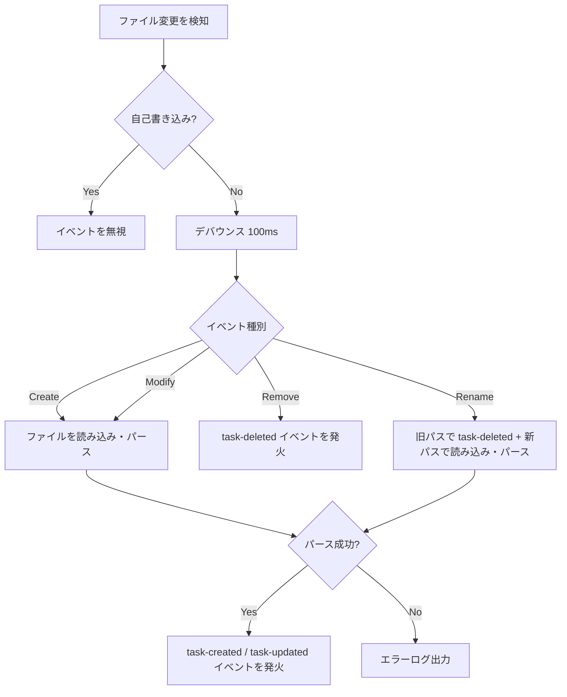

# spec-board - ファイルシステム仕様（バックエンド）

> **機能**: [spec-board](./index.md)
> **ステータス**: 下書き

## 概要

Tauriバックエンド（Rust）におけるmdファイルの読み書き・パース・ファイルシステム監視の仕様を定義する。プロジェクトディレクトリ内のmdファイルをタスクとして管理し、外部からの変更をリアルタイムに検知してフロントエンドへ通知する。

## Tauriコマンド一覧

| コマンド | 説明 |
|:---------|:-----|
| `open_project` | プロジェクトディレクトリを開き、mdファイルを一括読み込みして watcher ハンドルを初期化（現時点では Noop） |
| `get_tasks` | 現在のプロジェクト内の全タスクを取得 |
| `create_task` | 新規タスクのmdファイルを作成 |
| `update_task` | 既存タスクのmdファイルを更新 |
| `delete_task` | タスクのmdファイルを削除 |
| `get_columns` | カラム設定を取得（[config-spec.md](./config-spec.md) 参照） |
| `update_columns` | カラム設定を更新（[config-spec.md](./config-spec.md) 参照） |
| `update_card_order` | カラム内のカード並び順を更新（[config-spec.md](./config-spec.md) 参照） |
| `add_link` | タスク間の関連リンクを追加 |
| `remove_link` | タスク間の関連リンクを削除 |

## コマンド詳細

### `open_project`

**説明**: 指定ディレクトリをプロジェクトとして開き、配下のmdファイルをスキャンしてタスク一覧を返す。同時に watcher ハンドルを `AppState` に設置する。

> 現時点では watcher 具象は `NoopWatcherHandle`（no-op）であり、実ファイル変更検知は別 Issue で `notify` crate 導入時に追加する。本コマンド呼び出しでは GUIDE.md の best-effort 書き出し（`<project_root>/.spec-board/GUIDE.md`）と `AppState` の 5 フィールド（`project_path` / `config` / `tasks_cache` / `watcher_handle` / `write_ignore`）の一括更新を行う。

**引数**:

| パラメータ | 型 | 説明 |
|:----------|:---|:-----|
| path | `String` | プロジェクトディレクトリの絶対パス |

**戻り値**:
```json
{
  "tasks": [
    {
      "id": "ファイルパス（プロジェクトルートからの相対パス）",
      "title": "タスクタイトル",
      "status": "Todo",
      "priority": "Medium",
      "labels": ["bug", "frontend"],
      "parent": "tasks/parent-task.md",
      "links": ["tasks/related-task.md"],
      "children": ["tasks/child-1.md", "tasks/child-2.md"],
      "reverseLinks": ["tasks/other-task.md"],
      "body": "Markdown本文",
      "filePath": "tasks/fix-bug.md",
      "extras": { "estimate": 3 },
      "warnings": [
        {
          "code": "missingStatusUsedDefault",
          "field": "status",
          "message": "status is missing; default status was used"
        }
      ]
    }
  ],
  "columns": ["Todo", "In Progress", "Done"]
}
```

- `parent`: フロントマターの `parent` フィールドの値
- `links`: フロントマターの `links` フィールドの値
- `children`: このタスクを `parent` に指定している子タスクのパス一覧（全タスク index 構築後の派生値）
- `reverseLinks`: このタスクを `links` に含んでいる他タスクのパス一覧（全タスク index 構築後の派生値）
- `extras`: 定義外フロントマターを JSON 互換値として保持したオブジェクト
- `warnings`: `title` / `status` の fallback や `parent` / `extras` の型不一致など、Task 生成を継続できる非致命警告の一覧

フロントエンドでは、この Tauri IPC payload を `TaskPayload` として受け取り、domain model の `Task` に変換して扱う。`Task` では `parent` / `children` は `hierarchy.parentFilePath` / `hierarchy.childFilePaths` に、`links` / `reverseLinks` は `links.linkedFilePaths` / `links.reverseLinkedFilePaths` に格納する。IPC payload と markdown frontmatter のフィールド名は互換性維持のため flat なまま変更しない。

**エラー**:

| ケース | 条件 | エラーメッセージ |
|:-------|:-----|:---------------|
| ディレクトリ不存在 | 指定パスが存在しない | `ディレクトリが見つかりません: {path}` |
| ディレクトリではない | 指定パスがディレクトリでない（通常ファイル等） | `ディレクトリではありません: {path}` |
| アクセス権限なし | 読み取り権限がない | `ディレクトリにアクセスできません: {path}` |
| 内部状態の lock 破損 | `AppState` の Mutex / `WriteIgnoreRegistry` が poison 状態 | `内部状態のロックが破損しました` |
| スキャン致命エラー | parent 循環 / scan I/O など | `io scan failed: {message}` |
| config 読み込み失敗 | `config.json` が壊れている等 | `config load failed (io|parse): {message}` |

> 個別 md ファイルの `fs::read` 失敗、および `task_from_markdown` のパース失敗は致命扱いせず、`log::warn!` で記録して該当ファイルだけ skip する（コマンド全体は成功する）。warning を payload へ同梱する仕様は別 Issue 扱い。

---

### `get_tasks`

**説明**: 現在のプロジェクト内の全タスクを取得する。`open_project` で読み込み済みのタスクキャッシュから返却する。

**引数**: なし

**戻り値**: `open_project` と同じ `tasks` 配列。`children` と `reverseLinks` の逆引き情報を含む。

---

### `create_task`

**説明**: フロントマター付きのmdファイルを新規作成する。

**引数**:

| パラメータ | 型 | 必須 | 説明 |
|:----------|:---|:-----|:-----|
| title | `String` | はい | タスクタイトル |
| status | `String` | はい | ステータス |
| priority | `String` | いいえ | 優先度（High / Medium / Low） |
| labels | `Vec<String>` | いいえ | ラベル一覧 |
| parent | `String` | いいえ | 親タスクのファイルパス |
| body | `String` | いいえ | Markdown本文 |

**振る舞い**:
1. タイトルをkebab-caseに変換してファイル名を生成（例: `fix-login-bug.md`）
2. 同名ファイルが存在する場合はサフィックスを付与（`fix-login-bug-1.md`）
3. `parent` が指定されている場合、対象ファイルの存在と循環参照がないことを検証
4. フロントマター + 本文の形式でmdファイルを書き出し
5. 作成したタスク情報を返却（`children` と `reverseLinks` を含む）

---

### `update_task`

**説明**: 既存タスクのmdファイルを更新する。

**引数**:

| パラメータ | 型 | 必須 | 説明 |
|:----------|:---|:-----|:-----|
| filePath | `String` | はい | 対象ファイルのプロジェクトルートからの相対パス |
| title | `String` | いいえ | タスクタイトル |
| status | `String` | いいえ | ステータス |
| priority | `String` | いいえ | 優先度 |
| labels | `Vec<String>` | いいえ | ラベル一覧 |
| parent | `String` | いいえ | 親タスクのファイルパス（空文字で親を解除） |
| body | `String` | いいえ | Markdown本文 |

**振る舞い**:
1. 対象ファイルを読み込み、フロントマターをパース
2. 渡されたフィールドのみを更新（未指定フィールドは変更しない）
3. `parent` が変更される場合、循環参照がないことを検証
4. フロントマター + 本文を再構成して書き出し
5. **`title` を変更してもファイル名はリネームしない**（`parent` や `links` での参照が壊れるため）

> Implementation notes (2026-05-05): parent 循環検証は
> `task_index::validate_parent_hierarchy` で行う。PL-008 の初期実装は
> task_index の純粋 validation API を提供する段階であり、`create_task` /
> `update_task` command を実装または接続する変更では、この note を更新し、
> command 側で index 確定前に同 API を呼び出す。

---

### `delete_task`

**説明**: タスクのmdファイルを削除する。

**引数**:

| パラメータ | 型 | 必須 | 説明 |
|:----------|:---|:-----|:-----|
| filePath | `String` | はい | 対象ファイルのプロジェクトルートからの相対パス |
| orphanStrategy | `String` | いいえ | 子タスクがある場合の処理方針。`clear`（子の `parent` をクリア）または `abort`（削除中止）。デフォルト: `clear` |

**振る舞い**:
1. 対象ファイルの存在を確認
2. 子タスクが存在する場合、`orphanStrategy` に従い処理
   - `clear`: 全ての子タスクの `parent` フィールドをクリア
   - `abort`: エラーを返却し削除を中止
3. 他タスクの `links` フロントマターに削除対象のパスが明示的に記載されている場合、該当エントリを削除（逆引きのみのリンクはフロントマター上に存在しないため処理不要）
4. ファイルを削除
5. 削除完了を返却

---

### `add_link`

**説明**: 2つのタスク間に関連リンクを追加する。

**引数**:

| パラメータ | 型 | 必須 | 説明 |
|:----------|:---|:-----|:-----|
| sourceFilePath | `String` | はい | リンク元タスクのファイルパス |
| targetFilePath | `String` | はい | リンク先タスクのファイルパス |

**振る舞い**:
1. 両ファイルの存在を確認
2. リンク元タスクのフロントマター `links` に `targetFilePath` を追加
3. 既にリンクが存在する場合は何もしない

---

### `remove_link`

**説明**: 2つのタスク間の関連リンクを削除する。

**引数**:

| パラメータ | 型 | 必須 | 説明 |
|:----------|:---|:-----|:-----|
| sourceFilePath | `String` | はい | リンク元タスクのファイルパス |
| targetFilePath | `String` | はい | リンク先タスクのファイルパス |

**振る舞い**:
1. リンク元タスクのフロントマター `links` から `targetFilePath` を削除

---

## ビジネスロジック

### mdファイルのスキャン

| ID | ルール | 条件 | 振る舞い |
|:---|:-------|:-----|:---------|
| BL-001 | スキャン対象 | プロジェクトディレクトリ直下および再帰的なサブディレクトリ | `.md` 拡張子のファイルのみをタスクとして認識 |
| BL-001a | 拡張子の大小文字非区別 | `.MD` / `.Md` / `.mD` などの大文字混じり拡張子 | `.md` と同等にスキャン対象とする |
| BL-002 | 除外パターン | `node_modules`、`.git`、`.*`（ドットファイル/ディレクトリ） | スキャン対象から除外 |
| BL-002a | ドット始まりのmdファイル | `.hidden.md` / `.DS_Store` などファイル名先頭がドット | `.md` 拡張子であっても除外 |
| BL-002b | 非 UTF-8 のパス | ファイル名・パス component に非 UTF-8 バイト列を含む | 後続の Tauri / JSON 境界（UTF-8 文字列前提）と整合させるため保守的に除外 |
| BL-002c | 除外パターンの適用範囲 | 利用者が `~/.spec-board/` や `node_modules` という名前のディレクトリを root として渡した場合 | 除外パターンは **root 配下の子孫エントリにのみ適用** し、root 自身がドット始まりや `node_modules` 名でもスキャン自体は実行する |
| BL-002d | 巨大ファイル | サイズが 1MB（1,048,576 byte）を超える `.md` ファイル | スキャン結果から除外（1MB ちょうどは含める） |
| BL-002e | バイナリファイル | 先頭 8KB（8,192 byte）に NUL byte (`0x00`) を含む `.md` ファイル | スキャン結果から除外（プローブ範囲外の NUL byte は判定しない） |
| BL-003 | フロントマターなしのmd | フロントマターが存在しないmdファイル | タスクとして認識しない（スキップ） |

### ファイル名の生成

| ID | ルール | 条件 | 振る舞い |
|:---|:-------|:-----|:---------|
| BL-004 | kebab-case変換 | タイトルからファイル名を生成する際 | スペース → ハイフン、特殊文字を除去、小文字に統一 |
| BL-005 | 重複回避 | 同名ファイルが既に存在する場合 | サフィックス `-1`, `-2`, ... を付与。`task-1.md` 衝突時は `task-1-1.md`（base の末尾数字は解釈しない） |

## ファイルシステム監視

### 監視仕様

| 項目 | 仕様 |
|:-----|:-----|
| 監視ライブラリ | `notify` crate（Rust） |
| モジュール配置 | サブクレート `spec-board-fs`（`src-tauri/crates/fs/`）配下に置く（重い外部 crate を集約する規約。CLAUDE.md「Rust バックエンド構成ルール」参照）。公開 API には `notify::*` の型を漏らさず、`std` の型と独自エラー型のみで構成する |
| 監視対象 | プロジェクトディレクトリ以下の `.md` ファイル |
| 監視イベント | Create / Modify / Remove / Rename |
| デバウンス | 後述の「デバウンス（スライディングウィンドウ集約）」セクション参照 |
| 自己書き込み抑制 | 後述の「自己書き込み抑制」セクション参照 |
| フロントエンドへの通知 | Tauri のイベントシステム（`emit`）を使用 |

### イベント通知

フロントエンドに送信するイベント:

| イベント名 | ペイロード | 発火条件 |
|:----------|:----------|:---------|
| `task-created` | `{ task: Task }` | 新しいmdファイルが作成された |
| `task-updated` | `{ task: Task }` | 既存のmdファイルが更新された |
| `task-deleted` | `{ filePath: string }` | mdファイルが削除された |

### 処理フロー


```mermaid
flowchart TD
    A[ファイル変更を検知] --> A1{自己書き込み?}
    A1 -->|Yes| A2[イベントを無視]
    A1 -->|No| B[デバウンス 100ms]
    B --> C{イベント種別}
    C -->|Create| D[ファイルを読み込み・パース]
    C -->|Modify| D
    C -->|Remove| E[task-deleted イベントを発火]
    C -->|Rename| R[旧パスで task-deleted + 新パスで読み込み・パース]
    D --> F{パース成功?}
    R --> F
    F -->|Yes| G[task-created / task-updated イベントを発火]
    F -->|No| H[エラーログ出力]
```

### Rename イベントの処理

ファイルがリネームされた場合（外部エディタやAIエージェントによる操作）:

1. 旧パスのタスクに対して `task-deleted` イベントを発火
2. 新パスのファイルを読み込み・パースし、`task-created` イベントを発火
3. 他タスクの `parent` や `links` に旧パスが含まれている場合、**自動的には更新しない**（リンク切れとして表示し、ユーザーに修正を促す）

### デバウンス（スライディングウィンドウ集約）

`spec_board_fs::watcher` は同一パスの連続イベントを `100ms` のスライディングウィンドウで集約する。エディタ保存時に多くのバックエンドが連続発火する `Modify` を抑制し、上位層のノイズを減らすための層であり、本体クレート `spec-board` に到達する `FsEvent` 件数が削減される。

| 項目 | 仕様 |
|:-----|:-----|
| ウィンドウ幅 | `100ms`（`DEBOUNCE_DURATION` 定数。`watcher.rs` 内のみで参照） |
| 集約方式 | スライディングウィンドウ。同一 path に新着イベントが届くたびに deadline を `now + 100ms` まで延長する。`100ms` 静止して初めて発火する |
| 上書き仕様 | 集約中の保留イベントは後続イベントで `event` ごと上書きされる（`kind` も含めて最後のイベントのみが送出される） |
| 集約キー | 通常イベント (`Created` / `Modified` / `Removed` / `Other`) はそのままの path を key とする。`Renamed { from, to }` は **宛先 `to`** を key とする（`from` 側は独立扱い）。rename 後に同じ `to` への `Modified` 等が連続すれば、後続イベントが pending 内の `Renamed` を上書きする |
| バイパス対象 | `FsEvent::Rescan` / `FsEvent::Error` はデバウンスせず即時 forward する。状態乖離や障害検出を遅延させないため、保留イベントを **追い越して** 先に通知される |
| 順序保証 | バイパスイベントは保留を flush せずに追い越すため、受信側は `Rescan` 後に古い `Modified` 等が遅延発火する可能性を許容する前提で実装すること |
| Drop 時の保留 | `Watcher` の Drop で上流が解放された際、保留イベントは破棄せず deadline 昇順（同点は path 昇順）で flush されてから adapter スレッドが終了する |
| 公開 API への影響 | 公開 API（`Watcher::start` / `FsEvent` / `WatcherError` / `Receiver<FsEvent>`）は完全互換 |

### 自己書き込み抑制

spec-board 自身がmdファイルを書き込んだ直後に、ファイル監視がその変更を「外部変更」として検知して二重更新される問題を防止する。

**方式**: 書き込みパスセット（Write Ignore Set）

| ステップ | 動作 |
|:--------|:-----|
| 1 | ファイル書き込み前に、対象ファイルパスを「書き込みパスセット」に追加 |
| 2 | ファイルを書き込み |
| 3 | ファイル監視がイベントを受け取った際、「書き込みパスセット」にパスが含まれていればイベントを無視 |
| 4 | イベント無視後、該当パスを「書き込みパスセット」から除去 |

- 書き込みパスセットは `HashSet<PathBuf>` で管理し、`Mutex` で排他制御
- セット登録後に対応するイベントが来なかった場合の解除は呼び出し側が明示的に行う

## エラーハンドリング

| エラーケース | 発生条件 | 振る舞い | ログレベル |
|:------------|:---------|:---------|:----------|
| ファイルスキャンの致命的エラー | スキャン root が不在 / アクセス不可 / ディレクトリでない | `open_project` 経由でフロントエンドに「ディレクトリが見つかりません / アクセスできません / ディレクトリではありません」相当のエラーを返却 | ERROR |
| 走査中の個別 I/O エラー | 走査中の特定ファイル / サブディレクトリの権限不足等 | 黙って skip し、走査を継続する（ログ出力は別 Issue で本格導入予定） | （現状は出力しない） |
| ファイル読み込み失敗 | 権限不足、ファイルロック中 | `log::warn!` で記録し該当ファイルだけ skip。`open_project` 全体は成功する。フロントエンドへの個別通知 / payload 同梱は別 Issue | WARN |
| フロントマターパース失敗 | YAML構文エラー、必須フィールド欠損 | `log::warn!` で記録し該当ファイルだけ skip。`open_project` 全体は成功する。フロントエンドへの個別通知 / payload 同梱は別 Issue | WARN |
| ファイル書き込み失敗 | ディスク容量不足、権限不足 | エラーをフロントエンドに返却 | ERROR |
| 監視の初期化失敗 | OS制限（inotify上限等） | エラーをフロントエンドに通知、ポーリングにフォールバック | ERROR |

## バックエンド API（内部）

`open_project` などの Tauri command から呼び出される、内部 Rust API の仕様。

### モジュール配置の方針

重い外部 crate（`walkdir` / `notify` / `reqwest` 等）に依存する処理は独立サブクレート `spec-board-fs`（`src-tauri/crates/fs/`）に集約し、Cargo.toml レベルで外部ライブラリ差し替えの影響を 1 箇所に閉じ込める。本体クレート `spec-board` は `path = "crates/fs"` 経由でのみ参照する。

- 集約する: 重い I/O / 走査 / OS 依存 / ネットワーク等を伴う crate
- 集約しない: `serde` / `serde_json` / `serde_yaml_ng` / `thiserror` / `anyhow` 等のエコシステム標準（本体 crate に直接置く）
- `spec-board-fs` の各モジュールは公開 API の型シグネチャに外部 crate の型を出さない（`std` の型と独自エラー型のみ）
- `spec-board-fs` は `tauri` に依存しない（IPC コマンド層は本体クレート側に置く）

詳細は CLAUDE.md「Rust バックエンド構成ルール」を参照。

### `scan_md_files`

```rust
pub fn scan_md_files(root: &Path) -> Result<Vec<PathBuf>, ScanError>;

pub enum ScanError {
    Io {
        path: std::path::PathBuf,
        source: std::io::Error,
    },
}
```

| 項目 | 仕様 |
|:-----|:-----|
| 機能 | `root` 配下の `.md` ファイルを再帰的に列挙する |
| 配置 | `src-tauri/crates/fs/src/file_scanner.rs`（サブクレート `spec-board-fs`、`walkdir` の集約先）。呼び出しは `spec_board_fs::file_scanner::scan_md_files` |
| 戻り値 | `root` からの **相対 `PathBuf`** の `Vec`。順序は OS 依存のため呼び出し側でソートする |
| 走査ライブラリ | `walkdir` crate（`follow_links(false)` 設定でシンボリックリンクは辿らない） |
| 除外パターン | BL-002 / BL-002a / BL-002b / BL-002c / BL-002d / BL-002e の各ルールを内部で適用 |
| 個別 I/O エラー | per-entry の `Err` は黙って skip し走査を継続（上記「エラーハンドリング」の挙動） |
| 致命的エラー | `Err(ScanError::Io { path, source })` を返す。`path` には呼び出し時に渡された root が保持され、エラー文脈を残す |
| `Display` 形式 | `failed to scan directory \`{path}\`: {source}`（root のパスを必ず含める） |

`open_project` 等の Tauri command は本 API を呼び出し、`ScanError::Io` をフロントエンド表示用エラー（"ディレクトリが見つかりません" 等）に変換して返却する。

### `WriteIgnoreRegistry`

```rust
pub struct WriteIgnoreRegistry;

impl WriteIgnoreRegistry {
    pub fn new() -> Self;
    pub fn register(&self, path: impl AsRef<Path>) -> Result<bool, WriteIgnoreError>;
    pub fn should_ignore(&self, path: impl AsRef<Path>) -> Result<bool, WriteIgnoreError>;
    pub fn consume(&self, path: impl AsRef<Path>) -> Result<bool, WriteIgnoreError>;
    pub fn unregister(&self, path: impl AsRef<Path>) -> Result<bool, WriteIgnoreError>;
    pub fn len(&self) -> Result<usize, WriteIgnoreError>;
    pub fn is_empty(&self) -> Result<bool, WriteIgnoreError>;
    pub fn clear(&self) -> Result<(), WriteIgnoreError>;
}

pub enum WriteIgnoreError {
    LockPoisoned,
    CleanupWorkerSpawnFailed,
}
```

| 項目 | 仕様 |
|:-----|:-----|
| 機能 | spec-board 自身の書き込みで発生したファイル監視イベントを呼び出し側が識別するため、無視対象パスを登録・参照・解除する |
| 配置 | `src-tauri/crates/fs/src/write_ignore.rs`（サブクレート `spec-board-fs`）。呼び出しは `spec_board_fs::write_ignore::WriteIgnoreRegistry` |
| 内部状態 | `Mutex<HashSet<PathBuf>>` で登録済みパスを保持する |
| `register` | パスを登録し、新規追加なら `Ok(true)`、重複なら `Ok(false)` を返す |
| `should_ignore` | パスが登録済みなら `Ok(true)`、未登録なら `Ok(false)` を返す。状態は変更しない |
| `consume` | 1回の lock 内でパスを確認して解除し、登録済みなら `Ok(true)`、未登録なら `Ok(false)` を返す。ファイル監視イベントの one-shot 消費に使う |
| `unregister` | パスを解除し、登録済みなら `Ok(true)`、未登録なら `Ok(false)` を返す |
| `clear` | 登録済みパスを全て消去する。Mutex poison 時のみ `Err(WriteIgnoreError::LockPoisoned)` を返す。プロジェクト再オープン等のライフサイクル境界で呼ぶ |
| 解除責務 | `consume` / `unregister` による明示的な解除を呼び出し側が行う |
| タイムアウト | registry 自体は timeout cleanup を行わない。イベント未到達時の stale entry 防止が必要な場合は呼び出し側で解除タイミングを管理する |
| 重複登録 | 同一 path の重複 `register` は `Ok(false)` を返し、状態を変更しない |
| 再登録 | `consume` / `unregister` 後に同一 path が再登録された場合は、新規登録として `Ok(true)` を返す |
| パス比較 | canonicalize / normalize は行わず、渡された `PathBuf` 表現の完全一致で扱う |
| エラー | public API では Mutex が poison された場合に `Err(WriteIgnoreError::LockPoisoned)` を返す。`CleanupWorkerSpawnFailed` は互換性維持のため enum variant として残すが、現在の `HashSet` registry 実装では返さない |
| Tauri 依存 | なし。Tauri state やファイル監視コンポーネントへの保持・統合は呼び出し側で行う |

`WriteIgnoreRegistry` は自己書き込み抑制用の registry を担当する。ファイル監視イベントを無視する判定では race-free な `consume` を使う。対応する監視イベントが届かない場合の解除は呼び出し側の責務とする。

### `Watcher` / `FsEvent` / `WatcherError`

```rust
pub struct Watcher;

impl Watcher {
    pub fn start(
        path: impl AsRef<Path>,
    ) -> Result<(Watcher, std::sync::mpsc::Receiver<FsEvent>), WatcherError>;
}

pub enum FsEvent {
    Created(PathBuf),
    Modified(PathBuf),
    Removed(PathBuf),
    Renamed { from: PathBuf, to: PathBuf },
    Other(PathBuf),
    Error(String),
    Rescan,
}

pub enum WatcherError {
    Init(String),
    PathNotFound(PathBuf),
    Io(std::io::Error),
}
```

| 項目 | 仕様 |
|:-----|:-----|
| 機能 | `path` を再帰的に監視し、変更を [`FsEvent`] として `mpsc::Receiver` 経由で逐次通知する |
| 配置 | `src-tauri/crates/fs/src/watcher.rs`（サブクレート `spec-board-fs`、`notify` の集約先）。呼び出しは `spec_board_fs::watcher::Watcher` |
| バックエンド | まず `RecommendedWatcher` を試み、`new` または再帰 `watch()` のいずれかが失敗した場合は `PollWatcher`（2 秒間隔）へ自動フォールバック |
| Symlink | 両バックエンドに `notify::Config::with_follow_symlinks(false)` を適用。再帰中に出現する子孫 symlink は辿らない（無限ループ／プロジェクト境界外監視を防止）。root が symlink ディレクトリ自体である場合は `Watcher::start` は受け入れる（呼び出し側責務） |
| 停止 | 戻り値の `Watcher` を drop すると **同期的** に監視停止する。内部 backend → adapter thread の順で解放され、`Drop` 完了後に発生したファイル変更は `Receiver` に届かない（Drop 前に enqueue 済みのイベントは `Disconnected` を観測するまで `recv` 可能） |
| 公開境界 | `notify::*` の型は公開シグネチャに一切露出させない（`std` の型と `FsEvent` / `WatcherError` のみ） |

#### `FsEvent` 変換テーブル

| `notify::EventKind` | 条件 | 変換結果 |
|:--------------------|:-----|:---------|
| `Create(_)` | `paths[0]` 必須 | `FsEvent::Created(paths[0])` |
| `Modify(Data(_))` / `Modify(Metadata(_))` | 〃 | `FsEvent::Modified(paths[0])` |
| `Modify(Name(_))` | `paths.len() >= 2` | `FsEvent::Renamed { from: paths[0], to: paths[1] }` |
| `Modify(Name(_))` | `paths.len() < 2` | `FsEvent::Other(paths[0])`（rename を確定できないため downgrade） |
| `Remove(_)` | `paths[0]` 必須 | `FsEvent::Removed(paths[0])` |
| `Access(_)` / `Any` / `Other` | 〃 | `FsEvent::Other(paths[0])` |
| 任意 | `paths.is_empty()` | 送信スキップ |
| 任意 | `notify::Event::need_rescan() == true` | `FsEvent::Rescan`（キューオーバーフロー／コアレスでイベントが取りこぼされた可能性。`paths` の有無に関わらず先に判定し、caller に状態再構築を促す） |
| `notify` バックエンドからの `Result::Err` | — | `FsEvent::Error(message)`（黙殺せず caller に通知） |

#### `WatcherError`（`start` 時のみ）

| variant | 発生条件 |
|:--------|:---------|
| `PathNotFound(PathBuf)` | 単一の `std::fs::metadata(path)` 呼び出しで判定。`std::io::ErrorKind::NotFound`（パス不在）または `metadata.is_dir() == false`（ディレクトリでない）の場合に返す。`try_exists()` + `metadata()` の二段呼び出しは TOCTOU レースで `Io` に降格する恐れがあったため、単一呼び出しで両条件をマップする実装に統一している |
| `Init(String)` | recommended と poll の両方が初期化または再帰 `watch()` に失敗。両者の原因メッセージを結合した文字列を保持する |
| `Io(std::io::Error)` | `metadata()` 取得時の I/O 失敗（`NotFound` 以外。例: 権限不足） |

#### スコープ外（後続 Issue で扱う）

- 拡張子フィルタ（`.md` 等）— 呼び出し側責務
- 監視対象パスの動的追加・削除
- Tauri IPC 経由のフロントエンド emit（`task-created` / `task-updated` / `task-deleted` への変換）
- `WriteIgnoreRegistry` との統合（自己書き込み抑制）
- root が symlink ディレクトリの場合の追加検査（現状は notify に委ねる）

## カラム設定・カード並び順の永続化

カラム設定、カード並び順、AIエージェント向けガイドの仕様は [config-spec.md](./config-spec.md) を参照。

`get_columns`、`update_columns`、`update_card_order` のコマンド詳細も [config-spec.md](./config-spec.md) に記載。

## 制限事項

- シンボリックリンク先のmdファイルは監視対象外
- ファイル名に使用できない文字がタイトルに含まれる場合、自動的に除去して生成
- 大量ファイルの同時変更時（100ファイル以上）はバッチ処理で順次反映

## 関連仕様

- [config-spec.md](./config-spec.md) - 設定ファイル・カラム管理・AIエージェント向けガイド
- [task-format-spec.md](./task-format-spec.md) - mdファイルのフォーマット定義・パース仕様
- [board-view-spec.md](./board-view-spec.md) - ファイル変更イベントを受け取るフロントエンド側の仕様
- [task-card-spec.md](./task-card-spec.md) - タスクデータの表示仕様
