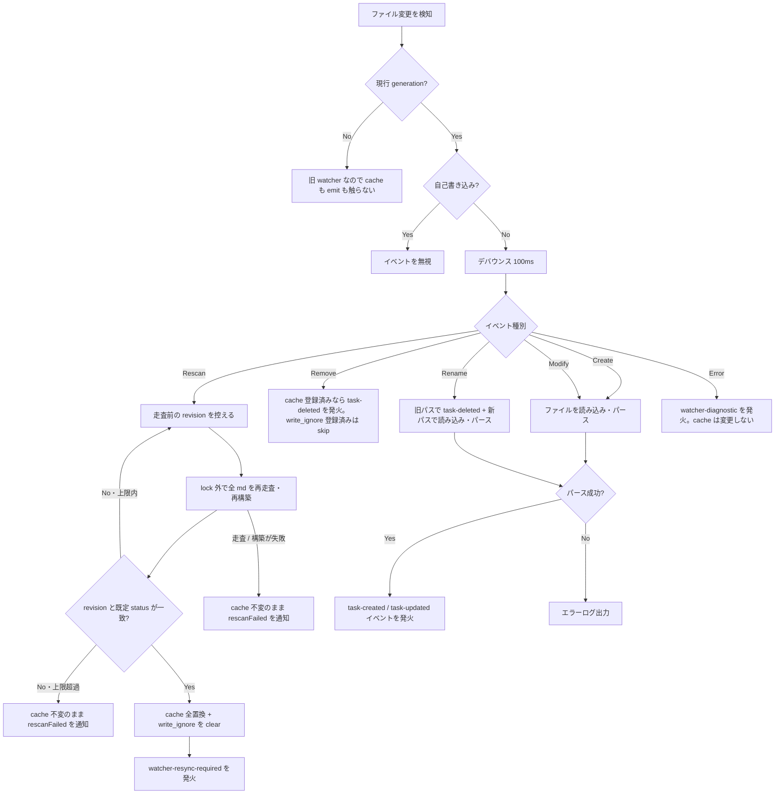

# spec-board - ファイルシステム仕様（バックエンド）

> **機能**: [spec-board](./index.md)
> **ステータス**: 下書き

## 概要

Tauriバックエンド（Rust）におけるmdファイルの読み書き・パース・ファイルシステム監視の仕様を定義する。プロジェクトディレクトリ内のmdファイルをタスクとして管理し、外部からの変更をリアルタイムに検知してフロントエンドへ通知する。

## Tauriコマンド一覧

| コマンド | 説明 |
|:---------|:-----|
| `open_project` | プロジェクトディレクトリを開き、mdファイルを一括読み込みし、`notify` ベースの実 watcher を起動して FE への `task-created` / `task-updated` / `task-deleted` 配信を開始する |
| `get_tasks` | 現在のプロジェクト内の全タスクと task / milestone の集計 projection を取得 |
| `create_task` | 新規タスクのmdファイルを作成 |
| `update_task` | 既存タスクのmdファイルを更新 |
| `delete_task` | タスクのmdファイルを削除 |
| `get_columns` | カラム設定を取得（[config-spec.md](./config-spec.md) 参照） |
| `get_labels` | ラベルマスタ定義を取得（[config-spec.md](./config-spec.md) 「labels.yml スキーマ」参照） |
| `update_columns` | カラム設定を更新（[config-spec.md](./config-spec.md) 参照） |
| `move_task` | タスクのカラム間移動（status 変更 + cardOrder 更新）と同一カラム内並び替え（[config-spec.md](./config-spec.md) 参照） |
| `create_label` | ラベルマスタに新規ラベルを追加（[config-spec.md](./config-spec.md) 「ラベル CRUD コマンド」参照） |
| `update_label` | 既存ラベルの metadata を更新（PUT・[config-spec.md](./config-spec.md) 参照） |
| `delete_label` | ラベルを削除し削除前の使用数を返す（[config-spec.md](./config-spec.md) 参照） |
| `add_link` | タスク間の関連リンクを追加 |
| `remove_link` | タスク間の関連リンクを削除 |

## コマンド詳細

### `open_project`

**説明**: 指定ディレクトリをプロジェクトとして開き、配下のmdファイルをスキャンしてタスク一覧を返す。同時に `notify` ベースの実 watcher を起動し、`task-created` / `task-updated` / `task-deleted` を `tauri::AppHandle::emit` でフロントエンドに配信する adapter を `AppState` に設置する。

> 本コマンド呼び出しでは GUIDE.md の best-effort 書き出し（`<project_root>/.spec-board/GUIDE.md`）と `AppState` の 6 フィールド（`project_path` / `config` / `labels` / `tasks_cache` / `watcher_handle` / `write_ignore`）の更新を、(1) watcher 起動準備 → (2) 旧 watcher 停止 → (3) state commit → (4) adapter spawn の 4 段階で行う。watcher 起動が失敗した場合は AppState を一切変更せず `WatcherInitFailed` を返す（旧プロジェクトを表示したまま動作継続）。

> `.spec-board/labels.yml`（ラベルマスタ）も config 読み込みと同じく open 時に読み込み、`AppState.labels` に commit する。不在時は空レジストリ（`labels: []`）で開け、後方互換を保つ。壊れた YAML / name 重複 / name 空文字は `labels load failed (parse)`、I/O 異常は `labels load failed (io)` として open に失敗する。取得は独立コマンド `get_labels` で行い、本コマンドの payload には同梱しない。

**引数**:

| パラメータ | 型 | 説明 |
|:----------|:---|:-----|
| path | `String` | プロジェクトディレクトリの絶対パス |

**戻り値**:
```json
{
  "tasks": [
    {
      "id": "ファイルパス（プロジェクトルートからの相対パス）",
      "title": "タスクタイトル",
      "status": "Todo",
      "priority": "Medium",
      "labels": ["bug", "frontend"],
      "parent": "tasks/parent-task.md",
      "links": ["tasks/related-task.md"],
      "children": ["tasks/child-1.md", "tasks/child-2.md"],
      "reverseLinks": ["tasks/other-task.md"],
      "body": "Markdown本文",
      "filePath": "tasks/fix-bug.md",
      "extras": { "estimate": 3 },
      "warnings": [
        {
          "code": "missingStatusUsedDefault",
          "field": "status",
          "message": "status is missing; default status was used"
        }
      ]
    }
  ],
  "columns": ["Todo", "In Progress", "Done"],
  "projections": {
    "tasks/fix-bug.md": {
      "subIssueProgress": { "done": 1, "total": 3 },
      "isDone": false,
      "childFilePaths": ["tasks/sub-a.md", "tasks/sub-b.md"]
    }
  },
  "milestoneProjections": {
    "release-v1": {
      "total": 1,
      "done": 0,
      "taskFilePaths": ["tasks/fix-bug.md"]
    }
  },
  "session": {
    "projectKey": "/home/user/specs",
    "generation": 1,
    "revision": 1,
    "eventSeq": 0
  }
}
```

- `parent`: フロントマターの `parent` フィールドの値
- `links`: フロントマターの `links` フィールドの値
- `children`: このタスクを `parent` に指定している子タスクのパス一覧（全タスク index 構築後の派生値）
- `reverseLinks`: このタスクを `links` に含んでいる他タスクのパス一覧（全タスク index 構築後の派生値）
- `extras`: 定義外フロントマターを JSON 互換値として保持したオブジェクト
- `warnings`: `title` / `status` の fallback や `parent` / `extras` の型不一致など、Task 生成を継続できる非致命警告の一覧
- `projections`: filePath をキーにした集計値。詳細は `get_tasks` 節を参照する。初期表示時点でフロントエンドが集計を持てるよう同梱する
- `milestoneProjections`: milestone 名をキーにした `{ total, done, taskFilePaths }`。`projections` と別取得せず、同じ payload に同梱する
- `session`: watcher イベント検証の初期 baseline。`tasks` と**同一トランザクション**で確定した値で、watcher を起動する前に組み立てる。分けて組み立てると「session はある変更を含むが tasks は含まない」状態が生まれ、その変更のイベントが stale として捨てられたまま復旧しなくなる。詳細は「イベント通知」節を参照

フロントエンドでは、この Tauri IPC payload を `TaskPayload` として受け取り、domain model の `Task` に変換して扱う。`Task` では `parent` / `children` は `hierarchy.parentFilePath` / `hierarchy.childFilePaths` に、`links` / `reverseLinks` は `links.linkedFilePaths` / `links.reverseLinkedFilePaths` に格納する。IPC payload と markdown frontmatter のフィールド名は互換性維持のため flat なまま変更しない。

**エラー**:

| ケース | 条件 | エラーメッセージ |
|:-------|:-----|:---------------|
| ディレクトリ不存在 | 指定パスが存在しない | `ディレクトリが見つかりません: {path}` |
| ディレクトリではない | 指定パスがディレクトリでない（通常ファイル等） | `ディレクトリではありません: {path}` |
| アクセス権限なし | 読み取り権限がない | `ディレクトリにアクセスできません: {path}` |
| 内部状態の lock 破損 | `AppState` の Mutex / `WriteIgnoreRegistry` が poison 状態 | `内部状態のロックが破損しました` |
| スキャン致命エラー | parent 循環 / scan I/O など | `io scan failed: {message}` |
| config 読み込み失敗 | `config.json` が壊れている等 | `config load failed (io|parse): {message}` |
| ファイル監視の初期化失敗 | inotify 上限超過 / poll fallback 失敗 / path 消失等で `Watcher::start` が `Err` を返した場合 | `ファイル監視の初期化に失敗しました: {source}` |

> 個別 md ファイルの `fs::read` 失敗、および `task_from_markdown` のパース失敗は致命扱いせず、`log::warn!` で記録して該当ファイルだけ skip する（コマンド全体は成功する）。warning を payload へ同梱する仕様は別 Issue 扱い。
>
> ファイル監視の初期化失敗時は AppState の全フィールド（`project_path` / `config` / `tasks_cache` / `watcher_handle` / `write_ignore`）が **一切変更されず**、フロントエンドは旧プロジェクトを表示したまま動作を継続する。FE 側 `TauriError.PATTERNS` には未対応のため `UNKNOWN` 分類になる（必要なら FE 側で「ファイル監視の初期化」パターンを個別追加する）。

---

### `get_tasks`

**説明**: 現在のプロジェクト内の全タスクを取得する。`open_project` で読み込み済みのタスクキャッシュから返却する。

**引数**: なし

**戻り値**: `{ tasks, projections, milestoneProjections, session }`。`tasks` は `open_project` と同じ Task 配列（`children` と `reverseLinks` の逆引き情報を含む）、`projections` は filePath をキーにした task 集計、`milestoneProjections` は milestone 名をキーにした集計、`session` は watcher イベント検証の baseline。

> `tasks` の並び順は `open_project` と**完全に同一**（カラム表示順 → `cardOrder` → `id` 昇順）。フロントエンドは配列順をそのまま表示順に使うため、片方だけ `id` 昇順にすると watcher の full rescan / イベント欠落からの復旧のたびに DnD で決めた並びが崩れる。並び順の決定は `TaskIndex::sorted_by_board_order` 1 箇所に集約する。`milestoneProjections[*].taskFilePaths` も、この `tasks` を milestone ごとに絞り込んだ順序と一致する。`config` が `None` の場合のみ `TaskIndex::sorted_by_id` にフォールバックし、`tasks` / `taskFilePaths` ともに `id` 昇順とする。この場合は完了カラムも解決できないため `done` は 0。

```json
{
  "tasks": [ /* ... */ ],
  "projections": {
    "tasks/parent.md": {
      "subIssueProgress": { "done": 1, "total": 3 },
      "isDone": false,
      "childFilePaths": ["tasks/child-a.md", "tasks/child-b.md"]
    }
  },
  "milestoneProjections": {
    "release-v1": {
      "total": 3,
      "done": 1,
      "taskFilePaths": [
        "tasks/parent.md",
        "tasks/child-a.md",
        "tasks/child-b.md"
      ]
    }
  },
  "session": {
    "projectKey": "/home/user/specs",
    "generation": 1,
    "revision": 42,
    "eventSeq": 17
  }
}
```

`session` は返した `tasks` と同一トランザクションで確定した値で、受信側はこれで
watcher イベント検証の baseline（`revision` と `eventSeq` の両方）を取り直す。

**`projections` の各フィールド**:

| フィールド | 説明 |
|:----------|:-----|
| `subIssueProgress.total` | 全子孫の件数。root 自身は含まない |
| `subIssueProgress.done` | 全子孫のうち完了カラムに居る件数 |
| `isDone` | そのタスク自身が完了カラムに居るか |
| `childFilePaths` | 直接の子の filePath。`filePath` 昇順 |

**`milestoneProjections` の各フィールド**:

| フィールド | 説明 |
|:----------|:-----|
| `total` | その milestone が割り当てられた task 件数 |
| `done` | 対象 task のうち、snapshot の config から解決した完了カラムに居る件数。完了カラムを解決できない場合は 0 |
| `taskFilePaths` | 対象 task の `filePath`。payload の `tasks` と同じ board order（config が `None` なら id 順） |

`milestone: null` と空文字は未割当として map に含めない。空でない名称は milestone registry に未定義でも raw 値を key として保持し、task 集合を 1 回走査して `total` / `done` / `taskFilePaths` を同時に集計する。`taskFilePaths` 自体は集計中に sort せず、command 層が先に tasks を payload 順へ sort してから `TaskIndex` を再構築することで順序を保証する。百分率は payload に含めない。

**集計規則**:

- 親子関係は各タスクの `parent` から組み直す（payload の `children` には依存しない）
- 集計対象は**全子孫**で、root 自身は含まない
- サイクル（A→B→A）・自己参照（A→A）でも有限ステップで停止する
- 同じ子孫へ複数経路で到達しても 1 度だけ数える
- `parent` が実在タスクに解決できないタスクは、どのタスクの子にもならない（`childFilePaths` にも現れない）
- `childFilePaths` の値は親が書いた raw な参照文字列ではなく、**解決先タスク自身の `filePath`**
- 完了カラムは `doneColumn` 設定値。未設定時は `columns` の `order` 最大（表示上の末尾）カラム。どちらも解決できない場合は `isDone` が常に false・`done` は 0
- 百分率は payload に含めない（表示層で算出する）

**未オープン時**: `tasks` / `projections` / `milestoneProjections` はすべて空、`session` は初期値（`generation` / `revision` / `eventSeq` がすべて 0）の payload を成功で返す（エラーにはしない）。

### Snapshot / projection 同期契約

`get_tasks` は `project_path → config → tasks_cache` の順に 3 lock を取得して同時保持し、config / tasks を clone すると同じ critical section で watcher session を確定する。lock 解放後、snapshot の config で完了カラムを解決し、tasks を board order（config が `None` なら id 順）へ sort して `TaskIndex` を再構築する。その同じ index から task projection、milestone projection、最後に payload の tasks を取り出す。

`open_project` は読み込んだ同じ config / tasks を state に commit し、`tasks_cache` の置換・revision / generation 更新・session 確定を watcher spawn 前に行う。payload は途中の state を再読込せず、その config / tasks と確定済み session から `get_tasks` と同じ `sort → task projection → milestone projection → tasks` の順で構築する。このため両 command は同じ project snapshot に対して `tasks` / `projections` / `milestoneProjections` の値と順序が一致し、4 フィールドは同じ論理 snapshot に属する。

フロントエンドでは、open 成功時に `tasks` と両 projection map を 1 つの `ProjectData` に設定する。task mutation、column reorder、完了カラム変更後の projection sync は project command queue の barrier 後に `get_tasks` を呼び、1 つの `projections-refreshed` action で両 map を同時置換する。single in-flight と path / open request id / request sequence の guard を通らない古い応答、および IPC 失敗時は現在値を保持する。

watcher の `eventSeq` gap または full rescan 通知から復旧する場合も、queue barrier 後に `get_tasks` で full snapshot を取得する。読み取り中に mutation が enqueue された応答、project / generation / session が変わった応答は採用しない。gate が snapshot session を受理したときだけ、1 つの `tasks-resynced` action で `tasks` / `projections` / `milestoneProjections` を atomic に反映する。走行中の session baseline は watcher gate が更新し、`ProjectData.watcherSession` は open baseline のまま保持する。buffer した watcher event の replay で tasks がさらに進んだ場合は、通常の projection sync が両 map を再取得する。

---

### `create_task`

**説明**: フロントマター付きのmdファイルを新規作成する。

**引数**:

| パラメータ | 型 | 必須 | 説明 |
|:----------|:---|:-----|:-----|
| title | `String` | はい | タスクタイトル |
| status | `String` | はい | ステータス |
| priority | `String` | いいえ | 優先度（High / Medium / Low） |
| labels | `Vec<String>` | いいえ | ラベル一覧 |
| parent | `String` | いいえ | 親タスクのファイルパス |
| body | `String` | いいえ | Markdown本文 |

**振る舞い**:
1. タイトルを kebab-case に変換してファイル名を生成（例: `fix-login-bug.md`）
2. **配置先ディレクトリの決定**:
   - `parent` 未指定 → プロジェクトルート直下の `tasks/`（必要なら自動作成）
   - `parent` 指定 → 解決済み親 Task の `file_path` の dirname に同居（raw 入力の `./tasks/x.md` や `tasks\\x.md` 表記揺れではなく、正規化済み親パス由来）
3. **ファイル名衝突回避**:
   - in-memory `tasks_cache` の同一配置先ディレクトリ内に同名 Task があればサフィックス付与（`fix-login-bug-1.md` / `-2.md` ...）
   - cache に未反映の disk 上 stale ファイルや並行 create との衝突は `OpenOptions::create_new(true)` で検出され `Io(AlreadyExists)` エラー（上書きはしない）
4. **入力検証**:
   - `parent` 指定時は対象 Task の存在 + 親 chain 循環 + 深さ上限（MAX=20）を検証
   - 既存 cache 内の dangling parent / links が新規 Task で解決されるケース（augmented hierarchy）も検証対象に含める
   - `title` が空、または kebab-case 化結果が空文字列なら `InvalidTitle` エラー
5. **frontmatter 構築**:
   - `priority` は `High` / `Medium` / `Low` に ASCII 大小文字非区別で正規化、`Some` だけ書き出す（無効値 / 空文字 / 未指定は frontmatter から省略）
   - `labels` は空配列なら省略
   - `parent` は解決済み Task の `file_path` 文字列をそのまま書き出す
6. **書き込み + cache 差分更新**:
   - watcher 起動状態でのみ `write_ignore` レジストリに自前 write path を登録 → 監視 thread 側で `task-created` IPC emit を抑止
   - 書き込み成功後、`tasks_cache` に新規 Task を挿入し、親の `children` および link 先の `reverse_links` を差分更新
   - 既存 cache 内で dangling parent / links が新規 Task を参照していた場合、新規 Task 側の `children` / `reverse_links` にも反映
7. **戻り値**: 挿入後の Task（`children` / `reverseLinks` 解決済み）

### preview_task_filename IPC

タスク作成フォームで入力中のタイトル / 明示ファイル名 / 親タスクパスから、
保存先パスのプレビュー（衝突回避済み）を返す読み取り専用 IPC。

- **引数**: `{ title, explicitFilename?, parentFilePath? }`
- **戻り値**: `{ kind: "path", fileName, relPath, fullPath }` | `{ kind: "invalid", error }` | `{ kind: "pending" }`
- FE 側の kebab-case 変換・unique filename 生成は本 IPC に統一し、二重実装を排除する

**Atomic 性 (部分 atomic)**:
- 入力検証 / 配置先決定は副作用前に完了する。失敗時は FS / state を一切変更しない
- FS write 中の失敗（`write_all` 途中失敗）は best-effort で `remove_file` を試み、`write_ignore` を解除して `Io` エラーを返す
- FS write 成功後の cache 更新失敗（lock poison 等）はファイルが残る（次回 open / watcher rescan で拾われる）

---

### `update_task`

**説明**: 既存タスクのmdファイルを更新する。

**引数**:

| パラメータ | 型 | 必須 | 説明 |
|:----------|:---|:-----|:-----|
| filePath | `String` | はい | 対象ファイルのプロジェクトルートからの相対パス |
| title | `String` | いいえ | タスクタイトル |
| status | `String` | いいえ | ステータス |
| priority | `String` | いいえ | 優先度 |
| labels | `Vec<String>` | いいえ | ラベル一覧 |
| parent | `String` | いいえ | 親タスクのファイルパス（空文字で親を解除） |
| body | `String` | いいえ | Markdown本文 |

**振る舞い**:
1. 対象ファイルを読み込み、フロントマターをパース
2. 渡されたフィールドのみを更新（未指定フィールドは変更しない）
3. `parent` が変更される場合、循環参照がないことを検証
4. フロントマター + 本文を再構成して書き出し
5. **`title` を変更してもファイル名はリネームしない**（`parent` や `links` での参照が壊れるため）

> Implementation notes (2026-05-16): parent 循環検証は
> `task_index::validate_parent_hierarchy` / `validate_chain_from_parent` で行う。
> `create_task` / `update_task` command は本ドキュメントの振る舞いを実装済み。
> dangling parent 解決による cycle / too-deep は `validate_parent_hierarchy` を
> augmented snapshot に対して呼ぶことで検出する。`update_task` は部分マージ更新
> （未指定フィールドは変更しない）で、`parent` が変更される場合のみ augmented
> 検証を実行する。

---

### `delete_task`

**説明**: タスクのmdファイルを削除する。

**引数**:

| パラメータ | 型 | 必須 | 説明 |
|:----------|:---|:-----|:-----|
| filePath | `String` | はい | 対象ファイルのプロジェクトルートからの相対パス（絶対パスも受付可。`InputTaskPath` で `.md` 必須として正規化） |
| orphanStrategy | `String` | いいえ | 子タスクがある場合の処理方針。現在は `abort`（削除中止）のみ実装。`clear` strategy は将来対応 |

**振る舞い**:
1. `filePath` を `InputTaskPath` で正規化し、空文字・非 `.md`・`..` を含むパスは `InvalidPath` エラーを返す
2. cache（`TaskIndex`）上で対象タスクの存在を確認し、見つからなければ `FileNotFound` エラーを返す
3. 子タスクが存在する場合、`HasChildren` エラーを返却し削除を中止する（abort strategy）
4. watcher 起動中は `WriteIgnoreRegistry` に削除対象パスを登録し、watcher 側の重複処理を抑止する
5. `TaskIo::remove` でファイルを物理削除する
6. `tasks_cache` から対象タスクを除去する
7. `Ok(())` を返却する

**エラー**:

| エラー | Display 文字列パターン | 条件 |
|:------|:---------------------|:-----|
| `InvalidPath` | `invalid path: {raw}`（空文字時は `invalid path: empty`） | 空文字・非 `.md`・不正パス |
| `FileNotFound` | `file not found: {abs_path}` | cache に対象タスクが存在しない、またはファイル物理削除時に disk 上に存在しない |
| `HasChildren` | `task has children: {path} (children: ...)` | 子タスクが 1 件以上存在する |
| `UnsupportedOrphanStrategy` | `unsupported orphan strategy: {strategy}` | `abort` 以外の orphanStrategy が指定された |
| `NoProjectOpen` | `project is not opened` | プロジェクト未オープン |

> `delete_task` command は `create_task` / `update_task` と同じ lock 取得順序契約・write_ignore パターン・effect 層構成に従う。CardOrder の cleanup は watcher の reconciliation に委ねる。現在は abort strategy のみ実装済みで、clear strategy（子の parent クリア）や reverse_links 再構築は将来 Issue で対応する。

---

### `add_link`

**説明**: 2つのタスク間に関連リンクを追加する。

**引数**:

| パラメータ | 型 | 必須 | 説明 |
|:----------|:---|:-----|:-----|
| sourceFilePath | `String` | はい | リンク元タスクのファイルパス |
| targetFilePath | `String` | はい | リンク先タスクのファイルパス |

**振る舞い**:
1. 両ファイルの存在を確認
2. リンク元タスクのフロントマター `links` に `targetFilePath` を追加
3. 既にリンクが存在する場合は何もしない

---

### `remove_link`

**説明**: 2つのタスク間の関連リンクを削除する。

**引数**:

| パラメータ | 型 | 必須 | 説明 |
|:----------|:---|:-----|:-----|
| sourceFilePath | `String` | はい | リンク元タスクのファイルパス |
| targetFilePath | `String` | はい | リンク先タスクのファイルパス |

**振る舞い**:
1. リンク元タスクのフロントマター `links` から `targetFilePath` を削除

---

## ビジネスロジック

### mdファイルのスキャン

| ID | ルール | 条件 | 振る舞い |
|:---|:-------|:-----|:---------|
| BL-001 | スキャン対象 | プロジェクトディレクトリ直下および再帰的なサブディレクトリ | `.md` 拡張子のファイルのみをタスクとして認識 |
| BL-001a | 拡張子の大小文字非区別 | `.MD` / `.Md` / `.mD` などの大文字混じり拡張子 | `.md` と同等にスキャン対象とする |
| BL-002 | 除外パターン | `node_modules`、`.git`、`.*`（ドットファイル/ディレクトリ） | スキャン対象から除外 |
| BL-002a | ドット始まりのmdファイル | `.hidden.md` / `.DS_Store` などファイル名先頭がドット | `.md` 拡張子であっても除外 |
| BL-002b | 非 UTF-8 のパス | ファイル名・パス component に非 UTF-8 バイト列を含む | 後続の Tauri / JSON 境界（UTF-8 文字列前提）と整合させるため保守的に除外 |
| BL-002c | 除外パターンの適用範囲 | 利用者が `~/.spec-board/` や `node_modules` という名前のディレクトリを root として渡した場合 | 除外パターンは **root 配下の子孫エントリにのみ適用** し、root 自身がドット始まりや `node_modules` 名でもスキャン自体は実行する |
| BL-002d | 巨大ファイル | サイズが 1MB（1,048,576 byte）を超える `.md` ファイル | スキャン結果から除外（1MB ちょうどは含める） |
| BL-002e | バイナリファイル | 先頭 8KB（8,192 byte）に NUL byte (`0x00`) を含む `.md` ファイル | スキャン結果から除外（プローブ範囲外の NUL byte は判定しない） |
| BL-003 | フロントマターなしのmd | フロントマターが存在しないmdファイル | タスクとして認識しない（スキップ） |

### ファイル名の生成

| ID | ルール | 条件 | 振る舞い |
|:---|:-------|:-----|:---------|
| BL-004 | kebab-case変換 | タイトルからファイル名を生成する際 | スペース → ハイフン、特殊文字を除去、小文字に統一 |
| BL-005 | 重複回避 | 同名ファイルが既に存在する場合 | サフィックス `-1`, `-2`, ... を付与。`task-1.md` 衝突時は `task-1-1.md`（base の末尾数字は解釈しない） |

## ファイルシステム監視

### 監視仕様

| 項目 | 仕様 |
|:-----|:-----|
| 監視ライブラリ | `notify` crate（Rust） |
| モジュール配置 | サブクレート `spec-board-fs`（`src-tauri/crates/fs/`）配下に置く（重い外部 crate を集約する規約。CLAUDE.md「Rust バックエンド構成ルール」参照）。公開 API には `notify::*` の型を漏らさず、`std` の型と独自エラー型のみで構成する |
| 監視対象 | プロジェクトディレクトリ以下の `.md` ファイル |
| 監視イベント | Create / Modify / Remove / Rename / Rescan / Error。Create〜Rename は本体クレート側 adapter で `tasks_cache` を差分更新後、Tauri IPC で FE に配信される。Remove は cache 登録済みパスのみ `task-deleted` を発火し、`WriteIgnoreRegistry` に登録された自前 delete はスキップする。Rescan は full rescan を行って `tasks_cache` を全置換し、Error は structured diagnostics として FE へ通知する |
| デバウンス | 後述の「デバウンス（スライディングウィンドウ集約）」セクション参照 |
| 自己書き込み抑制 | 後述の「自己書き込み抑制」セクション参照 |
| フロントエンドへの通知 | Tauri のイベントシステム（`emit`）を使用 |

### イベント通知

すべての watcher イベントは共通 envelope に包んで配信する。

```ts
{
  projectKey: string,      // BE 採番の project 識別子
  generation: number,      // watcher 世代（open_project ごとに +1）
  revision: number,        // tasks_cache の版
  cacheMutating: boolean,  // この event が cache を変更したか
  eventSeq: number,        // emit ごとに 1 消費する連番（欠番 = 取りこぼし）
  changeId: string,        // "{generation}-{eventSeq}"（ログ相関用）
  payload: { /* イベント別 */ }
}
```

| イベント名 | payload | 発火条件 | cacheMutating |
|:----------|:--------|:---------|:--------------|
| `task-created` | `{ task: Task }` | 新しい md ファイルが作成された | true |
| `task-updated` | `{ task: Task }` | 既存の md ファイルが更新された | true |
| `task-deleted` | `{ filePath: string }` | md ファイルが削除された | true |
| `watcher-resync-required` | `{ reason: "rescan" }` | `FsEvent::Rescan` を受けて full rescan を完了した。**snapshot は同梱しない**（FE が `get_tasks` で取り直す） | true |
| `watcher-diagnostic` | `{ code, message, paths }` | watcher backend の障害 / full rescan の失敗 | false |

受信側は `projectKey` / `generation` の不一致を破棄し、`eventSeq` の欠番を検知したら
`get_tasks` で snapshot を取り直す。`cacheMutating: true` の event についてのみ
`revision` の単調性を検査する（診断イベントは cache を変えないため revision が進まない）。

**現時点の保証範囲（1）— 通常の差分更新とカラム更新の競合**: status を省略した md の
既定カラムは、その md を処理する時点の `Config` から解決する。ただし「`Config` を読む →
md を parse する → `tasks_cache` を更新する」が単一のクリティカルセクションではないため、
その途中で `update_columns` が commit すると、当該ファイルだけ 1 世代前の既定カラムに入る。
**旧カラムが削除されていた場合は、どのカラムにも属さずボード上から見えなくなる**。
いずれもそのファイルが再度変更されるか full rescan が走れば解消する。

恒久対策は `update_columns` の atomic 化だけでは足りない（watcher は commit の前に
古い `Config` で parse を終えているため）。cache への insert 時点で既定 status を
再検証し、変わっていれば parse からやり直す **conditional upsert** が必要で、
バックエンドのドメイン再構成（Epic #417）で扱う。

**現時点の保証範囲（2）**: `open_project` は watcher を起動してから応答を返すため、
「watcher 起動 → フロントエンドが購読を開始する」までの短い窓に発生した変更は、
open 応答の snapshot にも購読にも含まれない。この欠落は**次のイベントが届いた時点で
`eventSeq` の欠番として検知され、自動再取得で復旧する**。ただし窓の直後に一切
イベントが発生しない場合はその変更が反映されないままになる。窓自体を無くすには
購読の常設化または BE/FE のハンドシェイクが必要で、watcher reconciliation
（Issue #460）で扱う。

`open_project` / `get_tasks` の応答には、その snapshot と**同一トランザクション**で
確定した `session`（`{ projectKey, generation, revision, eventSeq }`）が含まれる。
受信側はこれを envelope 検証の baseline とし、再取得のたびに取り直す。

`watcher-diagnostic` の `code` は
`watchPathUnavailable` / `resourceExhausted` / `permissionDenied` / `io` / `unknown` /
`rescanFailed` のいずれか。未知の値は受信側で `unknown` に丸めて必ず通知する。

### 処理フロー


```mermaid
flowchart TD
    A[ファイル変更を検知] --> G0{現行 generation?}
    G0 -->|No| G1[旧 watcher なので cache も emit も触らない]
    G0 -->|Yes| A1{自己書き込み?}
    A1 -->|Yes| A2[イベントを無視]
    A1 -->|No| B[デバウンス 100ms]
    B --> C{イベント種別}
    C -->|Create| D[ファイルを読み込み・パース]
    C -->|Modify| D
    C -->|Remove| E[cache 登録済みなら task-deleted を発火。write_ignore 登録済みは skip]
    C -->|Rename| R[旧パスで task-deleted + 新パスで読み込み・パース]
    C -->|Rescan| S0[走査前の revision を控える]
    C -->|Error| X[watcher-diagnostic を発火。cache は変更しない]
    S0 --> S1[lock 外で全 md を再走査・再構築]
    S1 --> S2{revision と既定 status が一致?}
    S2 -->|No・上限内| S0
    S2 -->|No・上限超過| S6[cache 不変のまま rescanFailed を通知]
    S2 -->|Yes| S3[cache 全置換 + write_ignore を clear]
    S3 --> S4[watcher-resync-required を発火]
    S1 -->|走査 / 構築が失敗| S5[cache 不変のまま rescanFailed を通知]
    D --> F{パース成功?}
    R --> F
    F -->|Yes| G[task-created / task-updated イベントを発火]
    F -->|No| H[エラーログ出力]
```

### Rename イベントの処理

ファイルがリネームされた場合（外部エディタやAIエージェントによる操作）:

1. 旧パスのタスクに対して `task-deleted` イベントを発火
2. 新パスのファイルを読み込み・パースし、`task-created` イベントを発火
3. 旧パスへの `task-deleted` 処理時、他タスクの `parent` / `links` / `reverseLinks` に残っていた旧パス参照は **自動的に cleanup される**（リンク切れの状態で残さない）。新パスの `task-created` では新タスク自身の frontmatter 由来の `parent` / `links` と親側 `children` の同期だけが反映されるため、他タスクに残っていた旧パス参照を新パスへ自動変換することはしない。新パス参照を他タスクに復元するには、外部側で当該タスクの md を編集して新パスを記述し直す必要がある

### デバウンス（スライディングウィンドウ集約）

`spec_board_fs::watcher` は同一パスの連続イベントを `100ms` のスライディングウィンドウで集約する。エディタ保存時に多くのバックエンドが連続発火する `Modify` を抑制し、上位層のノイズを減らすための層であり、本体クレート `spec-board` に到達する `FsEvent` 件数が削減される。

| 項目 | 仕様 |
|:-----|:-----|
| ウィンドウ幅 | `100ms`（`DEBOUNCE_DURATION` 定数。`watcher.rs` 内のみで参照） |
| 集約方式 | スライディングウィンドウ。同一 path に新着イベントが届くたびに deadline を `now + 100ms` まで延長する。`100ms` 静止して初めて発火する |
| 上書き仕様 | 集約中の保留イベントは後続イベントで `event` ごと上書きされる（`kind` も含めて最後のイベントのみが送出される） |
| 集約キー | 通常イベント (`Created` / `Modified` / `Removed` / `Other`) はそのままの path を key とする。`Renamed { from, to }` は **宛先 `to`** を key とする（`from` 側は独立扱い）。rename 後に同じ `to` への `Modified` 等が連続すれば、後続イベントが pending 内の `Renamed` を上書きする |
| バイパス対象 | `FsEvent::Rescan` / `FsEvent::Error` はデバウンスせず即時 forward する。状態乖離や障害検出を遅延させないため、保留イベントを **追い越して** 先に通知される |
| 順序保証 | バイパスイベントは保留を flush せずに追い越すため、受信側は `Rescan` 後に古い `Modified` 等が遅延発火する可能性を許容する前提で実装すること。**上位層はこれを envelope の `revision` / `eventSeq` で吸収する**: 追い越した古い cache 変更は `revision` が snapshot 以下になるので破棄され、`eventSeq` の欠番は取りこぼしとして自動再取得を起こす。再取得の応答が届くまでに来た cache 変更は受信側 gate が buffer し、baseline 取り直し後に順に畳み込んで適用する |
| Drop 時の保留 | `Watcher` の Drop で上流が解放された際、保留イベントは破棄せず deadline 昇順（同点は path 昇順）で flush されてから adapter スレッドが終了する |
| 公開 API への影響 | 公開 API（`Watcher::start` / `FsEvent` / `WatcherError` / `Receiver<FsEvent>`）は完全互換 |

### 自己書き込み抑制

spec-board 自身がmdファイルを書き込んだ直後に、ファイル監視がその変更を「外部変更」として検知して二重更新される問題を防止する。

**方式**: 書き込みパスセット（Write Ignore Set）

| ステップ | 動作 |
|:--------|:-----|
| 1 | ファイル書き込み前に、対象ファイルパスを「書き込みパスセット」に追加 |
| 2 | ファイルを書き込み |
| 3 | ファイル監視がイベントを受け取った際、「書き込みパスセット」にパスが含まれていればイベントを無視 |
| 4 | イベント無視後、該当パスを「書き込みパスセット」から除去 |

- 書き込みパスセットは `HashSet<PathBuf>` で管理し、`Mutex` で排他制御
- セット登録後に対応するイベントが来なかった場合の解除は呼び出し側が明示的に行う
- **パス表現は絶対パス**で揃える。`FsEvent` から渡される `PathBuf` をそのまま key として比較するため、書き込み側も `register` 時に絶対パスを使うこと。相対表記や区切り違い（`./tasks/x.md` と `tasks/x.md` 等）は別キーとして扱われ、`unregister` がヒットせずに自己書き込みが二重通知される
- **stale entry の TTL cleanup は行わない**。書き込み後に対応するイベントが届かなかった場合の登録は、`open_project` で別プロジェクトを開いたタイミングと **full rescan 完了時**の `WriteIgnoreRegistry::clear()` で解消される。full rescan で clear するのは、stale entry が残ると以後の自前 write 判定を誤らせるため（`open_project` の commit と同じ扱い）。プロジェクトを開き直さずに長時間動作させても自己書き込み判定が壊れない仕様にしたい場合は、呼び出し側で `unregister` を明示する

## エラーハンドリング

| エラーケース | 発生条件 | 振る舞い | ログレベル |
|:------------|:---------|:---------|:----------|
| ファイルスキャンの致命的エラー | スキャン root が不在 / アクセス不可 / ディレクトリでない | `open_project` 経由でフロントエンドに「ディレクトリが見つかりません / アクセスできません / ディレクトリではありません」相当のエラーを返却 | ERROR |
| 走査中の個別 I/O エラー | 走査中の特定ファイル / サブディレクトリの権限不足等 | 黙って skip し、走査を継続する（ログ出力は別 Issue で本格導入予定） | （現状は出力しない） |
| ファイル読み込み失敗 | 権限不足、ファイルロック中 | `log::warn!` で記録し該当ファイルだけ skip。`open_project` 全体は成功する。フロントエンドへの個別通知 / payload 同梱は別 Issue | WARN |
| フロントマターパース失敗 | YAML構文エラー、必須フィールド欠損 | `log::warn!` で記録し該当ファイルだけ skip。`open_project` 全体は成功する。フロントエンドへの個別通知 / payload 同梱は別 Issue | WARN |
| ファイル書き込み失敗 | ディスク容量不足、権限不足 | エラーをフロントエンドに返却 | ERROR |
| 監視の初期化失敗 | OS制限（inotify上限等） | `Watcher::start` 内部で recommended → poll の自動フォールバックを試み、両方失敗した場合のみ `open_project` から `ファイル監視の初期化に失敗しました: ...` を返す。AppState は **一切変更せず**、フロントエンドは旧プロジェクトを表示したまま動作を継続する | ERROR |
| 監視稼働中の backend 障害 | 監視対象の消失 / 資源枯渇 / 権限剥奪 / I/O エラー | `FsEvent::Error(WatcherFailure)` を `watcher-diagnostic`（`cacheMutating: false`）として FE へ配信し、error トーストで可視化する。`tasks_cache` と `revision` は変更しない | WARN |
| full rescan の失敗 | Rescan 受信後の再走査で root 不在 / 親チェーンの深さ超過 | `tasks_cache` を **一切変更せず**、`watcher-diagnostic`（`code: "rescanFailed"`）のみ発火する。FE に再取得させても BE の cache が古いままなので、「復旧できなかった」ことを伝える方が安全側 | WARN |
| full rescan 中の並行 mutation / カラム更新 | 走査中に mutation command が commit して revision が進む、または `update_columns` が既定 status を変える | 置換直前の check-and-set が **revision と「走査に使った既定 status」の両方**の不一致を検出し、**最大 3 回**まで再走査する。上限超過時は cache を変更せず `rescanFailed` を通知する（最終試行を無条件採用すると、その走査中のカラム変更まで誤った内容で確定させてしまうため） | WARN |

## バックエンド API（内部）

`open_project` などの Tauri command から呼び出される、内部 Rust API の仕様。

### モジュール配置の方針

重い外部 crate（`walkdir` / `notify` / `reqwest` 等）に依存する処理は独立サブクレート `spec-board-fs`（`src-tauri/crates/fs/`）に集約し、Cargo.toml レベルで外部ライブラリ差し替えの影響を 1 箇所に閉じ込める。本体クレート `spec-board` は `path = "crates/fs"` 経由でのみ参照する。

- 集約する: 重い I/O / 走査 / OS 依存 / ネットワーク等を伴う crate
- 集約しない: `serde` / `serde_json` / `serde_yaml_ng` / `thiserror` / `anyhow` 等のエコシステム標準（本体 crate に直接置く）
- `spec-board-fs` の各モジュールは公開 API の型シグネチャに外部 crate の型を出さない（`std` の型と独自エラー型のみ）
- `spec-board-fs` は `tauri` に依存しない（IPC コマンド層は本体クレート側に置く）

詳細は CLAUDE.md「Rust バックエンド構成ルール」を参照。

### `scan_md_files`

```rust
pub fn scan_md_files(root: &Path) -> Result<Vec<PathBuf>, ScanError>;

pub enum ScanError {
    Io {
        path: std::path::PathBuf,
        source: std::io::Error,
    },
}
```

| 項目 | 仕様 |
|:-----|:-----|
| 機能 | `root` 配下の `.md` ファイルを再帰的に列挙する |
| 配置 | `src-tauri/crates/fs/src/task/file_scanner.rs`（サブクレート `spec-board-fs`、`walkdir` の集約先）。呼び出しは `spec_board_fs::task::file_scanner::scan_md_files` |
| 戻り値 | `root` からの **相対 `PathBuf`** の `Vec`。順序は OS 依存のため呼び出し側でソートする |
| 走査ライブラリ | `walkdir` crate（`follow_links(false)` 設定でシンボリックリンクは辿らない） |
| 除外パターン | BL-002 / BL-002a / BL-002b / BL-002c / BL-002d / BL-002e の各ルールを内部で適用 |
| 個別 I/O エラー | per-entry の `Err` は黙って skip し走査を継続（上記「エラーハンドリング」の挙動） |
| 致命的エラー | `Err(ScanError::Io { path, source })` を返す。`path` には呼び出し時に渡された root が保持され、エラー文脈を残す |
| `Display` 形式 | `failed to scan directory \`{path}\`: {source}`（root のパスを必ず含める） |

`open_project` 等の Tauri command は本 API を呼び出し、`ScanError::Io` をフロントエンド表示用エラー（"ディレクトリが見つかりません" 等）に変換して返却する。

### `WriteIgnoreRegistry`

```rust
pub struct WriteIgnoreRegistry;

impl WriteIgnoreRegistry {
    pub fn new() -> Self;
    pub fn register(&self, path: impl AsRef<Path>) -> Result<bool, WriteIgnoreError>;
    pub fn register_bulk(&self, paths: &[PathBuf]) -> Result<(), WriteIgnoreError>;
    pub fn should_ignore(&self, path: impl AsRef<Path>) -> Result<bool, WriteIgnoreError>;
    pub fn unregister(&self, path: impl AsRef<Path>) -> Result<bool, WriteIgnoreError>;
    pub fn len(&self) -> Result<usize, WriteIgnoreError>;
    pub fn is_empty(&self) -> Result<bool, WriteIgnoreError>;
    pub fn clear(&self) -> Result<(), WriteIgnoreError>;
}

pub enum WriteIgnoreError {
    LockPoisoned,
    CleanupWorkerSpawnFailed,
}
```

| 項目 | 仕様 |
|:-----|:-----|
| 機能 | spec-board 自身の書き込みで発生したファイル監視イベントを呼び出し側が識別するため、無視対象パスを登録・参照・解除する |
| 配置 | `src-tauri/crates/fs/src/watcher/write_ignore.rs`（サブクレート `spec-board-fs`）。呼び出しは `spec_board_fs::watcher::write_ignore::WriteIgnoreRegistry` |
| 内部状態 | `Mutex<HashSet<PathBuf>>` で登録済みパスを保持する |
| `register` | パスを登録し、新規追加なら `Ok(true)`、重複なら `Ok(false)` を返す |
| `register_bulk` | 複数パスを 1 回の lock 内でまとめて登録する。空スライスは何もせず `Ok(())`。重複は `HashSet` により 1 件に丸まる |
| `should_ignore` | パスが登録済みなら `Ok(true)`、未登録なら `Ok(false)` を返す。状態は変更しない |
| `unregister` | 1回の lock 内でパスを確認して解除し、登録済みなら `Ok(true)`、未登録なら `Ok(false)` を返す。ファイル監視イベントの one-shot 消費（自己書き込み判定）と、登録のロールバックの両方に使う |
| `clear` | 登録済みパスを全て消去する。Mutex poison 時のみ `Err(WriteIgnoreError::LockPoisoned)` を返す。プロジェクト再オープン等のライフサイクル境界で呼ぶ |
| 解除責務 | `unregister` による明示的な解除を呼び出し側が行う |
| タイムアウト | registry 自体は timeout cleanup を行わない。イベント未到達時の stale entry 防止が必要な場合は呼び出し側で解除タイミングを管理する |
| 重複登録 | 同一 path の重複 `register` は `Ok(false)` を返し、状態を変更しない |
| 再登録 | `unregister` 後に同一 path が再登録された場合は、新規登録として `Ok(true)` を返す |
| パス比較 | canonicalize / normalize は行わず、渡された `PathBuf` 表現の完全一致で扱う |
| エラー | public API では Mutex が poison された場合に `Err(WriteIgnoreError::LockPoisoned)` を返す。`CleanupWorkerSpawnFailed` は互換性維持のため enum variant として残すが、現在の `HashSet` registry 実装では返さない |
| Tauri 依存 | なし。Tauri state やファイル監視コンポーネントへの保持・統合は呼び出し側で行う |

`WriteIgnoreRegistry` は自己書き込み抑制用の registry を担当する。ファイル監視イベントを無視する判定では race-free な `unregister`（確認と解除を 1 lock で行う）を使う。対応する監視イベントが届かない場合の解除は呼び出し側の責務とする。

### `Watcher` / `FsEvent` / `WatcherError`

```rust
pub struct Watcher;

impl Watcher {
    pub fn start(
        path: impl AsRef<Path>,
    ) -> Result<(Watcher, std::sync::mpsc::Receiver<FsEvent>), WatcherError>;
}

pub enum FsEvent {
    Created(PathBuf),
    Modified(PathBuf),
    Removed(PathBuf),
    Renamed { from: PathBuf, to: PathBuf },
    Other(PathBuf),
    Error(WatcherFailure),
    Rescan,
}

/// 監視稼働中に発生したランタイム障害。起動時エラー `WatcherError` とは役割が違う。
pub struct WatcherFailure {
    pub kind: WatcherFailureKind,
    pub paths: Vec<PathBuf>,
    pub detail: String,
}

pub enum WatcherFailureKind {
    WatchPathUnavailable,
    ResourceExhausted,
    PermissionDenied,
    Io,
    Unknown,
}

pub enum WatcherError {
    Init(String),
    PathNotFound(PathBuf),
    Io(std::io::Error),
}
```

| 項目 | 仕様 |
|:-----|:-----|
| 機能 | `path` を再帰的に監視し、変更を [`FsEvent`] として `mpsc::Receiver` 経由で逐次通知する |
| 配置 | `src-tauri/crates/fs/src/watcher/core.rs`（サブクレート `spec-board-fs`、`notify` の集約先）。呼び出しは `spec_board_fs::watcher::core::Watcher` |
| バックエンド | まず `RecommendedWatcher` を試み、`new` または再帰 `watch()` のいずれかが失敗した場合は `PollWatcher`（2 秒間隔）へ自動フォールバック |
| Symlink | 両バックエンドに `notify::Config::with_follow_symlinks(false)` を適用。再帰中に出現する子孫 symlink は辿らない（無限ループ／プロジェクト境界外監視を防止）。root が symlink ディレクトリ自体である場合は `Watcher::start` は受け入れる（呼び出し側責務） |
| 停止 | 戻り値の `Watcher` を drop すると **同期的** に監視停止する。内部 backend → adapter thread の順で解放され、`Drop` 完了後に発生したファイル変更は `Receiver` に届かない（Drop 前に enqueue 済みのイベントは `Disconnected` を観測するまで `recv` 可能） |
| 公開境界 | `notify::*` の型は公開シグネチャに一切露出させない（`std` の型と `FsEvent` / `WatcherError` のみ） |

#### `FsEvent` 変換テーブル

| `notify::EventKind` | 条件 | 変換結果 |
|:--------------------|:-----|:---------|
| `Create(_)` | `paths[0]` 必須 | `FsEvent::Created(paths[0])` |
| `Modify(Data(_))` / `Modify(Metadata(_))` | 〃 | `FsEvent::Modified(paths[0])` |
| `Modify(Name(_))` | `paths.len() >= 2` | `FsEvent::Renamed { from: paths[0], to: paths[1] }` |
| `Modify(Name(_))` | `paths.len() < 2` | `FsEvent::Other(paths[0])`（rename を確定できないため downgrade） |
| `Remove(_)` | `paths[0]` 必須 | `FsEvent::Removed(paths[0])` |
| `Access(_)` / `Any` / `Other` | 〃 | `FsEvent::Other(paths[0])` |
| 任意 | `paths.is_empty()` | 送信スキップ |
| 任意 | `notify::Event::need_rescan() == true` | `FsEvent::Rescan`（キューオーバーフロー／コアレスでイベントが取りこぼされた可能性。`paths` の有無に関わらず先に判定し、caller に状態再構築を促す） |
| `notify` バックエンドからの `Result::Err` | — | `FsEvent::Error(WatcherFailure)`（黙殺せず caller に通知）。`kind` は `notify::ErrorKind` から写像する: `PathNotFound` / `WatchNotFound` → `WatchPathUnavailable`、`MaxFilesWatch` → `ResourceExhausted`、`Io(_)` は内側の `std::io::ErrorKind` を見て `NotFound` → `WatchPathUnavailable` / `PermissionDenied` → `PermissionDenied` / `StorageFull`・`OutOfMemory` → `ResourceExhausted` / それ以外 → `Io`、`Generic` / `InvalidConfig` → `Unknown` |

`FsEvent::Error` は**稼働中**の障害、`WatcherError` は **`start` 時**の失敗を表す。両者を
1 つの型にまとめると「監視が始まらなかった」と「監視が途中で壊れた」を呼び出し側が
区別できず、後者を起動失敗として扱って project を閉じてしまう。

#### `WatcherError`（`start` 時のみ）

| variant | 発生条件 |
|:--------|:---------|
| `PathNotFound(PathBuf)` | 単一の `std::fs::metadata(path)` 呼び出しで判定。`std::io::ErrorKind::NotFound`（パス不在）または `metadata.is_dir() == false`（ディレクトリでない）の場合に返す。`try_exists()` + `metadata()` の二段呼び出しは TOCTOU レースで `Io` に降格する恐れがあったため、単一呼び出しで両条件をマップする実装に統一している |
| `Init(String)` | recommended と poll の両方が初期化または再帰 `watch()` に失敗。両者の原因メッセージを結合した文字列を保持する |
| `Io(std::io::Error)` | `metadata()` 取得時の I/O 失敗（`NotFound` 以外。例: 権限不足） |

#### `spec-board-fs::watcher` のスコープ外

`spec-board-fs::watcher` は OS の watcher backend を抽象化し `FsEvent` までを返す層であり、本体クレート `spec-board` 側の `watcher_event` adapter で以下を担当する:

- 拡張子フィルタ（`.md` 等）— `watcher_event::handler::rel_md_path` で root 配下の `.md` のみを処理
- Tauri IPC 経由のフロントエンド emit（5 event の envelope 化）— `watcher_event::handler::handle_event` + `EmittingWatcherHandle`
- `WriteIgnoreRegistry` との統合（自己書き込み抑制）— `watcher_event::handler` 内で `unregister(abs_path)` を呼ぶ
- `FsEvent::Rescan` の full rescan（全 md 再走査 → `tasks_cache` 全置換 → `watcher-resync-required` 発火）— `watcher_event::handler::handle_rescan`
- `FsEvent::Error` の structured diagnostics 化（`WatcherFailureKind` → `watcher-diagnostic` の `code`）— `watcher_event::handler::handle_backend_failure`
- 旧世代 watcher の event 破棄（`generation` guard）— `watcher_event::handler::handle_event` 冒頭

引き続き後続 Issue で扱うもの:

- 監視対象パスの動的追加・削除
- root が symlink ディレクトリの場合の追加検査（現状は notify に委ねる）

## カラム設定・カード並び順の永続化

カラム設定、カード並び順、AIエージェント向けガイドの仕様は [config-spec.md](./config-spec.md) を参照。

`get_columns`、`update_columns`、`move_task` のコマンド詳細も [config-spec.md](./config-spec.md) に記載。

## 制限事項

- シンボリックリンク先のmdファイルは監視対象外
- ファイル名に使用できない文字がタイトルに含まれる場合、自動的に除去して生成
- 大量ファイルの同時変更時（100ファイル以上）はバッチ処理で順次反映

## 関連仕様

- [config-spec.md](./config-spec.md) - 設定ファイル・カラム管理・AIエージェント向けガイド
- [task-format-spec.md](./task-format-spec.md) - mdファイルのフォーマット定義・パース仕様
- [board-view-spec.md](./board-view-spec.md) - ファイル変更イベントを受け取るフロントエンド側の仕様
- [task-card-spec.md](./task-card-spec.md) - タスクデータの表示仕様

## 変更履歴

| バージョン | 日付 | 変更内容 | 変更者 |
|:-----------|:-----|:---------|:-------|
| 1.1 | 2026-07-29 | `open_project` / `get_tasks` の milestone projection、同一 snapshot・board order、mutation / watcher resync の atomic 同期契約を追加 | - |
