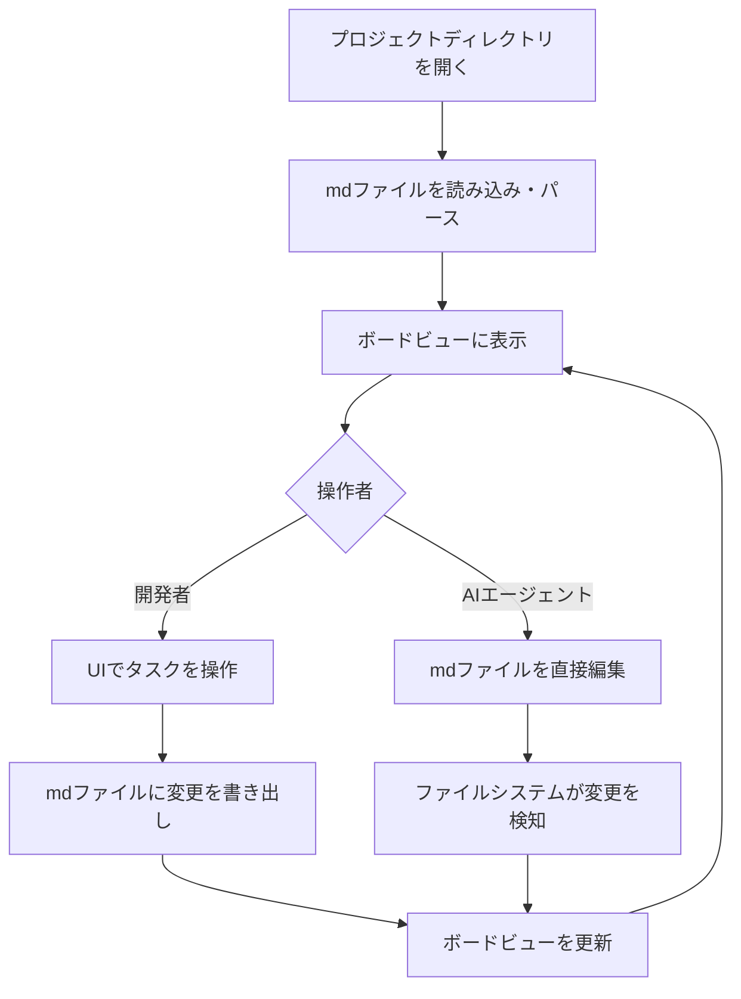

# spec-board

> **バージョン**: 1.0
> **作成日**: 2026-04-12
> **ステータス**: 下書き

## 概要

spec-board は、mdファイルをデータストアとしたプロジェクト管理デスクトップアプリケーションである。開発者はカンバン風ボードビューでタスクを管理し、AIエージェントはmdファイルを直接操作することでタスクの参照・更新を行う。Tauri + React で構築する。

## 背景

AIエージェント（Claude Code など）を活用したソフトウェア開発が普及する中、プロジェクト管理には依然として GitHub Projects や Jira などの外部サービスが使われている。これらのツールは Web UI や API 経由の操作が前提であり、AIエージェントがプロジェクトの状態をファイル操作だけで把握・更新できる仕組みが存在しない。

spec-board は、mdファイルという開発者にもAIエージェントにも扱いやすい形式をデータストアとして採用し、両者が同じデータソースでシームレスにプロジェクト管理を行えるようにする。

## スコープ

**対象範囲**:
- mdファイル（YAMLフロントマター形式）によるタスクのCRUD操作
- カンバン風ボードビューによるタスクの可視化・操作
- ユーザー定義カラム（ステータス）のカスタマイズ
- タスクカードにタイトル・ステータス・優先度・ラベルを表示
- サブIssue（親子関係・多階層ツリー構造）のサポート
- タスク間の関連リンク（双方向）
- ファイルシステム監視による外部変更（AIエージェント等）のリアルタイム反映

**対象外**:
- GitHub Issue / PR との連携
- マルチユーザー対応（複数人の同時編集・リアルタイムコラボレーション）
- クラウド同期
- 検索・フィルタリング機能（ラベル、優先度、キーワードによるタスク絞り込みはV2以降で検討）

## ユーザーストーリー

| ID | ～として | ～したい | ～のために | 優先度 |
|:---|:---------|:---------|:-----------|:-------|
| US-001 | 開発者 | ボードビューでタスクをステータス別に一覧表示したい | プロジェクト全体の進捗を直感的に把握するために | 高 |
| US-002 | 開発者 | ドラッグ&ドロップでタスクのステータスを変更したい | 素早くタスクの状態を更新するために | 高 |
| US-003 | 開発者 | UIからタスクを作成・編集・削除したい | ボード上で直接タスクを管理するために | 高 |
| US-004 | 開発者 | ボードのカラム（ステータス）を自由にカスタマイズしたい | プロジェクトのワークフローに合わせるために | 高 |
| US-005 | AIエージェント | mdファイルを直接読み書きしてタスクを操作したい | API設定なしでプロジェクト状態を把握・更新するために | 高 |
| US-006 | 開発者 | AIエージェントがmdファイルを更新したらボードに即座に反映してほしい | 常に最新の状態をボード上で確認するために | 高 |
| US-007 | 開発者 | タスクにサブIssueを作成して親子関係で管理したい | 大きなタスクを小さなタスクに分解して進捗を把握するために | 高 |
| US-008 | 開発者 | 親タスクのカードでサブIssueの進捗を確認したい | ボードを見るだけで全体の進捗を把握するために | 高 |
| US-009 | 開発者 | タスク間に関連リンクを設定したい | 関連するタスクを素早く参照できるようにするために | 中 |

## 処理フロー

## 仕様書一覧

| 仕様書 | 説明 |
|:-------|:-----|
| [board-view-spec.md](./board-view-spec.md) | [FE] カンバンボードUI・カラム管理・ドラッグ&ドロップ |
| [task-card-spec.md](./task-card-spec.md) | [FE] タスクカード表示・詳細パネル・作成/編集フォーム |
| [file-system-spec.md](./file-system-spec.md) | [BE] mdファイルのパース・ファイル監視・CRUD操作 |
| [task-format-spec.md](./task-format-spec.md) | [BE] mdファイルフォーマット定義・フロントマター仕様 |
| [config-spec.md](./config-spec.md) | [BE] 設定ファイル・カラム管理・カード並び順・AIエージェント向けガイド |

## 非機能要件

| カテゴリ | 要件 | 目標値 |
|:---------|:-----|:-------|
| パフォーマンス | ファイル変更からボード更新までの遅延 | 1秒以内 |
| パフォーマンス | 管理可能なタスク数 | 数百件程度 |
| ユーザビリティ | セットアップ手順 | ディレクトリ指定のみで利用開始可能 |

## 用語集

| 用語 | 定義 |
|:-----|:-----|
| spec-board | 本プロダクトの名称。mdファイルベースのプロジェクト管理デスクトップアプリ |
| ボードビュー | カンバン方式でタスクをステータス別カラムに表示するUI |
| タスクカード | ボード上の各タスクを表すカード型UI要素 |
| フロントマター | mdファイル冒頭のYAMLメタデータブロック（`---` で囲まれた部分） |
| カラム | ボードビューにおけるステータス別の列。ユーザーが自由に定義可能 |

## 変更履歴

| バージョン | 日付 | 変更内容 | 変更者 |
|:-----------|:-----|:---------|:-------|
| 1.0 | 2026-04-12 | 初版作成 | - |
