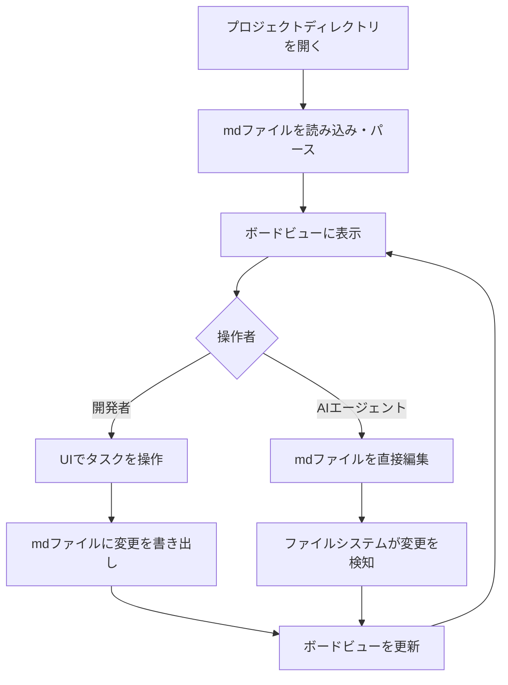

# spec-board

> **バージョン**: 1.0
> **作成日**: 2026-04-12
> **ステータス**: 下書き

## 概要

spec-board は、mdファイルをデータストアとしたプロジェクト管理デスクトップアプリケーションである。開発者はカンバン風ボードビューでタスクを管理し、AIエージェントはmdファイルを直接操作することでタスクの参照・更新を行う。Tauri + React で構築する。

## 背景

AIエージェント（Claude Code など）を活用したソフトウェア開発が普及する中、プロジェクト管理には依然として GitHub Projects や Jira などの外部サービスが使われている。これらのツールは Web UI や API 経由の操作が前提であり、AIエージェントがプロジェクトの状態をファイル操作だけで把握・更新できる仕組みが存在しない。

spec-board は、mdファイルという開発者にもAIエージェントにも扱いやすい形式をデータストアとして採用し、両者が同じデータソースでシームレスにプロジェクト管理を行えるようにする。

## スコープ

**対象範囲**:
- mdファイル（YAMLフロントマター形式）によるタスクのCRUD操作
- カンバン風ボードビューによるタスクの可視化・操作
- ユーザー定義カラム（ステータス）のカスタマイズ
- タスクカードにタイトル・ステータス・優先度・ラベルを表示
- サブIssue（親子関係・多階層ツリー構造）のサポート
- タスク間の関連リンク（双方向）
- ファイルシステム監視による外部変更（AIエージェント等）のリアルタイム反映
- 画面区分（ボード / 設定）の切り替えと、設定画面内のサブナビ（タブ）基盤
- 設定画面でのラベルレジストリ（登録済みラベル）の CRUD 管理（作成・編集・削除・validation）
- ボード / リスト / ツリー / カレンダー / Epic ロードマップの表示形態切替
- 設定画面内のステータス編集・設定ファイル viewer（現段階は App 永続化 adapter 未接続の presentational UI）

**対象外**:
- GitHub Issue / PR との連携
- マルチユーザー対応（複数人の同時編集・リアルタイムコラボレーション）
- クラウド同期
- 検索・フィルタリング機能（ラベル、優先度、キーワードによるタスク絞り込みはV2以降で検討）

## ユーザーストーリー

| ID | ～として | ～したい | ～のために | 優先度 |
|:---|:---------|:---------|:-----------|:-------|
| US-001 | 開発者 | ボードビューでタスクをステータス別に一覧表示したい | プロジェクト全体の進捗を直感的に把握するために | 高 |
| US-002 | 開発者 | ドラッグ&ドロップでタスクのステータスを変更したい | 素早くタスクの状態を更新するために | 高 |
| US-003 | 開発者 | UIからタスクを作成・編集・削除したい | ボード上で直接タスクを管理するために | 高 |
| US-004 | 開発者 | ボードのカラム（ステータス）を自由にカスタマイズしたい | プロジェクトのワークフローに合わせるために | 高 |
| US-005 | AIエージェント | mdファイルを直接読み書きしてタスクを操作したい | API設定なしでプロジェクト状態を把握・更新するために | 高 |
| US-006 | 開発者 | AIエージェントがmdファイルを更新したらボードに即座に反映してほしい | 常に最新の状態をボード上で確認するために | 高 |
| US-007 | 開発者 | タスクにサブIssueを作成して親子関係で管理したい | 大きなタスクを小さなタスクに分解して進捗を把握するために | 高 |
| US-008 | 開発者 | 親タスクのカードでサブIssueの進捗を確認したい | ボードを見るだけで全体の進捗を把握するために | 高 |
| US-009 | 開発者 | タスク間に関連リンクを設定したい | 関連するタスクを素早く参照できるようにするために | 中 |

## 処理フロー

```mermaid
flowchart TD
    A[プロジェクトディレクトリを開く] --> B[mdファイルを読み込み・パース]
    B --> C[ボードビューに表示]
    C --> D{操作者}
    D -->|開発者| E[UIでタスクを操作]
    D -->|AIエージェント| F[mdファイルを直接編集]
    E --> G[mdファイルに変更を書き出し]
    F --> H[ファイルシステムが変更を検知]
    G --> I[ボードビューを更新]
    H --> I
    I --> C
```

## 仕様書一覧

| 仕様書 | 説明 |
|:-------|:-----|
| [board-view-spec.md](./board-view-spec.md) | [FE] カンバンボードUI・カラム管理・ドラッグ&ドロップ |
| [milestone-view-spec.md](./milestone-view-spec.md) | [FE] マイルストーン専用ビュー（フィルタ・検索・ソート・list⇔roadmap 切替・作成モーダル） |
| [task-card-spec.md](./task-card-spec.md) | [FE] タスクカード表示・詳細（全画面 2 ペイン）・作成/編集フォーム |
| [file-system-spec.md](./file-system-spec.md) | [BE] mdファイルのパース・ファイル監視・CRUD操作・[ProjectSession と並行性契約](./file-system-spec.md#projectsession-と並行性契約) |
| [task-format-spec.md](./task-format-spec.md) | [BE] mdファイルフォーマット・TaskDocument codec・preview_task_markdown・フロントマター仕様（priority / labels / milestone / parent / links） |
| [config-spec.md](./config-spec.md) | [BE] 設定ファイル・カラム管理・カード並び順・labels.yml / milestones.yml マスタ・[writer protocol](./config-spec.md#projectsession-writer-protocol)・AIエージェント向けガイド |
| [label-registry-spec.md](./label-registry-spec.md) | [FE] ラベルのグループ分類・oklch カラーパレット・グループ色割当 |

## 非機能要件

| カテゴリ | 要件 | 目標値 |
|:---------|:-----|:-------|
| パフォーマンス | ファイル変更からボード更新までの遅延 | 1秒以内 |
| パフォーマンス | 管理可能なタスク数 | 数百件程度 |
| ユーザビリティ | セットアップ手順 | ディレクトリ指定のみで利用開始可能 |

## 用語集

| 用語 | 定義 |
|:-----|:-----|
| spec-board | 本プロダクトの名称。mdファイルベースのプロジェクト管理デスクトップアプリ |
| ボードビュー | カンバン方式でタスクをステータス別カラムに表示するUI |
| タスクカード | ボード上の各タスクを表すカード型UI要素 |
| フロントマター | mdファイル冒頭のYAMLメタデータブロック（`---` で囲まれた部分） |
| カラム | ボードビューにおけるステータス別の列。ユーザーが自由に定義可能 |
| マイルストーン | タスクをリリース単位で束ねる横断メタ情報。frontmatter `milestone`（単数）で参照し、`.spec-board/milestones.yml` でメタ情報（表示名・期日・並び順・状態）を定義する |
| ProjectLoadWarning | open_project / get_tasks が返す、部分的な読み込み失敗を code / stage / path / message / recoverable で表す warning。fatal error とは区別し、loaded board の注意パネルと要約 toast に表示する |
| ProjectSession | 現在開いている 1 project の root / SessionId / session-local Revision / config / registries / tasks を単一 snapshot として扱うバックエンド aggregate。watcher handle と write-ignore は session version で紐づく別 resource として保持する |
| IDEシェル | ヘッダー下を「左サイドバー｜メイン」に分割した IDE 風の画面構成。サイドバー（プロジェクトスイッチャー / ファイルツリー）・ビュー切替サブバー・横断フィルタ・外観切替から成る |
| ビュー（表示形態） | ボード領域の表示形態。ボード / リスト / ツリー / カレンダー / Epic ロードマップをサブバーで切り替える。選択はクライアントローカルに永続化する |
| Epic ロードマップ | 親を持たない task を Epic として直下 child と期間 timeline に表示するボード表示形態。マイルストーン専用ビュー内の roadmap とは別機能 |
| 外観 | テーマ（ライト / ダーク / システム）・表示密度・アクセントカラーのクライアントローカル設定。`localStorage` に永続化する |

## 変更履歴

| バージョン | 日付 | 変更内容 | 変更者 |
|:-----------|:-----|:---------|:-------|
| 1.0 | 2026-04-12 | 初版作成 | - |
| 1.1 | 2026-05-31 | 画面区分（ボード / 設定）と設定画面のサブナビ基盤・ラベル読み取りタブを追加 | - |
| 1.2 | 2026-06-07 | IDEシェル（サイドバー / ビュー切替サブバー / 横断フィルタ / 外観テーマ）を追加。検索・フィルタを MVP 採用へ昇格 | - |
| 1.3 | 2026-06-21 | マイルストーン専用ビューの仕様書 ([milestone-view-spec.md](./milestone-view-spec.md)) を追加 | - |
| 1.4 | 2026-07-31 | Issue #453: backend の ProjectSession aggregate / writer gate / revision CAS / staged watcher swap を仕様化。multi-project cache (#189)、wire redesign (#465)、OwnWriteGuard (#468)、path canonicalization は対象外 | - |
| 1.5 | 2026-08-01 | Issue #458: ProjectLoadWarning、partial success、読み込み注意パネルとwarnings通知を追加 | - |
| 1.6 | 2026-08-01 | Issue #455/#402: TaskDocument codec、TaskPatch、preview_task_markdown の共通 renderer と full Markdown preview を追加 | - |
| 1.7 | 2026-08-11 | Epic Roadmap view mode、Settings Status / Config 内部タブ、List / Tree / Calendar の拡張挙動を仕様一覧へ反映 | - |
