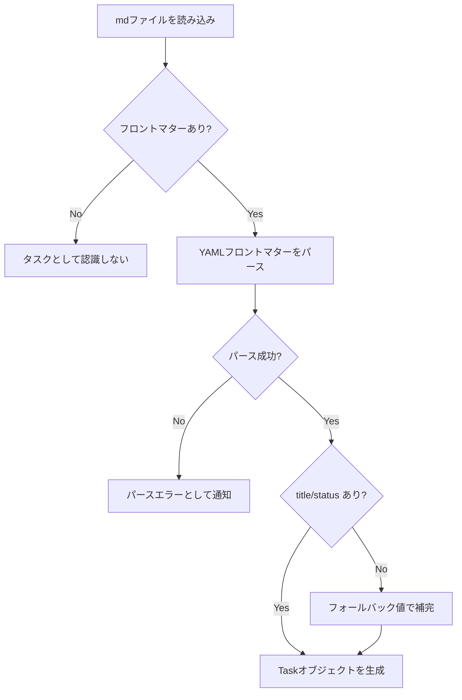

# spec-board - タスクフォーマット仕様（バックエンド）

> **機能**: [spec-board](./index.md)
> **ステータス**: 下書き

## 概要

spec-board で管理するタスクのmdファイルフォーマットを定義する。YAMLフロントマターにタスクのメタデータを記述し、本文にタスクの詳細説明をMarkdown形式で記述する。

## ファイルフォーマット

### 全体構造

```markdown
---
title: タスクのタイトル
status: Todo
priority: Medium
labels:
  - bug
  - frontend
parent: tasks/parent-task.md
links:
  - tasks/related-task.md
---

タスクの詳細説明をMarkdownで記述する。

## 補足情報

- 箇条書きなども自由に記述可能
```

### フロントマター定義

| フィールド | 型 | 必須 | デフォルト | 説明 |
|:----------|:---|:-----|:----------|:-----|
| title | `string` | 推奨 | ファイル名から生成 | タスクのタイトル。省略時はファイル名をフォールバック |
| status | `string` | 推奨 | 最初のカラム名 | タスクのステータス。ボードのカラムに対応。省略時は最初のカラムをデフォルト設定 |
| priority | `string` | いいえ | なし（バッジ非表示） | 優先度。`High` / `Medium` / `Low` のいずれか。省略時はバッジを表示しない |
| labels | `string[]` | いいえ | `[]` | ラベルの配列。カテゴリやタグとして使用 |
| parent | `string` | いいえ | なし | 親タスクのファイルパス（プロジェクトルートからの相対パス） |
| links | `string[]` | いいえ | `[]` | 関連タスクのファイルパスの配列 |

### フィールド詳細

#### title

- タスクを識別するためのタイトル
- 推奨フィールド。省略時はファイル名（拡張子除去、ハイフンをスペースに変換）をフォールバックとして使用
- 空文字は不可（空文字の場合もファイル名フォールバックを適用）
- ファイル名の生成元としても使用される（kebab-case変換）
- **タイトル変更時にファイル名はリネームしない**（ファイルパスが `parent` や `links` で参照されるため、リネームすると参照が壊れる）

#### status

- ボードのカラムに対応するステータス文字列
- 推奨フィールド。省略時は最初のカラム（`config.json` の `columns[0].name`）をデフォルトとして設定
- ユーザーが定義したカラム名と一致する必要がある
- 一致するカラムが存在しない場合、自動的に新規カラムとして追加
- 有効なステータス値は `.spec-board/GUIDE.md` で確認可能（[config-spec.md](./config-spec.md) 参照）

#### priority

- 省略可能。省略時はボード上で優先度バッジを表示しない
- 大文字・小文字は区別しない（パース時に正規化）
- 定義外の値が設定された場合は無視（バッジ非表示）
- UIの作成フォームでは「なし」を選択可能。「なし」選択時はフロントマターに `priority` フィールドを出力しない（`None` という文字列は使用しない）

#### labels

- 省略可能。省略時は空配列として扱う
- 各ラベルは任意の文字列
- 重複するラベルはパース時に除去

#### parent

- 親タスクのmdファイルへの相対パス（プロジェクトルート起点）
- 省略時はルートレベルのタスクとして扱う
- 多階層のネストが可能（親→子→孫→...）。ただしネストの深さは最大20階層まで（超過時はパースエラー）
- 指定されたファイルが存在しない場合、警告を表示しフィールドは保持
- 循環参照（A→B→A）が検出された場合、パースエラーとして通知

#### links

- 関連タスクのmdファイルパスの配列（プロジェクトルート起点）
- 省略可能。省略時は空配列として扱う
- リンクは**双方向**として扱う。片方のタスクに `links` を設定すると、リンク先タスクからも関連タスクとして表示される（リンク先のフロントマターには書き込まない。表示時に逆引きする）
- 指定されたファイルが存在しない場合、リンク切れとして警告アイコンを表示

### 本文

- フロントマターの `---` 閉じタグ以降がMarkdown本文
- 本文は省略可能（フロントマターのみのファイルも有効）
- spec-board は本文の内容を解釈せず、そのまま保持・表示する

## パース仕様

### パース処理フロー



### パースルール

| ID | ルール | 説明 |
|:---|:-------|:-----|
| PL-001 | フロントマター検出 | ファイル先頭が `---` で始まり、2つ目の `---` で閉じられている部分をフロントマターとして認識 |
| PL-002 | YAML パース | フロントマター部分を YAML としてパース。パース失敗時はエラーとして通知 |
| PL-003 | title フォールバック | `title` フィールドが未定義の場合、ファイル名（拡張子除去、ハイフンをスペースに変換）をタイトルとして使用 |
| PL-004 | status フォールバック | `status` フィールドが未定義の場合、最初のカラムのステータスをデフォルトとして設定 |
| PL-005 | priority 正規化 | `high` → `High`、`MEDIUM` → `Medium` のように先頭大文字に正規化 |
| PL-006 | labels 正規化 | 文字列が渡された場合は単一要素の配列に変換。重複を除去 |
| PL-007 | parent 解決 | `parent` フィールドのパスを解決し、親タスクの存在を検証。存在しない場合は警告 |
| PL-008 | parent 循環参照検出 | 親子関係のツリーを辿り、循環参照がないか検証。検出時はパースエラー。探索深さ上限は20階層 |
| PL-009 | links 正規化 | 文字列が渡された場合は単一要素の配列に変換。重複を除去。存在しないパスは警告付きで保持 |
| PL-010 | links 逆引きインデックス | 全タスク読み込み後、links の逆引きインデックスを構築。双方向リンクの表示に使用 |
| PL-011 | 子タスク収集 | 全タスク読み込み後、各タスクの `parent` を元に子タスク一覧を構築 |
| PL-012 | 未知フィールド | フロントマターに定義外のフィールドが存在する場合、そのまま保持（削除しない） |

## シリアライズ仕様

タスクの変更をmdファイルに書き戻す際のルール:

| ID | ルール | 説明 |
|:---|:-------|:-----|
| SL-001 | フロントマター再構成 | 変更されたフィールドのみを更新し、未知フィールドは保持 |
| SL-002 | フィールド順序 | `title` → `status` → `priority` → `labels` → `parent` → `links` → その他の順序で出力 |
| SL-003 | 本文保持 | 本文部分は変更せずにそのまま保持 |
| SL-004 | 改行コード | LF（`\n`）で統一 |
| SL-005 | 末尾改行 | ファイル末尾に改行を付与 |

## ディレクトリ構造

```
project-root/
├── .spec-board/
│   └── config.json          # カラム設定・アプリ設定
├── tasks/                   # タスク用ディレクトリ（推奨だが必須ではない）
│   ├── fix-login-bug.md
│   ├── add-search-feature.md
│   └── update-readme.md
└── other-dir/               # サブディレクトリ内のmdも対象
    └── design-review.md
```

- タスクのmdファイルはプロジェクトルート以下の任意の場所に配置可能
- `.spec-board/` ディレクトリはアプリの設定ファイル専用
- `node_modules`、`.git`、ドットディレクトリは除外

## サンプルファイル

### 最小構成

```markdown
---
title: ログイン画面のバグ修正
status: Todo
---
```

### フル構成

```markdown
---
title: 検索機能の追加
status: In Progress
priority: High
labels:
  - feature
  - frontend
  - backend
links:
  - tasks/product-list-redesign.md
---

## 概要

商品一覧ページにキーワード検索機能を追加する。

## 受け入れ基準

- キーワード入力で商品名を部分一致検索できる
- 検索結果が0件の場合、適切なメッセージを表示する
- 入力中はデバウンス（300ms）を適用する
```

### 親子関係の例

親タスク（`tasks/search-feature.md`）:
```markdown
---
title: 検索機能の追加
status: In Progress
priority: High
---

検索機能全体のEpicタスク。
```

子タスク（`tasks/search-ui.md`）:
```markdown
---
title: 検索UIの実装
status: Todo
priority: Medium
parent: tasks/search-feature.md
---

検索バーとオートコンプリートの実装。
```

孫タスク（`tasks/search-autocomplete.md`）:
```markdown
---
title: オートコンプリート実装
status: Todo
parent: tasks/search-ui.md
---

検索バーのオートコンプリート機能。
```

## 制限事項

- ファイルエンコーディングは **UTF-8（BOMなし）** のみサポート。BOM付きUTF-8はBOMを除去して読み込む。その他のエンコーディング（Shift-JIS等）はパースエラー
- フロントマターのYAML構文エラーがある場合、該当ファイルはタスクとして認識されない
- バイナリファイルや極端に大きいファイル（1MB超）はスキップ
- ネストされたYAML構造（オブジェクト型フィールド）は未知フィールドとして保持するが、spec-board UIでは編集不可
- 日本語など非ASCII文字を含むタイトルのファイル名生成: ASCII文字のみkebab-case変換し、非ASCII文字はそのまま保持する（例: 「ログイン修正」→ `ログイン修正.md`）。全てASCII変換不可の場合もタイトルをそのままファイル名に使用する
- 親子ネストの深さは最大20階層。超過した場合はパースエラーとして通知

## 関連仕様

- [config-spec.md](./config-spec.md) - 設定ファイルのスキーマ・AIエージェント向けGUIDE.md仕様
- [file-system-spec.md](./file-system-spec.md) - ファイルの読み書き・監視の実装仕様
- [task-card-spec.md](./task-card-spec.md) - パースされたデータの表示仕様
- [board-view-spec.md](./board-view-spec.md) - ステータスとカラムの対応関係
