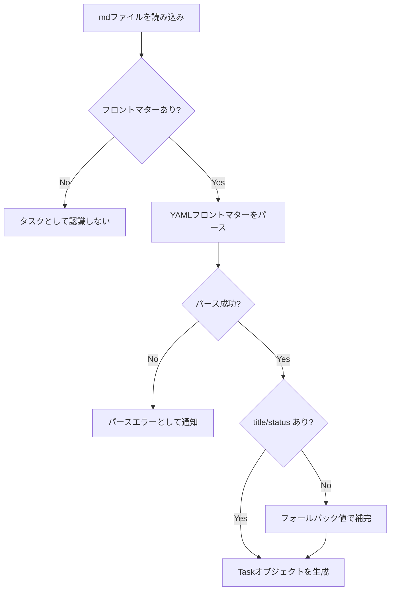

# spec-board - タスクフォーマット仕様（バックエンド）

> **機能**: [spec-board](./index.md)
> **ステータス**: 下書き

## 概要

spec-board で管理するタスクのmdファイルフォーマットを定義する。YAMLフロントマターにタスクのメタデータを記述し、本文にタスクの詳細説明をMarkdown形式で記述する。

### タスク識別子

バックエンドの resident `Task` は、scanner が正規化した project root 相対の
`filePath` を唯一の identity として保持する。IPC payload は後方互換のため `id` と
`filePath` の両フィールドを従来の順序・型で返すが、両方とも常に同じ canonical path
である。フロントエンドの `Task.id` と既存 wire / disk / error 形状は変更しない。

## ファイルフォーマット

### 全体構造

```markdown
---
title: タスクのタイトル
status: Todo
priority: Medium
labels:
  - bug
  - frontend
milestone: v0.3
parent: tasks/parent-task.md
links:
  - tasks/related-task.md
---

タスクの詳細説明をMarkdownで記述する。

## 補足情報

- 箇条書きなども自由に記述可能
```

### フロントマター定義

| フィールド | 型 | 必須 | デフォルト | 説明 |
|:----------|:---|:-----|:----------|:-----|
| title | `string` | 推奨 | ファイル名から生成 | タスクのタイトル。省略時はファイル名をフォールバック |
| status | `string` | 推奨 | 最初のカラム名 | タスクのステータス。ボードのカラムに対応。省略時は最初のカラムをデフォルト設定 |
| priority | `string` | いいえ | なし（バッジ非表示） | 優先度。`High` / `Medium` / `Low` のいずれか。省略時はバッジを表示しない |
| labels | `string[]` | いいえ | `[]` | ラベルの配列。カテゴリやタグとして使用 |
| milestone | `string` | いいえ | なし | マイルストーン参照キー（単数）。リリース単位の束ね。`.spec-board/milestones.yml` の `name` と対応（未定義値も暗黙許容） |
| parent | `string` | いいえ | なし | 親タスクのファイルパス（プロジェクトルートからの相対パス） |
| links | `string[]` | いいえ | `[]` | 関連タスクのファイルパスの配列 |
| due | `string`（`YYYY-MM-DD`） | いいえ | なし（バッジ非表示） | 期限。ISO 8601 の日付のみ（時刻なし）。省略・空文字はバッジ非表示 |
| draft | `boolean` | いいえ | `false`（非 draft） | 下書きフラグ。`draft: true` のみ下書きとして扱う |

### フィールド詳細

#### title

- タスクを識別するためのタイトル
- 推奨フィールド。省略時はファイル名（拡張子除去、ハイフンをスペースに変換）をフォールバックとして使用
- 空文字は不可（空文字の場合もファイル名フォールバックを適用）
- ファイル名の生成元としても使用される（kebab-case変換）
- Tauri command `create_task` は任意の `fileName`（`.md` 付き完全名）の明示指定を受け付ける。指定時はタイトル由来の自動生成を行わず、指定名を検証（空 / パスセパレータ含み / 非 `.md` 拡張子 / `.md` 単体を拒否）したうえで使用する。既存ファイル名と重複する場合はエラーにせず連番サフィックスを付与して回避する。大文字混在の `.MD` 拡張子は受理し、小文字 `.md` に正規化して保存する
- **タイトル変更時にファイル名はリネームしない**（ファイルパスが `parent` や `links` で参照されるため、リネームすると参照が壊れる）

#### status

- ボードのカラムに対応するステータス文字列
- 推奨フィールド。省略時は最初のカラム（`config.json` の `columns[0].name`）をデフォルトとして設定
- ユーザーが定義したカラム名と一致する必要がある
- 一致するカラムが存在しない場合、自動的に新規カラムとして追加
- 有効なステータス値は `.spec-board/GUIDE.md` で確認可能（[config-spec.md](./config-spec.md) 参照）

#### priority

- 省略可能。省略時はボード上で優先度バッジを表示しない
- 大文字・小文字は区別しない（パース時に正規化）
- 定義外の値が設定された場合は無視（バッジ非表示）
- UIの作成フォームでは「なし」を選択可能。「なし」選択時はフロントマターに `priority` フィールドを出力しない（`None` という文字列は使用しない）

#### labels

- 省略可能。省略時は空配列として扱う
- 各ラベルは任意の文字列
- 重複するラベルはパース時に除去
- frontmatter の `labels` は自由文字列であり、ラベルマスタ `.spec-board/labels.yml`（[config-spec.md](./config-spec.md) 「labels.yml スキーマ」参照）に未定義のラベルも**警告なく暗黙許容**する。labels.yml の読み込みは frontmatter の `labels` に一切干渉せず非破壊である（マスタはあくまで説明・色などのメタ情報の付与に使う）

#### milestone

- 省略可能。省略時はマイルストーン未割当タスクとして扱う
- **単数の文字列**（例: `milestone: v0.3`）。labels の `string[]` とは異なり、1 タスク = 1 マイルストーンとする（複数所属はスコープ外）
- frontmatter の `milestone` は自由文字列であり、マイルストーンマスタ `.spec-board/milestones.yml`（[config-spec.md](./config-spec.md) 「milestones.yml スキーマ」参照）に未定義の値も**警告なく暗黙許容**する。milestones.yml の読み込みは frontmatter の `milestone` に一切干渉せず非破壊である（マスタはあくまで表示名・期日・並び順・状態などのメタ情報の付与に使う）
- 型不一致時の扱い（`priority` の不正値を無視する方針に倣う）: `milestone` が文字列以外（配列 / 数値 / bool / mapping 等）・`null`・空文字 `""` の場合は**省略（未割当）として扱い、パースエラーにはしない**
- マスタ定義ファイルが存在しない / 空の場合は、すべての `milestone` 値を暗黙のマイルストーンとして扱う（後方互換）

#### parent

- 親タスクのmdファイルへの相対パス（プロジェクトルート起点）
- 省略時はルートレベルのタスクとして扱う
- 多階層のネストが可能（親→子→孫→...）。ただしネストの深さは最大20階層まで（超過時はパースエラー）
- 指定されたファイルが存在しない場合、警告を表示しフィールドは保持
- 循環参照（A→B→A）の扱い:
  - **canonical resolver（open / mutation / watcher / rescan）**: 処理を継続し、ループに含まれる全 task に `parentCycle` warning を付与する。disk 再構築用の raw `parent` は原文のまま保持し、IPC に出す effective `parent` だけを `None` にする。ファイル本体の YAML `parent:` キーは変更しない（ユーザーが手で修正できるよう原文を残す）
  - **create / update のI/O前strict validation**: 従来通り `CycleOrTooDeep` パースエラーとして拒否する。validation通過後のcache構築自体は他mutationと同じcanonical resolverを使う

#### links

- 関連タスクのmdファイルパスの配列（プロジェクトルート起点）
- 省略可能。省略時は空配列として扱う
- リンクは**双方向**として扱う。片方のタスクに `links` を設定すると、リンク先タスクからも関連タスクとして表示される（リンク先のフロントマターには書き込まない。表示時に逆引きする）
- 指定されたファイルが存在しない場合、リンク切れとして警告アイコンを表示
- 壊れたリンク（target が tasks に存在しない）の関連タスク行クリックは完全 no-op（announce / 追加 UI フィードバックなし）。警告アイコン表示の実装有無は別 Issue で扱う（本仕様は撤回せず据え置く）
- Tauri command `add_link({ sourceFilePath, targetFilePath })` で `links` への追加が可能。同じ target がすでに含まれる場合は noop（書き込みもキャッシュ更新も行わない）。リンク先（target）のフロントマターは書き換えない（双方向リンクは表示時の逆引きで実現する）
- Tauri command `remove_link({ sourceFilePath, targetFilePath })` で `links` から target の完全一致エントリを **すべて** 取り除く（パス表記揺れは正規化して吸収）。最後の 1 件を消した場合は `links:` キーごと消える。target がすでに含まれていない場合は冪等な no-op として成功を返す（書き込みもキャッシュ更新も行わない）。target タスクが削除済みで存在しなくても source の `links` からの除去は実行する（dangling link 掃除の用途を兼ねる）。リンク先（target）のフロントマターは書き換えない（双方向リンクは表示時の逆引きで実現する点は `add_link` と同じ）
- Tauri command `create_task` の `links`（任意・省略時は空配列）で、**作成時点で関連タスクを付与**できる。BE は **lenient 正規化**のみを行う: 空・絶対パス・Windows drive prefix のエントリは除外し、表記揺れ（`./tasks/a.md` と `tasks/a.md`）を正規化して重複を除去する（先勝ち）。**存在しないパスや parent と同一パスは reject せず保持する**（作成は成功する）。self/parent を候補から除外する責務は作成フォームのピッカー（`buildCreateLinkCandidates`）が担い、BE は除外しない。正規化後の `links` が空なら `links:` キーは出力しない。作成時に実在 target を指定した場合、canonical full resolver が全 task の逆引き（reverse link）を再構築するため、再 open 不要で関連タスクとして表示される。
- 作成フォームで links を選択後に parent を別タスクへ変更しても、**選択済みの links は自動削除しない**。`buildCreateLinkCandidates` は以後その task を追加候補から除外するだけで、選択済み chip はユーザーが明示的に × を押すまで残る。

#### due

- フォーマットは `YYYY-MM-DD`（例: `due: 2026-06-30`）。時刻・タイムゾーンは扱わない。
- 省略時は期限なし。空文字 `due: ""` は省略相当として扱い、warning も付与しない。
- 解釈不能なフォーマット（`2026/6/30`, `tomorrow`, `2026-13-40`, 存在しない日付 `2026-02-29` 等）は `invalidDue` warning を付与しつつ、frontmatter の原文値はそのまま保持する（非破壊）。
- 値はバックエンドでは生の文字列として保持し、相対表示（「今日」「あと X 日」「X 日超過」）と期限切れ強調はフロントエンドが今日を基準に算出する。
- due は typed フィールドではなく extras として記述順を保持するため、他フィールド更新時の再シリアライズでも値は失われない。
- 作成フォームのネイティブ date 入力（`YYYY-MM-DD`）から書き込まれる。未入力時は `due` キー自体を出力しない。

#### draft

- 下書きフラグ。`draft: true` のみ下書きとして扱う。省略・`false`・非 bool 値（`"yes"` / `1` / `null` 等）はすべて非 draft（warning なしの lenient 解釈）。
- typed フィールドとして固定順（`links` の後）で serialize し、`draft: true` のときのみキーを出力する（`draft: false` は書かない）。
- 既存 md が extras として `draft:` キーを持っていた場合も typed として吸収され、非 bool 値は再 serialize で出力されない。
- `update_task` の `draft` は 3 値: 未指定 = 不変 / `true` = draft 化 / `false` = 解除（キー除去）。

#### DetailScreen 上のリンク追加 UI

- DetailScreen に **関連タスクセクション** を持ち、`linkedFilePaths` と `reverseLinkedFilePaths` を区別して一覧表示する（`links` → `reverseLinks` の順）。各行は button としてフォーカス可能で、クリックで in-place に詳細の表示対象が切り替わる。`reverseLinks` 行は読み取り専用で削除 UI（× ボタン）を持たない（削除は forward 側で行う）
- `+ リンク追加` ボタン → タスク候補ポップオーバから対象を選択することでリンクを追加する
- 候補からは **自身 / 既に link 済みのタスク / 逆リンク済みのタスク / 親 / 子** をすべて除外する。既に link 済み / 逆リンク済みの除外は、表記揺れを正規化した同値判定で行う（`./tasks/b.md` が登録済みなら canonical `tasks/b.md` のタスクも候補に出ない）
- 選択直後に **source / target 両方を楽観 dispatch** で更新する:
  - source: `linkedFilePaths` に target を append
  - target: `reverseLinkedFilePaths` に source を append（add_link の IPC 戻り値には target が含まれず、watcher event も target 側 disk 変更が無いため発火しない。FE 側で楽観 dispatch しないと target 反映が永続的に欠落する）
- 既にリンク済みの add（表記揺れを正規化した同値判定）/ 対象リンクが無い remove は **no-op** として IPC を呼ばず成功する（書き込みもキャッシュ更新も行わない。片方向ドリフトがあっても修復せず残置し、canonical 更新〔watcher / 次回 open〕で解消される）
- 自身へのリンク追加・存在しないタスクへのリンク追加は IPC を呼ばずエラーとして扱う（バックエンドの reject を待たない）
- `add_link` invoke 成功時は source を IPC 戻り値の canonical Task で再 dispatch する。target は IPC が返さないため楽観値のまま据え置く
- `add_link` / `remove_link` invoke 失敗時は **inverse rollback** する。操作が触れた path のみを現在 state から除去 / 復元し、IPC 中に別経路で入った外部更新（別 path の追加や links 以外の field 変更）は保持する。remove の rollback（re-append）は操作前の配列位置へ **best-effort** で復元する（外部で要素が減っていた場合は末尾へ clamp。外部変更併存時の相対順の完全復元は保証しない）
- rollback のうち**逆リンク（リンク先タスク側の表示）の復元**は、相手タスクが適用時点で存在しない場合に skip する（外部で削除されたタスクへの逆リンクを復活させない）。**自タスク側のリンク（frontmatter が保持している内容）の復元は無条件に行う**（リンク先が存在しない壊れたリンクの削除失敗でも表記が元に戻る = ファイル内容との整合を優先。壊れたリンクは既存の表示仕様で扱う）
- リンク削除（× ボタン）は `linkedFilePaths` の raw 値（`./tasks/b.md` 等の表記揺れ）を対象とし、forward は削除対象を参照する**正規化同値な全表記**を除去する（表記揺れが併存していても一括で消える。バックエンドの除去挙動と一致）。リンク先タスクの逆リンク表示は表記揺れを正規化して解決したうえで更新する。リンク先が解決できない壊れたリンクは source 側のみ除去する
- 競合時の保証範囲: 失敗 rollback とプロジェクト切替 guard のみを保証する。invoke 成功時は source を IPC 戻り値の canonical Task で再 dispatch する現行挙動のまま（IPC 中の source 外部更新との収束は対象外）。また失敗応答が disk 書き込み後の失敗（post-write failure）だった場合、rollback により表示と disk が一時乖離するが、canonical 更新（watcher / 次回 open）で再収束する
- 同一 tick の連続選択は `useRef<boolean>` ベースの in-flight guard で 1 回のみ通す
- task 切替（`task.id` 変化）時は DetailScreen が LinksSection に名前空間付き key を付与してリマウントし、ポップオーバの開閉 / 検索クエリ等の内部 state を確実にリセットする

### 本文

- フロントマターの `---` 閉じタグ以降がMarkdown本文
- 本文は省略可能（フロントマターのみのファイルも有効）
- ファイルとして保持する本文は常に原文そのまま（spec-board が勝手に整形・正規化しない）
- 表示時は独自の軽量 Markdown パーサで描画する。対応する記法は以下:
  - 見出し: `#` / `##` / `###`（h1〜h3）
  - 箇条書き: `-` / `*`（先頭空白なし。ネストは対象外でフラット扱い）
  - タスクリスト: `- [ ]` / `- [x]` / `- [X]`（チェックボックスとして描画。`*` リストも可）
  - 引用: `>` 連続行（blockquote。引用内は inline 記法のみ処理し、ブロックの再帰解釈はしない）
  - コードブロック: ` ``` ` fence（言語タグ可。内部は raw text として保持し inline 化しない）
  - inline: `` `code` `` / `**strong**`
- 上記以外の記法（リンク・画像・テーブル等）は解釈せず、生テキスト（Raw）として安全に表示する（`dangerouslySetInnerHTML` は使用しない）。Raw 表示のトグル UI は提供しない。
- タスクリストのチェックボックスはクリックで toggle でき、対象となった**その 1 行のみ** `[ ]`↔`[x]` を書き換えて `update_task` で永続化する。同一文言の他行・空白・改行コード（CRLF 含む）・未対応記法は不変。toggle 対象行は本文のソース行番号で同定するため、コードブロック内やインデント行に `- [ ]` 風の行があっても誤って書き換わらない。
- 改行は `\n` を行区切りとし、`\r\n`（CRLF）は表示時に `\r` を吸収する。単独 `\r`（`\n` を伴わない旧 Mac 改行）は行区切りとして扱わず 1 行内に保持する（レアケースのため非対応）。

## パース仕様

### パース処理フロー


```mermaid
flowchart TD
    A[mdファイルを読み込み] --> B{フロントマターあり?}
    B -->|No| C[タスクとして認識しない]
    B -->|Yes| D[YAMLフロントマターをパース]
    D --> E{パース成功?}
    E -->|No| F[パースエラーとして通知]
    E -->|Yes| G{title/status あり?}
    G -->|No| H[フォールバック値で補完]
    G -->|Yes| I[Taskオブジェクトを生成]
    H --> I
```

### パースルール

| ID | ルール | 説明 |
|:---|:-------|:-----|
| PL-001 | フロントマター検出 | ファイル先頭が `---` で始まり、2つ目の `---` で閉じられている部分をフロントマターとして認識 |
| PL-002 | YAML パース | フロントマター部分を YAML としてパース。パース失敗時はエラーとして通知 |
| PL-003 | title フォールバック | `title` フィールドが未定義の場合、ファイル名（拡張子除去、ハイフンをスペースに変換）をタイトルとして使用 |
| PL-004 | status フォールバック | `status` フィールドが未定義の場合、最初のカラムのステータスをデフォルトとして設定 |
| PL-005 | priority 正規化 | `high` → `High`、`MEDIUM` → `Medium` のように先頭大文字に正規化 |
| PL-006 | labels 正規化 | 文字列が渡された場合は単一要素の配列に変換。重複を除去 |
| PL-007 | parent 解決 | `parent` フィールドのパスを解決し、親タスクの存在を検証。存在しない場合は `parentNotFound` warning を記録し、Task 自体は読み込み成功として扱う。外部編集を watcher 経由で取り込む場合も同じ扱いで、BE が `parent` の値を書き換えたり md を書き戻したりはしない |
| PL-008 | parent 循環参照検出 | 親子関係のツリーを辿り、循環参照と深さ超過を検証する。**canonical resolver（open / mutation / watcher / rescan）**: 循環検出時は処理を継続し、ループに含まれる全 task に `parentCycle` warning を付与する。raw `parent` は保持し、effective `parent` のみ `None` にする。21 edge 以上の深さは `CycleOrTooDeep` パースエラー（深さ超過が循環検出より先行）。**create/updateのI/O前strict validation**: 循環は引き続き `CycleOrTooDeep` パースエラーとして拒否する |
| PL-009 | links 正規化 | 文字列が渡された場合は単一要素の配列に変換。重複を除去。存在しないパスは保持する（BE は warning を付けない。dangling 警告は FE `src/domains/broken-link` の派生判定で表示する）。`create_task` での作成時付与も同じ lenient 正規化（dedup・パス正規化・存在しないパス保持）に従う。参照先が外部削除・リネームされた場合も watcher 経路で `links` の値は書き換えず、消えるのは派生値の `reverseLinks` だけ |
| PL-010 | links 逆引きインデックス | 全タスク読み込み後、links の逆引きインデックスを構築。双方向リンクの表示に使用 |
| PL-011 | 子タスク収集 | 全タスク読み込み後、各タスクの `parent` を元に子タスク一覧を構築 |
| PL-012 | 未知フィールド | フロントマターに定義外のフィールドが存在する場合、`Task.extras` に JSON 互換値として保持する |
| PL-013 | 非致命警告 | `title` / `status` の fallback や `parent` / `extras` の型不一致は `Task.warnings` に保持し、Task 生成自体は継続する |

### Task 変換時の補足

- Markdown/YAML の読み込み直後は parse-only candidate とし、resident session/cache には canonical resolver を通過した Task 集合だけを格納する。parse-only candidate と resident Task は IPC serialize / deserialize の対象にしない
- canonical resolver は全 task を `filePath` 昇順に正規化してから、parent 検証、`children`、`reverseLinks`、graph warning を全件再計算する。したがって `children` / `reverseLinks` の配列順も参照元 task の `filePath` 昇順で安定する
- parser が生成した warning と graph resolver が生成した `parentNotFound` / `parentCycle` warning は内部で分離して保持し、IPC では parser warning → graph warning の順に連結する
- Rust / Tauri IPC の task payload は出力専用の projection であり、`parent` / `children` / `links` / `reverseLinks` を top-level に持つ従来どおりの flat camelCase JSON とする。今回 canonical 化する `TaskWarning.field` を除き、既存キー順、他の `Option` の省略、`draft: false` の省略を含む wire 形状は変更しない
- `TaskWarning.field` の canonical wire は値がある場合だけ文字列キーを出力し、未指定時はキー自体を省略する。canonical payload は `field: null` を出力しない
- frontend の IPC 入力adapterは旧backendが出力した `field: null` も互換入力として受理し、field省略とともにdomain `TaskWarning`のキーなしへ正規化する。文字列は空文字を含めて保持し、frontend domain / canonical `TaskPayload`へ`null`を持ち込まない
- フロントエンド domain の `Task` は IPC payload を `TaskPayload` として受け取った後、`hierarchy.parentFilePath` / `hierarchy.childFilePaths` と `links.linkedFilePaths` / `links.reverseLinkedFilePaths` に変換して保持する
- `title` が未定義の場合はファイル名（拡張子除去、ハイフンをスペースに変換）を fallback とし、`missingTitleUsedFileName` warning を付与する
- `title` が空文字または文字列以外の場合はファイル名 fallback とし、`invalidTitleUsedFileName` warning を付与する
- `status` が未定義の場合は既定ステータスを fallback とし、`missingStatusUsedDefault` warning を付与する
- `status` が文字列以外の場合は既定ステータスを fallback とし、`invalidStatusUsedDefault` warning を付与する
- `parent` が文字列以外の場合は値を無視し、`invalidParentIgnored` warning を付与する
- `parent` が文字列だが読み込み済み Task の `file_path` に存在しない場合は、値を保持したまま `parentNotFound` warning を付与する
- `parent` の存在検証では比較時のみ `\` と `./` を軽量正規化する。先頭 `/` または Windows drive prefix 付きの値は相対パス仕様外として `parentNotFound` warning を付与する
- 自己参照 `parent` は存在する Task として扱い、循環検出は PL-008 で扱う
- canonical resolver が親チェーンの循環を検出した場合、open / mutation / watcher / rescan のいずれでもループに含まれる全 task に `parentCycle` warning を付与する。各 task の raw `parent` は保持し、IPC に投影する effective `parent` のみ `None` にする。ファイル本体の YAML `parent:` キーは変更しない（ユーザーが手で修正できるよう原文を残す）
- `extras` の非文字列 key は除外し、`nonStringExtraKeyIgnored` warning を付与する
- `extras` の JSON 非互換 value は除外し、`extraValueNotJsonCompatible` warning を付与する
- `due` がキー無し・空文字の場合は期限なし（`None`）として扱い、warning は付与しない
- `due` が `YYYY-MM-DD`（構文・月日範囲・うるう年）として妥当な文字列なら原文をそのまま typed フィールドに保持する
- `due` が文字列だが妥当な `YYYY-MM-DD` でない場合は原文を保持しつつ `invalidDue` warning を付与する。`due` が文字列以外（数値・マッピング等）の場合は値を無視し `invalidDue` warning を付与する
- `due` は typed フィールド化せず extras にも残すため、他フィールド更新時の再シリアライズでも値・記述順が保持される（round-trip 保持）

### Task 変換時 warning code

| code | field | 条件 | 挙動 |
|:--|:--|:--|:--|
| `parentNotFound` | `parent` | `parent` が文字列だが、読み込み済み Task の `file_path` に存在しない | `parent` 値は保持し、Task の `warnings` に追加する |
| `parentCycle` | `parent` | canonical resolver が親チェーンの循環（自己参照含む）を検出した | ループに含まれる全 task の `warnings` に追加し、effective `parent` を `None` にする。raw `parent` とファイル本体の YAML は無変更 |
| `invalidDue` | `due` | `due` が `YYYY-MM-DD` として解釈できない、または文字列以外 | 原文は保持する（非破壊）。Task の `warnings` に追加するが、parse-error バナー・カードのエラーアイコンの対象には**含めない** |

## シリアライズ仕様

タスクの変更をmdファイルに書き戻す際のルール:

| ID | ルール | 説明 |
|:---|:-------|:-----|
| SL-001 | フロントマター再構成 | 変更されたフィールドのみを更新し、未知フィールドは保持 |
| SL-002 | フィールド順序 | `title` → `status` → `priority` → `labels` → `milestone` → `parent` → `links` → `draft` → その他の順序で出力。`due` は typed フィールドではなく「その他（extras）」としてユーザー記述順を保持し、typed 順序には組み込まない |
| SL-003 | 本文保持 | 本文部分は変更せずにそのまま保持 |
| SL-004 | 改行コード | LF（`\n`）で統一 |
| SL-005 | 末尾改行 | ファイル末尾に改行を付与 |

## TaskDocument codec と preview

### TaskDocument / TaskPatch

- タスク Markdown の YAML Mapping は `TaskDocument` の codec 境界に閉じ込める。create / update / move / add_link / remove_link / 子タスク parent 解除 / `update_columns` は、同じ `TaskDocument::parse` → `TaskPatch` → `TaskDocument::render` 経路を使う。
- 新規 draft は `TaskDocument::from_draft` で構築し、既存文書の変更は `TaskPatch` の `Unchanged`（保持） / `Set`（設定） / `Clear`（キーまたは値を除去）の 3 状態で表す。`priority`、`labels`、`milestone`、`parent`、`links`、`draft`、`due`、本文を個別の raw YAML mutation として扱わない。
- typed フィールドの順序・lenient 解釈・未知キーの保持は codec が一元管理する。未知キーの値と出現順、本文、CRLF 入力の意味を可能な限り保持し、出力は LF と末尾改行に統一する。
- serializer の失敗は typed error として呼び出し側へ返し、panic に依存しない。

### `preview_task_markdown`

- Task Form は `title`、`status`、`priority`、`labels`、`parent`、`links`、`due`、`draft`、`body` の camelCase DTO を Tauri command に渡す。`fileName` や project state は含めない。
- command は I/O や project state を参照せず、`TaskDocument::from_draft` と同じ renderer で full Markdown（frontmatter + 本文）を返す。保存時の create 経路と preview の出力規則は同一である。
- FE は返却された full Markdown を再度 YAML parse / stringify せず、Raw 表示または fence の内側と本文の表示にだけ分割する。IPC の pending / error / stale 応答では古い preview を表示しない。

## ディレクトリ構造

```
project-root/
├── .spec-board/
│   └── config.json          # カラム設定・アプリ設定
├── tasks/                   # タスク用ディレクトリ（推奨だが必須ではない）
│   ├── fix-login-bug.md
│   ├── add-search-feature.md
│   └── update-readme.md
└── other-dir/               # サブディレクトリ内のmdも対象
    └── design-review.md
```

- タスクのmdファイルはプロジェクトルート以下の任意の場所に配置可能
- `.spec-board/` ディレクトリはアプリの設定ファイル専用
- `node_modules`、`.git`、ドットディレクトリは除外

## サンプルファイル

### 最小構成

```markdown
---
title: ログイン画面のバグ修正
status: Todo
---
```

### フル構成

```markdown
---
title: 検索機能の追加
status: In Progress
priority: High
labels:
  - feature
  - frontend
  - backend
milestone: v0.3
links:
  - tasks/product-list-redesign.md
---

## 概要

商品一覧ページにキーワード検索機能を追加する。

## 受け入れ基準

- キーワード入力で商品名を部分一致検索できる
- 検索結果が0件の場合、適切なメッセージを表示する
- 入力中はデバウンス（300ms）を適用する
```

### 親子関係の例

親タスク（`tasks/search-feature.md`）:
```markdown
---
title: 検索機能の追加
status: In Progress
priority: High
---

検索機能全体のEpicタスク。
```

子タスク（`tasks/search-ui.md`）:
```markdown
---
title: 検索UIの実装
status: Todo
priority: Medium
parent: tasks/search-feature.md
---

検索バーとオートコンプリートの実装。
```

孫タスク（`tasks/search-autocomplete.md`）:
```markdown
---
title: オートコンプリート実装
status: Todo
parent: tasks/search-ui.md
---

検索バーのオートコンプリート機能。
```

## update_task（部分マージ更新）

既存タスクの frontmatter / body を部分的に上書きする IPC コマンド。

入力: `{ filePath, title?, status?, priority?, milestone?, labels?, parent?, body?, draft? }`

### マージ規則

- wireで指定されたフィールドだけが反映され、未指定フィールドは保持される
- raw frontmatter の未知 key・`links`・YAML 値型・出現順は **そのまま保持** される
  （内部実装は `TaskDocument::parse` に読み込み、`TaskPatch` を適用して `TaskDocument::render` で書き戻す）
- `parent: ""` で親解除（frontmatter から `parent` キーを除去）
- `labels: []` で全ラベル削除
- `milestone: ""` でマイルストーンを解除し、非空文字列で設定する。未指定なら保持する
- `draft: true` でdraft化、`draft: false`で解除する。未指定なら保持する
- `priority: None` は不変。**priority 自体を「なし」にする操作は本コマンドではサポートしない**
- **title 変更時もファイル名は不変**（rename はしない）
- 空 title 指定は許可される。書き戻し後の Task 再 parse で `invalidTitleUsedFileName` warning が乗る
- `children` は派生計算のため update_task では更新できない

`UpdateTaskArgs`はwire形状を維持したadapterであり、domainへ渡す前にclear可能な3 fieldを
`Patch`へ分類する。空文字判定はexactで、trimは行わない。

| wire入力 | `parent` / `milestone` intent | `draft` intent |
|:---------|:--------------------------------|:---------------|
| 未指定 / `null` | `Patch::Unchanged` | `Patch::Unchanged` |
| `""` | `Patch::Clear` | - |
| 空白のみを含むその他の文字列 | `Patch::Set(raw)` | - |
| `true` | - | `Patch::Set(true)` |
| `false` | - | `Patch::Clear` |

`UpdateTaskIntent`以降はwireの空文字・`false`を再解釈せず、この分類済みpatchを
`TaskDocument`とparent検証へ渡す。wire / disk形状、エラー文字列、I/O順序は変わらない。

### ファイル位置

update_task は `filePath` で識別し、**ファイル移動は一切行わない**。
`parent` を変更しても物理配置は元のディレクトリのまま。

### エラー（Display 文字列パターン）

- `file not found: <abs path>` — 対象ファイルが存在しない / cache に無い
- `invalid path: <input>` — `..` を含む、`.md` 以外、project_root 外、空、ディレクトリ指定
- `parse failed: <reason>` — 既存ファイルの frontmatter が壊れている / delimiter 不在
- `parent not found: <path>` — 指定 parent が cache に無い
- `parent validation: <file_path> (<reason>)` — 親チェーン循環 / 深度超過
- `content not scanner eligible: <reason>` — 更新後 body が 1 MiB 超 / NUL 含む

### mutation 後の resident Task 再構築

create / update / delete / archive / move / add_link / remove_link / update_columns は、
変更後の全 parse-only candidate を canonical resolver に通し、`children` / `reverseLinks` /
graph warning を全件再計算してから resident Task 集合を一括置換する。コマンド直後の状態は、
同じ disk 状態を再 open した状態と一致する。wire / disk 形状と既存エラー文字列は変更しない。

create / update の strict parent 検証は I/O より前に従来どおり実行する。`parent` フィールドの
「変化」は分類済みの `intent.parent` patchに応じて以下のように判定する:

- `Patch::Unchanged`: parent は変更されない（`parent_changed=false`）。hierarchy 検証はスキップする（全タスク走査の O(N) コストを回避）。
- `Patch::Clear`: parent を解除する。既存 parent が存在する、または frontmatter にraw `parent` キーが存在する場合に `parent_changed=true` となり hierarchy 検証を実行する（親解除なので構造的に循環は発生しないが、不正データの早期検出のため検証は走る）。
- `Patch::Set(path)`: 検証は以下の順序で実行する:
  1. **parent 存在チェック** — `parent_changed` の真偽に関わらず、最初に cache から該当 task を引き当てる。存在しなければ `parent not found: <path>` を返す。
  2. **正規化等価判定** — 正規化済みパス（`./tasks/p.md` / `tasks\p.md` などの表記揺れを吸収する lookup key）が既存 parent と等価なら `parent_changed=false` として hierarchy 検証はスキップする。
  3. **hierarchy 検証** — 正規化等価でない場合のみ`parent_changed=true`となり、対象をpatchした`Vec<ParsedTask>`を`ResolvedTaskSet::validate_strict`へ渡す。strict検証後のresident構築は全mutation共通のcanonical resolverを通る。

検証に失敗した場合は `parent validation: <file_path> (<reason>)` を返し、ファイル書き込みおよび cache 更新は行わない。`reason` は循環検出 (`Cycle`) または 20 段超過 (`TooDeep`) のいずれか。

## 制限事項

- ファイルエンコーディングは **UTF-8（BOMなし）** のみサポート。BOM付きUTF-8はBOMを除去して読み込む。その他のエンコーディング（Shift-JIS等）はパースエラー
- フロントマターのYAML構文エラーがある場合、該当ファイルはタスクとして認識されない
- バイナリファイルや極端に大きいファイル（1MB超）はスキップ
- ネストされたYAML構造（オブジェクト型フィールド）は未知フィールドとして保持するが、spec-board UIでは編集不可
- 日本語など非ASCII文字を含むタイトルのファイル名生成: ASCII文字のみkebab-case変換し、非ASCII文字はそのまま保持する（例: 「ログイン修正」→ `ログイン修正.md`）。全てASCII変換不可の場合もタイトルをそのままファイル名に使用する
- 親子ネストの深さは最大20階層。超過した場合はパースエラーとして通知

## 関連仕様

- [config-spec.md](./config-spec.md) - 設定ファイルのスキーマ・labels.yml / milestones.yml マスタ・AIエージェント向けGUIDE.md仕様
- [file-system-spec.md](./file-system-spec.md) - ファイルの読み書き・監視の実装仕様
- [task-card-spec.md](./task-card-spec.md) - パースされたデータの表示仕様
- [board-view-spec.md](./board-view-spec.md) - ステータスとカラムの対応関係

## 変更履歴

| バージョン | 日付 | 変更内容 | 変更者 |
|:-----------|:-----|:---------|:-------|
| 1.4 | 2026-08-24 | Issue #611: TaskWarning.field未指定のcanonical wireをキー省略へ統一し、legacy nullをfrontend入力adapterでdomainキーなしへ正規化する互換契約を明記 | - |
| 1.3 | 2026-08-24 | Issue #605: update_task wireの3値互換を維持し、Args adapterでparent / milestone / draftを分類済みPatchへ変換する責務境界を明記 | - |
| 1.2 | 2026-08-23 | Issue #602: resident Task の identity を canonical filePath の単一保存とし、wire id/filePath の同値・形状互換を明記 | - |
| 1.1 | 2026-08-23 | Issue #601: parse-only candidate と resolved resident Task の型境界、raw/effective parent、warning 分離、全 mutation の canonical full resolver、path 昇順の派生値、出力専用 IPC projection と wire/disk/error 互換契約を明記 | - |
